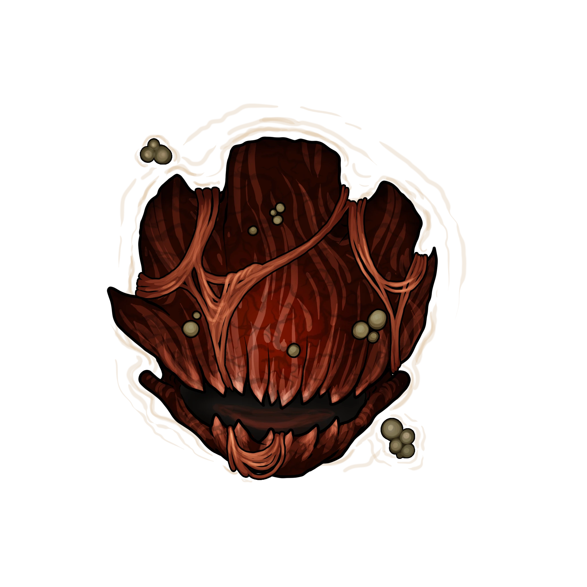
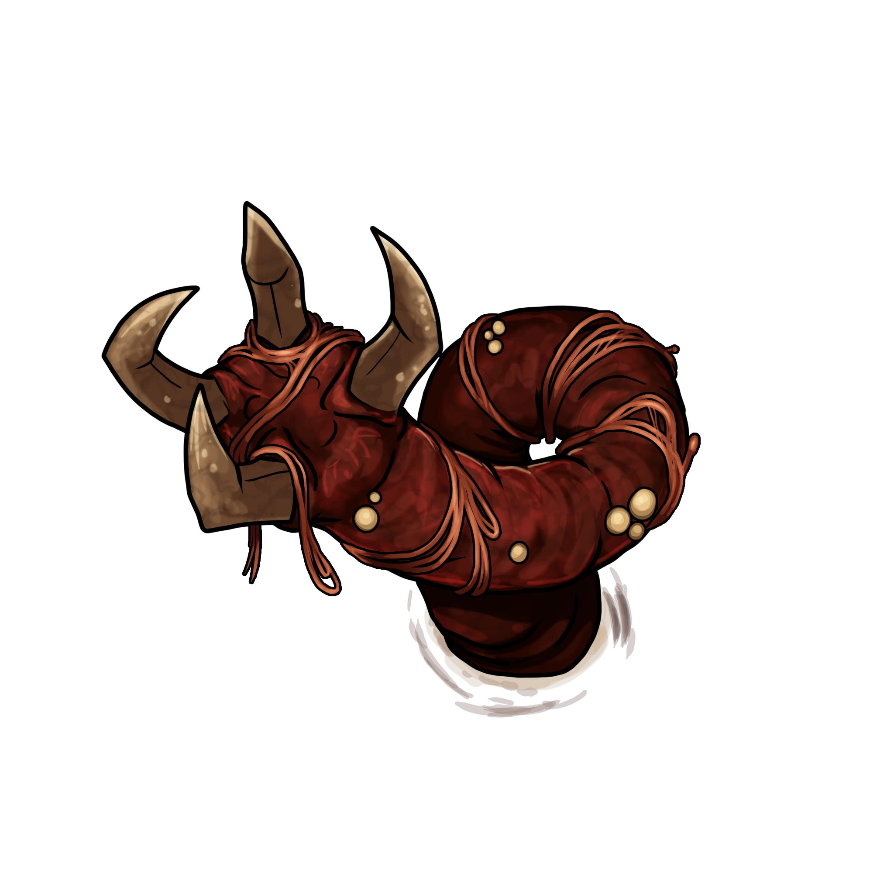
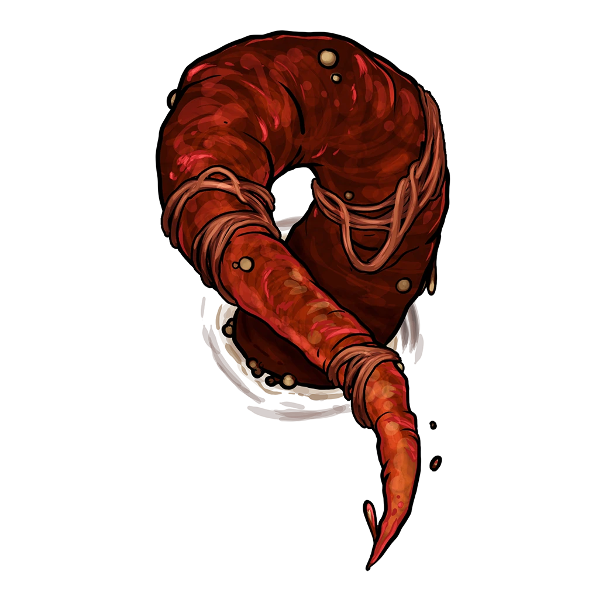
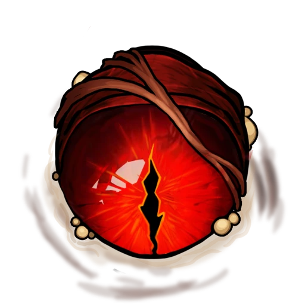

# Sealed Chamber

> [!quote] Read Aloud
> Behind the once-sealed door, the sprawling interior chamber is large enough to bring a slight chill to the air. In its center, a large empty platform of stone is connected to each doorway by a shimmering bridge of light that passes over the glittering void space below. The room seems as if it must have some purpose, and a sour scent lingers in the air, but whatever the purpose is — or was — is impossible to make out from the entrance.

> [!warning] Gamemaster
> #### Delayed Attack
>
> The creature Gohema does not reveal itself until the entire party is standing on the central column in the middle of the chamber, at which point it immediately attacks and combat begins.

#### Work In Progress

The arena in which the Gohema is encountered will eventually be obscured from view until triggered at which point it will become visible along with the boss itself. This is not yet automated and is left to the Gamemaster to narrate in a way that is clear to the players.

> [!tip] Exploration
> #### Observing the Chamber
>
> Any character who attempts to study the empty chamber before combat begins and makes a successful `[[/check inv 18]]` check senses an aura of Abyssal energy that suffuses the area like a shroud. While the exact cause is unclear, the disconcerting room appears seems likely to have once crawled with Abysssal monsters, staining the very stones with corruption.
>
> - **Knowledge: Abyssals**: The character gains **+2 Boons** on this check.

## Fighting Gohema

Once the party reaches the center platform, the following Actors appear encircling them:

> [!abstract] Gohema's Head
> **[[Gohema's Head]]**
>
> Level 1 · Unknown Unknown
>
> 

> [!abstract] Gohema's Tail
> **[[Gohema's Tail]]**
>
> Level 1 · Unknown Unknown
>
> 

> [!abstract] Gohema's Tendril
> **[[Gohema's Tendril]]**
>
> Level 1 · Unknown Unknown
>
> 

> [!abstract] Gohema's Eye
> **[[Gohema's Eye]]**
>
> Level 1 · Unknown Unknown
>
> 

> [!danger] Hazard
> #### A Beast in Many Parts
>
> This strange beast of corrupt flesh rises from the deep below the party, and surrounds them on all sides. However, the individual appendages cannot move onto the platform where the party stands — nor outside the chamber — due to their [[Gohema Part]] feature.
>
> #### Gohema's Head Tactics
>
> During combat, [[Gohema's Head]]remains close to the central column, staying connected to the platform so that it can reach party members with [[Bite]] and [[Slam]].
>
> Once Gohema's Head is reduced to 0 Hit Points, combat ends, accompanied by the consequences described in [[Lightless Halls]] below.
>
> #### Gohema's Tail Tactics
>
> Near the beginning of combat, [[Gohema's Tail]] uses [[Entrench]] to make itself difficult to target and enable it to use [[Reactionary Slam]].
>
> During combat, Gohema's Tail will:
>
> - Attempt to stay in close proximity to the party.
> - Attack with [[Ram]] (potentially throwing characters off of the platform in the process).
> - Use its [[Spiked Slam]] action to stun party members.
>
> #### Gohema's Tendril Tactics
>
> During combat:
>
> - 2 [[Gohema's Tendril]] will stay in proximity to Gohema's Head at all times, using [[Defensive Shielding]] whenever possible to absorb damage from the party.
> - Any remaining tendrils will target characters that are on the edge of or have fallen off the platform, using [[Lash]] to attack.
>
> #### Gohema's Eye Tactics
>
> [[Gohema's Eye]] do not attack, but instead serve as evasive weak points which the party can use to damage the rest of Gohema, via the Eyes' [[Critical Weakspot]] and [[Entity-Wide Blindness]] features.
>
> Gohema's Eyes begin combat visible to the party, but immediately attempt to hide using their [[Veiled Coward]] feature.
>
> During combat, Gohema's Eyes will:
>
> - Continue attempting to hide using their [[Veiled Coward]] feature.
> - Move to new locations in the chamber by using [[Flesh Fusion]], focusing on places that the party will not expect and that will provide the Eyes' with maximum cover.
>
> #### Flesh Pit
>
> Any characters thrown off of the bridge or platform onto the ground below discover that the bottom of the chamber is made up of flesh. Read or paraphrase the following:
>
> > What appeared to be the bottom of the chamber is actually a grotesque expanse of flesh, pulsing and shifting underfoot. Each step sinks slightly into the soft, gelatinous surface, making movement feel sluggish and laborious.
>
> Any time a character traverses across the flesh of Gohema at the bottom of the chamber:
>
> - The character moves at half their normal speed.
> - The character must succeed on their choice of a `[[/check athletics 15]]` or `[[/check acrobatics 15]]` check or else are &Reference[Restrained] until the beginning of their next turn.
>
> #### Ending Combat
>
> As Gohema's Head dies, it damages everything nearby via its [[Death Throes]] feature, and all other parts of Gohema are reduced to 0 Hit Points, ending the encounter.

Once Gohema is defeated, the creature also releases its fleshy hold on the final door on the north end of the chamber, allowing the party to progress further into the Primordial Bastion.

#### Work in Progress: Opening the Northern Door

At a future point in Ember's development, the northern door will be automated to visually open upon defeating Gohema.

> [!warning] Gamemaster
> #### "To Fall and Fall Again" Quest Progression: Defeating Gohema
>
> Once Gohema has been defeated, refer back to [[Lightless Halls]] in [[Lightless Halls]] for further consequences and rewards.
>
> Afterward, the party can either:
>
> - Proceed farther into bastion through the northern door, moving on the Region Map and progressing to [[Bastion Wreckage]].
> - Finish exploring the remainder of the Lightless Halls, potentially opening up the [[Treasure Room]] and acquiring the rewards within.
