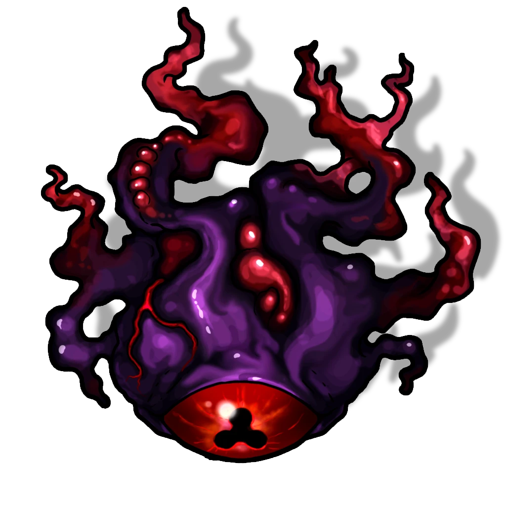

# Searing Steps

> [!quote] Read Aloud
> Beyond the two large drops into the void that cut across this chamber, a large stone bowl rests on a simple dais as if it is waiting for you. Facing it, on the last solid piece of ground before the first gap in the floor, the inert channel that runs into this room ends at a raised crystal in front of you.

#### Work In Progress

This challenge will be partially interactive and automated. These interactive elements are not yet implemented in Early Access. They will be added in a later patch, but until then gameplay is dependent upon the Gamemaster to describe the elements of this hazard and enforce its mechanical effects.

> [!tip] Exploration
> #### Crossing the Gaps
>
> The party initially faces a simple challenge: jump, float, or fly over the 10 foot gaps in this chamber to reach the unlit stone bowl and fill it with light using the [[Sun Star]]. However, as they do so, several things happen simultaneously.

### A Flaming Battle

Once a character crosses the first gap and steps onto the middle platform, four Abyssal Eyes in the room activate and combat begins. Immediately, the twin flamethrower traps on the central platform activate.

> [!danger] Hazard
> #### **Twin Flamethrowers**
>
> On each turn, both flamethrowers turn clockwise by one turn and shoot out a burst of flame that measures 10 feet long by 5 feet wide.
>
> Any character or creature within range of the flame must make a `[[/save dexterity 16]]` saving throw. When doing so:
>
> - The character closest to the flame always takes `[[/damage 2d6 fire]]` damage on a failure, or half that damage on a success.
> - Other characters make the same saving throw, but take `[[/damage 1d8 fire]]` damage on a failure, and no damage on a success.
> - If any Abyssal Eyes are in range of the flamethrowers, they are subject to the same rules, and absorb the higher damage amount if they are closest to the flamethrower.

> [!abstract] Abyssal Eye
> **[[Abyssal Eye]]**
>
> Level 1 · Unknown Unknown
>
> 

> [!abstract] Vhismara's Claw
> **[[Vhismara's Claw]]**
>
> Level 1 · Unknown Unknown
>
> 

> [!danger] Hazard
> #### **Stuck in the Middle in View**
>
> Waiting in ambush are 4 Abyssal Eyes, having hidden themselves in the darkest, most distant corners of the room. The party cannot detect the Abyssal Eyes until the floating monstrosities choose to reveal themselves — which they patiently wait to do until the party reaches the middle of the platform.
>
> Additionally, 2 Vhismara's Claws lie in wait until a character steps onto the platform containing the Light Bowl at the far end of the room, at which point they enter combat and attempt to leap onto the party from above.
>
> #### **Abyssal Eye Tactics**
>
> During combat, the [[Abyssal Eye]] will:
>
> - Position themselves to use [[Eye Blast]] in an attempt to push players off the platform and/or into the flamethrower blasts.
> - Attempt to push melee characters away to keep themselves out of range of melee attacks.
>
> #### **Vhismara's Claw Tactics**
>
> The [[Vhismara's Claw]] do not begin in combat; instead, they wait until a character steps onto the platform containing the Light Bowl at the far end of the room.
>
> Upon joining combat:
>
> - The Vhismara's Claws will attempt to remain hidden, crawling across the ceiling using [[Spider Climb]].
> - Once in position, the Vhismara's Claws jump down, attack, and attempt to grapple the closet character with [[Clawed Fingers]].
> - If a Vhismara's Claw is able to grapple a character, it immediately attempts to use [[Pinning Hold]].
>
> #### Void Space
>
> If any party member falls or is pushed off the sides of the platforms, they hurtle down into the glittering void of lights at the bottom of the chamber before reappearing in the [[Containment Chamber]]. Upon arrival, they suffer the ill effects specified on that page.
>
> #### Ending Combat
>
> As creatures of The Abyss, both the Abyssal Eyes and Vhismara's Claws fight to death, and their corpses linger as dangerous [[Abyssal Remains]]. If they are killed while floating over the bottomless void, their remains fall and reappear elsewhere by the same rules laid out for party members immediately above.

> [!tip] Exploration
> #### Empty Light Bowl
>
> At the far end of this room is an [[Unknown]], which can be investigated and lit by the party using the rules laid out on that page.
