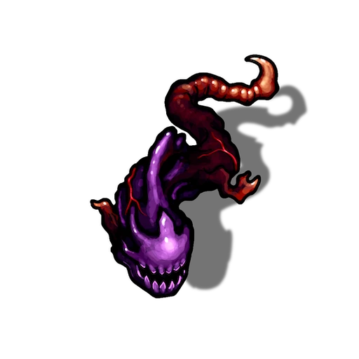

# South Hallways

> [!warning] Gamemaster
> #### Gamemaster's Note
>
> This hallway has two states — dark and illuminated. It becomes illuminated once all four Light Pillars in the [[Bastion Antechamber]] have been lit, thereby illuminating the Light Channel in this room.

### The Dark Hallway

> [!tip] Exploration
> #### A Light in the Dark
>
> If the party is currently employing a light source capable of overcoming [[Abyssal Darkness]], they will be able to see to the end of the hallway, though will still not benefit from the activation of the Light Bridge as described in [[Lightless Halls]] below.

If the party enters the hallway before illuminating its Light Channel, read or paraphrase the following:

> [!quote] Read Aloud
> The dark corridor stretches beyond the reach of any mundane light source, winding between massive stone block walls that show signs of ancient damage.

If characters have not activated the Light Bridges in the hallway, they will quickly discover a dead end as the corridor floor stops abruptly ahead of them.

> [!quote] Read Aloud
> Ahead of you, the corridor comes to an abrupt halt, revealing only a large empty void ahead.

> [!tip] Exploration
> #### Bridging the Gap
>
> To bridge the gap in the corridor, characters must illuminate the South Hallway. Due to the ancient magic in this place, any attempt to go across the void by other methods — including flying — unavoidably fails, plunging the character into the void below. They emerge in the [[Containment Chamber]], and upon arrival, suffer the ill effects specified on that page.

> [!danger] Hazard
> #### Spotting the Eel
>
> If the party carries a light source capable of overcoming [[Abyssal Darkness]], they may potentially spot and trigger [[Lightless Halls]] encounter below.

### The Illuminated Hallway

If the party enters the hallway after illuminating its Light Channel, read or paraphrase the following before proceeding:

> [!quote] Read Aloud
> With light filling the channel in the floor, a soft glow fills the hallway, illuminating the imposing stone and a bridge of light over an endless void.

## The Abyssal Eel

Once the hallway is effectively lit — regardless of the means — any party member has the opportunity to spot the [[Abyssal Eel]] that lies in wait in the corner of this dark passageway, still as stone and half-merged with the wall.

> [!tip] Exploration
> #### A Dark Rock
>
> Any character with a `[[/skill perception 15 passive format=long]]` or who makes a successful **Awareness (DC 13, Passive)** spots a strange, dark rock in the very corner of this hallway, tucked away and barely noticeable.
>
> Any character who attempts to investigate the rock and makes a successful `[[/check inv 19 check]]` or a `[[/check nat 18]]` determines that it is an inert monster called an Abyssal Eel.
>
> - **Knowledge: Abyssals**: The character gains **+2 Boons** on this check.

> [!danger] Hazard
> #### **Biting the Hand**
>
> If anyone in the party touches the inert Abyssal Eel, it immediately activates and bites down on the hand or finger of whoever touched it, dealing `[[/damage 1d4 piercing]]` damage, then attacks the party outright.

Once activated, the solitary Abyssal Eel assaults the party as best it can.

> [!abstract] Abyssal Eel
> **[[Abyssal Eel]]**
>
> Level 1 · Unknown Unknown
>
> 

> [!danger] Hazard
> #### **Lone Guardian**
>
> Alone and extremely weak, the Abyssal Eel is unlikely to present a significant danger to the party, but serves as a reminder of the constant hostility of this corrupted place.
>
> #### **Abyssal Eel Tactics**
>
> During combat, the Abyssal Eel will attempt to [[Bite]] whoever is closest to it.
>
> The Abyssal Eel fights to the death, and leaves behind [[Abyssal Remains]] if killed.
>
> #### Void Space
>
> If any party member falls or is pushed off the sides of the platforms, they hurtle down into the glittering void of light beneath the Light Bridge, before reappearing in the [[Containment Chamber]]. Upon arrival, they suffer the ill effects specified on that page.
