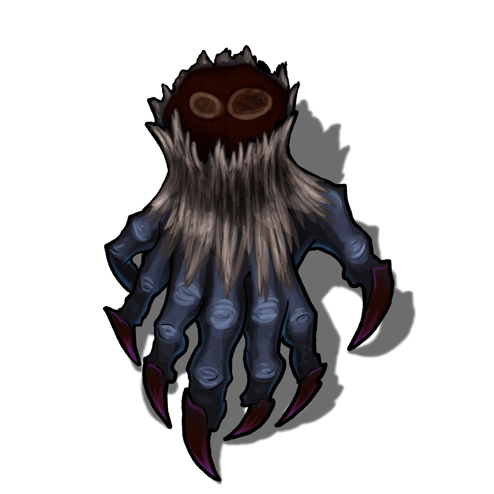

# Stone Altar

> [!quote] Read Aloud
> A huge, seemingly empty stone altar sits to one side of the otherwise-empty antechamber; the chamber's far exit is blocked by a thick stone door. The edges of the altar are embossed with glimmering ancient gold and exquisite patterns and carvings, but its purpose is unclear at first glance.

Before the party can study the altar further, they are attacked by a Vhismara's Claw which springs down from the ceiling and ambushes the party.

> [!abstract] Vhismara's Claw
> **[[Vhismara's Claw]]**
>
> Level 1 · Unknown Unknown
>
> 

> [!danger] Hazard
> #### **The Upper Hand**
>
> The claw in this room has been hiding in effective stasis for untold years, clinging to the ceiling using its [[Spider Climb]] feature.
>
> Any character with a `[[/skill perception 18 passive format=long]]` or who makes a successful **Awareness (DC 16)** check is able to detect the Vhismara's Claw at the last moment. If no character spots it, the party is &Reference[surprise]{Surprised} at the start of combat.
>
> #### **Vhismara's Claw Tactics**
>
> At the start of combat, the Vhismara's Claw attempts to grapple the weakest or lightest looking character with its[[Clawed Fingers]].
>
> During combat, it attempts to pin and kill &Reference[grappled] characters using [[Pinning Hold]].
>
> The Vhismara's Claw is a creature of pure evil, and does not hesitate to fight to the death — if killed, its corpse lingers as [[Abyssal Remains]].

Characters who examine the altar see the following:

> [!quote] Read Aloud
> The stone altar is a beautifully carved centerpiece of the room, yet nothing rests upon its surface. On its sides, giant figures are depicted in intricate detail, moving throughout the Pathways and worshipping under light rays which emanate from a central orb.

> [!tip] Exploration
> #### Examining the Altar
>
> Any character who makes a successful **Awareness (DC 16)** determines that, while at first glance the orb and rays emanating from it seem as if they depict the Primordial Bastion, further consideration of orb suggests the artwork may depict somewhere else in the Pathways — perhaps even the [[Heart of Ember]] itself.
>
> - **Knowledge: Subterranea**: The character gains **+2 Boons** on this check.
