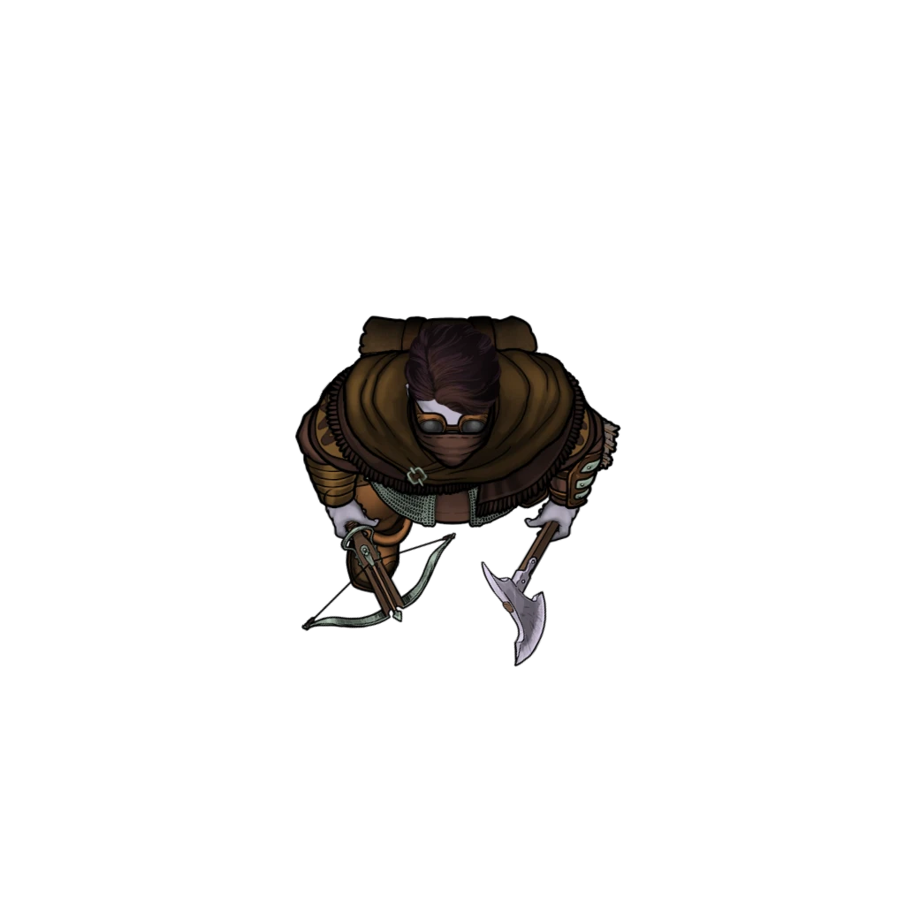
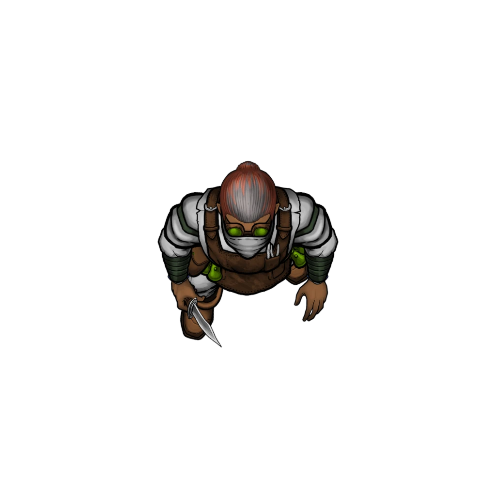

# Dormitory

> [!quote] Read Aloud
> The dormitory is a compact, utilitarian space with two rooms shared by the area's occupants. Rusty-framed beds and a lone hammock are set up with no regard for privacy, while footlockers rest at the base of each sleeping arrangement.
>
> The space could easily accommodate eight occupants, or three times as many if they were rotating their sleeping shifts. By the look of things, part of this space was in the midst of being searched or ransacked, with personal belongings packed or raided. It's hard to tell which.

> [!abstract] Mutagist Scout
> **[[Mutagist Scout]]**
>
> Level 3 (Minion) · Human Scout
>
> 
>
> A rugged, sly-looking individual, clad in a patchwork cloak of leather and fabric, their attire a mismatched collection of adventure-worn gear. They have the bearing of a well traveled and road worn adventurer or mercenary. It is concerning how utterly nondescript they actually are.

> [!abstract] Mutagist Vivisector
> **[[Mutagist Vivisector]]**
>
> Level 3 (Elite) · Human Chirurgeon
>
> 
>
> Clad in stained apron and coat, they regard you coolly from behind goggles and mask which make it impossibly to discern anything about them. They turn a razor sharp scalpel in their hand, as their off-hand rests on a pouch containing several vials of undoubtedly dangerous compounds. The air around them is thick with the scent of medicine and blood.

> [!danger] Hazard
> #### Off Duty Dangers
>
> A group of 2 [[Mutagist Scout]] and 1 [[Mutagist Vivisector]] can be found here packing their things and discussing the orders to abandon the lab.
>
> A stealthy party can take them by surprise if they manage a successful **Stealth (DC 14)** group check where at least half the party succeed. Otherwise they will attack on sight.
>
> The Mutagists engage in melee combat directly, since the fighting area is tight. If possible, they will attempt to control the door into the dormitory, or the doorway between rooms as this allows them to fight only one enemy at a time.

> [!tip] Exploration
> #### Personal Effects
>
> While a collection of personal effects, belongings, clothing and equipment can be found here, none of it is noteworthy or has any particular value.
