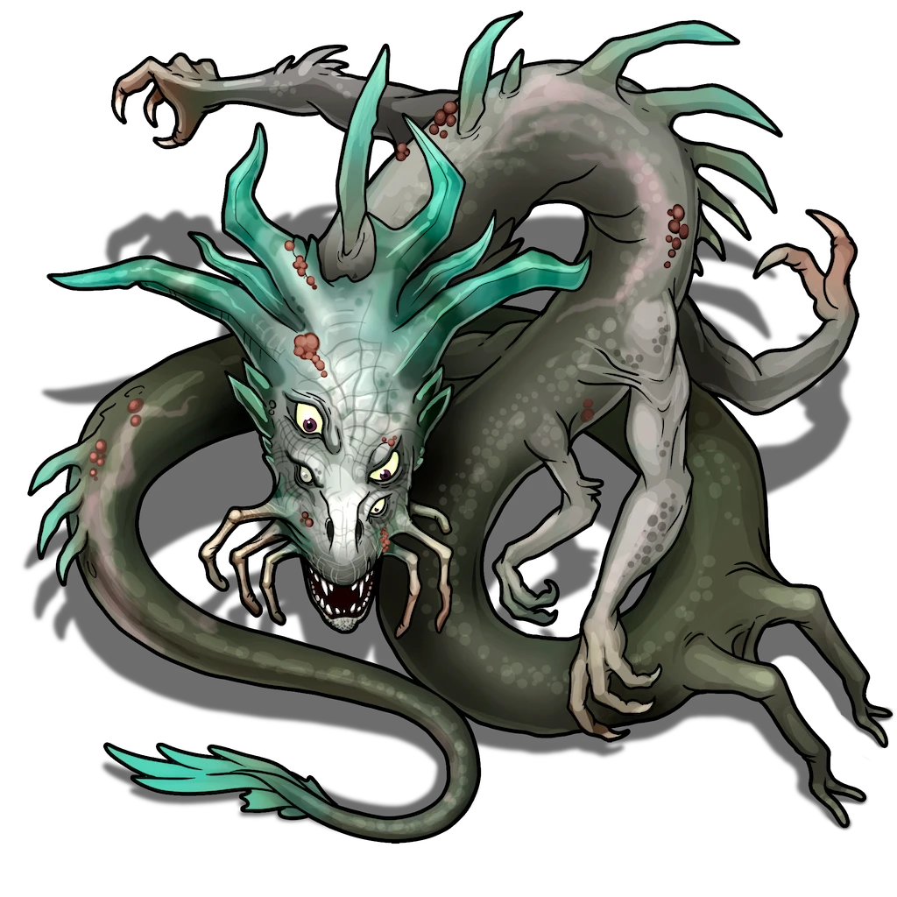

# Flooded Pit

**Work in Progress!**

While this combat should come pre-configured in the scene for the **Repurposed Quarry - Lower** area, there is a chance that the actor has been cleared. For Early Access you may need to add the Mutated Ultra Drake to the area for this encounter. The required actors are listed in the encounter below.

Make sure the Mutated Ultra Drake begins with the status "Invisible" or starts hidden to represent it being submerged.

> [!quote] Read Aloud
> The flooded pit marks the quarry's deepest point, a vast expanse now claimed by dark, swift-moving water. The reflective surface shimmers continuously under the erratic light, creating an illusion of boundless depth beneath. The sound of the cascading waterfall above reverberates through this space, adding to the sense of both confinement and expanse.

> [!danger] Hazard
> #### Drake Attack
>
> The massive drake here prefers to remain out of sight for as long as it can, waiting to attack prey when they are unwary.
>
> Characters moving through this area must succeed on a **Awareness (DC 18)** check to notice the presence of a massive, mutated drake lurking in the water of the flooded pit. Characters that fail are subject to **Unaware** when the creature explodes from the water and attacks.

> [!abstract] Mutated Ultra Drake
> **[[Mutated Ultra Drake]]**
>
> Level 6 (Boss) · Afflicted Pallid Drake Ultra Drake
>
> 
>
> Warped and misshapen, this monster is covered in thick scales, and scuttles forward on half a dozen limbs protruding haphazardly from its grotesque form. Its head is crowned with a flaring array of teal horns which extend into long, uneven spikes that run halfway down its spine. The creature's elongated mouth is framed by six finger-like appendages ready to guide pray into its jagged teeth. Scabbed over brown pustules blemish its body, hinting at an illness in remission.

> [!danger] Hazard
> #### Drake Tactics
>
> The drake is very aggressive and its [[Preternatural Instinct]] gives it a significant advantage over its prey, it relies on its substantially armored [[Drake Scales]] to protect it from severe injury when entering battle.
>
> The drake is fast, capable of using its [[Unknown]] to quickly close distance and harm multiple foes in the process.
>
> Up close, the drake uses its natural [[Talons]] and [[Bite]] attacks to rip apart foes, with its [[Bloodletter]] talent making these attacks particularly dangerous. The drake is ruthless, and will favor targets that are already **Bleeding** (informed by [[Blood Sense]]) and use this to fuel more actions through [[Blood Frenzy]].
>
> If an opponent is for some reason unreachable, or if two or more party members cluster together, it will make use of its [[Unknown]] and [[Unknown]] to punish them from a distance.
>
> When surrounded, the drake can use its [[Tail Sweep]] to knock down and scatter nearby creatures, allowing it to escape or maneuver.
>
> However, for all the drake's considerable power, it is has not been changed beyond the point of having survival instincts. If it feels its prey is too tough, or becomes **Broken** it will flee, retreating back into the darkness or below the waters and out of sight. If it successfully flees, it tears loose of the [[Control Collar]] , leaving it behind instead of the collar being found on the body as detailed below.

> [!tip] Exploration
> #### Explore
>
> Examining the dead drake, you find a [[Control Collar]]. A successful **Arcana (DC 14)** check reveals that the inscriptions and runs would have worked in concert with runes carved into the quarry walls to keep the drake in the lowest level.
>
> - **Success** You notice that the runes would have leveled a shockingly powerful and likely painful psychic shock when triggered. However, the runes are largely burned out, and likely haven't functioned for quite a while.
> - **Critical Success** The amount of magical artifice needed to make something like this is considerable, and likely required it to be custom made. Characters with **Knowledge: Crafts** note that while there's no clear maker's mark, the list of people who could create something of this sort is probably fairly short.
>
> - A further **Wilderness (DC 14)** check regarding this would lead you to believe that the creature was eventually conditioned to remain in the quarry, even without a working collar. Likely, it was smart enough to know what would happen if it tried to breach containment, and unwilling to risk it.
