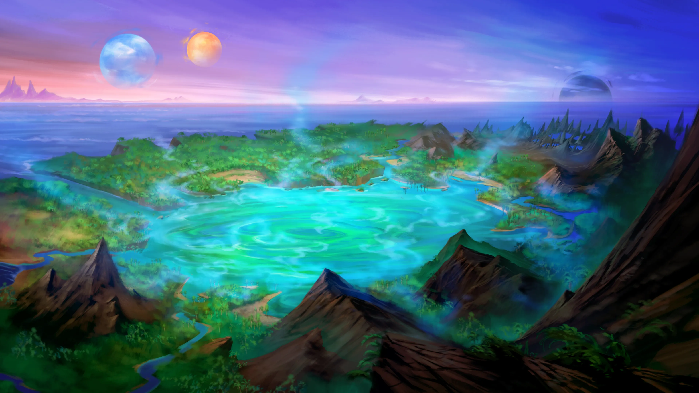

# Region Overview

A view of Kadisos from the slopes of the northern mountains.***Kadísos** [Kah-DEE-sos] is a volcanic island located to the south of Ordain along one of Ember's primal arteries which extend towards the Lowland Kingdoms.*

*The cloudy island of Kadisos is a landmass that not many know much about, even to those that frequent its shores and sole settlement. It is as shrouded in mystery as it is fog, with much of its past having been lost to the march of time and collapse of civilizations. For those that visit it, Kadisos is a modestly sized tropical island in the midst of temperamental seas and surrounded by jagged rocks and reefs the hunger for the hulls of passing ships. It has little to offer the average soul, and little more to the brave and daring that seek to explore its heart.*

## Terrain and Biomes

Once a huge volcano dominated the center of the island, but it exploded ages ago. In its place is a large, bubbling caldera lake which exudes warmth and the stink of sulfur at all hours. This great central lake is the source of the island's perpetual fog, as well, as cooler winds drawn across the steaming caldera quickly create huge banks of fog. The great gray clouds hang low over the island, gutting themselves on the island's few remaining mountains, their whispy tatters drifting out to sea to menace ships that come too near.

While jungles dominate the center of the landmass, both sandy and rocky beaches can be found nesteled between tall, rocky bluffs, jagged rocky shorelines, and tidepools teeming with life big and small. To the north, the island is dominated by rough hills and rugged, mountainous terrain rising high above the sea.

## Flora and Fauna

As a result of the great volcano's destruction, much of Kadisos is covered in heavy tropical rainforest nourished by rich volcanic soil, which makes for dense and fast growing foliage. The plant life on Kadisos hardy and thick, but due to the extensive damage the island has suffered in its past, it wants for diversity. Most of the plants are variations of palms, ferns, woody grasses and the like, but become more varied as they get deeper into the jungles where old Ashka and Aedir magic still lingers.

Given the remote and often ignored nature of Kadisos, many of these plants remain entirely unknown to the academic world, and are waiting to be discovered, studied, and written about. Unfortunately Kadisos makes for a particularly deadly expedition. The island teems with all manner of dangerous creatures that visitors would be wise to avoid.

Along the coasts are the **Red-Breasted Gore Birds**, which swarm corpses on the edges of the forest and along the shores, picking at old flesh to access the blood and innards beyond, **Crag Raptors**, magically infused flying lizards with huge claws and the ability to blend into their surroundings while perched on the bluffs, **Kadhana Lizards**, huge, clawed, cliff-climbing lizards with large frills and a taste for Crag Raptor eggs, fish, and anything too slow to escape its jaws, and **Tidal Snails**, massive scavenger mollusks with mouths filled with razor sharp teeth which they use to burrow into beached corpses.

In the jungles, travelers must contend with **Stripe-Tailed Mud Snakes** which can sit in wait for days, nestled under dead leaves or in mud puddles waiting for a creature to fill with their deadly venom, **Geyser Frogs** who sit on the banks of the boiling lake spitting jets of steam at prey, and **Slinkers**, huge centipedes with lemprey mouths which scuttle through the brush looking for warm bodies to burrow into.

If this weren't bad enough, even the rocks and waters teem with danger, including the **Gravestone Goats** known for creating landslides to kill predators, and turning to stone before butting would-be attackers off of cliffs, while the waters off of Kadisos are home to **Mirror Sharks** whose shiny scales make them almost impossible to distinguish from the natural glitter of sunlight on the ocean surface.

## Cultures and Settlements

Kadisos is home to only one major settlement, though calling it "major" is rather generous. The port town of Graven's Rest is a small dockyard built into a sea cave and crammed with all manner of additional structures, many of them built on old the docks themselves. It is a rough frontier town largely supported by the steady flow of ships harboring from storms as they make their way to and from the lowland coasts or the ordain port.

Graven's Rest is small, and its main population is sailors on leave, making for repairs, or waiting out storms. Beyond this the town has a handful of locals that fish, hunt, forage, and make a tidy business serving the incoming ships. A minor trade office of House Bastilla is about the only notable part of the town to the outside world, and even so it's a minor office of minimal import.

The folks of Graven's Rest are hardy, no-nonsense, and have learned to avoid the greater dangers of the island. In the sea cave where their town is built they are safe from most every problem there is except for the odd mirror shark attracted by fish guts being dumped overboard.

## Darkstone Ruins

Scattered across the island of Kadísos, but most concentrated around the northern shore of [[The Cauldron]] are unusual ruins sculpted of crystallized volcanic rock. These remnants are found throughout the island but they are most prevalent and impressive within the waters of the lagoon itself where dark pillars of obsidian rise out of the sea bed forming dwellings, thoroughfares, and gathering places for a lost people who dwelled on Kadísos in ages past. These undersea ruins form a skeleton and foundation upon which a vibrant coral reef thrives, striking a beautiful contrast between the dark stone and the myriad coral. There is a mysterious intentionality in how the ruins are not lost to nature but rather augmented and decorated by it - perhaps becoming the foundation for the lagoon's reef was what their original architects had intended.

The origin and nature of these ruins are a source of fascination for historians and archaeologists who are drawn to Kadísos to study them. The scholars who study these ruins believe that they predate the Aedir Empire and were most likely created during the Age of Beasts. The ruins were built by an ancient culture of scale-folk known as the Ashka who constructed their civilization around an expansive temple complex dedicated to the goddess Soleil.

The ruins of note on the island are:

- [[Unknown]]
- [[Unknown]]
- [[Unknown]]
- [[Unknown]]

## Additional Points of Interest

There is much to see and find on Kadisos, though most of it is not present in the minds of those who visit. In truth, the ancient island holds all manner of secrets and curiosities for those brave enough to go searching.

**Ruins:** The jungles of Kadisos are littered with old ruins from the ancient Aedir empire and the Ashka people before it. Though much of it has crumbled away to nothingness by now, there are still small remnants of the thriving societies that once called this island home. Brave and keen-eyed adventurers who know their history are in for a treat if they survive long enough to find one of these sites.

**The Boiling Lake:** At the center of Kadisos is the great caldera filled with nearly boiling water heated by vents of lava from below the surface. This great lake has many names, most of them coined by visitors and sailors spying it from afar, such as the clouded eye, the gray caldera, the cloud-mother, and so forth. Locals simply refer to it as the lake or caldera, and it's actively avoided as most don't like being boiled alive.

**The Great Storm Shrine:** Once an elaborate temple to the god Katu, the storm shrine sits atop a mountain cliff that has half eroded into the sea. What remains of the temple is just a fraction of the larger structure, and still stands as an active worship site for Katu, the god of storms.

**A Sunken City:** Though not many know of it, and even fewer can hope to find it, there is a great sunken city beneath the superheated waters of the caldera. This city used to belong to the ancient Ashka people, and fell wholly beneath the waves millennia ago. Anyone clever enough to find a way inside might discover all manner of ancient secrets and forgotten magic.

## Resources and Materials

It is largely believed that Kadisos has no real value or resources worth having, and to an extent this isn't incorrect. The effort required to exploit Kadisos is far higher than most companies and investors would be willing to undertake. From the danger to the remoteness of the island, most write the place off as being a waystation and little else.

But in reality there is quite a lot waiting to be discovered. There are all manner of strange plants that would make good medicines or poisons, wildlife which might make exotic pets or expensive delicacies. There is good stone waiting to be quarried, and rich earth which would grow most anything put into it.

More than this, there are old ruins of imperial and Ashka nature which might hold rare insights into magic, or yield resources whose production has been lost to time and collapse.

## Historical Notes

While much of Kadisos' history has been lost to time, a few key events and connections include:

- **Ashka Homeland:** Kadisos was the original homeland of the Ashka people, who now call much of the Lowland regions their home. The Ashka alive today are but a shadow of the magical society that once inhabited the island, and many of them have no interest in returning home, as the trek alone would be more trouble that it would be worth.
- **The Grave of Gods:** Before the rise of the empire the shard goddess Scoris brought the Ashka people to this island and helped them build a home. It was on this island that the dreadful Bale sowed chaos by releasing demons into the populace. As a result the two gods warred, and slew each other over Kadisos. It is said that Scoris' remains lay under the caldera to this day.
- **Imperial Outpost:** Before the shattering brought the empire of the Aedir low, Kadisos was home to a large garrison, and posting to it was considered desirable for its nearness to the great tower. However, when the the vampire collapsed, the island became subject to unchecked cruelty, the scars of which persist to this day.
- **Haunted Jungles**: It might seem odd to consider a jungle haunted, and in truth that's probably not the most accurate statement, but the locals are quick to warn newcomers not to enter the jungles when the fog is heaviest, because something terrible stalks the mists.
