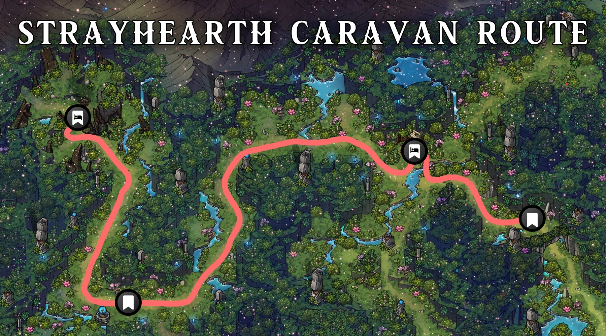

# Starting the Game

Before beginning play in Ember, there are several pieces of information that the Gamemaster should review, and activities that you should undertake along with your players.

## Review the Story

Unless you're particularly averse to spoilers, you may wish to read the [[Main Quest Overview]] in order to understand the scope of the main quest storyline, which will unfold over months (if not years) of gameplay.

## Character Creation

Before the game begins, take time for every member of the party to create a player character of the Player Character type. If you want players to be able to do this themselves, you will need to ensure that players have the Create Actors permission granted to them in the User Permission Configuration screen.

Once each player has completed the [[Creation Overview]] process, you should add their created character to the [[Party]] group, which defines the set of characters who are currently traveling together.

> [!warning] Gamemaster
> #### Session Zero
>
> We recommend beginning your experience with Ember by spending time on a preparatory session, often called "Session Zero," rather than jumping into the story immediately.
>
> Character creation will take some time to complete; it involves presenting new information about Ember as a setting, and requires each player at the table to make important creative decisions about their character. These campaign-spanning decisions should not be rushed.
>
> The first session of Ember's main story will likely feel more complete and satisfying if everyone has already created a new character beforehand. Furthermore, "Session Zero" is a valuable opportunity to establish shared expectations among your group regarding specific gameplay elements, social norms, and personal boundaries that are important to each player at the table.

## Starting Play

When you are ready to start play, activate the [[The Arctus Plateau]] region map Scene. The first gameplay event [[Sheltered Campsite]] in the Chapter 1 main quest [[The Winding Trail]] will automatically begin and present you with a prompt at the top-center of the screen.

At the beginning of this, and every other event, you will encounter readaloud text presented inside a parchment block that is intended to be narrated aloud to players before clicking the Begin Event button.

> [!quote] Read Aloud
> Text presented in this type of stylized block represents a "readaloud" which should be narrated aloud to the players.

Once you have narrated the initial event exposition, clicking the Begin Event button will transport you and your players into the first Scene of the game, a [[Vistas for Gamemasters]] depicting the campsite where your caravan is spending the night.

After you have completed the gameplay described within the event text, click the Complete Event button to mark the event as concluded, which will automatically return you to the Region Map.

## The Strayhearth Caravan

For the first leg of the adventure, players are not in control of the movement of the caravan on the region map. The Strayhearth Caravan makes its way towards Helkas using the most direct route, with stops at the [[Giant's Moonstone]] and [[Dry Outpost]] where the caravan will spend the night on Day 1.

#### Automatic Caravan Movement

Automatic movement of the Strayhearth Caravan is not yet implemented in Beta. We eventually envision a guided tutorial experience for this first passage of gameplay that helps the GM automatically direct the caravan.

For now, Gamemasters will need to manually move the Strayhearth Caravan up until the [[The Collapsed Cairn]] event, after which point the players will take control of their own Party token. The caravan should follow the annotated map shown below to reach this point at around noon on Day 2.

The Gamemaster should follow the above route with the Strayhearth Caravan until the Collapsed Cairn is encountered. Bookmark icons represent events that occur. Bookmarks which contain beds are the places the caravan camps for the night.
