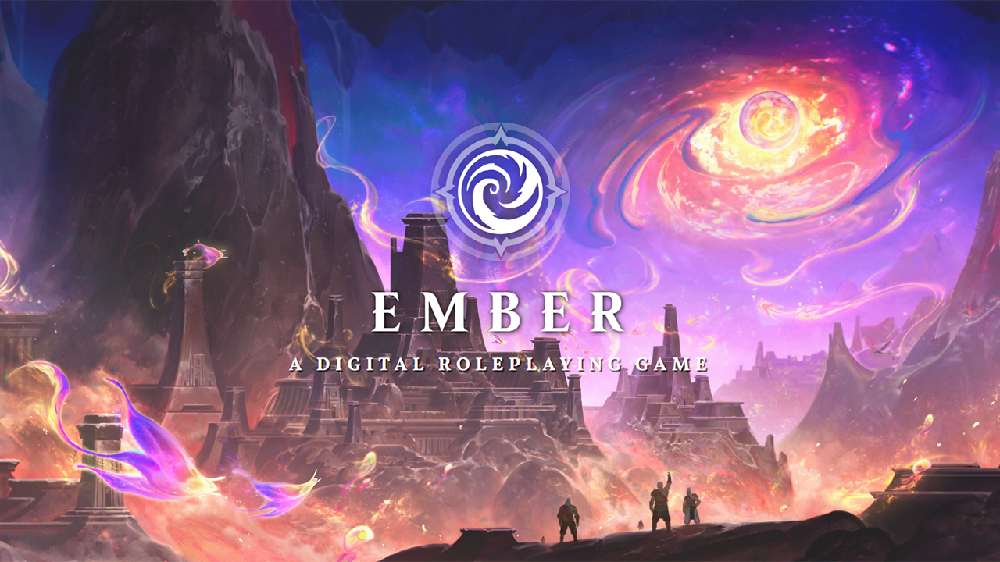

# Welcome to Ember

Ember is a vast world of rich history, vibrant cultures, imaginative places, and dramatic conflicts. The Ember game itself is both an original fantasy setting and a long-form campaign of epic scale.

Whether you're playing through Ember's canonical story or simply using the setting as a backdrop for your own narrative adventures, we hope you find it sets new and higher standards for immersive gameplay, mechanical innovation, player engagement, and memorable storytelling!

## What's It Like to Play Ember?

The Ember game is more than what one might expect from a traditional roleplaying game setting or adventure; it is an interactive world that lives and changes around your characters. While playing Ember, your party will:

- Travel across a vast region with tens of thousands of hexes and hundreds of discoverable locations.
- Explore detailed area maps with interactive on-screen elements like traps, puzzles, and dynamic lighting, using animated and dynamically generated character tokens.
- Encounter random events and overarching quests whose outcomes depend on the choices you make.
- Play through over four hundred hours of handcrafted events, taking place in a unique setting with deep worldbuilding, and with a Codex that automatically records your journey along the way.

All the details of your journey — from the position of your caravan on Ember's surface to the orbit of Ember's mystical moons above — are illustrated and depicted in the game world, updating continuously to reflect the passage of time.

As days, months, and seasons pass, Ember will live and breathe around you, its fate dependent on what you choose to do (or not to do). Where you go, whose calls to action you heed, and what obstacles you overcome will impact not just the events that transpire in directly front of you, but the whole of Ember's vast world.

## Plot Synopsis

This campaign is set upon the eastern coast of Aterica, the largest continent of the world of Ember, where a great rocky shelf known as the Arctus Plateau meets Ember's singular great ocean. The crown jewel of the Arctus Plateau is the metropolis of Ordain, one of the eleven great cities of the world.

You begin your story traveling with the Strayhearth Caravan — a group of traders traversing a route from the city of Casla-Brava (now several days to your west) to the great city of Ordain to your east. Your journey will take you through the winding trails of the Forest of Stone, open expanses of the Arctus Plateau, and ancient depths far below the surface, before you finally arrive to the bustling metropolis of Ordain.

Once you reach Ordain, you will become embroiled in a complex and far-reaching conspiracy involving powerful factions, shadowy and malevolent forces, iconic heroes, and gods themselves. Your approach to this conflict and the meaningful choices you make will forever alter the trajectory of Ember's story.

## Game Systems

Ember is a setting designed for use with one of two game systems:

***Dungeons & Dragons Fifth Edition***

You can experience playing Ember using a familiar d20 rule engine with well understood character options and mechanics. The Ember implementation for D&D is designed to support the modern 2024-era rules revisions.

***Crucible***

Crucible is an original game system made by our team specifically and exclusively for the Foundry Virtual Tabletop platform. It is a dice pool system with free-form classless character progression.

> [!warning] Gamemaster
> #### Which system is right for our group?
>
> *Crucible* is our own game system of choice and our favorite way to play Ember, as it lets us be bolder and take bigger swings with more interesting mechanics and design. However, because the ruleset of *Dungeons and Dragons Fifth Edition* is a mature, closed-loop ecosystem, it is more approachable for a broad range of players.

#### Crucible Beta Testing

Crucible is, like Ember itself, at an early stage of development, so choosing to play Ember with Crucible will result in a less polished and less complete experience than playing for D&D at this time.

#### Be Warned!

Testing Crucible in Ember is still **preliminary**. Many combat encounters are likely to be unbalanced — often against the player's favor.

Moreover, it is not yet possible to guarantee continuity of play with Crucible in Ember. Any characters created or testing done at this stage *may* need to be discarded with a subsequent update.

#### Thank You!

The Crucible system is a true passion to work on, and it will only achieve its potential with **your help** to evaluate the gameplay and enjoyment of using it. The team and I are very appreciative to those of you who take the time to try things out and share your feedback with us.

## Getting Started

To start playing Ember, there are two main paths:

- Discover more about the game's overall setting, beginning with the [[Setting Overview]].
- Learn about Ember's [[Character Creation]] process to begin forging your hero.
