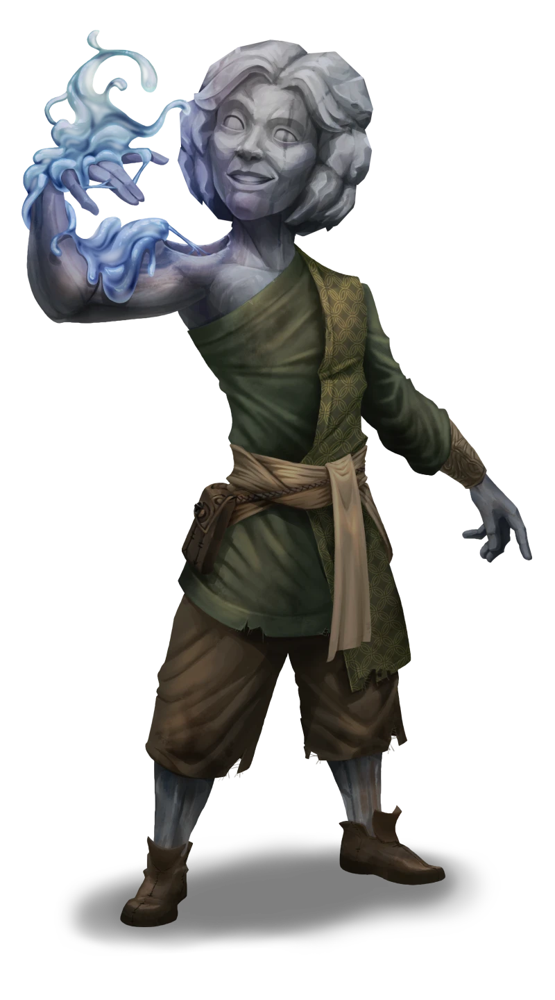

# Alchemical Decisions

> [!warning] Gamemaster
> #### Gamemaster's Summary
>
> This Social Event occurs after the party has discovered the source of contamination and returned to [[Yakoshta]]. By speaking with [[Tauric]] and [[Jasper]], the party can:
>
> - Inform them whether they cleaned up the [[Aedir Construct Fluid]] contaminating the mine.
> - Decide whether to preserve any for Jasper's experimental use.
> - Decide whether to inform Tauric about the neutralizing [[Alchemical Silver]].
>
> This Event will only trigger after the party has completed the [[Traversing the Tower]] Event in the [[Signal of Intent]] Side Quest.
>
> This Event is depicted using the [[Vista: Yakoshta]] Vista.

### Feuding Hulg'run

The two Hulg'run greet you and quickly broach the subject of your excursion.

> [!abstract] Tauric
> **[[Tauric]]**
>
> Level 1 · Hulg'run Scout
>
> 
>
> The young man's gray body appears to be carved from rock, with lines of blue agate running through the stone like veins. His color is matched by the gelatinous body of the small blueish-green ooze that sits on his shoulder, nestled into a hollow that seems to have been carved for the purpose.

> [!abstract] Jasper
> **[[Jasper]]**
>
> Level 1 · Hulg'run Operator
>
> 
>
> The hulg'run man steps carefully, as if he is assessing everything around him with sharp eyes and careful determination. He wears a slight scowl on his face, as if he is above whatever is around him, but the severity of his expression is somewhat undercut by the brilliance of the gems embedded in his face, arms, and legs, which have been carefully polished to a sparkling shine.

> [!quote] Read Aloud
> Jasper looks at you with an eager grin:
>
> > Well … it looks like you managed to get plenty done without us. Did you find the source of the contamination?
>
> Tauric interjects with obvious concern:
>
> > We were worried about you, but I'm also worried about the oozes. What's going to become of them? Can they be healed?
>
> The two stop talking over each other for just long enough to make clear that they want to hear your account of what has happened.

### Continuing Contaminant

If the party did not neutralize the contaminant by dispensing the alchemical silver, both Jasper and Tauric are dismayed to hear this news.

> [!info] Social
> #### Common Ground
>
> Jasper and Tauric do not agree on much, but both believe that the party should have cleaned up the alchemical fluid.
>
> - While Jasper is happy that the continued leak may give him access to the alchemical fluid, he is concerned that letting it flow naturally down to the mine will turn too many oozes into dangerous creatures before he has figured out a way to restrain them.
> - Tauric is upset both because this will hurt Sellen's dreams for the mine and because he believes that the luminous oozes are being corrupted from their natural friendly state by the contamination.
>
> Both Jasper and Tauric tell the party that they believe Yakoshta will not survive long if the contamination continues.

> [!quote] Read Aloud
> Jasper looks concerned to hear the news:
>
> > I know you may have felt that leaving the leak as is was doing me a favor, but I won't be able to start my ooze farming if I'm constantly being terrorized by oozes I can't yet control. While I appreciate you not getting rid of any chance of progress the way that Tauric wanted, I wish you'd chosen differently.
>
> A dismayed pallor has overtaken Tauric's granite face:
>
> > I don't understand. If you're here — weren't you able to find a way to help us? I saw how good you were in the fight back when we met, and everyone in Yakoshta is talking about how brave you were in the mine. I just knew you'd be able to save oozes like Squish from being contaminated and turned into one of those horrible creatures. What happened?
>
> Jasper nods in agreement with Tauric — for once — and proclaims:
>
> > I'll be honest with you. If the oozes continue to attack, I fear we'll have to leave Yakoshta before I discover anything useful that can help save the mine.
>
> Tauric averts his eyes with a look of resignation and disappointment:
>
> > I'll tell Sellen that it doesn't look like things are going to change for us. I know she'll be disappointed. As for Squish and me, we go where she goes, but I don't know that we'll ever find another place like this one.

### Cleansed Contaminant

If the party cleaned up the contaminant, Jasper and Tauric are glad to hear of this positive development.

> [!quote] Read Aloud
> Both Tauric and Jasper hold large coin bags that appear to have some weight to them — your reward for clearing the contamination from the mine, no doubt.
>
> Jasper exclaims as you approach:
>
> > We figured you'd be coming down soon. I was attempting to collect some more of the substance leaking into the mine when it turned to water in my hands!
>
> Tauric interjects:
>
> > Yeah, before you could use it to create your horrible ooze mining factory … so just in time!
>
> Jasper scoffs and looks at you plaintively:
>
> > That's not up to you, Tauric, and you know that. I only hope that these brave adventurers have decided to do the right thing.
>
> Tauric, staring at Jasper, resolutely confirms:
>
> > So do I, Jasper. So do I.

Jasper and Tauric are each holding half of the party's reward of  **50**, which Sellen asked them to deliver as a thank you for cleaning up the contaminant.

As for what happens next, Sellen has heard both Jasper and Tauric's arguments about what to do now, but is focused on making up for lost time in the mine and killing any remaining corrupted oozes in the area. As the ones who handled the threat, it's up to the party to decide what happens now.

### Jasper Makes His Case

> [!info] Social
> #### Jasper's Argument
>
> Jasper believes that the alchemical fluid is the future. If it could be used to change the oozes, it could be used for so many other things. He believes that the oozes could be a way to discover new forms of science and alchemy, and that their sacrifice would be worthwhile. He is willing to offer the party a cut on any future discoveries.
>
> If it is mentioned to him, Jasper claims that he is also interested in the [[Alchemical Silver]], but any character who makes a successful **Deception (DC 15, Passive)** check knows that he is likely to ignore it because he doesn't see a way for it to make him immediate profit.

> [!question] Q&A
> **Q:** Why do you want the Alchemical Fluid?
>
> **A:**
>
> > I know that Tauric thinks I am hard-hearted, but we use animals and plants around us every day to benefit ourselves. With the alchemical substance in hand and the leak taken care of, we could make progress not only in ooze mining, but in other ways — we must look to the future, not become sentimental over the things of the past.

> [!question] Q&A
> **Q:** What can you offer?
>
> **A:**
>
> > I promise that I will use Yakoshta Mine as a place to study this alchemical compound and what it could do and become. Will that mean using the oozes? Yes. But anything that I discover in the process, I promise that you will benefit from. Personally and materially.

> [!question] Q&A
> **Q:** Sweeten the deal?
>
> **A:**
>
> > What if I promise to only experiment on some of the oozes. Would that help?

> [!info] Social
> Any character who makes a successful**Awareness (DC 15, Passive)** check can tell that he thinks he would only experiment on some of the oozes, but he wouldn't be too broken up if he couldn't keep his promise.

### Tauric Makes His Case

> [!info] Social
> #### Tauric's Argument
>
> Tauric believes that working with the oozes is not only the best way forward for the mine, but the safest and the kindest. Why would the party condemn a creature like Squish to a life of anger and pain? He has nothing to offer the party immediately, but believes that he can find a way to learn things from the oozes about Ember and promises to share anything he discovers.
>
> Tauric is intrigued by the idea that the [[Alchemical Silver]], if mentioned, could potentially save the oozes, but is somewhat reluctant to use it. Any character who makes a successful **Diplomacy (DC 15, Passive)** check can tell that he would rather avoid all alchemical compounds; he feels guilty that his part in discovering how oozes change when exposed to metals has now put them in danger.

> [!question] Q&A
> **Q:** Why do you want the Alchemical Fluid destroyed?
>
> **A:**
>
> > When I met you, I knew you were helpers. You helped me. You helped Yakoshta. Now I need you to help the oozes. Maybe that alchemical stuff you found could help someone — someday — but we know that it is hurting the oozes now, and I know that Jasper will use it to cause little oozes like Squish pain and suffering. Will you let that happen?

> [!question] Q&A
> **Q:** What can you offer?
>
> **A:**
>
> > I think that the oozes know more about Ember than any of us might, and if I find a way to communicate with them, I'll share it with you. But more than that, you'll be on the side of life. Isn't that where you want to be?

> [!question] Q&A
> **Q:** Sweeten the deal?
>
> **A:**
>
> > Tell Squish! Tell him what you are doing to his face! If you can do that, nothing I say will matter.

### Siding with Jasper

It's up to the party to decide what to do with the [[Aedir Construct Fluid]]. They can give it to Jasper, as the overseer wishes, so that he can conduct profitable experiments into the future of ooze mining.

`[[/outcome gave]]`

> [!quote] Read Aloud
> As you hand the vials of orange fluid to Jasper, he smiles broadly but awkwardly, like his face isn't quite used to the expression.
>
> > You won't regret this —my discoveries have the potential to change all of Ember!
>
> Tauric adds:
>
> > And a high chance of getting us all killed, starting with all the innocent oozes you're sacrificing for your idea of science.
>
> As he turns to follow Jasper, Tauric slowly and sadly shakes his head, clutching his ooze tightly against his chest. As the two walk away, you hear Tauric mutter:
>
> > I know. I thought they were different too, Squish…

If the party sides with Jasper, they'll each be affected by the following Luxarum Attunement reinforcement:

#### Luxarum Attunement: Side with Jasper

Any character who contributed to giving the [[Aedir Construct Fluid]] to Jasper advances their **Attunement: Luxarum (+1)** at the conclusion of the Event.

### Siding with Tauric

The party can withhold the fluid from Jasper and respect Tauric's wishes to protect the oozes. They can also give Tauric some of the [[Alchemical Silver]], which can help against any alchemical spills in the future, and may be able to make the more dangerous oozes friendly again, though there is no way to tell at this time.

`[[/outcome withheld]]`

> [!quote] Read Aloud
> As Jasper realizes that you have not brought him any of the alchemical agent to use in his studies, his frown deepens and he shakes his head sharply.
>
> > Sentimentality over progress. Every time.
>
> Tauric, on the other hand, is thrilled. He somehow manages to clap, tip his head, and yelp in glee all at the same time, then holds his hands out. Squish makes its way down his arm and into the palm of his hand, where it reshapes itself into a very rough but recognizable image of your party, posed as heroes.
>
> > You're heroes, and Squish and I will make sure you're remembered that way!
>
> With a final bow of the head, Tauric turns and heads back towards Yakoshta. Jasper grunts and follows, still shaking his head from side to side and muttering about the future.

If the party sides with Tauric, they'll each be affected by the following Heart Attunement reinforcement:

#### Heart Attunement: Side with Tauric

Any character who contributed to withholding the [[Aedir Construct Fluid]] from Jasper advances their **Attunement: Heart of Ember (+1)** at the conclusion of the Event.

### Concluding the Event

> [!warning] Gamemaster
> #### Next Steps
>
> Once the party has made their decision, there is nothing more to be done for now except to depart Yakoshta once they are ready. While the party's choice has no immediate effect other than the reactions of Tauric and Jasper, they may encounter the consequences of their actions in downstream Events.
>
> - If the party destroyed the Alchemical Fluid, when returning to Yakoshta some time later, they will experience the [[Ooze Friends]] Event.
> - If the party gave the Alchemical Fluid to Jasper, when returning to Yakoshta some time later, they will experience the [[Ooze Foes]] Event.
