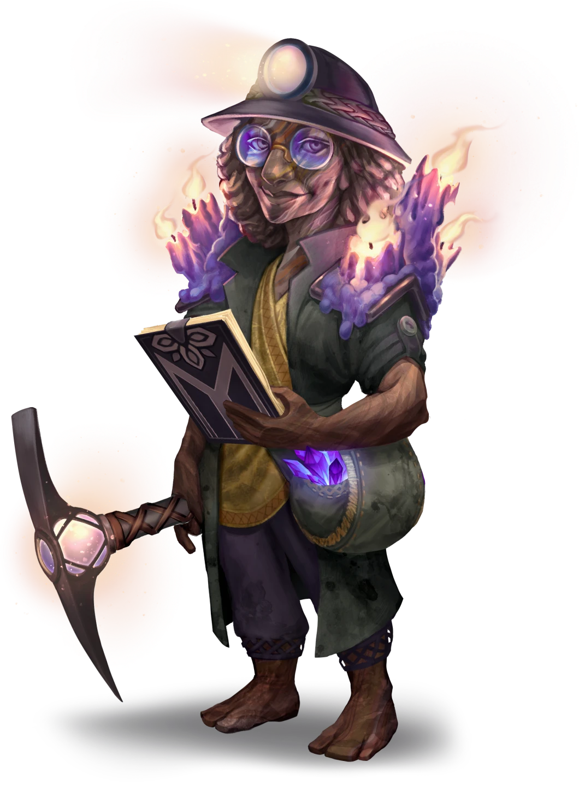

# Ooze Friends

> [!warning] Gamemaster
> #### Gamemaster's Summary
>
> This Social Event occurs when the party returns to [[Yakoshta]] after siding with [[Tauric]]. By interacting with the townsfolk, the party can:
>
> - See what's been happening in Yakoshta since they left.
> - Receive a gift from [[Sellen]].
> - Learn that [[Jasper]] has gone off in search of his fortune elsewhere.
>
> This Event will only trigger if at least 30 days pass after the party sided with Tauric during the [[Alchemical Decisions]] Event.
>
> This Event is depicted using the [[Vista: Yakoshta]] Vista.

### Reunion with Tauric

> [!abstract] Tauric
> **[[Tauric]]**
>
> Level 1 · Hulg'run Scout
>
> 
>
> The young man's gray body appears to be carved from rock, with lines of blue agate running through the stone like veins. His color is matched by the gelatinous body of the small blueish-green ooze that sits on his shoulder, nestled into a hollow that seems to have been carved for the purpose.

Tauric's yell of greeting brings attention from across Yakoshta, with miners shouting huzzahs and cheering the party's return. Both he and Sellen are thrilled to see the party again and show them what has become of Yakoshta since the group helped the settlement, with Tauric focused on how things are going with the oozes and Sellen on improvements to the mine. Jasper, though, is nowhere to be found.

> [!info] Social
> #### Tauric's Ooze Updates
>
> Tauric is now spending more time in the Yakoshta settlement than wandering the Forest of Stone with [[Squish]], as the two of them are helping to attract oozes to the area.

> [!question] Q&A
> **Q:** What's new?
>
> **A:**
>
> > Yakoshta is better than ever! You could say things are totally oozetacular! It's such a good thing you came along — things could have been so much worse for me and Squish. We're working hard to make the oozes part of our operation here, while making new friends along the way!

> [!question] Q&A
> **Q:** Where's Jasper?
>
> **A:**
>
> > He left not long after you did. I tried to hash things out with him, but I just don't think we're ever going to see eye-to-eye on things. I'm not sure where he went, but Sellen probably knows.

### Checking in on Sellen

> [!abstract] Sellen
> **[[Sellen]]**
>
> Level 1 · Hulg'run Trader
>
> 
>
> Between the light from the candles perched on her shoulders, the large pickaxe in one hand, and the clipboard in another, the woman before you seems nothing if not prepared for whatever faces her. The weathering on the carved stone of her body gives the sense that she's got more than a few stories to tell about what has gotten her this far along her journey, but whatever her past has brought her, she hasn't lost either the smile on her face or the determination in her eyes.

> [!info] Social
> #### Sellen's Reward
>
> Sellen will give the party  **5** as a bonus gift for clearing the mine and cleaning up the alchemical leak. The mine has been thriving since the party left, and she believes that she has them to thank for its prosperity.

> [!question] Q&A
> **Q:** What's new?
>
> **A:**
>
> > The attacks by the oozes made us realize how useful they could be as allies. With Tauric's help, the oozes have become a more closely integrated aspect of our mining program. They are learning to help us transport ore and explore crevices that we were previously unable to mine. Oh … and they're also excellent at keeping the mine clear of pesky crevvets!

> [!question] Q&A
> **Q:** Where's Jasper?
>
> **A:**
>
> > Ah … well. Jasper was really frustrated by not getting his hands on that alchemical fluid. He became obsessed with finding new opportunities for research. Jasper left Yakoshta some time ago to seek out some other sources of it. He's still hatching some scheme to somehow turn it into a fortune. We haven't heard from him since.
> >
> > I know Jasper caused us a lot of trouble, but I do care about him. If you happen to see him, please make sure he's okay?

### Concluding the Event

> [!warning] Gamemaster
> #### Next Steps
>
> There are no further steps in this Side Quest — Yakoshta is saved and will provide a welcome refuge or trading ally for the party should they ever choose to visit again.
