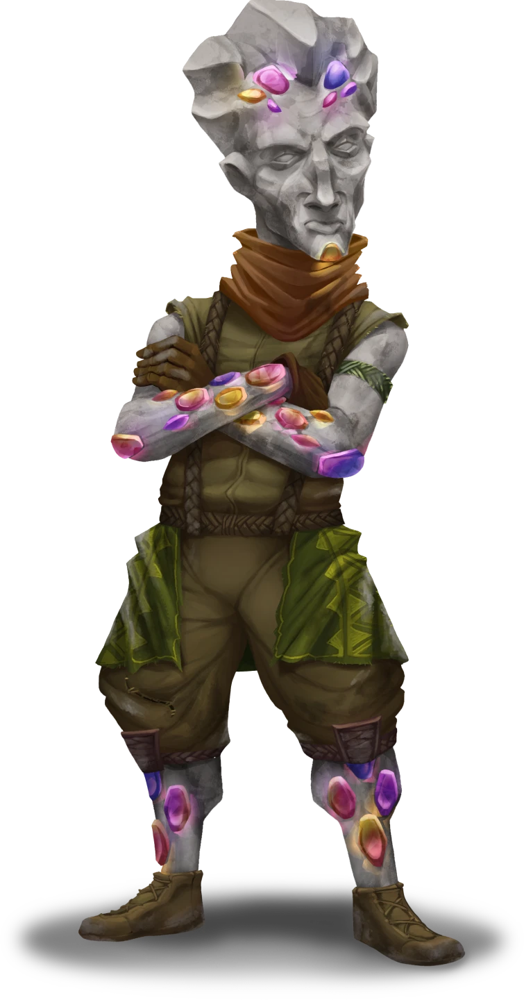

# Saving Jasper

> [!warning] Gamemaster
> #### Gamemaster's Summary
>
> This Exploration and Combat Event occurs when the party chooses to explore [[Area Overview]], wherein a group of miners struggle to fend off dangerous metallic oozes. By exploring the mine, the party can:
>
> - Rescue miners under attack from oozes.
> - Explore the mine and discover clues to the contaminant affecting the oozes.
> - Defeat a [[Giant Luminous Ooze]] and rescue the supervisor, [[Jasper]].
>
> #### Area Walkthrough
>
> The party begins in the [[Yakoshta Mine]] Scene, inside the Loading Zone room — a complete room-by-room description of the mine and the gameplay that occurs there is detailed in the [[Yakoshta Mine]] Area Walkthrough. When the Event begins, the party is immediately engaged in combat against attacking oozes.
>
> In addition to the details provided in the Area Walkthrough, there are three key moments during the exploration of the mine where Event-specific gameplay should occur:
>
> 1. After the party has defeated the oozes near the mine's entrance in [[Battle at the Loading Dock]].
> 2. If the party talks to Jasper from across the bridge in [[A Conversation with Jasper]].
> 3. After the party has defeated the giant ooze at the heart of the mine in [[After Rescuing Jasper]].

### Battle at the Loading Dock

As the party proceeds forward, they immediately encounter combat in the [[Loading Zone]]. Three miners are trapped in a corner of the room as oozes advance on them; the miners are armed only with a few [[Blast Flask]] from a planned clearing of a blockage further into the mine.

While the three rescued miners will fill the party in on what they know, they're most concerned that their supervisor, [[Jasper]], be rescued as quickly as possible, and urge the party to go further into the mine to help him. The miners are:

**Shel (Neutral Good, Arcturian Hulg'run, they/them)**

A short Hulg'run with arms that appear to be a bit longer than necessary and a tiger-eye coloring to their skin. After the battle, they begin counting up the ingots and taking inventory, marking up a slightly chipped tablet recovered from the rubble.

**Trianda (Neutral Good, Arcturian Thornling, they/them)**

A Thornling who resembles a green bramble bush with red leaves as ornamentation. They are compact in size and concern themselves mostly with repairing the broken crates and inspecting the wagons, wielding a hammer and nails with ease.

**Gravin (Neutral Good, Arcturian Hulg'run, they/them)**

A slightly taller Hulg'run with a rounded stomach, who appears as if they are carved out of green and brown marble, begins putting things into neat piles.

> [!danger] Hazard
> #### No Survivors
>
> If one or more miners have died during combat, the remaining miner(s) will still answer questions as indicated below while gathering the belongings of the fallen. If all three have died, Jasper yells out from his position across the bridge to try to find out what happened in [[A Conversation with Jasper]].

With Trianda under a wagon making repairs and Shel attempting to focus on their count, Gravin takes the role of speaking to the party and is happy to answer any questions they have. If asked, the miners will also provide the players with any [[Blast Flask]] that they still have.

> [!info] Social
> #### The Trouble in Yakoshta
>
> The key information that the miners have to share is:
>
> - The ooze attacks on the mine are getting worse every day.
> - The mine supervisor, Jasper, is trapped on the other side of the now broken bridge near a giant ooze. He refuses to leave the Excavation Pit area until it is dealt with.
> - To get deeper into the mine, characters can travel by foot past Jasper’s office (which holds supplies) or use the working mining cart to cross the center mining cavern.
> - There is another exit to this section of the mine, but it has caved in. The miners were planning to clear it with Blast Flasks when the oozes attacked.

> [!question] Q&A
> **Q:** What happened here?
>
> **A:**
>
> > Oozes happened. They attacked. Again. These oozes came from deeper in the mine, where Jasper is. I know he's the supervisor, and he thinks he can figure out how to keep these oozes under control, but if he's wrong, he's gonna need help. Immediately.

> [!question] Q&A
> **Q:** What were you throwing?
>
> **A:**
>
> > Blast Flasks. Like tiny explosions in a bottle. Been using them to try to clear the places in the mine where the rock has collapsed. Grabbed a few from the supply cache when we saw the oozes coming — there might be some left if you need an extra weapon.

> [!question] Q&A
> **Q:** Where is Jasper?
>
> **A:**
>
> > From what we can hear, Jasper is just across that bridge there — it hasn't been crossable since the earthquake a few weeks back, but it usually leads right to a ledge overlooking the current Excavation Pit. He was down there working when the oozes attacked — probably crawled up to the ledge to stay safe and do some more ooze research.

> [!question] Q&A
> **Q:** Jasper's research?
>
> **A:**
>
> > Since the oozes started attacking, Jasper's been convinced he can figure out why. He keeps saying that once he's finished whatever he's always scrawling down in his office, the mine will never be the same. Whatever that means. Almost as ooze-crazed as Tauric, if you ask me.

> [!question] Q&A
> **Q:** Sign on the wall?
>
> **A:**
>
> > The sign lets you know where you are, but we use it for the mining carts more than anything — those same signs are at all the track junction switches so you know where the cart's headed once you hit one. Jasper's got maps of the whole mine stashed in his office, just up this tunnel. He gives them out whenever a new miner joins. The switches might be a bit turned around from all of the attacks, though.

> [!question] Q&A
> **Q:** Directions further in?
>
> **A:**
>
> > Usually, the blue tracks up here lead right to the pit that Jasper's hiding above, but between the earthquake and the oozes, there are a bunch of broken sections. It might be more solid further in the mine, near the junction — you can get there on foot. Looks like the red tracks below are still working, though, so you can either take those through the mine or walk through the tunnels past Jasper's office.

> [!question] Q&A
> **Q:** About the mining carts?
>
> **A:**
>
> > They're pretty simple. Couple of symbols inside each cart — one that sets it to moving at a nice steady pace and one that brings it to a stop. Jasper and Sellen were the brains behind that. They based the symbols on some giant old carvings.

### Exploring the Mine

> [!tip] Exploration
> #### Encounters in Yakoshta
>
> As the party explores the mine, they can take several different paths, with potential encounters that include:
>
> - Discovering what is happening to the oozes through the records in [[Jasper's Office]], an encounter with friendly oozes in the [[Ooze Pool]], and an encounter with two dangerous oozes in the [[Glowing Ore Pit]].
> - Talking to a pair of miners recovering from an ooze attack in the [[Old Ore Pit]].
> - Finding a way to use explosives to blow up the giant ooze at the center of the mine (as noted in [[Ooze Go Boom!]]).

### A Conversation with Jasper

> [!tip] Exploration
> #### The Trapped Supervisor
>
> During the conversation with the miners, any character with **Awareness (DC 14, Passive)** can hear the sound of panicked movement from behind the miners in the next cavern. They can choose to investigate by crossing the [[Waterfall Bridge]] to the south.
>
> Jasper, the mine supervisor, is trapped behind rubble on the other side of the damaged bridge and is calling out for help!

> [!abstract] Jasper
> **[[Jasper]]**
>
> Level 1 · Hulg'run Operator
>
> 
>
> The hulg'run man steps carefully, as if he is assessing everything around him with sharp eyes and careful determination. He wears a slight scowl on his face, as if he is above whatever is around him, but the severity of his expression is somewhat undercut by the brilliance of the gems embedded in his face, arms, and legs, which have been carefully polished to a sparkling shine.

If the party succeeds in hearing Jasper's cries, or otherwise attempts to cross the bridge, read or paraphrase the following:

> [!quote] Read Aloud
> > Hello? Can you hear me? I hope you're turning back around!
>
> The voice from the other side of the rockfall is gravelly and hushed, but can be clearly heard despite the pile of rocks in front of you.
>
> > My name is Jasper, and normally I run this mine for Sellen with maximum efficiency and minimum trouble. But of course, as you can see, we are in a situation that is far from normal. One where I could use the help of adventurers like you.

Jasper speaks in hushed tones and tries to keep it brief in order to avoid catching the attention of the giant ooze located in the Excavation Pit below him.

> [!question] Q&A
> **Q:** Are you okay?
>
> **A:**
>
> > I'm fine. Hope everyone else is too — I could hear the commotion from here. Luckily, the larger ooze specimen hasn't spotted me, which is giving me the opportunity to make some new observations, but I don't want to be here forever and I don't know how long I can stay hidden.

> [!question] Q&A
> **Q:** How can we help?
>
> **A:**
>
> > If you make your way through the mine, you can reach the Excavation Pit and engage the thing. Just be ready — it's consuming everything that comes in here. That's what's made it so big — gorging on ore cart after ore cart.

> [!question] Q&A
> **Q:** How do we get to you?
>
> **A:**
>
> > You can walk part of the way through the tunnels, and the mining tracks should connect the rest. Some parts might be damaged by the ooze, but from what I heard of that battle, you'll find a way.

> [!question] Q&A
> **Q:** Can we get you from here?
>
> **A:**
>
> > I don't think trying to get through this rockfall is a good idea. I thought about having the miners on the other side of the bridge try to get their blast flasks over here to clear the rubble, but the rocks are unsteady on this side and I think an explosion might bury me. It would certainly bring the ooze up this way and across the bridge, doing even more damage to the mine. Better to contain it where it is.

> [!question] Q&A
> **Q:** What caused this?
>
> **A:**
>
> > I'm not absolutely certain, but I do have some theories. Once I'm away from this ooze, I'm happy to share my ideas … and an opportunity.

### After Rescuing Jasper

Once the giant ooze in the Excavation Pit has been dispatched, read or paraphrase the following:

> [!quote] Read Aloud
> A Hulg'run of medium height stands on the ledge above the pit, smiling. He tips his head in your direction and gives you a small salute. He has a gray color similar to some of the rocks scattered between the glowing crystals of the cave, but his skin is studded with jewels that set him apart from the other Hulg'run of the settlement.

If you spoke to Jasper from the bridge:

> [!quote] Read Aloud
> > Great work! Sellen did well, sending you down here. And now that that thing is gone, see what it has left behind? With a few safety precautions, ooze farming can make Yakoshta rich. You can help me get Sellen and that ooze-loving brother of hers to understand my vision!

Otherwise, if this is your first time encountering Jasper:

> [!quote] Read Aloud
> > Great work. Sellen must have sent you this way, right? The two of us may not agree on everything, but this I truly appreciate. And look at what the creature has left behind — refined metal that can easily be sold in trade. With a few safety precautions, ooze farming could be the future of Yakoshta — I can't be the only one who sees it!

If the party is cunning enough to utilize the resources available in the mine to save Jasper, each of the characters may be affected by the following Primordis Attunement reinforcement:

#### Primordis Attunement: Blast the Ooze

Any character who contributed to using the [[Barrel of Blast Powder]] to defeat the Giant Luminous Ooze advances their **Attunement: Primordis (+1)** at the conclusion of the Event.

Alternatively, if the party doesn't use the mine's resources and saves Jasper using their own inherent talents, each of the characters may be affected by the following Ragen Attunement reinforcement:

#### Ragen Attunement: Direct Assault

Any character who contributed to defeating the Giant Luminous Ooze in combat advances their **Attunement: Ragen (+1)** at the conclusion of the Event.

### Concluding the Event

Jasper is eager to discuss the future of the oozes with you, but equally as eager to get out of the mine. He scrambles down into the main [[Excavation Pit]] and heads back to Yakoshta, asking the party to meet him at "Day's End," the settlement's normal gathering point.

> [!warning] Gamemaster
> #### Next Steps
>
> Once the party has finished exploring the mine, they may return to [[Yakoshta]] and debrief with Sellen in [[A Miner Update]].
