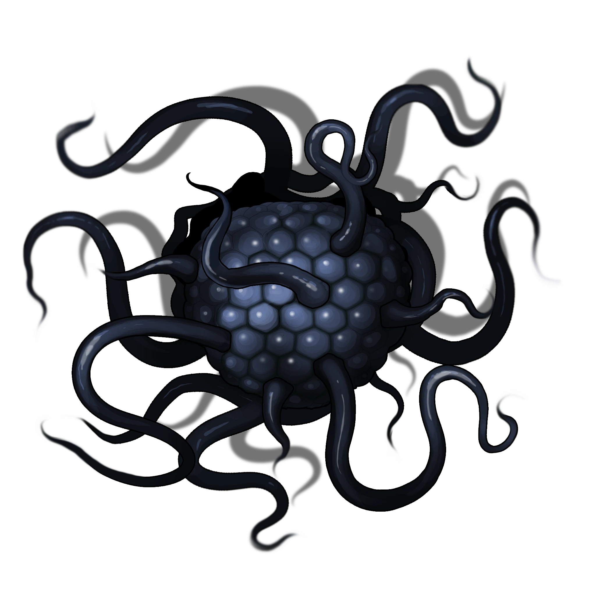

# An Ancient Battle

> [!warning] Gamemaster
> #### Gamemaster's Summary
>
> This Combat Event occurs as the party enters the [[Writhing Grave]]. By investigating the area, the characters can:
>
> - Encounter a [[Writhing Whisperer]], a malevolent and ancient Abyssal entity.
> - Battle the Writhing Whisperer or accept its offered bargain.
> - Interact with the Shent seer, [[Mioroth]], who appears via projection after the battle.
>
> #### Area Walkthrough
>
> The party begins in the [[Writhing Grave]] Scene, where the central gameplay of this Event transpires. A complete description of the area and the gameplay that occurs there is detailed in the [[Writhing Grave]] Area Walkthrough.

In this Event, the party faces a Writhing Whisperer, a terrible abyssal monster trapped here for thousands of years.

> [!abstract] Writhing Whisperer
> **[[Writhing Whisperer]]**
>
> Level 6 (Elite) · Abyssal Harbinger Whisperer
>
> 
>
> Ever shifting and reshaping itself, producing new limbs as quickly as it retracts existing ones, occasionally you glimpse flickers of stars and lights swirling around under the surface, but they are always consumed by blackness a moment later.
>
> It has no eyes, no mouth, no perceptible form that lets you ascribe humanity or awareness to it, and yet you can feel its alien intelligence, feel it probing your mind, trying to find ways in. You can sense it trying to understand what you are in much the same way you are trying to parse is inscrutable form in return.

Immediately refer to the [[Writhing Grave]] Area Walkthrough for gameplay details of this location and the encounter that happens here. Once the encounter is resolved, return to this Event to deal with the aftermath depending on what choice the party made.

### The Whisperer Destroyed

If the party opposed and destroyed the Writhing Whisperer as Mioroth asked, record the Event Outcome, and award attunement progression.

`[[/outcome mioroth]]`

#### Heart Attunement: Defeat the Whisperer

Any character who contributed to defeating the Writhing Whisperer in combat advances their **Attunement: Heart of Ember (+1)** at the conclusion of the Event.

Shortly after the Whisperer is slain, the projection of Mioroth faintly appears, shimmering amidst the vapor of the cascading waterfalls.

> [!abstract] Mioroth
> **[[Mioroth]]**
>
> Level 18 (Boss) · Memory Shent Seer
>
> 
>
> Appearing as if from legends, a ghostly, semi-transparent, colossal figure looms over you even as he sits with his legs crossed. He is serene, calm, and intangible, as if made of pure energy and flickering strands of light. Shadows and motes of magic constantly evaporate from his body, and his only constant is his wise and gentle smiling expression. He looks faintly like a Kivahr, but as if carved from stone, with heavy brows, long limbs, and a muscular frame. The clothing he wears matches no recognizable style.

Mioroth acknowledges the party's effort.

> [!quote] Read Aloud
> > Thank you for doing what we could not. We should have destroyed this creature instead of allowing it to linger for these countless years, but there were none who could take up the fight once the last of us fell.
> >
> > I will reward your intervention as I am able, and I plan to watch your progress to the extent that my remaining sight permits. I suspect this will not be the last time we meet.

The party can ask about any missed information or topics from [[Lunar Awakenings]] in [[Lunar Awakenings]], as well as the following additional information:

> [!question] Q&A
> **Q:** What was that thing?
>
> **A:**
>
> > A Whisperer, an outsider that slipped through during the Shattering.

> [!question] Q&A
> **Q:** What happened here?
>
> **A:**
>
> > The battle was meant to be one-sided. We had the abomination finally cornered. My people made preparations to destroy it, but we took too long, and it had found its way into the minds of our allies.
> >
> > The fight was no longer on our terms, and before long all we could do was wound it, then fall back. In our retreat we sealed the passes and gates, attempting to at least contain what we could not defeat.

> [!question] Q&A
> **Q:** Leaving this place?
>
> **A:**
>
> > The closest exist from the region is through crystal caves to the south. We had a stone doorway there that served as a gateway to more verdant paths beyond. However, the door is sealed magically. You will need to speak the words "Hope in destruction," which will open the way for you.
> >
> > Do not worry what tongue you use. The old magic was meant to recognize the meaning, not the words.

> [!question] Q&A
> **Q:** About a reward?
>
> **A:**
>
> > Yes, of course, there is a great treasure to be had in the caves to the south. During the war against the Abyss, a powerful seer of ours was grievously wounded and sacrificed herself to make sure the canyon was properly sealed.
> >
> > If you can find the final resting place of this mage, you can claim the ancient spell case in the remains. Be warned though, if you do go searching the gloomy corners of the caverns, beware the glint of gossamer in the darkness. There are many lurking dangers still.

> [!warning] Gamemaster
> #### Shent Spell Case
>
> The corpse of the seer that Mioroth mentions can be discovered during the [[The Glint of Gossamer]] Event in the [[Kaleidoscope Caverns]] to the south of the ancient battle site. It only appears for parties that have helped Mioroth and learned about its existence.

> [!question] Q&A
> **Q:** Will we see you again?
>
> **A:**
>
> Mioroth offers an odd smile.
>
> > There are many paths, and many events the Shent foretold before our time on Ember was up, and I have not forgotten all I've seen. We will meet again. I cannot and will not say anything more.

### The Whisperer Released

If the party aided the Writhing Whisperer and freed it from its restraints, mark the following Outcome as complete, and award Attunement progression as described below.

`[[/outcome whisperer]]`

#### Abyss Attunement: Release the Whisperer

The character who was most proactive in accepting the Writhing Whisperer's sinister bargain advances their **Attunement: The Abyss (+3)** at the conclusion of the Event. Each other character in the party who allied themselves with the Whisperer also advances their **Attunement: The Abyss (+1)** at the conclusion of the Event.

Shortly after the Whisperer escapes, the projection of Mioroth faintly appears, shimmering amidst the vapor of the cascading waterfalls.

> [!quote] Read Aloud
> As your minds settle, you perceive the shimmering form of a Shent seer looking down at you. His voice booms from all directions, fury clear in his voice:
>
> > Fools! Greedy, short-sighted fools! You have no idea what you've done. You've unleashed an entity of pure destruction on this world! When the skies were first sundered and its ilk spilled into our lands they were nearly our doom!
> >
> > Of all the monsters that slipped through, it was not even the strongest, and yet its power sufficed to lay waste to **dozens** of us within minutes of its arrival, and we only managed to weaken and contain it!
> >
> > I hope that you have not doomed this world with your actions, and that whatever dark boon it granted you was worth it …
>
> With this, the fuming projection of the seer shimmers out of existence, his words still echoing off the walls and in your mind.

### Concluding the Event

> [!warning] Gamemaster
> #### Next Steps
>
> Once the party has finished its encounter with the Writhing Whisperer, they can proceed southwest into the [[Kaleidoscope Caverns]], triggering [[The Glint of Gossamer]].
