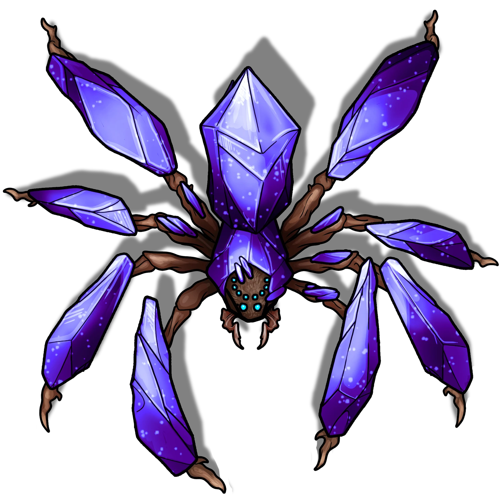

# The Glint of Gossamer

> [!warning] Gamemaster
> #### Gamemaster's Summary
>
> This Combat and Exploration Event occurs as the party searches for an exit from the [[Kaleidoscope Caverns]]. By exploring the caverns, the characters can:
>
> - Navigate a hazardous arena of glittering webs.
> - Search the desiccated cadavers of long-dead Shent.
> - Survive combat with three [[Young Cheliceraeth]].
>
> This Event is depicted using the "Spider Maze" Level of the [[Kaleidoscope Caverns]] Area Map.

### The Gossamer Cave

While navigating this psychedelic subterranean landscape, the party reaches a peculiar expanse of scintillating caves defined by its natural stone columns and the presence of glittering spiderwebs. The party is funneled into the Cheliceraeth lair via a narrow tunnel before spilling out into a larger maze-like cavern dotted by natural stone columns.

> [!quote] Read Aloud
> Here and there, you spy vaguely humanoid shapes wrapped up in glittering webbing — large skeletal forms, the size of giants — but it's apparent that no kind of living traveler has been here in ages.
>
> Two of these clusters of webbed detritus catch your eye in particular. To your left, a set of metallic armor adorned in ancient filigree pokes out of a bulbous mass of glittering webs. Far ahead, a large skeletal figure wreathed in sparkling gossamer clutches an odd metallic cylinder. Perhaps other withered corpses lie hidden here, with secrets of their own …

> [!danger] Hazard
> #### Glittering Webs
>
> It is easy for the characters to spot the potential danger of these glittering webs, but they may be tempted to explore them after noticing treasure among the desiccated corpses.
>
> Whenever a creature moves through a space covered in glittering webs, they must face **Glittering Webs (Hazard 4, Fortitude, Harmless)**, if not resisted that character becomes **Restrained** by webbing. Creatures who are restrained may escape at the cost of **6 Action** or with a **Athletics (DC 16)** check.
>
> Sections of webbing are defined according to 5 foot squares, and can be destroyed with the application of Fire or Acid damage.
>
> #### Lurking Spiders
>
> While exploring the caverns, it is likely that the characters will disturb and provoke the Young Cheliceraeth who lurk here.
>
> - Any character who becomes &reference[restrained] by or who otherwise touches the webs immediately draws the attention of all 3 Young Cheliceraeth .
> - Any character who passes within 10 feet of a Young Cheliceraeth must make a successful **Stealth (DC 13, Passive)** check to avoid detection.
> - If the party is remarkably loud, the Young Cheliceraeth will hear them.
>
> If the Young Cheliceraeth detect the characters, proceed to [[The Glint of Gossamer]].

The glittering webs that crisscross the Cheliceraeth lair have been here for centuries and house an array of broken egg sacs and clusters of cocooned mysteries. In addition to the skeletal remains of subterranean animals, these webs also contain a concealed array of ancient equipment and treasure from a bygone era.

After noticing the filigreed armor, the party may wish to explore the cave's tangled network of glittering webs for other signs of loot — a sure way to attract the attention of the three Young Cheliceraeth who dwell here.

> [!tip] Exploration
> #### Searching for Treasure
>
> A total of four Shent corpses are scattered throughout the Cheliceraeth lair, all of them cocooned in gem-spangled webbing. These forgotten souls were once the *Sealers of the Southern Gate*; now, their worldly remains are all but bones and dust, mired in glittering web. Characters can loot the corpses with a small amount of effort, but must take care to avoid getting caught in the glittering webs.
>
> **Shent Corpse A:** The Shent corpse to the northeast wears a set of [[Shent Breastplate]] armor adorned in ancient filigree.
>
> **Shent Corpse B:** The skeleton near the center of the area holds one item of interest: a powerful [[Shent Scroll Case]].
>
> Any character who examines the [[Shent Scroll Case]] and makes a successful **Arcana (DC 16, Passive)** check recognizes that the case is a powerful artifact and a discovery of considerable value.
>
> - **Knowledge: Artifacts**: The character automatically succeeds on this check.
>
> Any character with **Awareness (DC 15, Passive)** spots the other two Shent corpses concealed within the tangled mass of glittering webs.
>
> **Shent Corpse C:** The ancient corpse to the southwest clings to something obscured by grit and gossamer: an ancient [[Shent Amulet]] made of a curious unknown alloy.
>
> Characters with **Knowledge: Legends** or **Knowledge: Gods** who make a successful **Society (DC 15)** check recognize that this holy symbol depicts the Elder God Pathwalker.
>
> **Shent Corpse D:** The corpse to the southeast holds two other aged items covered in elaborate filigree: a [[Shent Shield]] and a [[Shent Shortsword]].

#### Signara Attunement: Shent Scroll Case

The first character to successfully unlock the [[Shent Scroll Case]] advances their **Attunement: Signara (+1)**. This occurs as soon as the magic item is unlocked.

The items the party may discover here once belonged to ancient Shent giants and giantkin who served as Sealers of the Southern Gate. Characters can spend a few moments scrutinizing this loot to learn more of its nature and history.

> [!tip] Exploration
> #### Secrets of the Ancient Shent
>
> Any character who examines the items and makes a successful **Society (DC 18)**check identifies the filigree on the armor and equipment as the insignia of the "Sealers of the Gate," a proud alliance of Shent mage-sentinels who guarded various arcane thresholds throughout Ember.
>
> - **Knowledge: Ancients**: The character gains **+2 Boons** on this check.
> - **Knowledge: Shent**: The character gains **+2 Boons** on this check.
>
> Any character who examines the corpses and makes a successful **Medicine (DC 13)** check concludes that, based on their wounds and the damage to their equipment, the giants who perished here did so beneath the fangs of much larger versions of the crystal spiders.
>
> - **Knowledge: Forensics**: The character automatically succeeds on this check.

### Cheliceraeth Ambush

Three [[Young Cheliceraeth]] lie in wait here disguised as Medium-sized outcroppings of crystals. Combat here is inevitable. However, the party may be able to avoid a surprise attack by the trio of crystal spiders if they successfully navigate the area without disturbing the webs.

> [!warning] Gamemaster
> #### Crouching Spider, Hidden Cheliceraeth
>
> The [[Toggle Cheliceraeth]] macro allows you to reveal hidden Cheliceraeth. To use this macro, select the Chelicerath tokens on the scene, and activate the macro by clicking on it in this dialog, or in the macro hotbar at the bottom of your screen.
>
> It will change the crystal spiders from their hidden to active appearance and vice versa.

> [!abstract] Young Cheliceraeth
> **[[Young Cheliceraeth]]**
>
> Level 2 · Crystal Spider Cheliceraeth
>
> 
>
> A melodious, twinkling percussion fills the air — like the sound of softly cascading glass — as you notice a medium-sized growth of crystals transform into a ten-eyed creature with eight spindly legs and two large, articulated fangs. This horrible arachnid resembles an enormous semi-translucent spider made of faceted purple moonstone, which shimmers and scintillates in the scant light. Angry crystalline spikes decorate the extremities of its silicate form, and its ten loathsome eyes appear refracted with a dreadful arcane opalescence.

> [!danger] Hazard
> #### Ambush!
>
> The 3 [[Young Cheliceraeth]] are perfectly concealed by their [[False Appearance]] trait and cannot be detected until they move. Once they begin to move, they can be detected by characters with **Awareness (DC 15, Passive)**. Characters who do not detect the Young Cheliceraeth before they attack begin the ensuing combat encounter with the **Unaware**condition.
>
> #### Young Cheliceraeth Tactics
>
> At the start of combat, the Young Cheliceraeth will use their [[Bewildering Gaze]] on enemies to render them **Confused**.
>
> Over the course of combat, the Young Cheliceraeth will prioritize the following actions and abilities:
>
> - In melee, the Young Cheliceraeth will use their [[Venomous Bite]] attack.
> - If their morale is **Broken**, the Young Cheliceraeth will attempt to climb the cavern walls and hide among the crystals using its [[False Appearance]] trait.
>
> The battle ends when the Young Cheliceraeth have been defeated or driven back into hiding.

After the fight with the Young Cheliceraeth concludes, the party notices the corpse of a much larger chaliceraeth underfoot. Read or paraphrase the following:

> [!quote] Read Aloud
> You can't help but wonder what could be responsible for all of the glittering webs in this cavern, considering the crystal spiders you just encountered weren't seen spinning webs of their own. That's when you notice the long-dead carcass of what must have been a massive specimen of crystal spider, twinkling egg sacs infesting each recess of its rotted gemstone cadaver.

After the battle or during the fray, characters may be able to recall certain details about cheliceraeth and their kin — including elder cheliceraeth and other spiders:

> [!tip] Exploration
> #### Regarding Cheliceraeth
>
> Any character who makes a successful **Arcana (DC 13, Passive)** check recalls legends of the Spider Goddess, known as "The Watcher," who is responsible for the creation of all true spiders on Ember. All manner of spiders populate the living planet, and these cheliceraeth must be among the most primordial.
>
> - **Knowledge: Abyssals**: The character automatically succeeds on this check. Additionally, they know another name for "The Watcher" — Sitheera. Sitheera is an Outer God who brought about the advent of true spiders during the Abyssal Shear. Sitheera's chosen speak of her monstrous feminine form — the grotesque beauty of her flowing hair made of spiders' legs, and the dominating golden-green majesty of her ten glittering eyes.
> - **Knowledge: Legends**: The character automatically succeeds on this check.
> - **Critical Success**: The character also recalls that the Spider Goddess is revered throughout Ember by clandestine cults of warlocks and sorcerous acolytes. She goes by several names, from "The Watcher" to "The Eyes in the Dark," and her worshippers are often allied with spiders and their arachnid kin.
>
> Any character who makes a successful **Wilderness (DC 14)** check understands that cheliceraeth are native inhabitants of the planet's subterranea, particularly where crystals enchanted by Ember's heartblood are known to grow in larger quantities. Compared to other giant spiders, they are rarely (if ever) seen on the world's surface.
>
> - **Knowledge: Monsters**: The character automatically succeeds on this check.
> - **Knowledge: Subterranea**: The character automatically succeeds on this check.
> - **Critical Success**: The character recalls that huge specimens of cheliceraeth have been documented by celebrated explorers of Ember's Pathways. These elder cheliceraeth are known to possess a potent venom and the ability to spin webs in combat. Some of the oldest specimens are rumored to be intelligent beyond normal measure, and blessed with arcane abilities greater than the bewildering gaze encountered here.

### Concluding the Event

> [!warning] Gamemaster
> #### Next Steps
>
> Once the party has finished exploring the caverns, they can proceed southeast, triggering [[A Promised Exit]].
