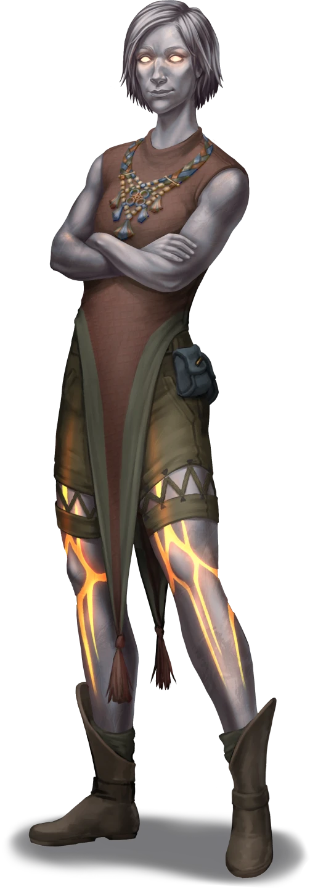

# Dusktide Destruction

> [!warning] Gamemaster
> #### Gamemaster's Summary
>
> This Social and Exploration Event occurs if the party was delayed in reaching Helkas and arrives later than 12:00am on Day 6; the party arrives to witness the aftermath of the Otherhood attack on Helkas described in the [[Dusktide Rising]] Event. By interacting with the survivors and investigating the scene, the party can:
>
> - Discover clues about the drakes and bandits that attacked Helkas.
> - Speak to the caravan members and learn their opinions on the attack.
>
> This Event is depicted using the "Dusktide Attack" Level of the [[Vista: Helkas]] Vista.

### Surveying The Destruction

The majority of the damage done to Helkas was through arson, with numerous fires being set across the town, resulting in large swaths of it burning to the ground. In terms of casualties, that is a more varied situation, with the dead and injured either being caught in fires or attacked by the invaders.

> [!tip] Exploration
> #### A Town In Ruin
>
> Those approaching the scene notice the presence of a dead raider lying in the burned-out ruins of a shop, and the remains of a large drake laying in an alley next to a pair of townsfolk.
>
> Any character who examines the scene and makes a successful **Awareness (DC 14, Passive)** check reveals three elements at play in the attack:
>
> 1. A monster attack (alternatively recognized using **Knowledge: Monsters**).
> 2. A bandit raid (alternatively recognized using **Knowledge: Crime**).
> 3. Arson and resulting fires (alternatively recognized using **Knowledge: Forensics**).
>
> Any character who recognizes the elements above and makes a successful **Intimidation (DC 14)** check comes to the reasonable assumption that the attacking raiders likely used the monsters as a vanguard to soften the town's defenses before entering themselves.
>
> - **Knowledge: Warfare**: The character gains **+2 Boons** on this check.
>
> Characters with**Knowledge: Alchemy** recognize the stench of accelerants and spot a few broken containers that would be used in the creation of alchemical fire. The fires would have been incredibly hard to stop when initially set due to how stubbornly such chemicals burn.

### The Dead Drake

Once the party has finished surveying the destruction in general, they may wish to examine the defeated drake, which when alive was described as follows:

> [!abstract] Afflicted Pallid Drake
> **[[Afflicted Pallid Drake]]**
>
> Level 4 · Afflicted Pallid Drake Adult Drake
>
> 
>
> This large, serpentine creature is covered in pale white-green scales with a prominent flared tail adorned with ragged, green frills. Its draconic head is set with long horns tipped in the same pale green hue, and halfway down its body are more wide, damaged frills. The Drake's eyes are a cloudy white, hinting at blindness, and its body is marred by unsettling yellow pustules emerging from ragged wounds. Despite its obvious afflictions, it maneuvers with undeterred grace, periodically revealing rows of razor-sharp teeth within a saliva-dripping maw.

> [!tip] Exploration
> #### Dead Drake
>
> Any character that examines a dead drake's corpse and makes a successful **Medicine (DC 14)** check reveals that this creature appeared to have been exceedingly ill during its life. It was likely in constant pain, and functionally — if not entirely — blind. You've never seen any kind of illness like this before. There are old scars that have healed over, and some especially rancid wounds on this drake that have been festering for some time. This drake was not just ill: it was chronically ill, possibly for most of its life.
>
> - **Knowledge: Forensics**: The character automatically succeeds on this check.
>
> Any character that examines the corpse's wounds and makes a successful **Science (DC 13)** check confirms that this creature died from the collective wounds it suffered while battling the townsfolk. The fatal blow was likely the broken spear jammed into its gut.
>
> - **Knowledge: Forensics**: The character automatically succeeds on this check.
>
> Any character who fought the sick drakeling in the Forest of Stone recognize this as the same sort, although the adult drake is a much older and larger specimen; it is a testament to the creatures' ferocity that they survived as long as they did while so sickened.

### The Dead Raider

The presence of a dead bandit may also draw their attention, complicating their picture of the attack. While alive, this individual would have been described as follows:

> [!abstract] Bassa the Firebug
> **[[Bassa the Firebug]]**
>
> Level 2 (Elite) · Kivahr Brigand
>
> 
>
> A wild-eyed fellow wearing scorched leather armor covered in dark metal studs, and multiple armored bandoliers packed with vials of unknown liquids. He smells of chemicals and smoke, and looks ready for a fight.

> [!tip] Exploration
> #### Bandit Corpse
>
> Any character that investigates the bandit's corpse and makes a successful **Awareness (DC 13, Passive)** check notices the distinctive presence of a tattoo on their arm. It depicts a stylized gold coin with Arcden script and glints slightly in the light.
>
> - **Knowledge: Forensics**: The character automatically succeeds on this check.
>
> Any character that examines this tattoo and makes a successful **Society (DC 14, Passive)** check recognizes that the coin tattoo says "For Other Fortunes," which is a play on an old Arcturian phrase about making changes to one's life; it is a shortened version of a catchphrase often used by pirates when pledging to a new ship: "I left my life for other fortunes — may they soon become my own."
>
> They also notice that the ink of the tattoo is moving slightly as they look at it, indicating it may have magical properties.
>
> - **Knowledge: Seafaring**: The character automatically succeeds on this check.
> - **Language: Arcden**: The character automatically succeeds on this check.
>
> Any character that notices the tattoo's magical properties and makes a successful **Arcana (DC 14, Passive)** check identifies the ink as a variant of "shifting ink," which is typically used to obscure documents, making them harder to decipher. The ink is not usually used on tattoos, and does not appear to have the same properties of changing the meaning of written text while on the body.
>
> - **Knowledge: Intrigue**: The character automatically succeeds on this check.
>
> Any character who examines the rope coil markings on the leather and makes a successful **Society (DC 13, Passive)** check identify them as an elaborate maker's mark, used by crafters to drive business their way, but cannot tell whose mark it is.
>
> - **Culture: Arcturian**: The character automatically succeeds on this check.
> - **Knowledge: Trade**: The character automatically succeeds on this check.
> - **Path: Caravanner**: The character automatically succeeds on this check.
>
> Characters with **Knowledge: Alchemy** recognize the telltale signs of chemically treated clothing and equipment to make it fire resistant. As long as this equipment is in well-maintained order, you reason that it could afford significant capability to withstand the hazards of heat and flame. Unfortunately, the gear was utterly destroyed.

### Speaking To Survivors

The party may wish to speak to other surviving townsfolk, however the opportunity to do so does not seem immediately appropriate.

> [!quote] Read Aloud
> Though there are many dead, the survivors are acting with determination and resolve to protect what is left of the town and its people. Townsfolk are milling about, ferrying water to quench fires and medicine for the wounded wherever it is most needed. You notice an altyran woman with a steeled expression coordinating most of the activity. She looks too busy and at too critical a juncture in her work to interrupt her now, but you take note that she is likely a local leader.

> [!info] Social
> #### Firsthand Accounts
>
> By speaking with other survivors, the party can learn the following details of what transpired.
>
> - The town was attacked just at midnight during the height of the Dusktide Festival. Prior to the attack, the festival had proceeded as expected without any remarkable deviations from the norm.
> - At first, a group of drakes appeared, attacking the townsfolk, and driving them indoors. A few of the local defenders fought desperately to scare them off or kill them. The defenders managed to kill one of the larger drakes, but it killed half a dozen people in the process.
> - At some point the fires began, and with it the bandits showed up. They took advantage of all the townsfolk being holed up inside to escape the drakes. This forced people to either sit in burning buildings, or rush out to face drakes and raiders.
> - The raiders seemed to know about the drakes, and were careful to avoid getting in their way. They didn't seem to be working directly together, however.

The town magistrate, Sadri Zhalimorne, is fully occupied with organizing the response to the attack. The party can observe her from a distance, but it is not possible to engage her in conversation at this time.

> [!abstract] Sadri Zhalimorne
> **[[Sadri Zhalimorne]]**
>
> Level 1 · Altyra Trader
>
> 
>
> You regard a steel-skinned woman with luminous golden eyes and side-parted bob of short-cropped silver hair. Adorned in a brown sleeveless tunic with leather shorts and boots, her countenance is equal parts purposeful and amused, and you can’t help but notice the lambent lines of bright copper that decorate her legs. A beaded Arcturian plastron necklace hangs around her neck, proudly signifying some kind of social station.

### Thoughts From The Caravan

Once the party has surveyed the scene, they would be likely to share thoughts with their traveling companions from the Strayhearth Caravan for further insights or ideas on what may have happened.

> [!question] Q&A
> **Q:**
>
> **A:**
>
> Agraband pauses from unloading belongings from his carts and meets your gaze with a steady but sorrowful expression.
>
> > I've never seen an attack like this directly on a town like Helkas. Yes, there's history of feuding groups in the Arctus Plateau, but never something as brazen as this. Strange things are brewing, and the clouds on the horizon seem to get bigger with every passing footfall.
> >
> > I recommend you stick together and put your skills to use investigating and standing against this rising tide of chaos. In my experience, the world never fixes itself. It's up to us, those of us who can, to do something and make a difference.
> >
> > In the meantime, I'm going to unload whatever supplies I can that will be put to good use here. Clipper and I will see to getting them into the hands of those who need them most.

> [!question] Q&A
> **Q:**
>
> **A:**
>
> Clipper surveys the scene of Helkas' desolation with a frown, idly twirling a coin back and forth across the knuckles of their ethereal hand.
>
> > It's awful what has happened here at Helkas. In my experience, whenever something terrible like this happens, it ultimately comes down to someone, somewhere, who profited from it. Some people are just bad, but most of the time there's a reason. Most of the time, that reason is hard coin. If you want to do something about what happened here, start by asking yourselves, "Who is better off because Helkas was attacked?"

> [!question] Q&A
> **Q:**
>
> **A:**
>
> Lyla appears distant, her expression reflecting worry about both current and past events. She remains deeply lost in thought until the sound of your approach jolts her back to awareness.
>
> > I've been hearing about attacks and disruptions on the Arctus Plateau, but this attack on Helkas is brazen. Helkas partners with House Cevher to some extent. For someone to be willing to subject it to such violence is unthinkable. Never mind the drake attacks, which are entirely new.
> >
> > I was already worried about the state of things here in the Arctus Plateau, but I can't just let this stand. I think it's time that I start doing some more digging, try to see what's going on here.

> [!question] Q&A
> **Q:**
>
> **A:**
>
> Ankarist pores over the fallen attackers, the ruins of buildings, and the patterns of combat in the ruined spaces of Helkas like they still hold secrets for him to find. Beyond this there is a simmering frustration in his posture and movements.
>
> > I can't believe we weren't here — what wretched misfortune that we were delayed upon the road!
> >
> > These events confirm some suspicions that I and my superiors have been exploring for several months now. There are strange new dangers emerging in the Arctus Plateau, and a degree of coincidence in their actions that is alarming. I must think on this for now and figure out what it means, and more importantly what to do next.

> [!question] Q&A
> **Q:**
>
> **A:**
>
> The young druidess looks personally harmed by the violence visited upon Helkas. The suffering of its people has seemingly rooted deep in her chest and grown into a powerful compassion which drives her to help all in her path. Yet there is something else in her eyes, something haunted and troubled beyond this violence.
>
> > It seems clear to me now — more than ever — that we need the Cindaric Sages. Terrible events like this cannot be allowed to happen so close to their seat in Ordain. They must be informed, or perhaps they already know and are setting plans in motion to help the people and set everything straight!
>
> A grim look passes over Sin's usually innocent face.
>
> > I heard an extremely disturbing rumor that one of these raiders, at the moment of their death, exhibited some sort of spiritual corruption by which their soul was twisted and pulled forth from their body as a gruesome specter. Could such a thing have actually happened? Something like that would be an unnatural affront to the cycle.

### Concluding the Event

All of the party's companions share the sentiment that they should spend some time looking around town for further clues.

> [!warning] Gamemaster
> #### Next Steps
>
> Having arrived late to discover the brutal aftermath of the attack on Helkas, the party can now spend time investigating in more detail what happened here.
>
> To continue the Quest, advance time by at least 1 hour or, if more suitable, have the party perform a **Rest**. A more thorough investigation of what transpired here occurs in the following Event, [[The Smoke Clears]].
