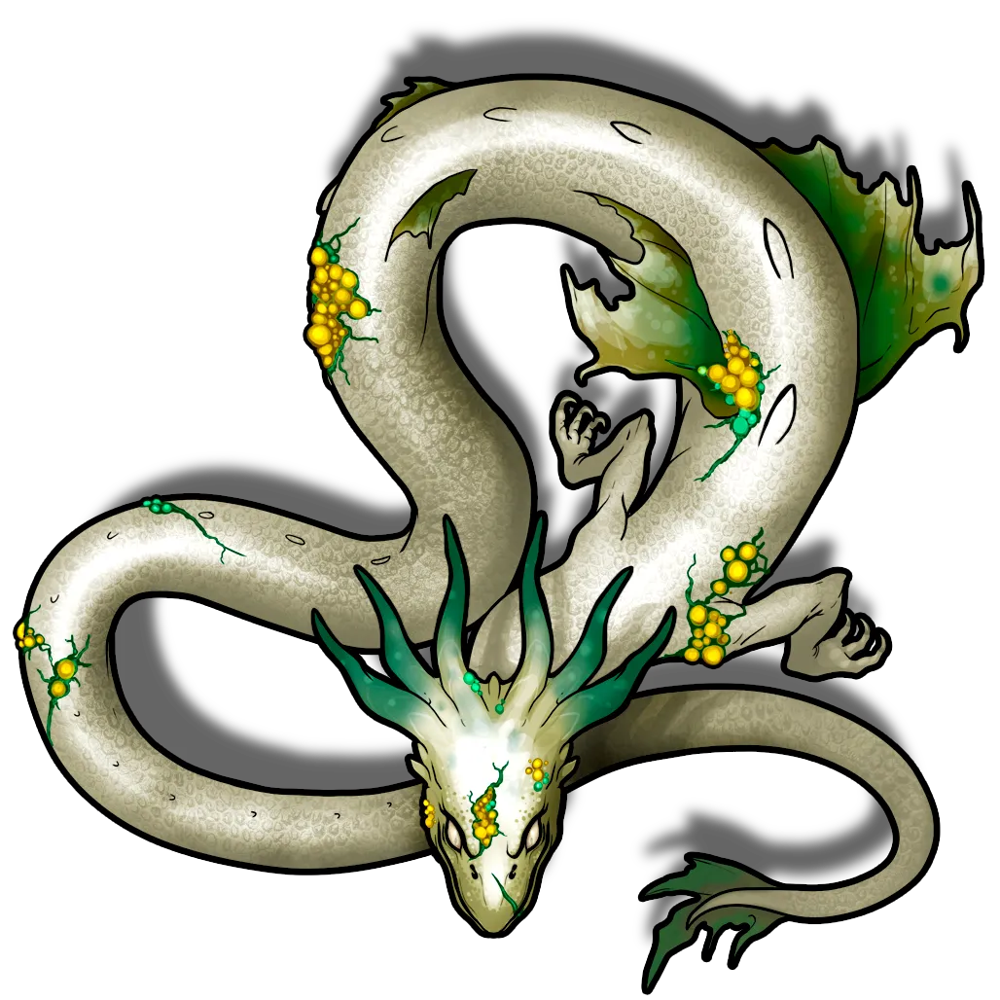
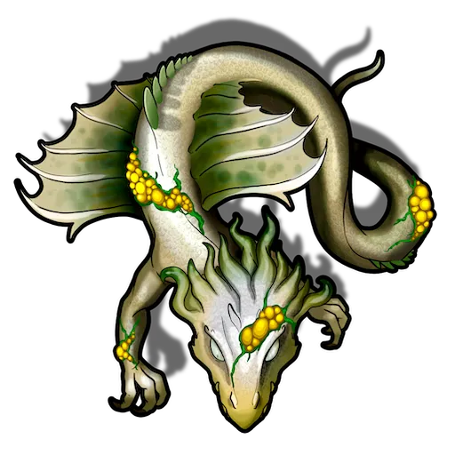
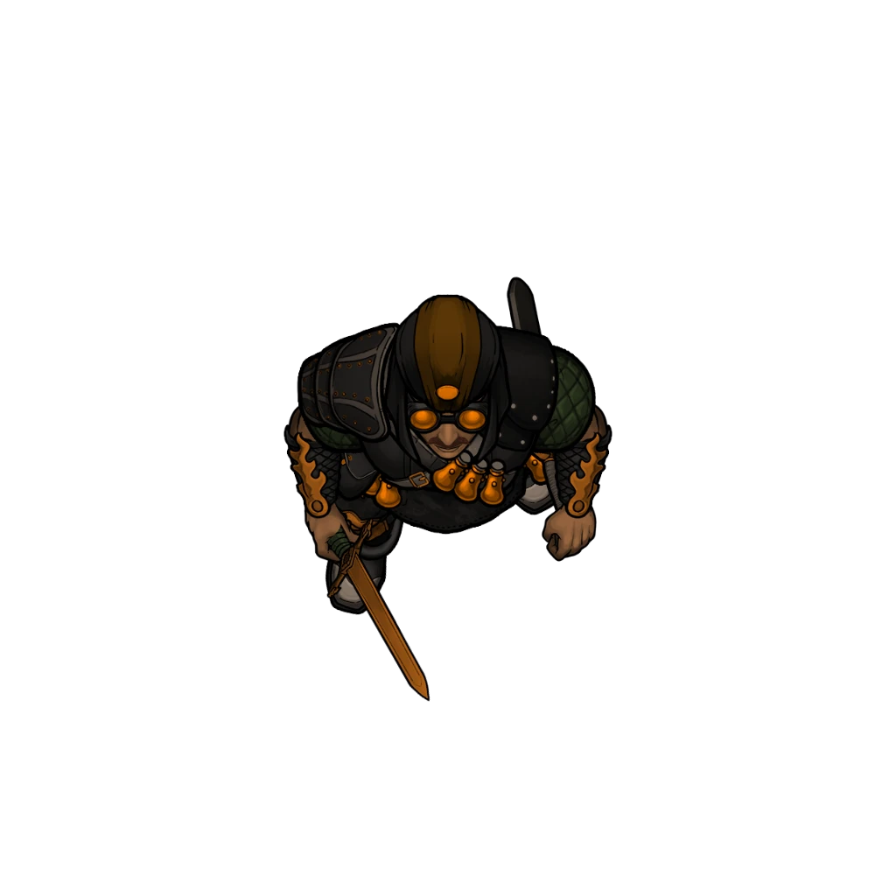

# Dusktide Rising

> [!warning] Gamemaster
> #### Gamemaster's Summary
>
> This Combat Event occurs when the town of Helkas is suddenly attacked by mutated drakes and a band of raiders during the Dusktide Festival. In this Event, the party must:
>
> - Survive an attack by a [[Afflicted Pallid Drake]] and several [[Afflicted Pallid Drakeling]].
> - Repel a seemingly unrelated onslaught from [[Otherhood Raider]] led by [[Bassa the Firebug]].
> - Protect or save as many townsfolk of Helkas as they can, including [[Arcturian]] and local NPCs alike.
> - Possibly learn a mysterious clue about the coordination of the attack.
>
> This Event is depicted using the "Green" Level of the [[Helkas]] Area Map.
>
> #### Combat Phases
>
> This Event is divided into two combat stages. Some important notes on these phases and how initiative order should be handled are:
>
> - The attack begins with the [[Drake Assault]] which drives townsfolk into cover and sows chaos throughout the town. During this phase [[Ankarist]] fights by your side in initiative order.
> - This attack is followed shortly thereafter by an [[Otherhood Assault]] wherein raiders arrive to pillage the town. During this phase [[Lyla Cevher]] fights by your side in initiative order.
> - Your other companions from the caravan are not included in the combat directly as they are instead offscreen assisting the townsfolk.
> - There are many [[Arcturian]] throughout the map. We recommend *not* adding these to tracked initiative order. At the end of every combat round you may reposition these commonfolk to simulate the survivors fleeing from danger and the overall chaos of the battle.
>
> It is intended for these two combat phases to occur consecutively without extensive time for recovery between them, but as the Gamemaster you should calibrate the timing to apply the right amount of pressure to the party based on how they fared during the battle with the drake.

### Drake Assault

The town is under attack! The townsfolk of Helkas scramble to reach safety while you and your companions prepare a hasty defense.

> [!warning] Gamemaster
> #### Active Ally
>
> [[Ankarist]] stands at your side to defend against the encroaching creatures and should be included in tracked initiative order.

> [!abstract] Afflicted Pallid Drake
> **[[Afflicted Pallid Drake]]**
>
> Level 4 · Afflicted Pallid Drake Adult Drake
>
> 
>
> This large, serpentine creature is covered in pale white-green scales with a prominent flared tail adorned with ragged, green frills. Its draconic head is set with long horns tipped in the same pale green hue, and halfway down its body are more wide, damaged frills. The Drake's eyes are a cloudy white, hinting at blindness, and its body is marred by unsettling yellow pustules emerging from ragged wounds. Despite its obvious afflictions, it maneuvers with undeterred grace, periodically revealing rows of razor-sharp teeth within a saliva-dripping maw.

> [!abstract] Afflicted Pallid Drakeling
> **[[Afflicted Pallid Drakeling]]**
>
> Level 2 · Afflicted Pallid Drake Drakeling
>
> 
>
> This serpentine creature has a long thin body accentuated by thin, ragged spotted frills midway along its body. Its features are dragon-like, boasting a crown of wavy horns, a maw filled with small, razor-sharp teeth, and a constant drool of acidic saliva. Its cloudy eyes suggest blindness, while the presence of unsettling yellow pustules in unhealed wounds point to a strange affliction. Despite its sickly appearance, the creature appears agile and dangerous.

> [!danger] Hazard
> #### Blinded
>
> The [[Afflicted Pallid Drake]] and the 4 [[Afflicted Pallid Drakeling]] are permanently **Blinded**. Their condition is offset by their [[Blood Sense]] talent, which allows them to locate wounded creatures within 2o feet.
>
> #### Afflicted Pallid Drake Tactics
>
> At the start of combat, the Afflicted Pallid Drake will fly aggressively through the battlefield in the general direction of any enemy it can hear or smell. It will use its [[Swooping Strike]] attack against the first enemy it makes contact with.
>
> Over the course of combat, the Afflicted Pallid Drake will prioritize the following actions and abilities:
>
> - In melee, the Afflicted Pallid Drake will use its [[Bite]] and [[Tail]] attacks.
> - From range, the Afflicted Pallid Drake will use its [[Noxious Spray]] attack, directing it toward the last known location of any enemy it previously sensed.
> - The Afflicted Pallid Drake fights to the death.
>
> #### Afflicted Pallid Drakeling Tactics
>
> The the start of combat, the Afflicted Pallid Drakeling will fly aggressively through the battlefield in the general direction of any enemy is can hear or smell. It will use its [[Pouncing Strike]] attack against the first enemy it makes contact with.
>
> Over the course of combat, the Afflicted Pallid Drakeling will prioritize the following actions and abilities:
>
> - In melee, the Afflicted Pallid Drakeling will use its [[Bite]] attack.
> - From range, the Afflicted Pallid Drakeling will use its [[Noxious Spit]] attack against an enemy it can hear or smell.
>
> #### Ankarist's Assistance
>
> [[Ankarist]] stands alongside the party and fights with them.
>
> Ankarist is a [[Spellblade]] empowered by a patron goddess of defense and creation. He is a fearless warrior who interweaves spellcraft with strikes from his greatsword, [[Greatsword]].
>
> - In melee, Ankarist uses his signature strike gesture to unleash devastating blows like **Flaming Strike**. If engaged with multiple targets, Ankarist will use [[Swipe]] to strike at multiple foes.
> - At a distance, Ankarist will hurl spellcraft like **Attractive Arrow of Control**, utilizing the Pull inflection to draw enemies closer to him.
> - Ankarist will fight until he becomes **Weakened** or **Broken**, at which point he will suggest a tactical retreat and withdraw.
>
> Once the drakes are defeated, Ankarist will depart to escort a group of embattled civilians out of the area and to safety, leaving the party to hold the square and protect whomever remains.
>
> #### Dramatic Moments
>
> At the beginning of each combat round after the first, roll on or choose from the [[Helkas Drake Moments]] table below and narrate the result. Each result can only happen once.

|  | #### Helkas Drake Moments |
| --- | --- |
| 1 | #### Flyby Spitting  A drake swoops overhead, its silhouette temporarily obscuring Mayis. A random party member who has recently made noise while performing an action is the target of **Spit Bile (Hazard 8, Acid, Reflex, Health)** which arcs down from above. |
| 2 | #### Lyla's Flying Dagger  A doorway swings open, and Lyla Cehver practically materializes from its shadows. She flings a **Thrown Dagger (Hazard 4, Piercing)**, striking the nearest drake or drakeling. |
| 3 | #### Panicked Commoners  A group of commoners come rushing out of a nearby building and begin trying to flee the area. They spend their available actions running towards the Boneway to ascend and escape into the hills above Helkas. |
| 4 | #### Barked Sin  Sin appears on a nearby roof wreathed in green energy and invoking the powers of Ember in druidic tongue. She casts a spell that wraps a nearby ally in a fortified mesh of sturdy bark, granting them the **Guarded** condition which lasts for six turns. |
| 5 | #### Clipper's Cool Shot  Clipper hops into view, a wide grin and maniacal glint in their eye. A glowing aura of frost forms around their hands, and with a clap of four palms, an arcing blade of kinetic force arrows across the battlefield striking a Drake or Drakeling with a **Kinetic Arrow (Hazard 6, Slashing)**. As the target turns in Clipper's direction, they quickly duck out of view saying "That one's free, the next one will cost ya!". |
| 6 | #### Color Commentary  Agraband's music and voice ring true over the din of battle. *Our heroes rallied in the ruin of the Dusktide, undaunted by the horrible visage of a drake's ragged bite. It would not be on their watch at all, that fair Helkas would fall!*.  One party member gains the **Inspired** condition which lasts for the following six rounds of combat. |

### Momentary Reprieve

> [!quote] Read Aloud
> The last drake collapses from its wounds, its body slumping to the ground with a heavy thud. Breathless, you turn to see Sadri emerging from a nearby building, ushering a group of frightened civilians toward safety.
>
> Ankarist spots her and strides over, his greatsword still glinting with crimson light.
>
> > I hope you're not planning to lead these folks by yourself.
>
> Sadri laughs like she's been caught.
>
> > I was, but if you're volunteering to escort us, consider yourself hired.
>
> She gestures for Ankarist to take the lead before looking toward you to say:
>
> > Hold the square in case more of those beasts show up. I’ll rally the town and send help as soon as I can!
>
> With that, Sadri and Ankarist make a hasty escape, driving the group of civilians along and leaving you to keep watch over square. As an uneasy quiet settles over the area, you can hear the roars and screams of chaos elsewhere in the town, but in the dark you can barely see what is happening.
>
> Nearby, Sin and Agraband appear and begin heading toward you, both look concerned in their own ways and are surveying the damage, but it is Sin who urges Agraband along, leading him toward you.
>
> > Good thing we arrived here before the attack. I don't know if Helkas would have been able to hold the line without you.
>
> Agraband grimaces, as though that hadn't occurred to him. The expression is only barely visible in the dark.
>
> > Yes, very fortunate. I shudder to think what might've happened otherwise.
>
> Sin nods, and then looks at you.
>
> > Well, I'm not here to think, I'm here to help. What can we do?

Believing the attack to be concluded, both [[Agraband Swift]] and [[Sin Marmot]] have returned to the Helkas green to provide healing and relief.

- Sin focuses on restoring the health of the wounded by casting **Composed Vital Influence**.
- Agraband focuses on restoring the morale of the party by casting **Pulse of Soul**.

This process of recovery is cut short as the window of time between the drakes being defeated and the next wave of attackers arriving turns out to be insufficient for anyone to do more than catch their breath, cast a few spells, drink a few potions, and check their gear.

> [!warning] Gamemaster
> #### Applying Pressure
>
> The Otherhood Raiders plan to attack the festival during the chaos caused by the drake attack. They would not ordinarily allow time for the town's defenders to regroup or evacuate civilians. It is intended that the party does not have time to rest between encounters. If the party fared poorly against the drakes, however, you may allow the party to Recover before beginning the next passage of the Event.

### Otherhood Assault

> [!quote] Read Aloud
> Suddenly you smell the stench of burning wood and cloth caught on the wind. Turning to the source, you see smoke rising between the buildings of Helkas. From all directions, raiders begin to encircle the town square. Some of them look at you, but others seem to be trying to gauge which buildings are occupied.
>
> Sin and Agraband swiftly retreat toward safety. Agraband calls out:
>
> > We'll make sure the civilians are safe, give them your worst… and make it look good!
>
> He has to stop and double back to grab Sin's arm, tugging her along.
>
> > Come on, Sin. Let them handle this, there are still injured folks in the tavern that need you.
>
> Reluctantly, Sin falls back as a sinister voice cuts through the night:
>
> > Best Dusktide festival I've ever been to. Shame it'll be the last one Helkas ever sees. Burn this place to ash! Leave nothing standing!
>
> The speaker resolves out of the darkness. He is a wild-eyed kivahr wearing scorched leather armor covered in dark metal studs, and multiple armored bandoliers packed with vials of unknown liquids. He smells of chemicals and smoke, and looks ready for a fight. With one wave of his hand the bandits close in around you, preparing to attack.
>
> However, you are not alone. Out of the corner of your eye you see the glint of a rapier, and a figure emerging from the shadows — Lyla Cevher. Her usual mirthful countenance is fixed and grim, ready to fight.
>
> > You're welcome to try, but we're not going to make it easy.

The party, joined by Lyla Cevher, faces a sortie of nine raiders, one of whom is their leader: Bassa, "the Firebug".

> [!warning] Gamemaster
> #### Active Ally
>
> [[Lyla Cevher]] stands at your side to defend against the arriving raiders and should be included in tracked initiative order.

> [!abstract] Otherhood Raider
> **[[Otherhood Raider]]**
>
> Level 1 · Human Brigand
>
> 
>
> A lightly-armored, heavily armed fighter wearing golden robes and brown leather armor. They look determined, disciplined and spoiling for a fight.

> [!abstract] Bassa the Firebug
> **[[Bassa the Firebug]]**
>
> Level 2 (Elite) · Kivahr Brigand
>
> 
>
> A wild-eyed fellow wearing scorched leather armor covered in dark metal studs, and multiple armored bandoliers packed with vials of unknown liquids. He smells of chemicals and smoke, and looks ready for a fight.

> [!danger] Hazard
> #### Otherhood Raider Organization
>
> [[Bassa the Firebug]] and his 8 [[Otherhood Raider]] are divided into three groups of three each; Bassa personally leads the southernmost group. Bassa is a pyromaniac and wishes for nothing more than to see Helkas burned to the ground. A character with **Knowledge: Warfare** recognizes that Bassa is the closest thing that passes for a "commander" of the Otherhood Raiders.
>
> #### Otherhood Raider Tactics
>
> At the start of combat, the Otherhood Raiders will fire a volley of [[Flaming Arrow]] at characters and buildings. Buildings ignite when struck.
>
> Over the course of combat, the Otherhood Raiders will prioritize the following actions and abilities:
>
> - In melee, the Otherhood Raiders will use their [[Dual Wield]] talent to strike with both their [[Shortsword]] and [[Dagger]].
> - Whenever able, the Otherhood Raiders will [[Backstab]] **Flanked** enemies.
> - From range, the Otherhood Raiders will use their [[Pinning Shot]] attack to prevent creatures from fleeing, and their [[Flaming Arrow]]attack to damage enemies and set buildings ablaze.
> - Otherhood Raiders whose morale is **Broken** will attempt to flee, but they will not surrender if cornered. They will also attempt to flee if Bassa is slain.
>
> #### Bassa the Firebug Tactics
>
> At the start of combat, Bassa will hurl [[Alchemist's Fire]] at the nearest enemy.
>
> Over the course of combat, Bassa will prioritize the following actions and abilities:
>
> - Bassa will avoid close quarters combat for as long as possible, preferring to use his [[Alchemist's Fire]] until none are remaining. He is reckless enough to even hurl these flasks at point-blank range, relying on the protection offered by his [[Firebug's Leather]] to protect him.
> - In melee, Bassa will throw his [[Alchemist's Fire]] and use his [[Dual Wield]] action to strike with his [[Shortsword]]. Once his [[Alchemist's Fire]] is expended, Bassa will draw his [[Dagger]].
> - Bassa will fight to the death. When death is near, Bassa will prioritize maneuvering into a position that maximizes the impact of his [[Death Throes]] feature.
>
> #### Lyla's Assistance
>
> [[Lyla Cevher]] stands alongside the party and fights with them.
>
> At the start of combat, Lyla will attempt to conceal herself.
>
> Over the course of combat, Lyla will prioritize the following actions and abilities:
>
> - In melee, Lyla will use her cunning to maneuver in combat to flank enemies and exploit their [[Weak Points]]. She uses [[Feinting Strike]] to deal heightened damage or [[Dual Wield]] to make multiple rapid strikes.
> - Lyla will fight until she becomes **Weakened** or **Broken**, at which point she will disengage and withdraw to safety.
>
> #### Dramatic Moments
>
> At the beginning of each combat round after the first, roll on or choose from the [[Helkas Raider Moments]] table below. Each result can only happen once.

|  | #### Helkas Raider Moments |
| --- | --- |
| 1 | #### Fire Support  The raiders receive supporting fire from allies nearby. A barrage of flaming arrows fall from the sky, fired by archers somewhere else in town. Any party member or ally not underneath overhead cover may be struck by **Flaming Arrows (Hazard 4, Fire, Reflex, Health)**. |
| 2 | #### Fire in the Pole  The festival pole at the center of the town becomes engulfed in alchemical flame, its attached streamers and tents catching fire and falling all around. Characters within 20 feet of the center of the Helkas Green risk being tangled up in **Burning Streamers (Hazard 4, Fire, Reflex)**. |
| 3 | #### Swift and Aggravating  Agraband steps into view and calls to a raider, "*I've seen more intimidating dummies in a tailor's window! It is fun how you all coordinated your outfits though…*". The magic laced in his words causes one of the raiders to flinch as though physically struck. Agraband uses [[Bard]] on a nearby raider. |
| 4 | #### Clipper's Free Sample  Clipper appears nearby, rummaging through their bag, pushing their arms in to their elbows. After a moment, a grin hits Clipper's face as they find what they're looking for. "*Looks like you could use a pick-me-up, take this!*" they yell, throwing a [[Healing Elixir]] to an ally nearby. |
| 5 | #### Ankarist's Eldritch Spear  Out of nowhere, a beam of magical energy streaks through the night, striking a foe. In the distance, you catch a glimpse of Ankarist wreathed in a nimbus of fading light. He nods to you before turning his attention to some danger only he can see. Ankarist casts **Arrow of Flame** on a nearby raider. |
| 6 | #### Swooping Season  Sin leaps off a roof, her form warping into a tiny red-beaked bird which dives down weaves through the battlefield, pecking and clawing at raiders one after another. Every remaining Raider who isn't inside a building suffers **Raking Pecks (Hazard 4, Piercing, Reflex)**. Sin then flies off before she can be retaliated against. |

### An Onlooker

After the final raider falls, the gleam of Orbis provides a momentary chance to identify a mysterious clue about the attack.

> [!tip] Exploration
> #### A Cowled Spectator
>
> Any character with **Awareness (DC 12, Passive)** notices the following:
>
> > You notice, standing atop the Helkas Boneway and illuminated against the vibrant Dusktide skyline, the silhouette of an onlooker. The figure is wearing heavy cascading robes and the combination of their low cowl and the gleaming moonlight behind them completely obscures their face. As if noticing your gaze, the figure turns their shoulder and disappears beyond the arcing ridge of the Boneway's spine.
>
> Any character who makes a successful **Awareness (DC 15)** check can tell by the figure's demeanor that they are neither a townsperson nor a raider. They seem to have been watching the bloody spectacle unfolding without directly intervening.
>
> - **Knowledge: Intrigue**: The character automatically succeeds on this check.
>
> By the time the party reaches a position to investigate further, no trace of the onlooker or their presence remains.

> [!warning] Gamemaster
> #### The Onlooker's Identity
>
> The onlooker mentioned above is [[Serethus]], leader of the [[Mutagists]] and one of the innermost circle of [[Zerranyss']] malevolent cabal. He orchestrated the attack against Helkas as a field test of the mutagen being developed in the [[Repurposed Quarry]] laboratory.
>
> The mutated drakes were specimens from this laboratory that Serethus transported to the region. The subsequent attack by the [[Otherhood of Fortune]] was planned by [[Sticks]] to pillage and sow discord in the aftermath of Serethus' experiment.
>
> It is impossible for the party to learn any of these connections at this time.

### Bassa's Wraith

> [!quote] Read Aloud
> As the battle stills and townsfolk begin to cautiously emerge from cover and safety, Bassa's corpse shudders and jolts. Suddenly, tendrils of light begin to spiral out of his corpse, followed by a spindly, translucent humanoid form. Cries of shock and fear erupt from onlookers, several of them running away.
>
> Sin, enraptured and horrified, walks toward the corpse as the spirit bearing a faint resemblance to Bassa begins to thrash and twist around, its form warping and becoming shot through with purple threads of energy.
>
> It grasps at its own corporeal body, and the ground around it, dragged into the air by an unseen force. The wraith's screams are tortured and desperate, then cut off abruptly as the energy making it up unravels, dissipating into nothingness.
>
> For a moment Sin stands wide-eyed, awestruck at the event she just witnessed. Breathlessly she speaks, more to herself than anyone else:
>
> > That can't be…

> [!tip] Exploration
> #### What Was That?
>
> It is immediately clear that something very wrong just happened. Any character who makes a successful **Science (DC 14, Passive)** check understands that this *does not happen* with the dead, and Sin's shocked reaction to it was understandable. On Ember, the dead should not rise, nor should their spirits manifest like that. Some malevolent influence seems to have been at play here.
>
> - **Knowledge: Undeath**: The character automatically succeeds on this check.
> - **Knowledge: Souls**: The character automatically succeeds on this check.
> - **Critical Success**: The character realizes that the Cindaric Sages must be alerted to what's happened here. A force powerful enough to rip a spirit from the body of a recently deceased person is a direct circumvention of the normal cycle of souls, and it could be a symptom of something wrong with the natural laws of Ember itself.
>
> Any character who makes a successful **Arcana (DC 15)** check ascertains that there is no remaining magical or unholy influence upon Bassa's remains which are now lifeless and still.
>
> Other than the information possibly learned above, your understanding of Ember's faiths and philosophies are insufficient to tell you anything more about this. Cindaric sages would likely know more about this, and should be informed.

Sin is clearly rattled by what she saw, and needs time to process, but if prompted to explain what she saw, or if she's okay, she can give a simple response:

> [!question] Q&A
> **Q:** About Bassa's wraith?
>
> **A:**
>
> > That was … unnatural. A deviation from the cycle of souls. This opposes what both the Primalists and Cindarics understand and believe. I'm not sure what could cause that, but that should never have happened. A spirit corrupted like that is bad, not just for Helkas but for the world itself. I need to speak with the Cindarics more now than ever.

### Aftermath

Once the drakes have been felled and the raiders have been defeated or driven off, the battle of Helkas is ended. The party will likely wish to examine the remains of their enemies for clues as to what happened here.

> [!tip] Exploration
> #### Dead Drake
>
> Any character that examines a dead drake's corpse and makes a successful **Medicine (DC 14)** check reveals that this creature appeared to have been exceedingly ill during its life. It was likely in constant pain, and functionally — if not entirely — blind. You've never seen any kind of illness like this before. There are old scars that have healed over, and some especially rancid wounds on this drake that have been festering for some time. This drake was not just ill: it was chronically ill, possibly for most of its life.
>
> - **Knowledge: Forensics**: The character automatically succeeds on this check.
>
> Any character who fought the sick drakeling in the Forest of Stone recognize these as the same sort, although the adult drake is a much older and larger specimen; it is a testament to the creatures' ferocity that they survived as long as they did while so sickened.

The bandits have some identifying markers on them that might be interesting.

> [!tip] Exploration
> #### Bandit Corpses
>
> Any character that investigates the bandits' corpses and makes a successful **Awareness (DC 13, Passive)** check notices the distinctive presence of a tattoo upon the arm of each raider. It depicts a stylized gold coin with Arcden script and glints slightly in the light.
>
> - **Knowledge: Forensics**: The character automatically succeeds on this check.
>
> Any character that examines this tattoo and makes a successful **Society (DC 14, Passive)** check recognizes that the coin tattoo says "For Other Fortunes," which is a play on an old Arcturian phrase about making changes to one's life; it is a shortened version of a catchphrase often used by pirates when pledging to a new ship: "I left my life for other fortunes — may they soon become my own."
>
> They also notice that the ink of the tattoo is moving slightly as they look at it, indicating it may have magical properties.
>
> - **Knowledge: Seafaring**: The character automatically succeeds on this check.
> - **Language: Arcden**: The character automatically succeeds on this check.
>
> Any character that notices the tattoo's magical properties and makes a successful **Arcana (DC 14, Passive)** check identify the ink as a variant of "shifting ink," which is typically used to obscure documents, making them harder to decipher. The ink is not usually used on tattoos, and does not appear to have the same properties of changing the meaning of written text while on the body.
>
> - **Knowledge: Intrigue**: The character automatically succeeds on this check.
>
> #### Bassa's Remains
>
> Investigation of Bassa's corpse identifies that several pieces of their gear are badly scorched, including the crossbow bolt sticking out of their chest. Despite the scorch marks, the leather is relatively untouched. A strange marking — a tower wrapped in coils of rope — has been deeply imprinted in the material. The armor is [[Firebug's Leather]] which can be retrieved from the corpse.
>
> Any character who searches Bassa's corpse and makes a successful **Awareness (DC 14, Passive)** check spots small pouches hidden in the gear which hold several short notes and letters written in an indecipherable code (a mysterious Otherhood cypher that will be revealed later in the campaign).
>
> - **Knowledge: Crime**: The character automatically succeeds on this check.
>
> Any character who examines the rope coil markings on the leather and makes a successful **Society (DC 13, Passive)** check identify them as an elaborate maker's mark, used by crafters to drive business their way, but cannot tell whose mark it is.
>
> - **Culture: Arcturian**: The character automatically succeeds on this check.
> - **Knowledge: Trade**: The character automatically succeeds on this check.
> - **Path: Caravanner**: The character automatically succeeds on this check.
>
> Any character who examines the leather material and makes a successful **Wilderness (DC 13, Passive)** check identifies the material used in the gear as leaf leather, an Arcturian leather style known for being lightweight and good for stealth. This leather is used throughout the Golden Flats, but is hard to acquire outside of larger towns and cities and costs more than a petty bandit is likely to pay.
>
> - **Knowledge: Crafts**: The character automatically succeeds on this check.
>
> Characters with **Knowledge: Alchemy** recognize the telltale signs of chemically treated clothing and equipment to make it fire resistant. As long as this equipment is in well-maintained order, you reason that it could afford significant capability to withstand the hazards of heat and flame.

### Concluding the Event

With the battle concluded, urgent wounds tended to, and fires quenched, both the party and the townsfolk can rest and begin to recover from the ordeal.

As part of the Event's conclusion, one of the characters may also be affected by the following Heart Attunement reinforcements:

#### Heart Attunement: Aid the Locals

If a character acted intentionally to protect the local townsfolk during the attack, that character advances their **Attunement: Heart of Ember (+1)**. You may choose more than one character for this advancement.

Additionally, one of the characters may be affected by the following Luxarum Attunement reinforcement:

#### Luxarum Attunement: Lead the Counterattack

If a character was proactive in leading the counterattack against the Otherhood Raiders and their allies, that character advances their **Attunement: Luxarum (+1)**. You may choose more than one character for this advancement.

> [!warning] Gamemaster
> #### Next Steps
>
> At this point, the party will likely wish to undertake a **Rest**, which is to be encouraged. Regardless of whether the party chooses to rest now or later, completing this Event will automatically transition into the [[The Smoke Clears]] Event.
