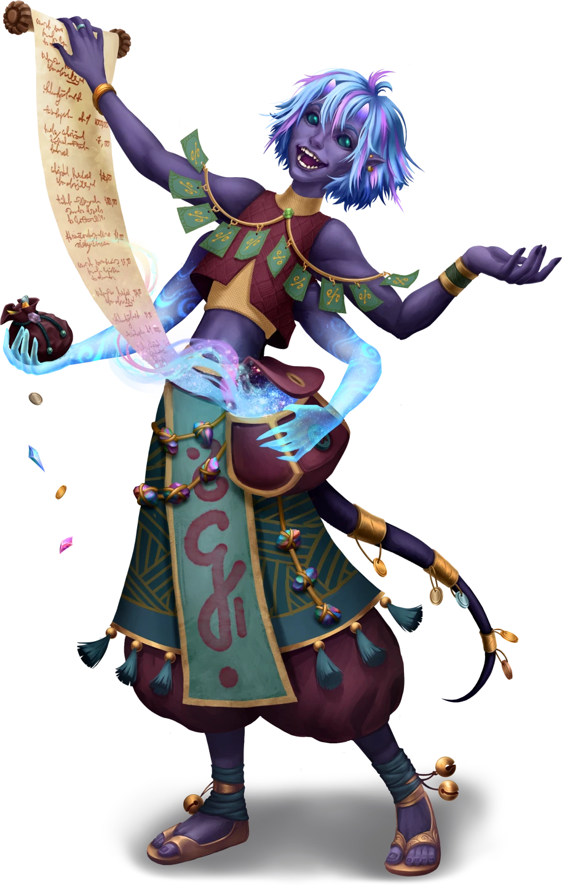

# The Smoke Clears

> [!warning] Gamemaster
> #### Gamemaster's Summary
>
> This Social and Exploration Event occurs regardless of whether the party was present for the attack in the [[Dusktide Rising]] Event or arrived afterward in the [[Dusktide Destruction]] Event. By interacting with the survivors and their NPC companions, the party can:
>
> - Provide aid to the town.
> - Speak with the town magistrate, [[Sadri Zhalimorne]], to receive a reward for their heroics.
> - Receive a request from Sadri to look into the safety of other nearby groups who may be in danger or also targeted in the recent attack.
> - Discuss the attack further with the companions in the Strayhearth Caravan and learn of what they intend to do next.
>
> This Event is depicted using the "Dusktide Aftermath" Level of the [[Vista: Helkas]] Vista.

### Talking to Sadri

Though there are many dead, enough survivors remain to eventually stabilize and rebuild Helkas. Chief among the survivors is the magistrate of Helkas, an altyran woman named Sadri Zhalimorne.

> [!abstract] Sadri Zhalimorne
> **[[Sadri Zhalimorne]]**
>
> Level 1 · Altyra Trader
>
> 
>
> You regard a steel-skinned woman with luminous golden eyes and side-parted bob of short-cropped silver hair. Adorned in a brown sleeveless tunic with leather shorts and boots, her countenance is equal parts purposeful and amused, and you can’t help but notice the lambent lines of bright copper that decorate her legs. A beaded Arcturian plastron necklace hangs around her neck, proudly signifying some kind of social station.

> [!question] Q&A
> **Q:** If the party was present for the [[Dusktide Rising]] Event.
>
> **A:**
>
> > We've never experienced anything like this before, much less during the Dusktide Festival. Who could possibly have wished to harm the people of Helkas? Those are questions for some other day. For now, we mourn and rebuild. We are tough folk. It will take a lot more than this to break our spirit.
> >
> > Thanks to your heroics, these raiders and monsters only managed to wound our town, not raze it. If Agraband's caravan hadn't arrived when it did, then things could have been a lot worse.
> >
> > We need as many supplies as we can get to prevent further damage and begin to rebuild — but we can spare whatever basic items you need for your continued journey. You put your lives on the line for this town, and we won't have it said that the people of Helkas were ingrateful.

Sadri will provide the party with up to  **5** worth of whatever basic items they need, whether that's healing kits, clothing, basic arms and armor, rations, or other supplies. They put their lives on the line for the town, and the town will see them paid back for it.

For their heroism during the assault, Sadri also names the party members as honorary "Stewards of Helkas", and bestows upon the characters a special ceremonial weapon — [[Duskmaw's Gavel]]. If no characters in the party have training with Heavy weapons, Sadri instead offers the [[Duskmaw's Bite]]

> [!question] Q&A
> **Q:** If the party was absent and arrived in the [[Dusktide Destruction]] Event.
>
> **A:**
>
> > Perhaps it's a bit selfish of me to say, but it's a shame you folks weren't here sooner. Our little town might have fared better with some armed adventurers at our sides.
> >
> > We've never experienced anything like this before, much less during the Dusktide Festival. Who could possibly have wished to harm the people of Helkas? Those are questions for some other day. For now, we mourn and rebuild. We are tough folk. It will take a lot more than this to break our spirit.

> [!question] Q&A
> **Q:** Thoughts on the attack?
>
> **A:**
>
> > I find it strange that the drakes and raiders came so close together, but I don't have time to worry about that right now. There are fires to put out, injured to heal, and bodies to bury before investigation can begin. It will take a lot more than this to put us down, though.

> [!question] Q&A
> **Q:** What now?
>
> **A:**
>
> > We rebuild. It will take a lot more than this to put us down.

Once it appears that the party has no further urgent questions for Sadri, she broaches a topic that has been concerning her since the attack.

> [!info] Social
> #### Sadri's Request
>
> Sadri is full of determination and resolve, but she is deeply concerned for other groups she knows of nearby in the Forest of Stone:
>
> > I don't know if you came across them while you were traveling, but there are miners out in Yakoshta and a group of Anachraenum explorers in the Forest of Stone. In light of recent attacks, I feel it's vital that we take steps to find out if they are okay or not. I don't have anyone to spare right now, but I'm prepared to hire you to go out there and check on them. I'll pay you for information on the status of both groups.
>
> Sadri offers a further reward of  **1 each** in exchange for confirmation that the miners at [[Yakoshta]] and the Anachraenum expedition at the [[Ancient Door]] are safe.

`[[/outcome sadriRequest]]`

> [!warning] Gamemaster
> #### Recommended Progression
>
> Sadri's request to backtrack to the Forest of Stone is the recommended and canonical path for the party to take next. This allows the party to obtain the additional milestones needed to reach Level 3 before beginning Chapter 2.
>
> It is possible for them to refuse, however, instead continuing onward to the [[Leavetakings]] Event, although this will make the early gameplay of Chapter 2 somewhat more difficult.

### Talking To Ankarist

Ankarist looks troubled by events, but behind his outward expression of concern there is an unmistakable fire as he is busily investigating the corpse of one of the felled drakes.

> [!abstract] Ankarist
> **[[Ankarist]]**
>
> Level 2 · Drakon Veiled Chain Investigator
>
> 
>
> You observe a stern Drakon warrior with a determined expression and piercing golden eyes. Clad in leather armor reinforced with steel, his martial prowess is immediately apparent in the way he handles the hefty greatsword at his side — a hulking blade with a wide, flared tip. This two-handed brand is obviously venerated by the Drakon, who regards the blade with marked discipline. A cloak pin on his breast bears the symbol of the Veiled Chain, the city of Ordain's noble protectorate.

> [!tip] Exploration
> #### The Felled Drakes
>
> The party can join Ankarist in investigating the body of the largest slain creature.
>
> Any character that examines the corpse and makes a successful **Wilderness (DC 15)** check reveals that its physiology, pallid flesh, and milky eyes suggest that it likely developed and acclimated to an underground environment.
>
> - **Knowledge: Dragons**: The character automatically succeeds on this check.
>
> Any character that makes a successful **Awareness (DC 15)** check notices something that had escaped Ankarist's notice: a chunk of plant-like matter lodged underneath one of the drake's talons.
>
> - **Knowledge: Forensics**: The character automatically succeeds on this check.
>
> Any character that inspects the plant matter and makes a successful **Wilderness (DC 15)** check identifies the material as **Lunderwort**, a giant mushroom variety which only grows deep beneath the surface.
>
> - **Knowledge: Plants**: The character automatically succeeds on this check.
>
> Any character that speaks with Ankarist and makes a successful **Diplomacy (DC 13, Passive)** check intuits that the drakon is forming a plan and will act upon it soon.

> [!question] Q&A
> **Q:** Your thoughts?
>
> **A:**
>
> > These events confirm some suspicions that I and my superiors have been exploring for several months now. There are strange new dangers emerging in the Arctus Plateau, and a degree of coincidence in their actions that is alarming.

> [!question] Q&A
> **Q:** What now?
>
> **A:**
>
> > My plans must change. I was bound originally for Ordain, but this requires immediate investigation. The drakes in particular are an emerging menace which could be related to another investigation. I will be traveling north, to Skybrush, to seek the cavernous origin of these dragons.

> [!question] Q&A
> **Q:** Can we help?
>
> **A:**
>
> > It may be a long and difficult road — but your company would be welcome should you wish to join me. I would be glad of the reinforcement; these creatures are dangerous and the shadowy forces creating or controlling them likely more so. If you're interested in coming with me, I'll be leaving in a day or two.

Ankarist plans to take a few days to help the townsfolk, rest, and resupply. In the meantime, the party is afforded time to follow up on Sadri's request.

### Talking To Lyla

Lyla is actively helping to coordinate the response and talking with townsfolk about what happened. The party may choose to join her.

> [!abstract] Lyla Cevher
> **[[Lyla Cevher]]**
>
> Level 2 · Human Cevher Heiress
>
> 
>
> A Human who is sharply dressed in a beautiful and richly decorated coat that proudly displays her wealthy background. It's clear from an initial glance at her overall bearing and clothing style that she is from the city of Ordain itself and while she holds herself with a confident air, she is also friendly and welcoming with a slight smile and small laughter lines appearing around her eyes.

> [!question] Q&A
> **Q:** Your thoughts?
>
> **A:**
>
> > I've heard about attacks and disruptions in the Arctus Plateau, but this attack on Helkas is without a doubt the most brazen incident I'm aware of. Never mind the drake attacks, which are entirely new. It seems there are plenty of new troubles to welcome me back.

> [!question] Q&A
> **Q:** Other troubles?
>
> **A:**
>
> She sighs deeply and looks at you with deep pain in her eyes.
>
> > My father died… recently. That's part of the reason I'm heading home. His death was sudden, and I will have to take over running House Cevher. I also need to look after my younger brother. I know I should head back to the city as soon as possible, but I need to see what's happening in the Plateau and with some of our other operations. I'm sure my brother would understand.

> [!question] Q&A
> **Q:** What now?
>
> **A:**
>
> > I need to get to Ordain, but after this attack, I'm going to take a detour first. An old friend of mine lives a day's travel to the south, and they are… well… let's just say they are eminently knowledgeable about all manner of topics, and I could use their advice.

> [!question] Q&A
> **Q:** Can we help?
>
> **A:**
>
> > You're very capable adventurers, and I would welcome the help in figuring out what's happening here. These raiders may seem like simple bandits, but I fear there is something more sinister at play here. With your help, we can find out who they are, why they attacked Helkas, and what they have to do with the other troubles. I'm going to take a few days to help out here and pull together some supplies, but then I'll be on my way. If you're interested in coming with me, you're most welcome.

> [!info] Social
> #### Lyla's Thoughts
>
> Any character who speaks with Lyla and makes a successful **Awareness (DC 14, Passive)** check can ascertain that something more is bothering Lyla. If pressed, she will elaborate:
>
> > Something about this entire attack feels wrong, but more than that — it feels like it's just the beginning. I'm getting worried about the state of things here in the Arctus Plateau. I think it's time that I start doing some more digging, try to see what is going on here.
>
> They can also intuit that there is more to Lyla's acquaintance than she is admitting. If pressed, she sheepishly admits:
>
> > Well, I don't like talking about it in these terms, but my friend is Sigil. He tends to keep a low profile, but he is… well, a Shard God, even if he doesn't act like one. He dwells in a place called Oldcraft Lodge by the shores of Lake Jinro to the south.
>
> Characters who make a successful **Society (DC 16, Passive)** check know the basic reputation of [[Sigil]] as a Shard God of scholastic learning, research, and knowledge.
>
> - **Knowledge: Gods**: The character automatically succeeds on this check.
> - **Path: Shard God Devotee**: The character automatically succeeds on this check.

Like Ankarist, Lyla plans to take a few days to help the townsfolk, rest, and resupply. In the meantime, the party is afforded time to follow-up on Sadri's request.

### Talking To Sin

The party notices that Sin is obviously exhausted by the ordeal, both physically and emotionally. She wears the distress of the attack plainly on her features, but the characters can also tell that the tenacious Keth druid is as determined as ever.

> [!abstract] Sin Marmot
> **[[Sin Marmot]]**
>
> Level 2 · Keth Cindaric Aspirant
>
> 
>
> A Keth with a friendly demeanor and wide blue eyes and a strange half-mask that covers her mouth. She seems to view everything around her with an air of wondrous innocence but her keen glances also suggest the ability to read any given situation quickly and she may be more capable than she appears at first glance.

> [!question] Q&A
> **Q:** Your thoughts?
>
> **A:**
>
> Sin replies with great conviction.
>
> > It's clear to me more than ever that the Cindaric Sages are exactly where I need to be, and who I need to speak to about the specter. Not only are they the best hope to aid these struggling people, they would be the ones to shed some light on that apparition and what it means. I will be certain to tell the Sages what transpired here, and they will know what to do.

> [!question] Q&A
> **Q:** What now?
>
> **A:**
>
> > I'm going to head to the nearest Cindaric enclave. Sadri told me about a place called Corpin Sanctuary to the east. It's an outlying enclave of the Sages on the top of Mial Mountain. I've got to let them know what happened here at Helkas so they can send aid.
> >
> > More importantly though, I need to talk to them about what happened to the bandit leader. Hopefully they have something more to tell me about this. From what I have gleaned from the locals, spirits rising from corpses has happened more than once in the area. If it's becoming more commonplace, then that could be a sign of something way worse brewing.

> [!question] Q&A
> **Q:** The bandit's death?
>
> **A:**
>
> If Sin directly witnessed Bassa's death:
>
> > Earlier, during the raider attack, I saw a spirit erupt from the chest of a dead bandit, then transform into a specter before being ripped away by some unseen force. According to the locals, this isn't the first time it's happened, either.
>
> If Sin heard about it secondhand:
>
> > I heard an extremely disturbing rumor that one of these raiders, at the moment of their death, exhibited some sort of spiritual corruption by which their soul was twisted and pulled forth from their body as a gruesome specter. Could such a thing have actually happened? Something like that would be an unnatural affront to the cycle.
>
> Either way, Sin is deeply concerned about what this means:
>
> > This might be a sign of something far worse brewing in the region, something corrupting the natural order of things. It's clear to me more than ever that the Cindaric Sages are exactly where I need to be. They are the best hope to aid these struggling people, and I must inform them about the issues with the restless dead if they don't already know.

> [!info] Social
> #### Unnatural Death
>
> Any character who speaks with Sin and makes a successful **Society (DC 15, Passive)** check agrees that the dead should remain dead, and any instances of their spirits manifesting, or rising as specters, ghosts or worse — animating — are signs that something is horribly amiss. Alerting the Sages would be wise.
>
> - **Knowledge: Souls**: The character automatically succeeds on this check.

> [!question] Q&A
> **Q:** Can we help?
>
> **A:**
>
> > I'm a little nervous to travel on my own, not knowing the region and all. If you wanted to come with me, I'd be glad to walk at your side. You were headed toward Ordain anyway, weren't you? Well now you have another good reason to go; these folk need help and we can make sure they get it! I'm going to leave in a couple days, once I've done all I can to help the folk here myself.

Though Sin wants to remain in Helkas and help the townsfolk, she also recognizes that now more than ever she needs to make contact with the Cindaric Sages. Not only can they send aid to Helkas, she needs to inform them about rumors and concerns that have been going around the town, and coming in with travelers: strange things are happening with the dead. Like the other companions, Sin will delay their departure until after aid has been provided to the people of Helkas, taking several days to provide whatever assistance they can before heading onward.

### Talking To Agraband

> [!abstract] Agraband Swift
> **[[Agraband Swift]]**
>
> Level 3 · Human Caravaneer
>
> 
>
> A lute is slung across the back of this aged human clad in an odd yet practical assortment of clothing and jewelry. The seasoned bard wears the salt-and-pepper locks of his long hair pulled back into a high half ponytail. His wide smile and calm demeanor lend him an air of experienced confidence, and a certain glint in his eye evokes the mirthful spirit of a beloved uncle. It's clear this man could spin a worthy tale at a moment’s notice.

> [!info] Social
> #### Thoughts on the Attack?
>
> Any character who speaks with Agraband and makes a successful **Awareness (DC 13, Passive)** check notices that Agraband is more keenly affected than he outwardly portrays. This suggests that the old bard wasn't ready for his tales of daring and adventure made manifest in front of him today. If asked about it, he laughs it off:
>
> > It's a long time since I was in a fight like that. Good show!
>
> Agraband has been mulling over how to turn it into a story worthy of the events that unfolded here today. Agraband looks at you with pride and gloats:
>
> > The more I think about what happened here, the more I'm certain this needs to be captured in a grand tale. This was important! It was a key moment in the history of Helkas, and someone ought to record it.
>
> > I was right about you. I could see the sparks of greatness in you as soon as we departed Casla-Brava! You are proper heroes in the making, with plenty of fascinating adventures ahead, I'm sure!
>
> #### What Now?
>
> Agraband isn't planning to leave Helkas immediately. He does have some shipments and contracts to fulfill in Ordain, but he has time before he needs to get moving again. For now, he's going to help the locals sort out the damage, lend a hand where he can, and collect accounts from people here.
>
> > You should head on without old Agraband. Now that we're out of the Forest of Stone, you don't really need my guidance anymore. Head for Ordain, if that's still your destination, or venture out into the unknown and see what you find! There's a rising tide of chaos in the Plateau lately, and you can probably help make a difference!
>
> Agraband bids the party farewell with wishes for luck and fortune:
>
> > If you do end up in Ordain — look for me around the markets of the Main Plaza. I hope to run into you again and hear about what adventures you've gotten up to!

### Talking To Clipper

> [!abstract] Clipper
> **[[Clipper]]**
>
> Level 2 · Signborn Trader
>
> 
>
> You hear the sound of jingling bells as a purple-skinned Signaran with a slight build draws your attention. Crowned in a feathered mop of cerulean- and lavender-streaked hair, this young merchant's bright cobalt eyes and wide, sharp-toothed smile reveal an unmistakable affability.
>
> Their clothing suggests origins the world over; hints of Maziran style clash with various accents of places from Old Carinth to Ordain. A sash of hand-written parchment coupons hangs around their neck, and a string of curious, multi-colored stones adorns their waist. Tassels and coins also hang from their ostentatious garments, and two tiny bells chime and jingle upon each ankle.

> [!info] Social
> #### Thoughts on the Attack?
>
> Any character who speaks with Clipper and makes a successful **Awareness (DC 13, Passive)** check notices that Clipper doesn't seem terribly fazed by the events here. Asking Clipper about it confirms that suspicion.
>
> > Suffering and violence are a part of the world. If you let it affect you deeply, then you are just suffering alongside them. Better to keep some distance while offering help where you can!
>
> If asked about why they're charging for their goods and services, they point out:
>
> > Just because times are tough doesn't mean I should put myself in dire straits as well! I'm not heartless though. I'm charging far less than I normally would.
>
> #### What Now?
>
> Clipper plans to head off in search of new opportunities. They don't know exactly what direction yet, but they'll search for whatever is out there to be traded, bought, studied, and sold again!
>
> > Agraband is staying here, so I'm off on my own for now. Time to search for new opportunities — whichever way the winds decide to carry me. What direction that will be… remains unknown … but I'm excited to see what is out there to be found, traded, bought, studied, and sold!
> >
> > If we're lucky, we'll cross paths again, because I know you'll have interesting stories and items to trade, and I look forward to both!

### Concluding the Event

> [!warning] Gamemaster
> #### Next Steps
>
> Once the party has finished talking to the townsfolk and their companions, they're free to move on. They have two choices at this point:
>
> - They can accept Sadri's request and backtrack to the Forest of Stone to confirm that the miners at Yakoshta and the Anachraenum expedition are both unharmed. If the party accepts Sadri's quest, be sure to mark the "Sadri's Request" outcome as completed.
> - They can press onward with Ankarist, Lyla, and Sin — departing Helkas together and moving toward the [[Leavetakings]] Event that concludes Chapter 1. Once the party is ready to depart Helkas eastward toward Ordain, follow the steps described below.
>
> Regardless of which path the party is now following, you may mark this Event as **Complete**; however, if the party decides to travel toward Ordain, be sure to take note of the actions listed under [[The Smoke Clears]], which are necessary to unlock the [[Leavetakings]] Event that concludes Chapter 1.

`[[/outcome departed]]`

> [!warning] Gamemaster
> #### Departing Together
>
> When the party is ready to depart Helkas for Ordain, take the following specific actions:
>
> 1. Mark the "Departed Helkas" Event outcome as completed.
> 2. Add [[Ankarist]], [[Lyla Cevher]], and [[Sin Marmot]] to the [[Party]] caravan.
> 3. You may remove the [[Strayhearth Caravan]] from play.
> 4. Begin traveling along the eastern road towards Ordain. The [[Leavetakings]] Event will occur after crossing the first bridge or upon the party's first **Rest**.
