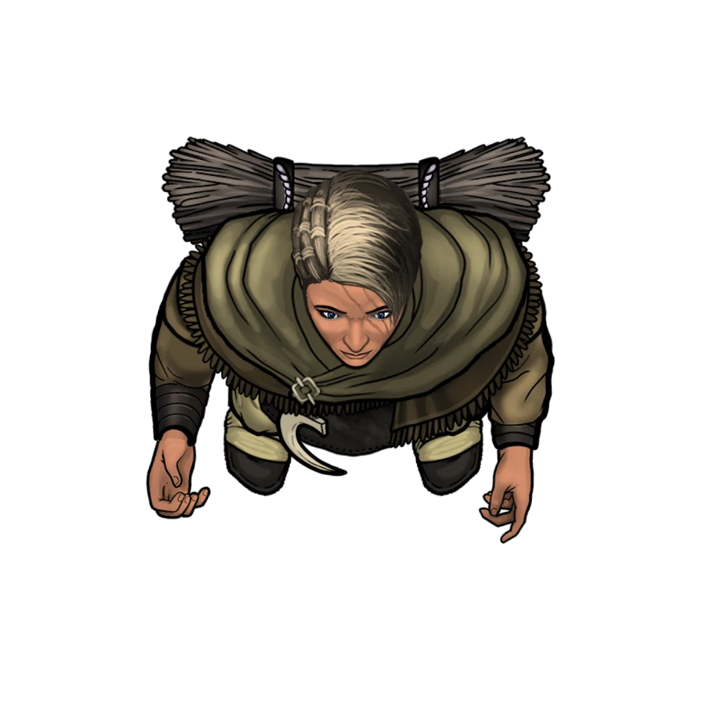
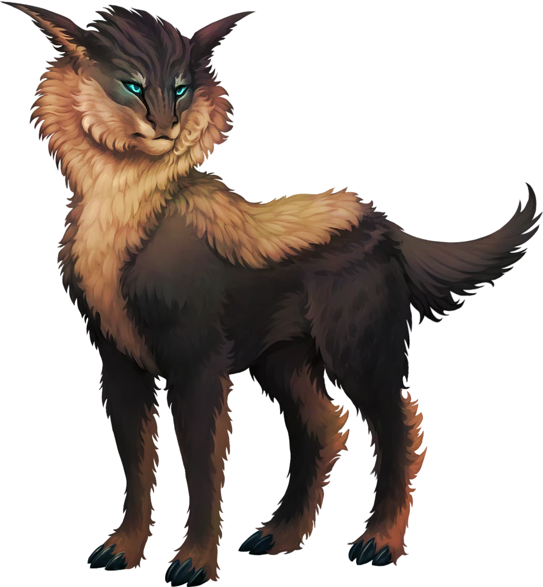

# Flight from the Dark

> [!warning] Gamemaster
> #### Gamemaster's Summary
>
> This Social Event occurs in the narrow mountain passes that approach the treetop village of [[Skybrush]], and brings the party face-to-face with refugees from that nearby town — a town which, unbeknownst to its residents, has fallen prey an evil curse. By speaking to the refugees, the characters can:
>
> - Learn about the exodus of a group of [[Arcturian]] from Skybrush, on the heels of a gruesome murder.
> - Ask the Townsfolk questions about Skybrush or their destination of [[Storsa's Strand]].
> - Possibly identify the [[Moon Blossom]] flower that is connected to the plight of Skybrush.
>
> This Event is depicted using the "Refugee Caravan" Level of the [[Rustvar Valleys]] Vista.

### The Harrowed Townsfolk

If the characters maintain their pace and bearing, they'll soon converge with three rask-drawn wagons carrying 6[[Arcturian]] who journey along the dusty highland road at a notably swift pace of their own.

- Each of the three wagons is drawn by a single [[Rask]].
- The caravan journeys southward and/or eastward along the unmarked valley road.
- The aforementioned elder is a wizened Arcturian carpenter named **Valence** (Neutral Good, Arcturian Human, he/him), and is armed with two Handaxes rather than a single Club.
- The young girl mentioned below is the six-year-old **Deera** (Lawful Good, Arcturian Human, she/her).

> [!abstract] Arcturian
> **[[Arcturian]]**
>
> Level 1 · Human Commonfolk
>
> 
>
> Arcturians are warm, friendly, and weathered by their time spent in the golden fields and outlying regions of the Arctus Plateau. You notice their hands are always not far from crafting tools, wearing simple leathers, brown cloth with hints and accents of the famous soft green colored fabrics draped around them, many of their clothes are also carefully woven with beautiful, subtle patterns.

> [!abstract] Rask
> **[[Rask]]**
>
> Level 1 (Minion) · Rask Pack Member
>
> 
>
> The eyes of this majestic quadruped appear to glow with subtle phosphorescence. A lean mammal with features both canine and feline in nature, the large creature is marked by feathery tufts of fur, and appears as strong as it is dexterous. A striped pelt crowns the beast's regal head, and a short fluffy tail sways behind it with graceful intention.

Before anyone even initiates a conversation, the characters may notice certain details about this troubled caravan of Arcturians:

> [!tip] Exploration
> #### Signs of Strife
>
> Any character with **Awareness (DC 12, Passive)** notices that most of these Harrowed Townsfolk look remarkably tired — as if they haven't slept in days — and that their wagons are almost absurdly overstocked with an abundance of possessions.
>
> - **Critical Success**: The character also spots a young girl among the Arcturians who holds a curious flower that resembles a pale cerulean anemone.
>
> Any character who notices the young girl's flower and makes a successful **Wilderness (DC 15)** check recognizes it to be a [[Moon Blossom]], and understands its curious properties.
>
> - **Knowledge: Plants**: The character automatically succeeds on this check.
>
> Characters with **Knowledge: Warfare**, **Knowledge: Undeath**, or **Path: Flameguard Militia** readily identify the Harrowed Townsfolk as refugees from a mountainside Arcturian settlement, and can size-up the hastily-assembled contents of their wagons with relative ease.

### The Trouble with Skybrush

The Harrowed Townsfolk are eager to share their tales of worry and woe, so it doesn't take much effort for the party to strike up a pointed conversation with the elder Valence.

> [!info] Social
> #### What the Townsfolk Know
>
> Valence and the other townsfolk are ultimately agreeable people, despite their angst and frustrations, and are happy to oblige the party any information that seems reasonable. Valence and the other Harrowed Townsfolk can readily offer the characters the following information:
>
> - A young man named **Branos Erekos** was brutally murdered in cold blood by his brother [[Dereth Erekos]]. In the wake of this incident, strange nightmares rife with undefinable terrors began afflicting several citizens of Skybrush, including Valence himself.
> - The caravan of refugees rides eastward to Storsa's Strand, on the banks of Lake Mithra, where they hope to escape the ill tidings that came to Skybrush.
> - The Harrowed Townsfolk are also willing to provide basic details about Skybrush itself, including various points of interest and a key few personages.
>
> Any character who makes a successful **Deception (DC 12)** check can confirm the veracity of the Townsfolk's tale; the truth behind their plight seems unmistakable.
>
> - **Critical Success**: There is no hiding the dread and trepidation in the Townsfolk's eyes. It seems that Valence himself feels downright haunted. There is a thinly-veiled sorrow to this exodus, signifying the loss of home and sanctity.
>
> Suggested dialog with Valence can be found below, including his reaction to questions about the young girl's Moon Blossom (described in [[Flight from the Dark]] above).

> [!question] Q&A
> **Q:** Who are you?
>
> **A:**
>
> > My name is Valence, friend. And these are my people. I make my coin as a carpenter, and this axe at my side is sharp enough to split a jurtak's skull — so please, kindly help us keep the peace and we'll be well on our way.

> [!question] Q&A
> **Q:** About Skybrush?
>
> **A:**
>
> > It pains us to say goodbye to a place we've known so long … our village in the trees, where the wind chimes sing and a dappled sun dances above the proud ruins of ancient giants. But that whimsy is gone, replaced by the lingering threat of a gruesome death. Good riddance, I say. And gods take whatever evil came to Skybrush!

> [!question] Q&A
> **Q:** About the young girl's flower?
>
> **A:**
>
> > Deera has always had a special fondness for the outdoors. She takes after her mother in that regard.
>
> The elder nods towards a headstrong Arcturian woman seated in the wagon beside the girl. After a brief moment of thought, he regards you once more.
>
> > Those cerulean anemones grow in and around Skybrush, but I'm no gardener. If you're lucky, that's the last one of those little flowers you'll ever see, friend.

Efforts to gather information elsewhere about the incident in Skybrush are relatively fruitless, compelling the characters to explore the harrowed settlement for themselves.

### Concluding the Event

Once the characters have satisfied their curiosity with the Skybrush refugees, the party is ready to venture forth. With the location of Skybrush newly indicated on their map, the party can travel towards that remote treetop village to investigate the unsavory rumors of a killer in the town's midst.

> [!warning] Gamemaster
> #### Next Steps
>
> Once the party has listened to Townsfolk's tale, they can begin the Quest in earnest by visiting Skybrush themselves, in [[The Situation in Skybrush]].
