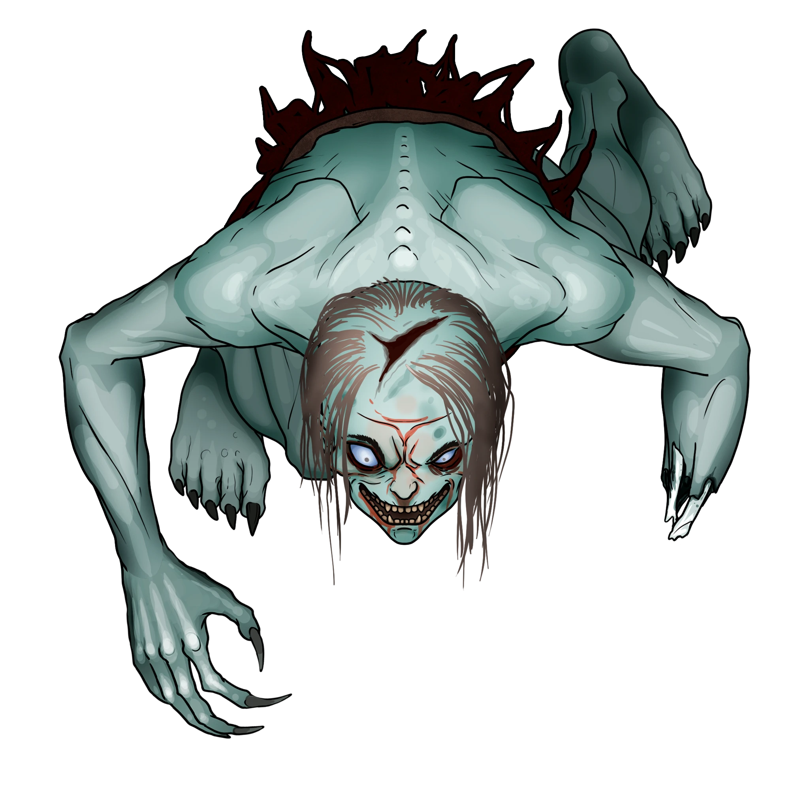

# Loose Ends

> [!warning] Gamemaster
> #### Gamemaster's Summary
>
> This Social and Exploration event takes place in [[Skybrush]] after the party's fateful encounter with Gedron Tath. In this Event, the characters can:
>
> - Discover the transformation of Qory Hult into an undead [[Horrendor]] which happened while the party was away.
> - Investigate the home of [[Dereth Erekos]] and speak with his surviving family members, who are newly open to visitation.
> - Visit the home of Dereth's girlfriend Revelry Wyst, whose brusque father Hescott Wyst offers a few pieces of new information.
> - Get paid a visit by Revelry Wyst herself, who is eager to share her side of the story about Dereth's macabre predicament.
> - Visit the home of House Cevher's Kel Kornan, who is in the final days of her fight against the onset of [[The Bewilderment]].
> - Deal with the passage of time in their absence, which may have allowed for additional exchanges of the accursed [[Varún]] artifacts.
> - Follow a trail of evidence to track Dereth's westward path from town.
>
> This Event is depicted using the "Skybrush - Gloomy" Level of the [[Vista: Skybrush]] Vista and the [[Arcturian Jail]] Area Map.
>
> #### Looking Deeper
>
> The party has several avenues of investigation. The most important of these are the aforementioned encounters with the Erekos family and Dereth's betrothed Revelry Wyst. Ultimately, your goal as the Gamemaster is to shepherd the party's investigation until they have the information they need to begin following Dereth's trail westward out of town.

### Remaining Clues

As the party returns to Skybrush after visiting the home of Gedron Tath, they will have several clues to follow-up on:

- The prisoner Qory Hult was depicted in baleful form in one of Gedron's paintings.
- The party may be seeking Kel Kornan on behalf of Kadrick Pond from [[Locating Kel Kornan]], or because Kornan was the subject of one of Gedron's paintings.
- The party may wish to interrogate the family of Dereth Erekos, or his paramour Revelry Wyst.
- The party may want to investigate the provenance of Varùn artifacts which seem to be a common thread.

> [!warning] Gamemaster
> #### Guiding the Investigation
>
> As the party gets settled in Skybrush and takes on additional events and encounters, their various visits back to the treetop settlement are likely to be a bit open-ended. As Gamemaster, you may have to improvise a bit more than usual during this quest. Here are a few pointers to help keep you on track:
>
> - Allow the characters ample time to follow leads and investigate Skybrush in their own way, but be mindful of moments when the narrative stalls out due to confusion or dead ends. Don't be afraid to interject with one of the several NPCs at your disposal to keep things moving along; after all, Skybrush is their town and the party is just visiting.
> - Always keep track of where each of the five Varùn artifacts are at any given time. If you know where the artifacts are you can determine when, how, and how quickly the Bewilderment is spreading.
> - When in doubt regarding the sequence of events that preceded the party's arrival or the effects of the curse itself, consult the [[Unknown]] and [[The Bewilderment]] appendices for more details.
>
> #### Offering Hints
>
> If at any point during the investigation, the party seems stuck, request that the players roll a **Awareness (DC 16)** or **Deception (DC 16)** check. On a success, provide a hint framed from the perspective of something they realize or remember.

### The Unholy Prisoner

**Qory Hult** died in his Blockhouse gaol cell while the party was away, and has just recently completed his baleful transformation into a Horrendor under the distant control of [[Tethra Shùl]].

> [!tip] Exploration
> #### Where the Moon Blossoms Grow
>
> Outside the Blockhouse, any character with **Awareness (DC 12, Passive)** notices a scattered growth of [[Moon Blossom]] gathered about the exterior.

> [!warning] Gamemaster
> #### Area Map: Arcturian Jail
>
> This particular passage of play will benefit from use of the [[Arcturian Jail]] Area Map, enabling you to play out the combat encounter with [[Horrendor]] at a tactical level. Since this Area Map occurs within the middle of an Event, its usage is not automated and you should activate it yourself at the appropriate moment.

> [!quote] Read Aloud
> You enter the squat gaol of the Blockhouse to see Qory Holt leaning against the rear wall of his cell, hands splayed to either side. As if suddenly aware of your presence, the man twists his head unnaturally around — at an almost impossible angle — and smiles at you with the rictus visage of a pallid corpse.

> [!abstract] Horrendor
> **[[Horrendor]]**
>
> Level 4 · Ghoul Horrendor
>
> 
>
> A disheveled corpse lurks before you, ripe with sepulchral effluvium. A wicked grin dripping a dark crimson ichor twists its way across the cadaver's pale, deathless face, and the exaggerated brows that frame its milky white eyes betray some kind of cunning menace.

> [!danger] Hazard
> #### Qory Transformed
>
> Qory Hult has become an undead [[Horrendor]] mere hours before the party's arrival, but his imprisonment has prevented him from causing too much harm.
>
> If the party attempts to question the Qory, he ridicules them in **Language: Common** and **Language: Abyssal** from behind bars. His taunts include the following:
>
> - Descriptions of how he might wreak havoc in Skybrush after escaping his gaol cell.
> - A deranged account of the murder of his wife that landed him here in the first place.
> - Personal insults to the characters, including but not limited to their character flaws.
>
> Characters who can understand **Language: Abyssal** or or that consume an [[Omniglot Decoction]] can make out a serious of cryptic phrases that Qory mutters beneath his breath:
>
> > The Bleak Seed grows within you.
> >
> > You may sunder my flesh but you'll never escape the Bewildering Night.
> >
> > The shadows of Ebbok Zhùr await.
>
> Qory is imprisoned behind bars and cannot leave the cell, but he is not actively &Reference[Restrained]. A cunning or resourceful party should not have difficulty subduing him. A formal combat encounter is likely not necessary, but depending on the players' actions you may call for initiative rolls if desired.
>
> #### Horrendor Tactics
>
> If a combat encounter is required, Qory will gleefully pummel any character that gets within 5 feet of the bars with unarmed attacks, and use his nature as a [[Skirmisher]] to disengage and retreat beyond reach.
>
> If the characters are prudent enough to maintain a safe distance, Qory will assail them with a steady stream of mockery, making use of [[Diversionist]] to batter their Focus each round.
>
> As a necromantic being, the Horrendor readily fights to the death. However, as one of the [[Restless Dead]], Qory is difficult to permanently defeat.

### Meeting the Erekoses

The family of both the victim Branos Erekos and the accused murderer Dereth Erekos have opened their doors for visitors while the party was away. **Zereth** and **Demetria Erekos** are somber and not overly welcoming of strangers, but they will accept the party into their home as long as they are not antagonistic.

Their home is a sullen one, marked by drab stillness and oppressive quietude. The only joy here is found in the brief tail wags of the Erekos family pet: a cat named "Tommen."

> [!tip] Exploration
> #### Where the Moon Blossoms Grow
>
> Outside the Erekos house, any character with **Awareness (DC 12, Passive)** notices a scattered growth of [[Moon Blossom]] gathered about the exterior.

> [!info] Social
> #### Speaking with Mr. & Mrs. Erekos
>
> Dereth's mother and father are stricken with grief, but are still able to answer a few questions about the young bard and his brother Branos:
>
> - They weren't present at the time of the incident.
> - The brothers, younger Dereth and older Branos, had a remarkably loving relationship until this tragic incident took place.
> - Dereth spent most of his free time writing songs for his girlfriend **Revelry Wyst**. In fact, he'd recently earned enough coin to purchase a new lute with which to sing his ballads. Unbeknownst to the Erekos family, Dereth purchased the new lute from the pawn broker [[Liestra Grann]] with his spoils from [[The Bleak Archive]] as described in [[Unknown]].
> - Dereth liked to write his songs while looking upon Skybrush from the hills nearby to the northwest. And music could be heard from his room nearly every day.
> - If the characters offer any form of assistance or consolation, Mr. & Mrs. Erekos invite the party to inspect Dereth's room for clues.
>
> Mr. & Mrs. Erekos speak quite guardedly, but any character who makes a successful **Deception (DC 13)** check can confirm that everything they do choose to share is spoken truthfully.
>
> #### Speak with Animals
>
> The **Talent: Wildspeaker** talent allows the party to communicate with Tommen the cat, who has one extra clue worth mentioning: Dereth cut his brother down with a strange stony blade before fleeing the Erekos home in a panic.

> [!tip] Exploration
> #### The Diary of Dereth Erekos
>
> If the characters search Dereth's room while in the Erekos home, they find two major clues:
>
> **Dusty Lute**
>
> A dusty old lute sits discarded and neglected. It hasn't been played in weeks.
>
> Any character who makes a successful **Awareness (DC 15)** check identifies telltale clues that the lute was — at one time — a beloved possession. For Dereth to leave it behind by choice would be surprising (unless it's somehow no longer his favored instrument).
>
> **Dereth's Journal**
>
> Near the bedside rests [[Dereth's Journal]] of song lyrics and diary entries. Any character who spends at least 10 minutes studying the journal reveals details concerning series of dreams in which Dereth encountered a dark, manipulative entity from a tenebrous nightmare realm.
>
> Any character who makes a successful **Diplomacy (DC 15)** check understands that these dreams are similar to the types of premonitions that the artist Gedron Tath might have experienced. If a character has experienced one of these dreams themselves in [[Night Terrors]], the check is made with **+2 Boons**.
>
> - **Character experienced a similar dream in** [[Night Terrors]]: The character gains **+2 Boons** on this check.

### Meeting the Wysts

If the party visits the home of Dereth's girlfriend Revelry Wyst, they'll find the Wysts are very apprehensive after Dereth's act of violence and subsequent disappearance.

> [!info] Social
> #### Speaking with Mr. Wyst
>
> Revelry's father **Hescott Wyst** is reluctant to accept home visitors, and will only entertain inquiries from the most persuasive of characters; a character must make a successful **Diplomacy (DC 16)** or **Deception (DC 18)** check to coerce his cooperation.
>
> - One detail Hescott Wyst eventually parts with: a few nights before the murder, Dereth showed up to sing Revelry a new song with a shiny new lute and a bouquet of lambent flowers in hand. "Fancy flourishes for a pauper like the Erekos boy …"
>
> Despite his reticence to converse with strangers, he speaks with an unhesitant earnestness, and any character who makes a successful **Deception (DC 10)** check can confirm the veracity of his words.
>
> If the characters entreat Hescott Wyst's professional services as an apothecary and inquire about the strange blue flowers that are growing about town, he relates the following:
>
> - These curious "Moon Blossoms" are new to Skybrush, and their novel properties are unknown.
> - Hescott is willing to study and identify the properties of one of the [[Moon Blossom]] over the course of an evening in exchange for 5 sp. The party must come back a day later for results — during which time, the effects of [[The Bewilderment]] may progress.

### A Visit from Revelry Wyst

If the party asks around town for signs of Dereth Erekos, they don't uncover many immediate clues; but their ambition eventually pays off when **Revelry Wyst** approaches the characters somewhere in public (such as The Roost, or near a public marketplace).

> [!info] Social
> #### Revelry's Confession
>
> Free from her father's overprotective scrutiny, Revelry is eager to share her side of the story.
>
> - According to the young muse, Dereth Erekos is the most kindhearted soul she's ever met, and he couldn't possibly be responsible for the killings.
>
> Any character who makes a successful **Diplomacy (DC 12)** or **Deception (DC 14)** check can coerce Revelry into sharing a few more private details:
>
> - Dereth liked to write songs for her from the tranquil confines of a small hillside grotto west of Skybrush.
> - Although she's never had any reason to be skeptical of Dereth's behavior, Revelry does seem to harbor some suspicions about the new lute he'd been seen with. With all of their plans for the future on one hand and Dereth's meager financial means on the other, the lute strikes her as a remarkably frivolous purchase.
>
> Revelry is grateful to have the party's assistance in righting what she judges to be a false (or at least, incomplete) story of Dereth's violence, and any character who makes a successful **Deception (DC 10)** check can easily confirm she speaks earnestly.

### The Return of Kel Kornan

If the party wasn't tasked with finding **Kel Kornan** directly via [[Locating Kel Kornan]], then discovery of the painting in Gedron Tath's studio and subsequent investigation may lead the party to the home of the experienced House Cevher stone and timber broker independently.

Asking around town about a [[Kiska]] with a description matching that of Tath's painting spurs townfolk to point the party in the direction of Kornan's home.

> [!tip] Exploration
> #### Where the Moon Blossoms Grow
>
> Outside Kornan's home, any character with **Awareness (DC 12, Passive)** notices a scattered growth of [[Moon Blossom]] about the exterior.

> [!info] Social
> #### The Verge of a Curse
>
> Although she purchased a cursed [[Rune-Marked Sash]] from [[Liestra Grann]], Kel Kornan simply hasn't succumbed to the full effects of the Bewilderment — yet. But it's only a matter of time.
>
> - If questioned about the murders in Skybrush, Kel is honestly ignorant; nor does it occur to her to voluntarily mention the Rune-Marked Sash or how she procured it.
> - Kel has never met Dereth Erekos, Qory Hult, or any of their kin; she simply lives in a different social strata than these "unfortunate young men."
>
> Any character who makes a successful **Society (DC 14)** check can confirm the [[Varún]] origins of the vintage sash that Kel wears as a novel part of her everyday apparel. If this connection is made, Kel will explain how she purchased the sash from the pawn broker Liestra Grann a few days prior.
>
> Kel Kornan has been suffering from the invasive dreams of [[Nethehepticas]] for weeks. Any character who makes a successful **Diplomacy (DC 15)** or **Deception (DC 15)** check can convince her to share more info with the party about this particular detail. Kel's fractured account of her past weeks suggest the onset of some kind of dementia.
>
> Any character who makes a successful **Deception (DC 12)** check can tell that Kel is speaking the truth, as best she knows it.
>
> #### A Job for House Cevher
>
> If the party came to Skybrush on behalf of Kadrick Pond in [[Locating Kel Kornan]], Kel is in possession of the missing consignment, but she's oblivious to the lapse in time and her responsibilities — perverse side effects of her own dreams of Nethehepticas.

> [!danger] Hazard
> #### A Bewildering Scene
>
> If the party members spend enough time in Kel's presence, the Confusion effects of the Bewilderment will occur before their very eyes.

### Enduring Evil

> [!danger] Hazard
> #### The Curse Abides
>
> Each time the party ventures out of the Skybrush city limits and returns, someone in town falls under the sway of [[Unknown]] while they're gone. The effects of this curse will manifest in either confused murders or their own accidental suicides.
>
> No matter the cause of their demise, these cursed citizens become [[Horrendor]]. As long as the party fails to reach [[Tethra Shùl]] within the [[True Vault]] of [[The Bleak Archive]] then destroy or consecrate her worldly remains, the malevolence of her curse will endure.
>
> **Qory Hult** is the first citizen of Skybrush to perish while the party is away. Additional points of contact with the accursed artifacts include the following:
>
> - [[Rune-Marked Band]]: The party likely found this during their encounter with **Gedron Tath**. If they didn't take the ring, **Mica Valaston** will add it to the evidence locker in their office at the Blockhouse gaol.
> - [[Rune-Marked Arrowhead]]: **Qory Hult**'s murder weapon in the Blockhouse gaol is likely the first artifact to change hands.
> - [[Rune-Marked Sash]]: Currently in the possession of **Kel Kornan**, who is already cursed by the item.
> - [[Rune-Marked Vial]]: Located in [[Liestra Grann]] pawn shop The Long Haul, this item is a prime target for petty theft by an unscrupulous citizen of Skybrush.
> - [[Rune-Marked Knife]]: The party will find this accursed weapon during their forthcoming encounter with [[Dereth Erekos]] in [[The Abandoned Lute]].
>
> The second time the party returns to Skybrush after a jaunt outside of town, there are at least two additional outbreaks of the Bewilderment to contend with. The rate at which the curse continues to proliferate should be determined by the party's relative advancement and associated character Levels.

> [!warning] Gamemaster
> #### Plot Armor
>
> As the Gamemaster you should feel empowered to afflict any citizen of Skybrush with the deadly curse except for [[Liestra Grann]] who is an important character in the [[Ancient Paths]] Quest and also makes an important appearance later in [[The Abandoned Lute]]. A narrative explanation for why Liestra does not succumb to the curse is that she does not have any sense of ownership over the Varùn artifacts and therefore is not succeptible to their effects.

### Concluding the Event

After gathering enough clues from Skybrush and its residents, the characters must track the trail of [[Dereth Erekos]] from Skybrush westward into the valley.

#### Signara Attunement: Dereth Evidence

The first character to successfully deduce that the Moon Blossoms and the grotto west of Skybrush are the party's most valid leads advances their **Attunement: Signara (+1)** at the conclusion of the Event.

`[[/outcome derethEvidence]]`

Once the party has obtained sufficient evidence to resolve themselves to this plan, mark the "Dereth Evidence" Outcome of the Quest and read the following aloud:

> [!quote] Read Aloud
> Your investigations in Skybrush have proven fruitful, and evidence compels you to strike out for the southwestern perimeter of town in search of the trail left by Dereth. As you approach the perimeter of town, you begin notice a scattered trail of the luminous blue Moon Blossoms that winds its way towards the outskirts of the vale.

The party can continue exploring the valley west of Skybrush to discover additional evidence connected to the bard's trail.

### Concluding the Event

With new clues in hand, the party must set out on the heels of Dereth Erekos to find the inspirational mountainside grotto spoken of in his diary and by his betrothed, Revelry Wyst.

> [!warning] Gamemaster
> #### Milestone
>
> Completing this Event earns the party 1 [[Milestone Progression]], potentially advancing them in Level.
>
> #### Next Steps
>
> Once the party has finished scouring Skybrush for further clues, they can:
>
> - Follow the path left by Dereth in [[The Bard's Trail]].
> - Stumble upon Dereth's location directly in [[The Abandoned Lute]].
