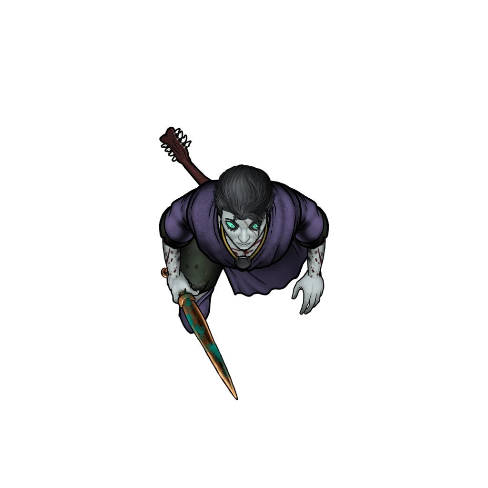

# The Abandoned Lute

> [!warning] Gamemaster
> #### Gamemaster's Summary
>
> This Exploration and Combat Event occurs northwest of Skybrush on the Region Map. By following the trail of [[Moon Blossom]], the characters can:
>
> - Reach the end of the flower trail leading towards Dereth's current location — a small mountainside grotto, marked by a loose circular gathering of ancient stones, where the characters will find Dereth's broken and abandoned lute.
> - Survive a fateful encounter with Dereth himself, who has transformed into an undead [[Horrendor]] under the control of the wraithlike warlock [[Tethra Shùl]].
> - Discover and aid the injured pawn broker [[Liestra Grann]], who has narrowly survived her own encounter with Dereth after woefully attempting to supersede the party during their manhunt.

### A Discarded Instrument

The final stop along the bard's trail into the hinterlands is a small mountainside grotto marked by a loosely circular gathering of ancient stones. Here, two miles northwest of Skybrush, the party finds Dereth's cast-aside lute.

> [!quote] Read Aloud
> A bright pinpoint of reflected light catches your eye. Something small and shiny among the rocks seems to be out of place here, and compels you to investigate further. Drawing near, you see the fractured remains of what must have been a lacquered instrument made of fine hardwood.

The instrument appears to be a lute, and was obviously quite shiny and new before it was recently bashed upon the nearby rocks.

> [!tip] Exploration
> #### The Lonely Lute
>
> Any character who makes a successful **Awareness (DC 13)** check notices that the broken instrument matches the description of Dereth's lute as indicated by both Hescott Wyst and [[Dereth's Journal]] during [[Loose Ends]].
>
> A successful **Wilderness (DC 13)** check allows the characters to locate Dereth's boot prints once more, leading northwest — and the long earthen groove of a heavy sword tip being dragged along behind the prints.

### Mountainside Grotto

> [!quote] Read Aloud
> As you approach the grotto itself, the Moon Blossoms spread outward from a narrow trail into a lush bed of cerulean blooms. In a circle around the flowerbed, stone columns grasp upward at the sky, their mottled gray surfaces inlaid with well-worn carvings whose original shapes and meanings have been lost forever to the cruelty of time.

Upon investigating the grotto, the party is attacked by Dereth Erekos — who is no longer human but is now a particularly formidable Horrendor who wields the [[Rune-Marked Knife]] as if it were a broadsword.

> [!abstract] Dereth Erekos
> **[[Dereth Erekos]]**
>
> Level 4 (Elite) · Ghoul Horrendor
>
> 
>
> A disheveled corpse of a young man lurks before you, freshly reanimated from the grave. A wicked grin dripping an evil crimson ichor twists its way across the cadaver's pale, deathless face, and the exaggerated brows that frame its milky white eyes betray some kind of cruel intelligent menace.
>
> Dressed in the clothes of an Arcturian commoner, the shambling corpse drags a heavy stone sword behind it with mock lethargy, rotating the tip of the blade in the dirt like some demented child with a new plaything.

> [!danger] Hazard
> #### The Bard's Betrayal
>
> This necromantic mockery of the man once known as Dereth Erekos is eager to strike the party down.
>
> Dereth will attempt to take the party by surprise, attempting to use stealth to take the party unawares. Failing that, Dereth will attempt to draw one of the characters closer to him by taking advantage of their curiosity — promising answers to the mystery of Branos' murder.
>
> #### Dereth's Tactics
>
> Once in range, Dereth will attack gleefully and without remorse using a combination of repeated focused attacks and [[Diversionist]] to mock the party and deprive them of Focus. Dereth will rely on his abilities as a [[Skirmisher]] to disengage and retreat beyond reach.
>
> Dereth fights to the death and will not answer any questions the party asks except with misdirection, mockery, or malice. Note that [[Restless Dead]] makes Dereth difficult to fully defeat.

> [!tip] Exploration
> #### When the Smoke Clears
>
> After the party defeats Dereth in combat, they may loot his body for clues. These include:
>
> - The [[Rune-Marked Knife]], which is at least the third [[Varún]] artifact the characters have encountered since visiting Skybrush.
> - A leather pouch containing  **25**.
> - If the characters haven't already found [[Dereth's Journal]], they find it here.

### A Grann Entrance

Once the party has had ample time to survey the area in the aftermath of their encounter with Dereth Erekos, they are approached by [[Liestra Grann]], who has followed them from town at a breakneck pace in an effort to warn them about a fresh revelation of hers …

Liestra has learned the location of [[The Bleak Archive]] and its involvement with the origin of the curse. The precise timing of Liestra's arrival depends on the players and the decisions they make following the encounter with Dereth in the Mountainside Grotto.

> [!warning] Gamemaster
> #### Dramatic Timing
>
> The moment of Liestra's arrival is a delicate narrative beat, particularly when it comes to the kind of suspenseful gameplay "A Brush With Death" aims to capture. Consider the following options when timing her appearance:
>
> **Best Case Scenario**
>
> The optimal time for Liestra to arrive, in terms of dramatic impact, would be when and if the characters take a Rest after their encounter with Dereth — particularly during the moment they decide to take a closer look at the Rune-Marked Blade (or another Varùn relic).
>
> **Most Likely Option**
>
> A more convenient timing for Liestra's arrival to the Mountainside Grotto would be the moment the party has finished inspecting Dereth's remains after the battle.
>
> **If All Else Fails**
>
> If the party's exploration somehow outpaces your preferred timing, simply have Liestra arrive when it suits you. After all, the tone and intentions of her message are ultimately more important than the timing.
>
> Whatever the actual timing, feel free and be prepared to augment the readaloud text below with a prefacing phrase that helps root Liestra's arrival in the precise moment that it occurs in your campaign.

When the moment is right, read the following aloud:

> [!quote] Read Aloud
> Just then, a voice cuts through the harsh rustling of mountain wind …
>
> > Be careful with that relic, my friend. You'll never believe from whence it came.
>
> You turn to see the weary face of Liestra Grann. Sweat drips from the Kivahr merchant's troubled brow, and her trademark grin has been replaced by an exhausted grimace. Her hands seem to tremble as she produces a rune-marked antique from the folds of her garments. Her eyes betray a potent fear, but her sense of purpose is unmistakable.
>
> Liestra extends the relic for you to see, and you behold an oversized vial carved from cerulean crystal, adorned with strange runic markings and stoppered with a cap made from some curious alloy. The markings on this relic are unmistakably similar to the ones found on the rune-marked blade wielded by Dereth Erekos. Liestra continues:
>
> > Pardon my intrusion, but I've made an important discovery — one that sheds light on this dismal situation in Skybrush. The news I bring is imperative, and I beseech you to listen …
> >
> > Dereth Erekos came to me one week ago with a collection of Varùn relics he'd found while ambling somewhere up in the mountains. As is my custom, I made sure to identify each item before agreeing to take them off the young bard's hands for a handsome price. I purchased four of these oversized antiques from Dereth, including a sash, a ring, an arrowhead, and the vial you see now. It seems young Erekos kept the knife for himself.
> >
> > These relics hail from a forgotten Shent vault north of here, known as the Bleak Archive. The sages who constructed it long ago built it to contain a variety of relics and antiques that have been corrupted by dark forces from beyond The Weave. Indeed, traces of The Abyss itself are said to linger in the lightless halls of the Archive. According to legend, a Varùn warlock named Tethra Shùl led a raiding party to the Bleak Archive and never left. Somehow, against all odds, Dereth brought these Varùn relics back to Skybrush from that loathsome place — a vault that predates the relics themselves.
>
> Liestra takes a moment to gauge your reaction to her tale.

> [!info] Social
> #### Liestra's Tale
>
> Liestra has the following information to offer about the Varùn relics in addition to the details presented in her readaloud above.
>
> - Liestra purchased four of the Varùn relics from Dereth, who had found them while exploring the hinterlands northeast of this grotto. Liestra offered Dereth the laquered hardwood lute and a very modest amount of coin in exchange for the relics — indeed, the very same lute that was found splintered and destroyed here in the grotto.
> - Magical and non-magical attempts to discern the nature of the relics did not yield any conclusive results.
> - After Liestra claimed them from Dereth, three of the Varùn relics were sold to their respective owners within a week — a Varùn arrowhead to Qory Hult, a Varùn sash to Kel Kornan, and a Varùn ring to Gedron Tath (for more details, consult [[Revealing the Mystery]] in the [[Unknown]] appendix).
> - When pressed about where he found the relics, Dereth described a "giantfolk tomb" nearly two miles northeast of the grotto. Liestra's research has revealed this place to be [[The Bleak Archive]], a vault supposedly constructed by the Shent who inhabited these mountains and valleys long, long ago.
>
> Any character who makes a successful **Deception (DC 11)** check can confirm that the worried merchant speaks truthfully.
>
> Whether or not the characters believe Liestra's story, she urges them to investigate the Bleak Archive themselves for a solution to the curse that plagues Skybrush.

### Concluding the Event

> [!warning] Gamemaster
> #### Next Steps
>
> With Dereth's notes in hand and guided by additional directions from Liestra Grann, the party must journey northeast to search for the location of [[The Bleak Archive]] and all faces them in [[Where Evil Lurks]].
