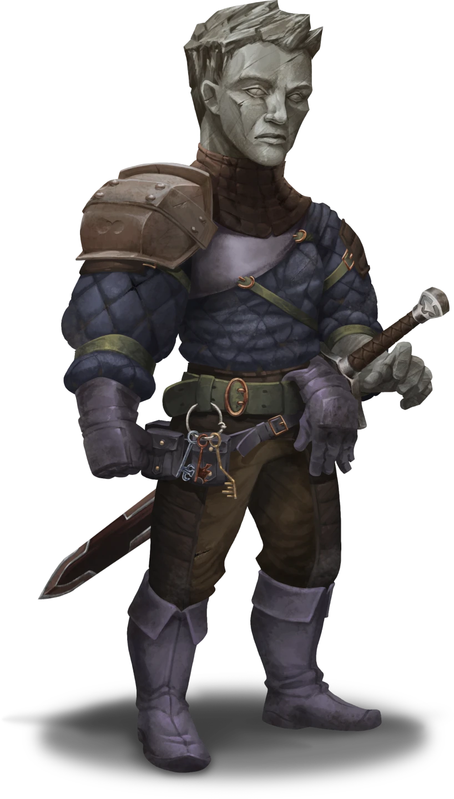

# The Situation in Skybrush

> [!warning] Gamemaster
> #### Gamemaster's Summary
>
> This Social and Exploration Event occurs when the party visits [[Skybrush]], where multiple murders herald the rise of some evil force. By exploring Skybrush, the characters can:
>
> - Encounter a local washerwoman named Gurty Holdstone who offers words of warning in the section [[The Situation in Skybrush]].
> - Visit The Roost, Skybrush's neighborhood watering hole, where a grizzled mine worker named Mattock can provide information about the murders in the section [[The Situation in Skybrush]].
> - Visit an accused murderer named Qory Hult in the Blockhouse jail and survey his deranged state in the section [[The Situation in Skybrush]].
> - Follow up with a visit to Qory Hult's home, where additional clues wait to be found in the section [[The Situation in Skybrush]].
> - Discover clues throughout these encounters that will point the party towards a reclusive artist named Gedron Tath.
>
> This Event is depicted using the "Skybrush - Gloomy" Level of the [[Vista: Skybrush]] Vista.
>
> #### Understanding the Mystery
>
> Before undertaking this Event (in which players will begin their investigation) you may wish to read through [[Revealing the Mystery]] to understand the truth of what is transpiring in Skybrush.

The remote treetop settlement known as Skybrush has fallen under hard times and ill omens as a mysterious curse of undeath plagues its inhabitants. The citizens of Skybrush are a mixture of stalward mining folk and proud lumber workers and are ignorant of the curse's sinister origin — the wraith of a Varùn warlock entombed deep in the Skybrush hinterlands. With any luck, the timely arrival of the party might help turn the bleak tide for this shadow-haunted frontier town.

Although many people of Skybrush are going about their daily business, something clearly troubles these rural folk, who regard the party with a healthy mix of curiosity and suspicion. Skybrush is cloaked in a palpable sense of dread, and the party's first encounter will point them towards the presence of a larger threat.

### The Lurking Fear

> [!quote] Read Aloud
> As you make your way through Skybrush, a local washerwoman meets your gaze. This elderly woman appears intently alert, and speaks up with righteous admonition.
>
> > You sure picked a bad time to visit Skybrush, strangers! There's a murderer on the loose in our humble town, and another killer's been locked up in the local gaol. Keep your eyes open, especially at night! Foul deeds are afoot …
>
> Her gaze lingers in your direction, as if silently inviting you to engage her in further conversation.

> [!info] Social
> #### A Friendly Warning
>
> This remonstrative washerwoman is **Gurty Holdstone** (Neutral, Arcturian Human, she/her), who is known throughout Skybrush for her overtly cautious nature. If the characters would like to know more, Gurty is all-too-eager to oblige them, although she indulges in a fair amount of unnecessary dramatic flair. Gurty has the following information to offer:
>
> - The first murder that happened was the killing of **Branos Erekos** by his brother [[Dereth Erekos]], who's gone missing after the incident. Mr. & Mrs. Erekos are in mourning, and aren't taking visitors at this time. Gurty recommends giving them a day or two for bereavement.
> - The second murder involved a young miner named **Qory Hult** who supposedly killed his wife. Qory is being held at the local gaol situated in The Blockhouse.
> - Gossip and rumors are never in short supply at The Roost, Skybrush's communal tavern in the treetop Canopy district.
> - Other than occasional attacks from local wildlife, Skybrush has never been a place for trouble or mortal terror. The people here are hard-working, and like to celebrate the fruits of their labors with good times and hearty celebration.
>
> Any character who makes a successful **Diplomacy (DC 12)** check determines Gurty's cautious information suitably trustworthy. She has nothing to hide.

### The Word About Town

Whether the party follows Gurty's advice or not, the Roost (situated in the Canopy district) stands out as one of the most suitable places to gather basic information. Considering the relatively subdued dispositions throughout Skybrush, this treetop watering hole is by far the liveliest venue in town.

This potentially serves as a first point of contact with Liestra Grann, the town's resident pawn broker and an influential ally of the Anachraenum. Although she doesn't offer much in the way of information at this time, Liestra invites the party to ask further questions while they're perusing the wares in her shop across town: The Long Haul.

> [!abstract] Liestra Grann
> **[[Liestra Grann]]**
>
> Level 4 · Kivahr Thief
>
> 
>
> > [!quote] Read Aloud
> > A muscular Kivahr femme clad in in loose layers of cloth and leather leans upon the wall with casual composure. A side-parted bob of tawny hair hangs just below her chin as she scrutinizes some curious trinket using a small eyepiece. A wry, expressive grin rises to meet you moments before she sizes you up with amber-colored eyes, and you can't help but spot a stony ersatz mace strapped to her side. It's quite evident she means business.

> [!info] Social
> #### Rumor Mill
>
> At The Roost, there is always talk of local happenings. If the party visits this treetop tavern with queries about Skybrush's recent disturbances, they can meet a few locals.
>
> A handful of NPCs frequent the Roost, including [[Liestra Grann]], **Danton Shain**, **Shax the Seeress**, and **Hadras**. At this time, however, they're more concerned with escaping their woes than educating outsiders.
>
> One grizzled citizen in particular is eager to share everything they know; this retired warrior is **Mattock** (Neutral Good, Lumek Fej, he/him) a scar-striped mine worker who's seen more action than most of Skybrush. Mattock's rumors include:
>
> - Seemingly out of nowhere, the young bard Dereth Erekos lost his mind and killed his brother Branos in cold blood. There were no witnesses, just evidence from the scene of the crime. After the incident, Dereth fled town hasn't been heard from since. The brothers' poor parents are completely absorbed by fear and sorrow.
> - Three nights later, a fellow mineworker named Qory Hult went mad and slaughtered his wife and their unborn child in the most gruesome display of violence the town has ever seen. Qory is currently locked up in the town gaol, and does not seem to remember what happened. He claims he had nothing to do with it, but the blood on his hands suggests otherwise.
> - Many townsfolk want swift mob justice for these atrocities, but the Town Council likes to do things by the book. An imminent inquest is needed to assess Qory and Dereth's culpability.
> - Stranger still, both of these incidents were the subject of paintings from a local artist — an eccentric loner named **Gedron Tath** who lives outside the city limits. The strangest part is that Tath painted these two scenes at least a week before they happened. Was it precognition or premeditation?
> - As for **Kel Kornan**: she lives nearby in the Canopy district, but has not been seen about town for several days.
>
> If the characters press the subject of Qory's wife Veera and their unborn child, Hadras will speak up to confirm the following:
>
> - Veera's bloody corpse was laid to rest in a ceremony Hadras himself, burned to ash according to ancient rites.
>
> Any character who makes a successful **Diplomacy (DC 12)** check can tell that Mattock and Hadras are sincerely sharing what they know about these strange events.

### The Agitated Prisoner

Gurty Holdstone and Mattock present the party with information that should point them towards The Blockhouse, where a local miner has been imprisoned for the crime of killing his wife and child. Here, they can speak with the accused as well as the town's constable.

> [!warning] Gamemaster
> #### Optional Area Map
>
> If you wish to further build suspense at this stage of the investigation, you may use the [[Arcturian Jail]] Area Map for the party's conversation with Qory. This map will be used again later during the subsequent [[Loose Ends]] Event when Qory is overcome by his curse.

> [!info] Social
> #### Interrogating the Accused
>
> **Qory Hult** (Chaotic Good, Arcturian Human, he/him) is afflicted with early onset of [[Unknown]], and has been locked up in the Blockhouse gaol after he murdered his wife and child during a state of magical confusion. His belongings, including the murder weapon (an ancient [[Rune-Marked Arrowhead]]), are locked up in Constable Mica Valaston's office nearby.
>
> Qory is available for questioning from the confines of his cell, and has the following information to offer:
>
> - Qory maintains that he is innocent, and does not remember anything of his wife and child's murder. He came to surrounded by blood and their warm corpses, an ancient Varùn Arrowhead in his hand.
> - The Rune-Marked Arrowhead is something he found while working the mine.
> - He is suspicious of Gedron Tath's macabre paintings and is certain they have something to do with the grim occurrence. Qory assures the characters that this is no mere coincidence, and begs them to seek answers from Tath on his behalf.
>
> Any character with **Diplomacy (DC 15, Passive)** are able to confirm the veracity of Qory's confessions, and that his suspicion of Gedron Tath seems sincere.
>
> - **Critical Success**: The character also determines that Qory seems afraid for more than his life; it's as if his very soul is on the execution block. More curiously, his story about the [[Varún]] Arrowhead rings false.
>
> Any character who makes a successful **Intimidation (DC 16)** or **Diplomacy (DC 16)** check can convice Qory to confess the true origin of the Arrowhead, admitting he purchased it from a local shop as an inevitable gift for his son — an investment for the future that he could barely afford on a miner's salary, and something he was sincerely afraid to boast about.

Nearby the gaol where Qory is held, the party may encounter the local constable.

> [!abstract] Mica Valaston
> **[[Mica Valaston]]**
>
> Level 3 · Hulg'run Lawkeeper
>
> 
>
> You behold the skeptical countenance of a thirty-something Hulg'run warrior clad in studded leather armor, a ring of keys around their belt. Their hand hovers just above the hilt of a sheathed longsword, and they regard you with a healthy look of suspicion.

> [!info] Social
> #### Meeting the Constable
>
> ConstableMica Valaston is the local authority in law enforcement, and maintains a Blockhouse office adjacent to the gaol. The constable speaks with a smoky femme voice and greets the party politely but with a hint of skepticism.
>
> > Constable Mica Valaston, at your service. I see you've found your way to Skybrush. So tell me: what brings you here, of all places?
>
> This cynical Arcturian gendarme can offer the party the following information:
>
> - Mica doesn't fully know what to make of the situation, but they do know that Qory was found at the scene of the crime with the murder weapon and his family's blood on his hands.
> - Before the incident, Qory was a relatively unremarkable citizen, known to appreciate his privacy and the simple rewards of family life. He doesn't have any best friends, aside from his deceased wife. Mica expresses an amount of sympathy for the young man, and laments the squandered potential of his lost family.
> - Veera Hult's corpse was laid to rest in a ceremony led by the priest Hadras, burned to ash according to ancient rites.
>
> Any character who makes a successful **Diplomacy (DC 12)** check can tell that the constable is being entirely up front and truthful with the party.
>
> #### The Murder Weapon
>
> Qory Hult's belongings are being held in an iron-bound evidence chest sealed with a formidable lock. If the party is upfront with their intentions, Mica has no problem letting them see the contents to assist their investigation, but only under direct supervision.
>
> Any character who makes a successful **Diplomacy (DC 18)** check can convince Mica to allow the party to take the Varùn Arrowhead with them to assist their investigation. Given the extreme suspicion surrounding this remarkably macabre case, Mica can't be bribed.

#### Akon Attunement: Convince the Constable

The first character who manages to successfully convince Mica Valaston to let the party take possession of the Varùn Arrowhead advances their **Attunement: Akon (+1)** at the conclusion of the Event.

If the characters fail to convince Mica Valaston of their efforts or wish to purloin the contents of the iron-bound evidence chest, they can attempt to pick the lock.

> [!tip] Exploration
> #### Acquiring the Evidence
>
> Any character who makes a successful **Stealth (DC 18)** check using [[Lockpicks]] can pick the lock, which is built into the iron bindings of the chest itself. The contents of the evidence chest include Qory Hult's belongings:
>
> - A [[Mining Guild Cloak Pin]] adorned with the House Cevher Mining Guild insignia.
> - A dusty gray cloak marked with lovingly-stitched repairs (sentimental value only).
> - A pair of modern Arcturian Bracers (worth  **2**).
> - An ancient [[Rune-Marked Arrowhead]] (the murder weapon).

#### Luxarum Attunement: Steal the Evidence

The first character to successfully steal the Rune-Marked Arrowhead from the evidence chest advances their **Attunement: Luxarum (+1)** at the conclusion of the Event.

### The Scene of the Crime

The party can also visit Qory Hult's bloodstained home to investigate the scene of the crime. Here, they can speak with a meddlesome neighbor, and find a few clues in the home itself.

> [!tip] Exploration
> #### Surveying the Hult Estate
>
> Outside the Hult Estate, any character with **Awareness (DC 12, Passive)** notices lambent cerulean [[Moon Blossom]] blooming outside the Hult home.
>
> Although Veera Hult's corpse has been cremated, the interior still harbors evidence of the murder. Bloodstains cover the front room, and the overturned furniture indicates clear signs of physical struggle.
>
> A successful **Medicine (DC 14)** check confirms the veracity of the forensics to date: a sharp weapon was used to puncture Veera's jugular vein, and she died of rapid exsanguination.

> [!info] Social
> #### The Haunting of Hult House
>
> As the characters search about Qory Hult's home, they're approached by an elderly woman with an unmistakable look of inquisitiveness on her wizened face. This nosy neighbor is **Mrs. Estweather** (Neutral Good, Arcturian Human, she/her), and she's eager to share a few salacious details.
>
> - There was a "perverted artist" named Gedron Tath hanging around who created a painting that caused a fight within the household.
> - The Hults never had any real fights to speak of, so Qory's behavior is curious in addition to the outright shock of the situation.
> - Veera's body was burned quickly after passing, although this is a customary funerary rite.
>
> Mrs. Estweather is easy to read, and any character who makes a successful **Diplomacy (DC 10)** check can determine that she is telling the truth in what she shares, but also holding information back about a particularly touchy subject.
>
> A successful **Diplomacy (DC 15)** check, a successful **Deception (DC 15)** check, or a bribe of  **5** or more convinces Mrs. Estweather to reveal that Veera had grown increasingly suspicious of her husband's behavior in the week that followed the art's arrival.
>
> Some dialog responses from Mrs. Estweather are presented below:

> [!question] Q&A
> **Q:** What do you know?
>
> **A:**
>
> > I can tell you're looking into things here — nobody listens to me about anything but I know a thing or two, you mark my words!
> >
> > Qory and his wife Veera had an argument about "that perverted artist" Gedron Tath's "sick joke of a painting" just a week ago. Qory was somewhat amused at the time, and Veera most certainly was not; while Mr. Hult was eager to dismiss the art as fantasy, his wife was notably suspicious of the grim imagery and ultimately offended by it.

> [!question] Q&A
> **Q:** Veera's fate?
>
> **A:**
>
> > It's a shame the beautiful young woman's body had to be burned so quickly, but rites are rites. And Hadras, as quiet and eccentric as he is, is a fine enough holy man for Skybrush.

### Concluding the Event

Investigation of any of the social encounters described in this Event may very well compel the characters to return to a previous encounter. No matter the order of their investigations, the discovery of the artist Gedron Tath's implied involvement is paramount to the party's next steps.

`[[/outcome gedronEvidence]]`

#### Primordis Attunement: A Suspicious Artist

If the party manages to deduce that Gedron Tath is their most prominent lead (and devises a plan to visit his remote estate), each character advances their **Attunement: Primordis (+1)** at the conclusion of the Event.

Clues gained from conversations with Mattock at The Roost, Qory Hult at the Blockhouse, and Mrs. Estweather at the Hult home should inevitably lead the party a mile from town to investigate the remote domicile of Gedron Tath — an eccentric illustrator and sculptor who purchased a cursed Varùn ring from Liestra Grann.

> [!warning] Gamemaster
> #### Next Steps
>
> Once the party has finished searching for clues in Skybrush proper, there are a couple ways for the party to move forward:
>
> - They may continue their investigation into the mystery of Skybrush by visiting the home of Gedron Tath in [[The House on Lonely Hill]] .
> - If the characters were commissioned to search out Kel Kornan by Kadrick Pond in [[Locating Kel Kornan]], they may wish to locate Kornan's treetop domicile in Skybrush. However, there is no sign of the House Cehver contact at this time — further details about Kel will be revealed later in [[Loose Ends]].
