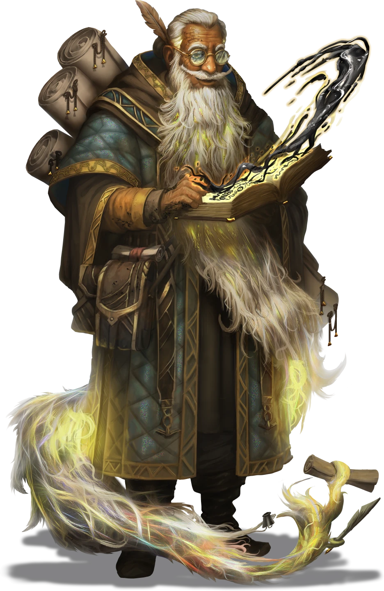

# A Friendly Reunion

> [!warning] Gamemaster
> #### Gamemaster's Summary
>
> This Exploration and Social Event occurs as the party approaches [[Oldcraft Lodge]] while accompanying [[Lyla Cevher]].
>
> By entering the lodge, the characters can:
>
> - Speak with Sigil and ask him about the bandits and any other problems currently affecting the Arctus Plateau.
> - Strategize about the clues they have in hand, which could lead them to the identity of the Helkas bandits.
> - Speak with the refugees at the improvised campsite and learn more about the chaos unfolding in the Arctus Plateau.
>
> #### Prerequisites
>
> The party must have chosen to accompany Lyla during the [[Leavetakings]] Event of the [[The Winding Trail]] Main Quest for this Event to occur.
>
> #### Area Walkthrough
>
> The party begins in the [[Oldcraft Lodge]] Scene. A complete room-by-room description of the lodge environment and the gameplay that occurs there is detailed in the [[Oldcraft Lodge]] Area Walkthrough.
>
> In addition to the details provided in the Area Walkthrough, there are three key moments during exploration of the location where Event-specific gameplay should occur:
>
> 1. [[A Friendly Reunion]] with Lyla.
> 2. [[A Friendly Reunion]].
> 3. Returning to Sigil and finishing their conversation in [[A Friendly Reunion]].

### Reviewing The Plan

> [!quote] Read Aloud
> As you step forward toward the large door of Oldcraft Lodge, Lyla stops you and beckons you to come closer so she can speak privately.
>
> > I brought us here to talk to Sigil, but it is far more crowded than I expected. I suspect that Sigil may be a little … distracted. So, we should review what we have and focus on what we need to discuss with him.

> [!tip] Exploration
> #### The Clues At Hand
>
> As the party stands close to the door, Lyla reminds the party about the clues found on the bandits in Helkas:
>
> - **Coded Instructions to the Bandits.** Lyla gives the party the [[Coded Bandit Instructions]] to attempt to decipher.
>   - The party can try to decode the instructions at any time, but will need help — they can ask Sigil later on in this Event or use a note found in the Arcturel Mine during [[Unwelcome Diversions]]. Once the instructions are decoded, give the characters the [[Decoded Bandit Instructions]], mark the Outcome below, and mark the Primordis attunement point.
> - **Leather Markings.** Lyla has sketched the markings on the leather worn by the bandits, which could reveal either where they are from or who supplied them with gear. She reminds the party that this is the second question they should ask Sigil.
> - **Tattoos.** Several of the bandits had the phrase "For Other Fortunes" tattooed on them along with ropes. It likely has some hidden meaning that could point the party towards the bandits' origin or purpose, and Lyla reminds the party that this is the third question they should ask Sigil.

> [!warning] Gamemaster
> #### Outcome Note
>
> Parties receive [[Coded Bandit Instructions]] from Lyla during this Event. They will have several opportunities to decode the instructions over the course of the Quest, including in this Event. If characters decode the instructions later in the Quest, return to this Event to mark it as a completed Outcome and award the attunement point noted below.

#### Primordis Attunement: Bandit Instructions Decoded

When the party manages to decode the Coded Bandit Instructions, each character advances their **Attunement: Primordis (+1)** at the conclusion of the current Event.

`[[/outcome decodedBanditNote]]`

### Speaking with Sigil

Once the party has gone over the questions they need to ask Sigil with Lyla, then they can proceed inside, and you can read the following to the party:

> [!quote] Read Aloud
> Although the exterior of the Oldcraft Lodge is relatively unassuming, as soon as you step inside the main room you are immediately dazzled by a chaotic cacophony of sights and sounds. Bright yellow and pink motes of magic dance in the air, casting an enchanting glow around the space. Mystical runes are casually scattered in piles across tables and shelves. The room is filled with books of all sizes, colors, and ages; some sit half-open, while others have torn pages now lying in piles. Tall bookshelves line the walls, packed with more books and scrolls, and colorful rugs adorn the polished hardwood floor.
>
> Standing near a large, comfortable-looking chair is a figure who appears to radiate magic in gentle waves. After only a few moments, the effects of his magical aura subside, and he turns toward you with a puzzled expression on his face. When he spots Lyla, his face lights up with joy, and he moves forward quickly. He begins speaking in a warm, melodic voice that reminds you of a wizened and wise grandfather.
>
> > Oh, OH! My dear little glowbug, welcome, welcome! The calluses on your hands ... are they from a pickaxe or a sword? No, a rapier — ahh, the one on your hip. And your footprint ... it’s heavier now. More certain. You've finally stopped dragging your left heel when you're nervous. Oh, my dear, there is sadness in your eyes; it is so heavy ... oh. Your father, that's right, I am so sorry.
>
> Sigil stops in front of Lyla and slowly extends his arms to offer her an embrace, though this kind of intimate contact doesn't seem to come easily to him. Lyla appears shocked at first, but then willingly leans in, and they embrace for a few moments. When they part again, Sigil looks both pleased with himself for his efforts and concerned for his once-student at the same time. Lyla, meanwhile, dashes away tears that had been gathering in the corners of her eyes.
>
> > It's so wonderful to see you, Sigie. I wish I could spend more time catching up, but unfortunately, we have some urgent questions for you.

> [!abstract] Sigil
> **[[Sigil]]**
>
> Level 18 (Boss) · Human Shard God
>
> 
>
> The old man is small, dwarfed by his large cloak, a long winding beard that gains a deep gleam of magic where it curls around his waist, and the sheer number of papers around him. And yet he is focused, moving his eyes and hands seamlessly from one to the next, as if each open scroll and loose sheet of vellum is in precisely the place he expected and needed it to be. He looks at you much the same way, glancing up as he flips through a book in his hands and makes a precise note in the margins, as if assessing you to determine where you belong.

Before any questions can be asked, however, the Lodge seems to vibrate slightly, and you can continue reading the following:

> [!quote] Read Aloud
> Before any further conversation can occur, an odd ringing sound can be heard in your ears. Suddenly, with a loud bang, several glowing yellow runes on the floor flash brightly, and multiple small motes of light burst into existence. The swarm surrounds you and Sigil, who clenches his fists, frowning with a twisted mouth. Then, the motes burst through the door and scatter outside.
>
> Sigil begins muttering under his breath.
>
> > So loud, where are they coming from? Light, Dark, Shadow, balance disturbed. Perhaps a new catalyst?
>
> He turns back to you and Lyla, his hands now clasped together tightly.
>
> > Please, my dear, and your friends, if possible, deal with those things. I won't be able to concentrate on anything for hours. Endless disruptions, oh, OH, they are trampling over the wards!

### The Mote Chase

> [!warning] Gamemaster
> #### Scene Transition
>
> At this point, activate the [[Oldcraft Lodge]] Scene. Navigate to the [[The Mote Chase]] page of the Area Walkthrough and complete that encounter before returning to this Event.

### A Calmed Mind

Once the [[Light Mote]] have been soothed, the party can return to Sigil and ask him their three questions about the bandits and any other topics they might have in mind.

> [!quote] Read Aloud
> Returning to the chaotic living room inside the lodge, Sigil appears visibly calmer, his soft smile has returned, and his hands are now resting on a book stand in front of him. He turns to look at Lyla and the party as they enter.
>
> > Very good! Thank you, glowbug, and friends, of course! Now it appears the vibrations have stopped. Yes, only two and a half percent remaining. Excellent. Oh yes, questions, you said. It's likely I have answers.

> [!info] Social
> #### A Conversation with Sigil
>
> Lyla begins speaking with Sigil. She is excited and out of breath after dealing with the motes, but she is able to accurately explain the events that led the party to Sigil. She talks about the attack on Helkas, the strange bandits, and drakes. She goes on to say the whole thing was too organized to be some random coincidence and suggests that Sigil's help could be useful in figuring out who or what is behind it.
>
> Sigil nods along, listening with his head tilted, and begins tapping his finger slowly on the book in front of him.
>
> > Drakes? Oh, that's not good news. With two or four arms? Don't tell me, it's two. Even worse news. Helkas attacked? Another assault then; many of the refugees outside have been talking endlessly about these things. Fires, death, and destruction — it's not something I get involved in if I can help it.
>
> Lyla gently interrupts the digression with a small cough.
>
> > I do have three questions that you may be able to help us with!
>
> As the conversation continues, the question and answer blocks below can be used to create a conversation between Lyla and Sigil, or to have Sigil answer questions from the party. Sigil knows the following generally:
>
> - The Helkas attackers are likely part of a new group of organized bandits on the Arctus Plateau, called the "Otherhood." However, he doesn't know much about them.
> - Lyla’s old friend, Juro Wandren, has helped Sigil obtain supplies from the village of Nain. Lyla will be visibly shocked at the news, but doesn't say anything at the mention.
> - Sigil has been hearing odd rumors from Arcturel and believes something has gone wrong there as well.
> - Sigil doesn't know anything about the leather markings on the bandits' gear offhand, but a book about the markings may be on the shelf nearby or on the floor; he isn't entirely sure.
>
> The mind of a Shard God is nearly impossible to fully comprehend. Any character who makes a successful **Diplomacy (DC 24)** check learns only that he is incredibly fond of Lyla and is giving her all of the information he's aware of. In fact, he is likely only going so far with this level of information because she is with the party.
>
> #### The Shifting of the Ink
>
> If the party asks about the [[Coded Bandit Instructions]], Sigil will nod enthusiastically while looking at it.
>
> > Ah, yes, a word, a phrase! This is shifting ink. It's often used in the smuggling circles and underworld to avoid the attention of authorities, and makes codes nearly impossible to break unless you know how to decode them — put them near a flame or say the right phrase while holding the paper. Something like that.

> [!tip] Exploration
> #### Decoding the Bandit's Message
>
> To decode the message left by the bandits, characters must hold the paper in their hands and say the words "For Other Fortunes." If they do this, they receive [[Decoded Bandit Instructions]] in place of [[Coded Bandit Instructions]]. Mark this Outcome complete in the [[A Friendly Reunion]] Event.
>
> #### Receiving the Text
>
> To get the book they need about Arcturian leatherworking, the party must find a specific book among the many books lying on the floor of Sigil's living room. As they search for it, Sigil will proudly remark that the books here represent his current "daily reading" and that his arcane library contains hundreds of times more tomes, scrolls, and books.
>
> As the party searches, they pick up all manner of interesting books, such as:
>
> - Ask Me Nicely: How to Get What You Want from Oakengarde to Oshclaw
> - Pleas and Thank Yous: Etiquette for Prisoners and Guards
> - Be Nice and Keep It Moving: Agraband Swift's Guide to Politeness
> - Handcrafts and How Do You Dos: Making Friends on the Arctus Plateau
>
> Any character who makes a successful **Awareness (DC 17)** check is able to uncover the book. The DC is reduced by 2 each time this check is made.
>
> Once they correctly identify the book, characters receive "Arcturian Leatherworking Marks: A Historical Perspective," which details a pattern in the bandits' leatherwork markings that indicates they are likely Ordani. Any character with **Knowledge: Trade** or **Knowledge: Seafaring** can narrow it down to two cities: Seawall and Ordain.

> [!question] Q&A
> **Q:** What Sigil Knows About The Bandits
>
> **A:**
>
> > Hmm. Bandits. Outlaws. Thugs. Pirates. Such unpleasant people are the reason that so many poor people have been driven from their homes. I hear the group is called the "Otherhood." I'm unclear how headgear is related to banditry. Aside from that, most of my information comes from the recently arrived travelers and Juro Wandren. A friend of yours, Lyla, yes?

> [!question] Q&A
> **Q:** Who is Juro Wandren?
>
> **A:**
>
> > A delightfully complex fellow, a bit of darkness and light all in one person. He was nice to talk to. He has been helping, getting goods for the refugees somehow. He has mentioned this Otherhood multiple times. I suggest asking him directly what he knows — he is currently working in Nain, though he also lives in Ordain.

> [!question] Q&A
> **Q:** Troubles in Arcturel
>
> **A:**
>
> > Down and down it goes, mining for ores and pearls. Trade is down. Seventy percent reduction, painful and disruptive. No other information, I'm afraid. I would strongly recommend going yourself to see.

> [!question] Q&A
> **Q:** Bandits' Leather Markings
>
> **A:**
>
> > I think there is a book somewhere around here, perhaps on that shelf there. Oh, no, over there in that pile … or perhaps I left it outside on a bench? It's not completely up to date, but helpful, I'm sure.

> [!question] Q&A
> **Q:** The Phrase "For Other Fortunes"
>
> **A:**
>
> > "For Other Fortunes." An old pirate expression, originating in Kessia several hundred years ago. Or possibly from the city of Crown. Seems to be an expression about taking others' fortunes for your own. Seems like the kind of thing that a bandit group might be attracted to, especially if they had some pirates in their midst.

Once Sigil has answered all of the party's questions, the conversation ends.

> [!quote] Read Aloud
> Sigil's words trail off as he stares into the space in and around you before he jumps slightly, returns to his book, and starts to hum in an off-tune tone. Lyla smiles wryly in his direction, then turns toward the door.
>
> > It was so nice to see you again, Sigie, I think we will leave you to it. There is much I need to take care of.
>
> At the sound of her voice, Sigil refocuses on her. Throughout the entire conversation, Sigil has appeared distracted, with his voice soft and distant, as if he was only giving a small fraction of his attention. But when his eyes meet Lyla's, they shine with an almost brilliant golden glow, and his expression is stern. The air in the room grows heavy, as if a great weight suddenly settles on everyone. His voice remains perfectly steady and firm.
>
> > You will endure, my dear. There is much ahead that will test you, but you are stronger than you could possibly imagine. I know the resonance of your soul better than I know my own wards. If the darkness grows too thick, I am here, and I will answer. Trust yourself and those around you who have proved their worth.
>
> Lyla does not respond, merely nodding while her eyes shine in surprise and gratitude.

### Concluding the Event

The party can remain in the lodge to rest, set up outside, or spend time speaking with the various groups at the lodge. When ready to leave, Lyla directs the party to their next destination: Arcturel.

> [!quote] Read Aloud
> Lyla sighs heavily as she begins to pack up her gear for the road.
>
> > I can't get what Sigil said about Arcturel out of my head. Something's going on there, and the settlement's no more than a day's ride. If we're going to help save House Cevher from whatever is happening on the Plateau, we need to start there.

> [!warning] Gamemaster
> #### Next Steps
>
> Lyla proceeds to Arcturel. If the party goes with her, they trigger [[Unhappy Accidents]]. If they go elsewhere, she will travel with them as long as they don't go too far off course, but may eventually return to her original route.
>
> If the party separates from Lyla, they can catch up with her again in Seawall in [[Gated Community]], or in Ordain in [[Fallen House]].
