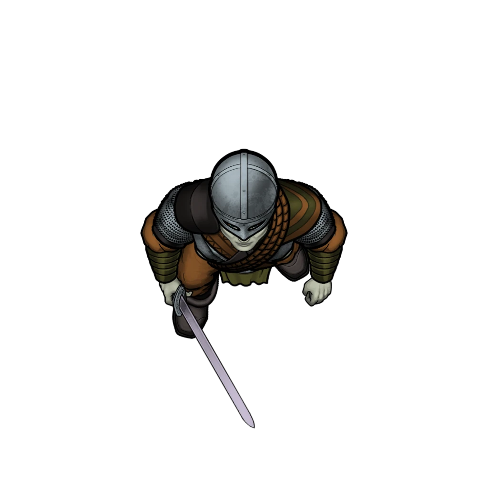
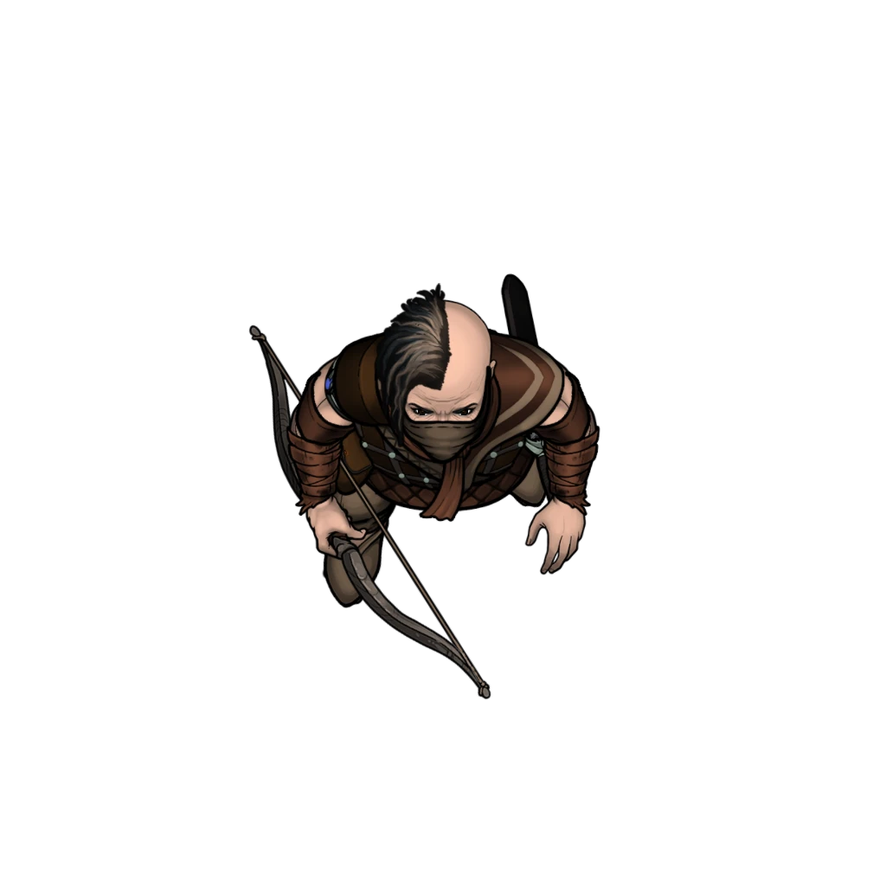

# Dash Away All

> [!warning] Gamemaster
> #### Gamemaster's Summary
>
> This Combat Event occurs as the party makes their way to an awaiting ship to flee Seawall before they are captured. In this Event, the characters can:
>
> - Fight, evade, or hide from Otherhood pursuers.
>
> This Event is depicted using the "Ship" Level of the [[Seawall Alleys]] Area Map.

### Otherhood Pursuit

> [!abstract] Otherhood Brigand
> **[[Otherhood Brigand]]**
>
> Level 3 · Human Brigand
>
> 
>
> A well-armored, season fighter of the Otherhood wearing golden robes and scale armor. They look determined, disciplined and spoiling for a fight.

> [!abstract] Otherhood Raider
> **[[Otherhood Raider]]**
>
> Level 1 · Human Brigand
>
> 
>
> A lightly-armored, heavily armed fighter wearing golden robes and brown leather armor. They look determined, disciplined and spoiling for a fight.

As the Area Map loads, the party realizes they must navigate a winding path filled with Otherhood members. They could try to stand their ground, but Lyla consistently urges them to run as the number of Otherhood members increases. While escaping through Seawall toward the docks, they are actively chased by Otherhood Raiders and Brigands.

> [!danger] Hazard
> #### An Unending Chase
>
> While fleeing through Seawall for the docks, the party is actively pursued by Otherhood Raiders and Brigands. However, their numbers are too great to overcome, and the party must flee rather than stand their ground. The chase challenge has three parts: Distance to Destination, Otherhood Proximity, and Chase Actions.
>
> Note: in the combat tracker, a single raider and brigand stand in for the group as a whole in initiative order.
>
> #### Chase Actions
>
> To get closer to their destination and evade the Otherhood, the party must make a series of group skill checks. The party can use any of these actions during the chase:
>
> - **Run For It!** The party runs full tilt. Make a group **Athletics (DC 14)** check.
>   **Result:** On a success, move 1 step closer to the Destination and move the Otherhood 2 steps further away. On a failure, move 2 steps away from the Destination, and move the Otherhood closer by 1 step.
> - **Follow me!** The party leaps down a level, runs across roofs, jumps through stalls, or crosses other rough terrain. Make a group **Athletics (DC 14)** check.
>   **Result:** On a success, move 1 step closer to the Destination and move the Otherhood away by 1 step. On a failure, move only 1 step farther from the Destination, or allow the Otherhood to move 1 step closer (the party chooses).
> - **This Way!** The party spots a shortcut or pathway toward their destination. Make a group **Awareness (DC 14)** check.
>   **Result:** On a success, move 2 steps closer to the Destination. On a failure, move only 1, closer to the destination and move the Otherhood closer by 1 step.
> - **Hide!** The party takes a risk and hides nearby, hoping their pursuers run past. Make a group **Stealth (DC 16)** check.
>   **Result:** On a success, move the Otherhood 2 steps away. On a failure, move the Otherhood closer by 2 steps.
> - **Improvise!** The players can suggest an action not listed here, such as knocking over stalls, causing distractions, throwing out money, or something similar. Discuss how this would affect the chase and determine a group check that makes sense for the action.
>
> #### Distance to Destination
>
> During this chase sequence, the Party is attempting to get to a ship to escape. The distance to this vessel is marked by a scale: **In Reach** - **In View - Nearby - Close - Distant**. To get onto the boat, the party must be **In Reach** of it.
>
> #### Otherhood Proximity
>
> The goal of this chase is to keep the Otherhood as far away as possible while getting closer to the party's Destination. During this chase sequence, the Otherhood pursuers have the following distance states:
>
> - **In Reach** - The Otherhood is about to grab you!
> - **In View** - The Otherhood can see you, and you can see them.
> - **Nearby** - The Otherhood is just one corner away, and will be in view momentarily.
> - **Close** - The Otherhood knows where you are and is closing in quickly.
> - **Behind** - The Otherhood has fallen behind but knows what direction you went.
> - **Searching** - The Otherhood has lost sight of you and isn't sure where you are. You have a little time to move freely.
>
> #### Escaping or Getting Caught
>
> If the Otherhood gets to the "In Reach" proximity step and the party **fails another chase action**, they are captured and must fight their way out. For this encounter, they have to brawl with 4x [[Otherhood Raider]] and 2x [[Otherhood Brigand]] on the [[Seawall Alleys]] Area Map. If they succeed, they can resume running, and the Otherhood start in the "**Behind"** distance step.
>
> To escape the Otherhood, the party needs to get into the **"In Reach"** distance step for their Destination, and the Otherhood needs to be **"Behind"** or **"Searching."**

### Escaping Seawall

Depending on how things go in the above sequence, the party can either jump onto the ship with Lyla:

> [!quote] Read Aloud
> You dash aboard the awaiting ship described to you by Salara. Its captain stands there for a moment with his head tilted to one side. He then turns and notices the Otherhood swarming toward you and his ship, and he grins widely.
>
> > Aha! You've kicked the hornet's nest, I see! Time to leave, lads!
>
> He then begins bellowing orders, and the ship seems to launch away from the Gray Harbor Docks with a shudder. Cries for the crew to stop from the approaching Otherhood fall on deaf ears as the ship's sails catch the wind and drag the vessel further from the docks. The Otherhood yell at each other and point at the ship. Some run off, likely to warn their leaders, while others hurl fading insults as you make your escape.
>
> Lyla exhales, relieved, but winded.
>
> > Didn't think we were going to make it there … now let's just hope they don't come after us.

#### Akon Attunement: Sail with Lyla

If the party chooses to set sail for Ordain with Lyla, each character advances their **Attunement: Akon (+1)** at the conclusion of the Event.

Or, in the unlikely event that the party decides to let Lyla go on her own:

> [!quote] Read Aloud
> You rush Lyla onto the docks and then turn to face the Otherhood. You are quickly overrun by their numbers, but they are too late to stop Lyla's ship from escaping. As the vessel retreats toward the sea, you are tied up and dragged off.
>
> After some rough handling and questioning, it's determined that you're not especially valuable or interesting. You're "fined" all of your carried coin and any other particularly valuable items you're carrying, then unceremoniously kicked out of the city.
>
> One particularly burly Otherhood goon growls at you:
>
> > Stay out of Seawall. If we ever see you back in here, we'll take more than your valuables.
>
> As they slam the gates shut, your weapons are thrown from the walls and rain down with a horrible clatter. Otherhood scoundrels jeer and mock you from atop the walls, well out of reach and far from reprisal.

#### Aura Attunement: Stay Behind

If the party chooses to stay behind while Lyla sets sail for Ordain on her own, each character advances their **Attunement: Akon (+1)** at the conclusion of the Event.

### Concluding the Event

> [!warning] Gamemaster
> #### Milestone
>
> Completing this Event earns the party 1 [[Milestone Progression]], potentially advancing them in Level.
>
> #### Next Steps
>
> If the party continues to Ordain with Lyla, mark that Outcome. As the party moves into the ocean on the Region Map, the Event [[Strange Depths]] triggers.
>
> If the party separates from Lyla, mark that Outcome instead. The party will connect with Lyla again in Ordain in [[Fallen House]].
