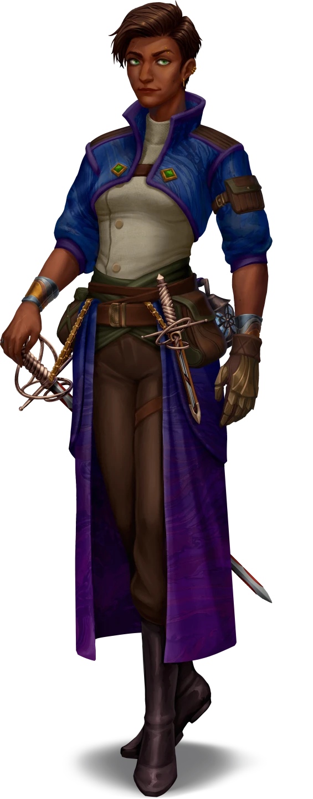

# Reuniting with Lyla

> [!warning] Gamemaster
> #### Gamemaster's Summary
>
> This Social Event occurs as the party reconnects with [[Lyla Cevher]] in the small village of [[Nain]]. In this Event, the characters can:
>
> - Learn about Lyla's meeting with [[Sigil]] in [[Oldcraft Lodge]]
> - Learn about the discovery of Celestials in [[Arcturel]] and the plot to disrupt House Cevher operations.
> - Lyla shares her thoughts on her investigation with the party, after which the group can proceed together to Nain and the [[A Smuggler Extraordinaire]] Event.
>
> #### Prerequisites
>
> The party must have separated from Lyla during the [[Leavetakings]] Event of the [[The Winding Trail]] Main Quest for this Event to occur.

### A Surprise Meeting

When Lyla leaves Helkas to begin her investigation of the bandits, the party knows that she intends to visit Oldcraft Lodge. As her journey takes her through the Arctus Plateau, there are a few opportunities for the characters to learn of her travels, but the party can reunite with her in the small village of Nain. This can happen deliberately; if the party is looking for Lyla, they might have come across clues or visited Oldcraft Lodge, where Sigil directed them toward Nain. Or they may come across her randomly and they have an opportunity to reconnect.

> [!abstract] Lyla Cevher
> **[[Lyla Cevher]]**
>
> Level 2 · Human Cevher Heiress
>
> 
>
> A Human who is sharply dressed in a beautiful and richly decorated coat that proudly displays her wealthy background. It's clear from an initial glance at her overall bearing and clothing style that she is from the city of Ordain itself and while she holds herself with a confident air, she is also friendly and welcoming with a slight smile and small laughter lines appearing around her eyes.

> [!warning] Gamemaster
> #### Music: Lyla's Theme
>
> When the party reunites with Lyla, play  **Music: Lyla Theme**

> [!info] Social
> #### What Lyla's Learned
>
> The party can fill Lyla in on what has happened to them during their travels so far, and Lyla is shocked by the scale of the troubles affecting the region. After a moment to compose herself, or if pressed, Lyla recaps what she learned in Oldcraft Lodge and Arcturel about the bandits.
>
> > My investigation began with Sigil at Oldcraft Lodge, where I found a large group of refugees and displaced families recovering outside. They were in terrible shape, but Sigil was doing his best to help them. While there, I asked around about the bandits and was able to learn a few things. The bandits that attacked Helkas are part of a larger organized group called the Otherhood. I don't know exactly what they want, but they seem determined to make House Cevher an enemy, and they harbor no love for any of the Trading Houses. They also appear intent on causing chaos in the region.
> >
> > Sigil advised I visit the mining town of Arcturel to the south, where I discovered a plot by a strange celestial creature named Kilner to disrupt my family's operations. In the aftermath, it seems like the plot wasn't random and might have been connected to this Otherhood group.
> >
> > I must admit, this all feels very overwhelming, and I don't know if I'll be able to uncover the true plan without some more help. So, I'm here to see if an old friend who has some... well, let's just say disreputable connections might have some information I wouldn't be able to find on my own.
>
> Lyla is happy to provide a summary of what she has learned about the three clues that she decided to investigate back in Helkas.
>
> > Oh, and there were those three clues from the bodies of those bandits back in Helkas that I managed to find some answers for at Oldcraft Lodge.
>
> - **The Coded Instructions:** Lyla partially decoded the instructions given to the bandits. They mention a cloaked figure, who she located in Arcturel, trying to sabotage House Cevher operations, and someone, a leader figure, who is referred to in the notes as the "Bonny Captain".
> - **The Leather Markings:** Lyla found a book on leather markings in Oldcraft Lodge and confirmed the information with merchants in Arcturel. She's fairly sure that the leather markings come from either Seawall or Ordain.
> - **The Strange Saying:** The phrase "For Other Fortunes," found on some bandits as Tattoos, is a code used by the Otherhood to identify themselves — it is half of a call-and-response, but she's not sure what the other half might be.

> [!question] Q&A
> **Q:** What do the Coded Instructions say?
>
> **A:**
>
> > I couldn't fully decode the bandit instructions, but I understood the essentials. A cloaked figure was sent to Arcturel to sabotage House Cevher’s operations. While there, I found out that this figure was actually a strange creature from Luxarum. I learned about these beings from Sigil long ago, and I think the name is Tyraphem. This particular creature was somewhat weak for something from the Inner Realms, and I have no idea why it would target my house’s operations. For now, it remains another mystery.

> [!question] Q&A
> **Q:** What about the Leather Markings?
>
> **A:**
>
> > The markings and icons suggest that the bandits are probably connected to either Seawall or Ordain. I think Seawall is more likely because the markings clearly show a large ancient tower, which is a distinctive feature of Seawall. Luckily, this is probably the next stop after Nain, so I will look into it further there!

> [!question] Q&A
> **Q:** The Strange Phrase tattooed on their arms?
>
> **A:**
>
> > I discovered in Arcturel that this is a phrase these bandits and this group called the Otherhood of Fortune use as a secret phrase among their members. "For Other Fortunes" might just be the first part of the codeword, though, and I wasn't able to find out the response.

> [!question] Q&A
> **Q:** The Otherhood of Fortune
>
> **A:**
>
> > I believe they are more organized than I initially feared, and they appear to have a sinister plan in motion that targets not only my house, but much of the Arctus Plateau. They seem to be exploiting other events to spread chaos and unrest, but I don't know what their ultimate goal is.

> [!question] Q&A
> **Q:** What is Seawall?
>
> **A:**
>
> > You might not be familiar with it, but Seawall is considered the only other genuine city near Ordain. It’s smaller and located to the east of Nain. The governing body of the Ordinate has paid it little mind, and it’s seen as somewhat of a backwater. Sometimes, trade ships avoid paying official taxes and duties at Ordain docks by heading to Seawall instead, hoping to negotiate a better deal. Despite that, it's a nice place, blending elements of Ordani and Arcturian traditions. I recall the people being very friendly, though a bit annoyed by Ordain and the Trading Houses the last time I visited.

> [!warning] Gamemaster
> #### Related Quests
>
> Before continuing on, the party may choose to undertake [[The Book Of Tales]], a Side Quest that starts in Nain. Lyla doesn't mind if the party chooses to do this first and wants to meet up with her later when she meets Juro.
>
> If the party is not yet at least Level 3, you may wish to strongly suggest the party investigate this side quest before continuing onward.
>
> #### Music: Default
>
> Once the party has finished conversing with Lyla, return to the default music:  **Music: Reset**

### Pursuing the Leads

Once the party has asked Lyla enough questions about her exploits, they can decide to embark on other quests, such as the [[The Book Of Tales]], or move on to meet up with Sin or Ankarist. Lyla will continue her investigations alone if she has to, and will find her old friend Juro in Nain and ask for his help.

However, if the party seems willing, Lyla says the following:

> [!quote] Read Aloud
> Lyla gazes at you with her eyes narrowing slightly, her hand moving to the guard of her sword, not as a threat, but as if she's considering you more carefully.
>
> > You know, I could really use some more help. My previous offer still stands—if you'd like to accompany me, there are still many questions to answer. I've also heard rumors from people here in Nain that Seawall has become more dangerous lately. I can compensate you for your efforts, and perhaps we can work together to uncover more about this bandit group.
> >
> > Before moving on to Seawall, let's stop by another familiar face here in Nain. He's likely to be glad to see us and could help clarify some of the rumors.

The party can then head off to meet with [[Juro Wandren]], and Lyla joins their group.

### Concluding the Event

> [!warning] Gamemaster
> #### Next Steps
>
> If the party decides to go with Lyla, proceed to [[A Smuggler Extraordinaire]], which also occurs within the town of Nain. To trigger [[A Smuggler Extraordinaire]] automatically, advance time in the game world by at least 1 hour.
>
> If the party separates from Lyla, they can catch up with her again in Seawall in [[Gated Community]], or in Ordain in [[Fallen House]].
