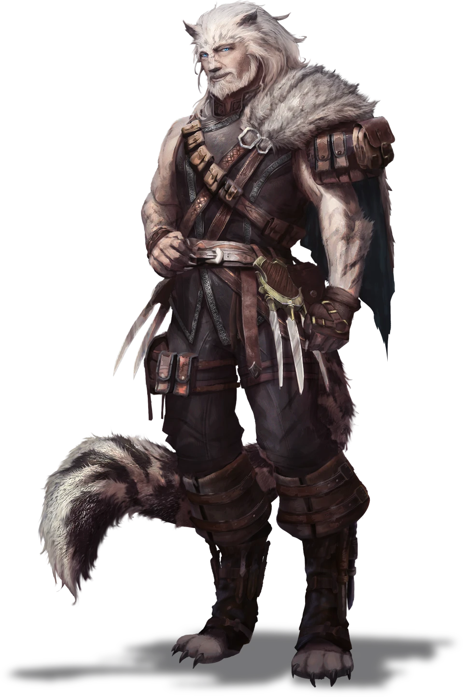

# Simmering Discontent

> [!warning] Gamemaster
> #### Gamemaster's Summary
>
> This Exploration and Social Event occurs as the party continues their investigation and explores the upper section of [[Seawall]] known as Tower Crags.
>
> In this Event, the characters can:
>
> - Find the leathermaker who made the bandits' outfits to learn more about them.
> - Talk to the tattoo artist responsible for the "For Other Fortunes" tattoos.
> - Befriend the locals to learn about what is happening in the city.
> - Find and listen to Sticks, the Provost of Seawall, as he is giving a speech.
>
> During the Event, the party may attract suspicion from the locals. As suspicion grows, it becomes harder to gather information, and the Event may end prematurely if they are attacked by residents who want them to leave town immediately.

### Suspicion in Seawall

Now that they are in Seawall, the party can follow up on some of the leads that they have gathered about the bandits, otherwise known as the Otherhood, but the party's options for following up on these leads are based on the Outcome of [[Gated Community]]. Before moving any further into the city, Lyla stops the party and says the following:

> [!quote] Read Aloud
> Lyla clenches her fists as she turns to you, her face scrunched in determination, clearly intent on figuring out what is happening here.
>
> > Alright. The city is definitely different from what I remember. Not at first glance ... but there's an air of fear, paranoia, and fervor here that I can't quite put my finger on. Be careful, friends; we should try not to upset the locals and see what we can uncover.

> [!tip] Exploration
> #### Full Access
>
> *Suspicion Rating 0*
>
> Parties that received full access to the city begin with a Suspicion Rating of 0. They can explore any location in the city outside the fort, which is restricted even for locals. This includes [[Simmering Discontent]], the [[Simmering Discontent]], and [[Simmering Discontent]].
>
> #### Limited Access
>
> *Suspicion Rating 2+*
>
> Parties that have limited access to the city and begin or gain more than 2 Suspicion Rating are limited in their choices of locations to visit. They can only explore [[Simmering Discontent]] and the [[Simmering Discontent]]. If they try and access the Old Door Inn, they are laughed at and thrown out onto the street, as the locals have passed word around that they are suspicious. They can attempt to enter by making a successful **Stealth (DC 15)** group check (if at least half of the group attempting the check succeeds, the entire group succeeds). On failure, they are still unable to enter, and their Suspicion Rating increases by 2.
>
> #### Sneaking Around
>
> *Suspicion Rating 0*
>
> Parties that snuck into the city can explore any location and begin with a suspicion level of 0, but have a chance of raising local suspicion whenever they fail a check. On a failed check of any kind within this Event, roll a `[[/roll d4]]`. On a 1, the level of suspicion on the party raises by 1.

> [!danger] Hazard
> #### Suspicion in Seawall
>
> While in Seawall, characters can take actions that increase the suspicion that falls on the party, raising their suspicion level in the process.
>
> - With a Suspicion Rating of 5 or more, the party is considered suspicious. All social skill checks are made with **-2 Banes**.
> - With a Suspicion Rating of 8 or more, the party is considered unwelcome. End all party activities and begin [[Simmering Discontent]].

#### Aura Attunement: Finding Your Own Path in Seawall

If the party manages to raise their Suspicion Rating enough to become unwelcome in Seawall, each character advances their **Attunement: Aura (+1)** at the conclusion of the Event.

`[[/outcome unwelcomeSeawall]]`

### Exploring Seawall

If the party doesn't have any clear direction, Lyla gives the following as possible options for investigation: checking out the shop of the leathermaker who made the bandits' clothing, finding the tattoo artist who inked the "For Other Fortunes" tattoos, and listening in to locals who may have information about what's happening in Seawall.

> [!tip] Exploration
> #### **Visiting The Leathermaker**
>
> Lyla:
>
> > Juro Wandren mentioned a leatherworker in Seawall. Pejil. If he isn't the one who made the leaf leather armor worn by the Helkas bandits with this pattern on it, I'm sure he knows the identity of the crafter who did. His shop's right by the Ancient Tower, if we want to investigate further.
>
> The party can head directly to his shop for [[Simmering Discontent]].

> [!tip] Exploration
> #### **Finding The Tattoo Artist**
>
> Lyla:
>
> > Keep an eye out for those For Other Fortune tattoos. If we can figure out who made them, we might be able to figure out exactly how to use that phrase to get the rest of the information that we need. I'm sure someone around here knows who they are.
>
> Characters can ask anyone around them where to find the tattoo artist, but will immediately be asked why they wish to know. Any character who makes a successful **Deception (DC 15)** check successfully lies about their reasons for wanting to find the tattoo artist. On a failure, the local refuses to tell them and suspicion of the party goes up by 1. Characters may also look around Seawall for the symbol used on the tattoo — with a successful **Awareness (DC 15)** check, they spot a sign on a signpost with similar artwork that points them to the tattoo artist Lejiki.
>
> Once the party has found Lejiki's location, they can proceed to [[Simmering Discontent]].

> [!tip] Exploration
> #### **Listening to the Locals**
>
> Lyla:
>
> > The last time I was here, my father warned me about visiting a particular place—the Old Door Inn, hidden under the shadow of the Ancient Tower in its basement, if the rumors are to be believed. If we're looking for information from some of the most undesirable people in the city, that might be a good place to start.
>
> If the party has full access to Seawall or snuck into the city, they can proceed directly to the Old Door Inn for [[Simmering Discontent]].

### Investigating the Leathermaker

> [!quote] Read Aloud
> The leatherworking shop is tucked into an alley next to the Ancient Tower. It appears small and unassuming, easily overlooked by those not specifically searching for it. Inside, a bald man with a long gray beard works diligently in a room filled with leather samples. He is hammering a design into a piece of leather stretched on a worktable with one hand, while sketching in a small design book with the other. Throughout, he casually hums a surprisingly complex tune.
>
> > Welcome to Pejil's Custom Leathers. I'm Pejil. I'm a bit swamped, but let me know if there's anything you need.

> [!info] Social
> #### Talking to the Leathermaker
>
> Pejil is focused on the task at hand and not much of one for idle conversation, answering any questions with a short response and then returning to his humming. Any character who makes a successful **Diplomacy (DC 15)** check can tell that Pejil is stressed. He has a lot of work to do and not very much time — his only real outlet of calm is his singing.
>
> Any character who makes a successful **Performance (DC 15)** check can harmonize with the current tune that Pejil is singing, which brings a smile to his face and makes him pause long enough to speak to the party.
>
> Any character who makes a successful **Society (DC 15)** check can identify the song he is humming, "By the Banks of the Elenain," and comment on it. He then pauses and will speak to the party.
>
> If the party talks to Pejil, he will share any of the following:
>
> - He has been working nonstop creating armor for the locals. It isn't the fine craft work he thought he'd be doing, but he wants to make sure those he knows and loves are safe. He's a bit anxious about the speech that local leader Sticks will give later today, but always feels reassured after listening to "The Captain."
> - He doesn't know anything about a grand plan for the Otherhood, but he's familiar with the term, as most of his clients recently call themselves the "Otherhood Crew." Seawall is a great place to live, though, and he's paid a fair wage, so he will continue doing what he's doing without asking too many questions.
> - He hasn't really had a chance to look back at his headcount and number of outfits ordered, though he keeps it in his record book, but the number has grown greatly over the last season or so. Recruiting must be up.

> [!tip] Exploration
> #### Snooping in the Shop
>
> A number of fine leather garments have been laid out across the shop.
>
> - Any character with **Awareness (DC 15, Passive)** check sees the pattern that Pejil is currently hammering into the leather from across the shop: the same pattern as the one worn by the bandits.
>
> - **Knowledge: Crafts**: The character gains **+2 Boons** on this check.
>
> The small book that Pejil is writing in appears to contain records and notes about whatever project he is currently working on, though it is difficult to tell from a distance.
>
> - A character can examine the book more closely by getting close to Pejil with a successful **Stealth (DC 15)** check. Once close enough, the character can see that the number of pieces of armor needed appears to be growing exponentially.
>   If the Stealth check fails, the character must make a successful **Deception (DC 14)** check to convince Pejil they weren't spying, or they are kicked out of the shop and Suspicion Rating of the party increases by 1.
> - A character can take the book with a successful **Stealth (DC 15)** check, giving them the opportunity to examine it more directly. They learn that the number of Otherhood recruits is indeed growing exponentially. A note in the book also reads, "Let me know if you need any extra hands in here again — I know this is a lot of work for one person and I should have some more qualified bodies soon enough. - Sticks"
>   If the character fails the check, they must make a successful **Deception (DC 16)** check to explain what they were doing, or they are kicked out of the shop and the Suspicion Rating of the party increases by 1.

### Tattoo Artist of The Sea

> [!quote] Read Aloud
> A signpost for a tattoo shop called the Sea Liner directs you to the edge of the plaza overlooking the docks below. Inside, a small Keth is drawing the city skyline with a variety of colorful inks from his pots, including a stunning golden ink that shimmers on the canvas.
>
> > Sorry, no tattoos today. I've been spending so much time inking others that I've forgotten what it means to ink for myself. Today, I just want to relax and enjoy the view.

Lejiki has an array of inks that he is currently working with, including three different gold shades. They may be shifting ink, though it would require some investigation to confirm.

> [!info] Social
> #### The Artist At Rest
>
> If characters speak to Lejiki, they can ask him about his art, though he is reluctant to talk while he is working. For each question asked, the character asking the question must make a successful **Diplomacy (DC 14)** check. If this check is failed twice during the conversation, Lejiki stops speaking altogether and asks the party to leave the shop. The Suspicion Rating of the party increases by 1. While speaking to the party, Lejiki can reveal the following:
>
> - He prefers art to tattoo work, especially because he has been asked to create the same tattoo over and over.
> - The tattoo he has been asked to repeat is ropes around arms, wrists, and legs, or the ancient tower itself, sometimes with the words "For Other Fortunes" under it. This is a phrase he hears often in Seawall, along with its customary reply, which he is not supposed to repeat.
>
> - **Critical Success**: He will reveal the response phrase, "With Our Own Two Hands."
>
> - The ink he uses in his tattoos is a particularly beautiful shade of gold that is really meant for messages, but he can't get enough of. He's convinced Sticks to let him have enough to do his art. If the party is familiar with Shifting Ink or if any character makes a successful **Arcana (DC 15)** check, they can confirm that he is using Shifting Ink for the artwork.

### A Rowdy Experience

> [!quote] Read Aloud
> You follow the sound of laughter and merrymaking to The Old Door Inn. The entrance appears to be a large open double door leading into a dark room directly beneath the Ancient Tower. It seems to be a very busy location, as Seawall locals are constantly entering and exiting, with loud laughter, the clanking and clashing of metal mugs or glasses heard everywhere, and a raucous song playing at a ridiculous volume, desperately trying to be heard above the noise. Three burly bouncers stand at the doorway, and although they don't seem to be stopping anyone, they are taking their jobs seriously, scanning people's faces and clothes as they pass.

> [!info] Social
> #### An Unruly Crew
>
> The party may not be able to enter the Old Door Inn, depending on their Suspicion Rating. (see "[[Simmering Discontent]]" above).
>
> Once they are inside, the Inn is a cacophony of noise, with locals dancing on tables and the entire cavernous room teeming with people. The locals at the Old Door Inn are talking loudly about all manner of topics, some about legends and myths, or the seasons changing, or swapping tales about their various exploits. As the party tries to situate themselves, they are beset by a loud group of locals who shout at them to share some stories.
>
> > You there … What about you lot! What merry tale can you share with me, lads?
>
> The party is trapped as the gang of locals surrounds them on all sides. The party must attempt a group challenge to impress the locals, with each party member rolling one of the following checks:
>
> - **Performance (DC 15)** to spin a story that is so exciting that no one pays attention to the particulars.
> - **Deception (DC 15)** to lie about their exploits on the Arctus Plateau.
> - **Diplomacy (DC 15)** to get out of telling a story by convincing someone else to tell the tale instead.
>
> When making any of the above checks:
>
> - **Knowledge: Intrigue**: The character gains **+2 Boons** on the check.
>
> If characters successfully tell the tale, they are welcomed by the group around them, who reveal the latest passcode to the phrase "**For Other Fortunes**": "**With Our Own Two Hands**."
>
> > Oi, you lot are alright in my book! HAH! I almost missed my last mission because of that blasted ink shifting this way and that. I know Sticks wants everyone to be cautious, but it just makes life so damn difficult!
>
> If characters fail the check, the locals are unimpressed by the story and believe that the party is lying to them. The party's Suspicion Rating increases by 3.

### An Address to The Crowd

Once the party has collected all available information, or if they have become Unwelcome in Seawall, a loud bell rings throughout the city.

> [!quote] Read Aloud
> Without warning, a loud clanging can be heard coming from the Ancient Tower above. The sound reverberates throughout your body, and you feel a flash of pain in your ears. Then it strikes again, and once more. On the third strike, you hear loud clapping and cheering as the sounds of people moving toward the Ancient Tower and the plaza in front of it can be heard.
>
> As you follow the crowd, you find yourself looking up at the steps of the Tower, where a tall, broad-shouldered Kiska dressed in exotic furs steps out and spreads his arms wide as a greeting. Based on the murmuring you hear from the crowd, it’s clear this must be Sticks, the Provost of Seawall.

> [!abstract] Sticks
> **[[Sticks]]**
>
> Level 6 (Boss) · Kiska Swashbuckler
>
> 
>
> You hear the retired pirate before you see him. As he talks, he throws his shoulders back, voice roaring and white fur gleaming underneath a uniform that is both casually rumpled and meticulously fitted. If he knows he is charming, which he almost certainly does, it doesn't detract from the charm, and there's a sense of warmth in his smile that makes it easy to see why so many people are ready to bask in it.

> [!quote] Read Aloud
> With a booming voice that conveys authority but still feels as if he's speaking to each person in the crowd individually and personally, Sticks addresses the crowd.
>
> > HAHA! Thank you all, loyal friends! How kind you all are! I wish that I had better news to report, but seeing your faces in the crowd makes my heart lighter and my burden lighter.
> >
> > As you know, our attempts to make our living on the Plateau we call home have remained stalled by the refusal of the listless Trading Houses and the weak wills of the Ordinate in Ordain. But I'm pleased to report, thanks to your bravery, we now know the truth: House Cevher has been creating the earthquakes that hurt our cities and crops, on purpose, simply to enrich their own pockets!
>
> Loud boos and jeers break out among the crowd, swelling in fury, before Sticks raises his hands, urging for calm.
>
> > Yes, unfortunately, it is true. I understand it’s shocking, but I personally saw the evidence in documents stored deep inside the tower that we will soon reveal to the world! However, don’t worry — we will find a way to fight back and reclaim the Plateau from these villains soon. Though Other Fortunes may be their tool, we will take it back ourselves!
>
> A rousing call of "For Other Fortunes" and "With Our Own Two Hands" breaks out in the crowd, and for a moment, Lyla simply stares, her mouth slightly open in disbelief. She squares her shoulders, whispering in your direction.
>
> > I may have been gone a few years, but there is no chance that House Cevher is doing any of that. And from what he's saying, he's behind everything the bandits have done in the Arctus Plateau. He might even be the leader of the Otherhood itself. Whatever "proof" he has? We find it and expose it.
>
> As you whisper quietly among yourselves, you notice some locals nearby pointing in your direction and pushing their way through the crowd. Several armed and armored figures start to converge on you. With a yelp, Lyla grabs your arm and hisses out a warning.
>
> > Looks like it's time to make ourselves scarce! Follow me!

### Concluding the Event

> [!warning] Gamemaster
> #### Next Steps
>
> The party follows Lyla as she leads them down the nearby stone stairways to Stone Haven. This is one move on the Region Map to the lower area of Seawall and the next Event in the Quest, [[Warning Shout]].
