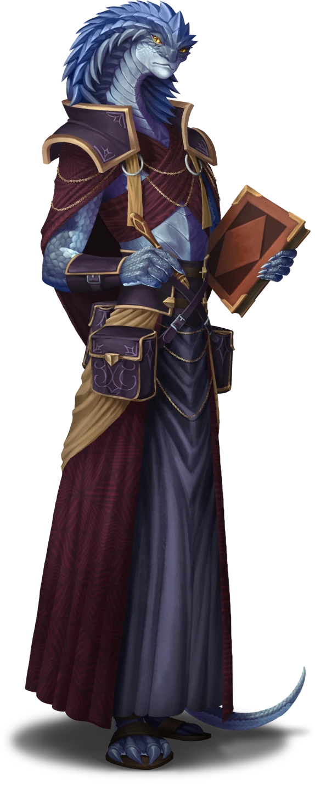

# Warning Shout

> [!warning] Gamemaster
> #### Gamemaster's Summary
>
> This Exploration and Social Event occurs as the party is confronted by Otherhood members who have become aware of their presence in the city. Lyla is eager to avoid combat, instead urging the party to stay hidden as long as possible, and if that fails, they need to find a ship to flee the city.
>
> In this Event, the characters can:
>
> - Evade Otherhood members as they attempt to track down and capture the party.
> - If ambushed, the party can knock out Otherhood members rather than kill them to keep things quiet.
> - Meet Salara, the Queen of Scales, a local legend whom Lyla is familiar with.
>
> As they try to find a way out of the city, this Event triggers a frantic attempt to escape Seawall before getting captured.

### Hunted & Harried

The party races through Seawall, following Lyla as she attempts to find a way down to the docks.

> [!quote] Read Aloud
> Lyla hurries alongside, stopping every few minutes to peer down side streets, trying to remember the way to the nearby docks.
>
> > It's been years since I was last in the city, and back then, I had my father to guide me. We used to pass through this area on our way to Arcturel or when I visited Sigil at his lodge. The place has become even more abandoned and derelict than it was before. No wonder the people here follow someone like Sticks; I imagine he's been promising them he can fix all of this.

### Ambushed Among the Debris

As the party makes its way down to the docks, they may be assaulted by Otherhood groups that have been sent to track them down and capture them.

> [!danger] Hazard
> #### Improvised Attack
>
> As the party races through the crumbling slums of Stone Haven, they must make a **Stealth (DC 15)** group check (if at least half of the group attempting the check succeeds, the entire group succeeds). On failure, they are spotted by the Otherhood, who jump them from nearby side streets. Lyla holds up her hands as the Otherhood bursts into the group and urgently half-whispers:
>
> > Wait! Don't kill them! It will draw more attention, and they will use it to further their cause!
>
> Only three Otherhood members jump the party, and they can be dealt with in any non-violent manner the party can think of, including some of these options below.
>
> - Tripping the bandits using nearby ropes or long strands of rotting cloth with a successful **Awareness (DC 14)** check to determine the proper place to put the rope and successful **Athletics (DC 14)** check to hold onto the rope as the Otherhood pulls against it, tangling them in the debris nearby.
> - Throwing a tarp, a larger piece of rotten cloth, or other kinds of debris over the Otherhood with a successful **Athletics (DC 15)** check, causing the bandits to tumble and fall to the ground.
> - Hitting them on the head with a piece of debris nearby, like some rocks, sagging wooden beams, or planks, or some actual rubbish with a successful **Athletics (DC 15)** check.
> - Making any additional attempts that they come up with on their own at the GM's discretion (any associated checks should be DC 14 or DC 15).
>
> #### A Coward's Path
>
> While it is not recommended, if the party chooses to ignore Lyla's warning and attack the Otherhood directly, they may do so, but things likely won't go as planned since none of the Otherhood are eager to fight head-on. You can describe a party member successfully landing a hit on any of the Otherhood, but as soon as this happens, all three immediately use their actions to flee, crying out as they go.

With the Otherhood either restrained nearby or running off, Lyla continues to urge the party forward.

> [!quote] Read Aloud
> > I'm sure reinforcements are on the way! You saw the size of that crowd with Sticks. We can't take on the entire city. We've got to get out of here on a ship before we're completely surrounded!

### The Queen of Seawall

Before the party can make it to the docks, they run across none other than Salara, the Queen of Scales, a legendary local figure whom Lyla remembers from her visits to Seawall years ago.

> [!quote] Read Aloud
> Rounding a corner, you spot a large building nearby among the crumbling houses. Just beyond it are the docks themselves, but before you can move any further, a tall figure emerges from the double doors. She seems to be fixating on you intently, and with a flick of her wrist, she beckons you over, calling out with a commanding tone.
>
> > Over here, please!
>
> Beside you, Lyla blinks in shock before muttering in disbelief.
>
> > Oh, Screaming Sockets ... I don't believe it … I think that's the Queen of Seawall…
>
> With a quick shake of her head, she rushes over to the building, beckoning you to follow.

> [!abstract] Salara, Queen of Scales
> **[[Salara, Queen of Scales]]**
>
> Level 4 · Ashka Trader
>
> 
>
> A tall, imperious Ashka woman, Salara is of middle age with gray-blue scales and icy eyes that can cut like daggers if properly directed. She dresses in fine clothing, with little accents of gold and silver to contrast her naturally darker garb and scale. She wears a low slung belt, and from that hangs a pouch packed with notes and ledgers, plus all manner of rulers, weights, tools used to keep her market in check

> [!quote] Read Aloud
> As you enter the building, the interior is not only well-maintained but also pristine. Silks, large soft cushions, delicate treasures, and various trinkets seem to shimmer from every corner. Salara herself glides over to a soft, luxurious-looking couch and sits down, her gaze calm and steady, accompanied by a slight smile on her face.
>
> > Well, well, Lyla Cevher, the talk of the town. It's been so long, my dear.

> [!info] Social
> #### The Queen of Scales.
>
> Lyla begins to talk with Salara. She is friendly but slightly cautious, keeping her hand near her rapier as she converses with the commanding woman before her. She briefly explains her purpose for coming — identifying the bandits who attacked Helkas — and mentions that they now believe Seawall, along with the newly acquired information about Sticks and the Otherhood, was likely responsible. Additionally, Lyla shares her shock and confusion over Sticks blaming House Cevher for the earthquake twenty years ago, which feels like a distant memory to her.
>
> Salara's light smile doesn't leave her face, and her eyes are glittering with intensity. Once Lyla is finished, she speaks slowly, each word soft and smooth.
>
> > I see. Well, my dear Lyla, I imagine you will need to get back to Ordain as quickly as possible. I will, of course, offer my help. And no, before you ask, I don't want any coins; I think I'd rather have a favour from you. Agreed?
>
> Lyla crosses her arms and sighs quietly before nodding her head.
>
> The conversation between Lyla and Salara ends, and Salara turns to the party, eyes burning with curiosity. The following information and the questions-and-answer blocks can be used for Salara to answer questions from the party. Salara knows the following information in general.
>
> - Salara is a broker, merchant, and accountant. She is also known for offering bounties on disreputable beings, malicious monsters, or for tracking down missing persons or items. In reality, she might be one of the most well-informed and unscrupulous individuals the party will encounter.
> - She does "work" for Sticks and the Otherhood, or rather, their relationship is one of mutual benefit. Salara has many friends and a great deal of influence n Seawall, and Sticks is happy for her to continue her own operations. In return, Salara gives Sticks and the Otherhood information, though she slyly admits that she doesn't always give them accurate information.
> - Salara is helping Lyla because of her father, Ralton Cevher, who Salara once worked for and respected. In fact, Salara and Lyla know each other, but the nature of that relationship seems to be somewhat secret, or at least neither seems willing to elaborate further.
> - She knows of a ship that is about to depart the docks, and she urges Lyla to get on it, before she is captured by the Otherhood.
> - She is very interested in the party and seems to make a visual note of the way they dress and hold themselves. She makes a point of asking them very directly that if they require work in the future, she has several lucrative jobs and contracts they might be interested in.
>
> Salara is clearly a powerful figure, and Lyla seems to know more about her than she's willing to reveal at this time. Any character who speaks with her and makes a successful **Diplomacy (DC 14)** check learns that she is extremely calculating and very difficult to read. She could be leading them into a trap or genuinely trying to help, but it is almost impossible to figure out.

> [!question] Q&A
> **Q:** Who are you?
>
> **A:**
>
> Salara slowly blinks her slitted eyes, her smile widening.
>
> > I assure you, no one of any consequence. I try to stay informed about what’s happening in the Arctus Plateau and have several contacts across the region. Mainly, here in Seawall, I am a merchant and an accountant, offering my services to any businessman or woman who needs help balancing the books, so to speak.
>
> She pauses, bringing her hands together to interlink her long fingers in front of her.
>
> > I also provide contracts based on the information I receive or from my contacts, for the adventuring type — various tasks, missions, and bounties that come my way. All extremely dangerous, but also very lucrative at the same time …

> [!question] Q&A
> **Q:** Do you work for the Otherhood/Sticks?
>
> **A:**
>
> > Yes, of course. At least Sticks likes to think so, and I oblige him. He is extremely vicious when crossed, but he knows I have my own influence. It's better for us to work together here in Seawall. I don't get in his way, and he doesn't interfere with me; plus, he pays handsomely for information.
>
> Her slight smile tightens.
>
> > Though, just between us, I don't approve of his Otherhood all that much, and all this chaos is bad for business. I sometimes give him information that isn't entirely … *accurate*.

> [!question] Q&A
> **Q:** How do you know Lyla?
>
> **A:**
>
> > Oh, her poor father was such a dear. I once worked for him, when we were both much younger, of course. I was sorry to hear of his death. I've known Lyla since she was a baby, though it's been many years since we've had the chance to … reconnect.

> [!question] Q&A
> **Q:** Contracts and Bounties?
>
> **A:**
>
> > Straight to the heart, something I find most enjoyable! While I offer my services to ships, captains, and merchants, I collect information more than I am interested in coins and accumulating wealth. To that end, I am often approached by individuals who require my help in facilitating solutions.
> >
> > That's where your kind come into the equation. Adventuring types, usually members of the Anachraenum, looking to make some extra coin, etc. If you're interested in what kind of contracts and bounties I have to offer, we should talk privately another time.
>
> With that, she slowly and very obviously winks.

> [!question] Q&A
> **Q:** How do we get out of here?
>
> **A:**
>
> > One of my contacts is about to set sail, or rather, he is attempting to. His ship, the brigantine trader Flywind, is currently a bit stuck because of delays. The Otherhood keeps postponing payment. However, the captain, who is an old friend of mine, can likely be convinced to accompany you just to free his ship.

As the conversation with Salara winds down, read the following.

> [!quote] Read Aloud
> > So, my dear, it seems our brief reunion is at an end. They are still hunting you outside, and you have some distance to travel before you can catch the ship. Remember, it's the small brigantine, with a captain dressed in a long black cloak.
> >
> > Oh, and your wonderful bodyguards are welcome to return anytime. I suspect the Otherhood is more after Lyla than you right now, so you should be able to go back to the city. Just be cautious and avoid announcing yourselves.
>
> She then reaches inside her long coat and pulls out a small, ancient-looking black coin.
>
> > If you do have any trouble, show this to anyone in Seawall, and they will leave you alone. Now, off you go; time is ticking,after all!

### Concluding the Event

> [!warning] Gamemaster
> #### Next Steps
>
> The party needs to head to Gray Harbour to find the ship Salara was talking about. Proceed with the [[Dash Away All]] Event.
