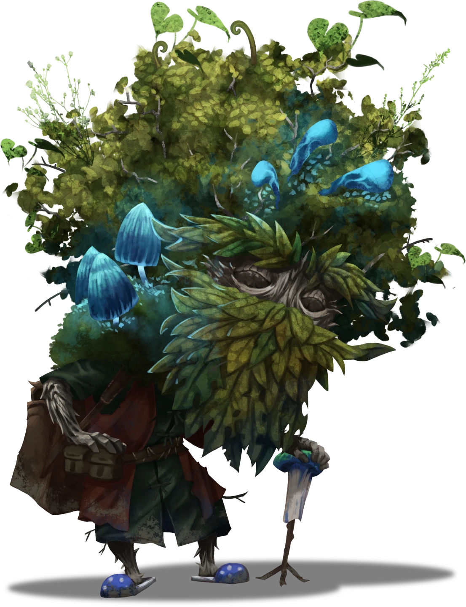

# Crackpot in the Caves

> [!warning] Gamemaster
> #### Gamemaster's Summary
>
> This social event allows the party to interact with the ancient and eccentric Kern, a powerful druid who lives down here in the Pathways. This event is depicted in the "Overgrowth" composition of [[Vista: Mycelian Expanse]]. The party here can:
>
> - Attempt to get information out of [[Kern]].
> - Take on a request from Kern to deal with some local [[Jurtak]] thieves and save his "friend"
> - Learn about his "friends" [[Kryz]] which is actually just an inanimate crystal, and [[Baradom]] which is actually a gargantuan lizard living nearby, though Kern won't portray either as such.
>
> The Gamemaster should be aware that Kern is an immensely powerful druid who does not behave in a way that might suggest that to the party at this time. To Kern, the party (and the Jurtak, and indeed the Baradom) are truly not a threat and his interactions with them should be somewhat obtuse and playful. Kern is peaceful because he is powerful enough that he can choose to be.

## Who?

> [!abstract] Kern
> **[[Kern]]**
>
> Level 16 · Thornling Shapeshifter
>
> 
>
> > [!quote] Read Aloud
> > This ancient, wizened Thornling leans upon a small, stout branch of fossiled wood, with a crooked grin barely visible beneath a bushy, exuberant beard of leaves. Thorny gnarled limbs and spindly legs are barely visible underneath a veritable mound of greenery and foliage. A great, scraggly bush grows from his back, creating a canopy of verdant growth over him and across leafy back and shoulders, sport clusters of blue, luminescent mushrooms.

> [!quote] Read Aloud
> The old thornling sweeps his little mushroom walking stick through the air, causing a large curtain of glowing ivy to reshape itself into a door way. Inside it is a warmly lit home built into a natural cave.
>
> He gestures for you to come along, as he quickly heads inside and begins setting a table which appears to be made from a large, flat-capped mushroom. On that table is an array of cups shaped from hardened mushrooms, and and pot of pungent tea.
>
> > Come over, sit down, drink tea!
>
> He pours himself a cup, the earthy smell of boiled mushrooms hitting you immediately.

> [!info] Social
> #### Just One Cup
>
> Kern treats the party like they are old friends, and Kern will be insulted if at least one person doesn't drink tea with him. The tea is awful, comprised on bitter leaves and chunks of dried mushroom. It tastes like sour dirt and mold, yet the aftertaste is somehow worse, and doesn't improve with time. Kern doesn't seem the least bit bothered by the flavor.
>
> A character can suppress any natural, reflexive reaction to the horrible taste of the tea by making a successful **Deception (DC 14)** check suffer the effects of **Disagreeable Brew (Hazard 4, Poison, Fortitude, Morale)** after they drink it.

From here on out the party can speak with Kern, possibly learning about him, and getting a quest to rescue a friend in need.

> [!info] Social
> #### Speaking to Kern
>
> Kern is very egotistical, and likes gifts and being given respect. He expects that everybody knows who he is, and that his legendary status as a druid has reached every corner of Ember. Naturally, nobody in the party has ever heard of Kern, but that doesn't prevent the party from lying.
>
> As long as the party doesn't insult Kern, and acts like he is as important as he thinks, Kern will remain friendly and cooperative.
>
> #### Befriending Kern
>
> Despite the ego and oddness of Kern, he is a truly powerful druid that would be a useful ally to have later on. It is possible to befriend Kern a handful of ways, and doing so is wise.
>
> - Playing into Kern's ego, and pretending he is a mighty and famed druid, being polite, humoring him, and being sociable goes a long way to earning Kern's support.
> - Helping Kern rescue his friend when he requests the party's help contributes immensely to getting on Kern's good side, especially if the party carries out the rescue without raising any issues with the details about it.
>
> #### Kern's Knowledge
>
> - Kern is happy to warn the part of "creepies" lurking in the darkness with their sharp weapons and hungry jaws. Attempting to coax more information from Kern reveals that these are the "Jurtak" a large group of wandering hunters that kill and eat anything that's not a plant.
> - Kern also alludes to the "nasties" which have been seen in the pathways, long, wormy lizards that can fly, and are covered in boils. He says they are sick and he's never seen one last very long. If asked, he doesn't know where they come from (Note: this is a lie).
>
> Kern is unwilling to share everything he knows with people who aren't his friends, and friends have tea together, he believes.

> [!question] Q&A
> **Q:** Who are you?
>
> **A:**
>
> Kern replies immediately with:
>
> > I told you: Kern!
>
> Ankarist issues a soft sigh.
>
> > Yes, but, we don't know who you are beyond your name.
>
> Kern scoffs loudly.
>
> > Everyone knows who Kern is! Legendary Kern, greatest of them all.
>
> Ankarist asks:
>
> > Greatest of who specifically?
>
> Kern grows briefly serious and leans in conspiratorially and speaks quietly:
>
> > All've 'em.

> [!question] Q&A
> **Q:** What are you doing down here?
>
> **A:**
>
> > Livin'! At least when I remember to.
> >
> > I've forgotten a time or two, took me a bit to remember again.
>
> He points his walking stick your way.
>
> > Don't forget if you can avoid it!

> [!question] Q&A
> **Q:** What's in this tea?
>
> **A:**
>
> > It's a mix, buncha things that won't kill you, mostly. I could make a nicer tea, but only once.

> [!tip] Exploration
> #### Self Neutralizing Poison
>
> Characters making a successful **Wilderness (DC 14)** or **Medicine (DC 14)** check suspect that this tea is a blend that is both poison and antitoxin, making it safe to consume if preserved right. Kern is either a master herbalist, or the luckiest thornling in the Pathways.
>
> - Characters with **Knowledge: Alchemy** have **+2 Boons** on this check.

## Kern's Troubles

After the party has spent some time talking to Kern, he will decide it's time to foist a mission upon them.

> [!quote] Read Aloud
> Kern raises the dainty mushroom cup to his brambly lips, inhaling the acrid aroma coming from it. He takes a sip, swishing the tea thoughtfully before savoring the taste with a content sigh. But quickly, his demeanor changes, grave and reflective, as though the very memory weighs down his shoulders.
>
> > It's a cruel world sometimes, isn't it?
>
> He muses, swirling the tea in his cup.
>
> > Imagine this: just out for a delightful walk, minding our own legendary business, when my good friend, another druid of extraordinary repute, finds himself swiped away by the creepies. Such nerve they have!

> [!question] Q&A
> **Q:** What are creepies?
>
> **A:**
>
> > Those scaled hunters, the creepies, they creep around the caves and act creepy, and look creepy. If you saw them you'd say 'those must be creepies' and you'd be right!
>
> He points a knobby finger at you.
>
> > The creepies are very aggressive and mean, if you see them, you should kill them on sight. Nobody will miss them, except the other creepies, who might want revenge, but if you can kill one, you can kill more than one!

> [!quote] Read Aloud
> Kern places the cup down, eyes narrowing with determination. Then, as if struck by a brilliant idea, he leans forward.
>
> > But you, yes, you marvelous adventurers, why… you could come to the rescue! Picture it: immortal, unkillable, but definitely needing a hand, my friend gets rescued by you! It could be the grandest tale of all! And who better to lend a hand than those hand picked by the equally mighty and probably immortal Kern?
>
> With an expectant smile, Kern waits for the group to realize the grand opportunity he's offering. Ankarist hesitant speaks up, skepticism evident in his voice:
>
> > I don't know… your friend sounds like they are fine, and you're clearly powerful enough to handle this adventure on your own. We really should get back to our search…
>
> Kern nods once, though it doesn't seem like he's listening, as he cuts in immediately:
>
> > Oh, well, of course a favor for one such as me, aside from being quite the feather in your caps would also come with a reward! I happen to know where to find the big dragon in the tunnels, and where all the little nasties like it are coming from.
>
> He waggles the big, leafy brows of his and Ankarist utters an annoyed groan, realizing that Kern actually has useful info.

> [!warning] Gamemaster
> #### What Is Actually Going On Here?
>
> Kern is being intentionally obtuse, likely because he's not entirely all there, but possibly because he's just messing with the party. Regardless, here's the plain situation:
>
> - Kern's friend "Kryz" is a large crystal that is important to Kern. Why is unclear, but the ancient Druid wants it back, and has also projected a personality on it. As stated above, Kern might not be all there anymore (if he ever was).
> - This crystal was stolen by local Jurtak, and while searching for it, Kern made contact with "Big Liz" which is actually a very large, very old [[Baradom]]. Kern is able to speak with her via the **Talent: Wildspeaker** talent, she is not otherwise capable of speech.
> - At some point Big Liz actually ate the thief that stole the crystal, and has since excreted their remains (and the crystal). A group of Jurtak are presently in and around her den looking for it. While Kern is more then capable of dealing with a bunch of Jurtak, he is lazy and wants to see how the Party handles themselves.

> [!question] Q&A
> **Q:** What happened?
>
> **A:**
>
> Kern clucks disapproving.
>
> > It was terrible. My friend Kyrz was captured by the creepies while I was out on a walk. He lives with me, by the way. Used to live in a cave, but got tired of being alone. Anyway, they came with their bone weapons and mouths full of teeth, raided my home, and ran off with Kryz!

> [!question] Q&A
> **Q:** Who is your friend?
>
> **A:**
>
> > Kryz! A powerful, immortal, ancient and reputable druid just like me!

> [!question] Q&A
> **Q:** If Kryz is so powerful, do they need help?
>
> **A:**
>
> > Well, you see, Kryz is a softy and wouldn't lift a finger to harm others. Not even big, awful creepies.

> [!question] Q&A
> **Q:** Where do we find your friend?
>
> **A:**
>
> > They ran off toward Big Liz's place. Of course Big Liz has been complaining about the creepies hanging around her home lately, setting traps and being annoying. They won't leave her alone, and probably have some nasty little den nearby or something. You should search around there.
> >
> > I even asked her if she'd seen Kryz recently, and you know what she told me? She said that they were dragging Kryz around while out harvesting their traps near her place.
> >
> > I can give you directions when you leave.

> [!question] Q&A
> **Q:** Who is Big Liz?
>
> **A:**
>
> > Well, Big Liz is big, first of all, obviously.
> >
> > Second of all, she is one of my oldest friends. She might even be older than me! Maybe. I'm not sure.
> >
> > Either way, third of all, Big Liz likes to be left alone.

The party isn't required to go rescue Kryz, but, Ankarist acknowledges that Kern my have useful knowledge, and Kryz might be a bit easier to work with.

### Concluding the Event

The party needs to decide if they want to help Kern and go rescue his friend, or if they want to continue on their own.

> [!warning] Gamemaster
> #### Next Steps
>
> If they choose to assist Kern and rescue Krys, they can proceed to [[Rocky Rescue]].
>
> If the party has already encountered the Jurtak trap clearing in the [[Cruel Traps]] event, they may have enough information to find the Mutagist lab already, otherwise, this might prove their best option to move forward.
