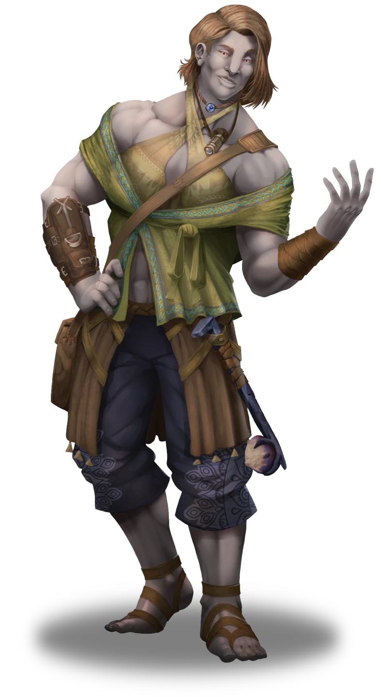
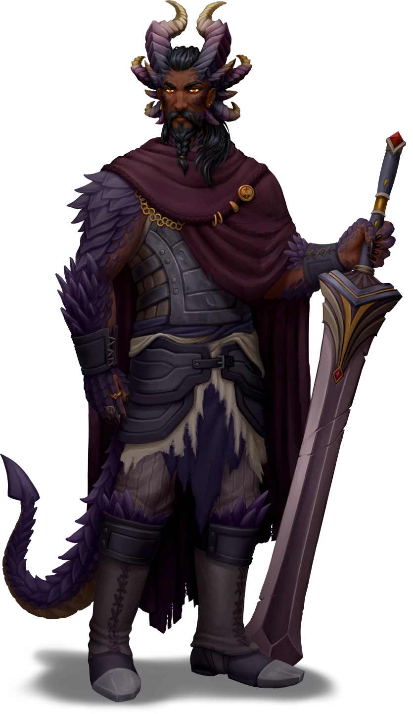

# Reuniting with Ankarist

> [!warning] Gamemaster
> #### Gamemaster's Summary
>
> This Social Event occurs when the party arrives in the remote town of [[Skybrush]] on the heels of [[Ankarist]], who can only be found via his local contact — the pawn broker [[Liestra Grann]]. In this Event, the characters can:
>
> - Encounter a local named **Mattock**, who can point the party towards Liestra Grann's shop, The Long Haul.
> - Meet Liestra and learn about her storied history with Ankarist.
> - Reconnect with Ankarist and learn about his intention to explore the depths of [[Mythspire Observatory]], located in the [[Wedgelands]] east of Skybrush.
> - Learn about various issues in Skybrush that Ankarist has agreed to help with.
>
> This Event is depicted using the "Skybrush - Gloomy" Level of the [[Vista: Skybrush]] Vista.

### Local Rumors

The party will need to find Liestra Grann if they hope to reconnect with Ankarist. Fortunately, the characters can seek help from warrior-turned-miner Mattock, even if no other townspeople are initially willing to help them.

> [!info] Social
> #### Conversation with Mattock
>
> Mattock can help point the party in the right direction, as well as provide them with a few basic rumors about Skybrush and other topics of interest.
>
> **Mattock (Neutral Good, Lumek Fej, he/him)**
>
> This grizzled, scar-covered mine worker has seen more action than most of Skybrush. A retired warrior who decided to settle down in a foreign land, the stout-hearted Mattock is rather protective of this treetop hamlet he calls home.
>
> Mattock is gracious with basic information, and is willing to discuss the following topics of conversation with the party:
>
> - Liestra Grann and directions to her pawn shop, The Long Haul.
> - His lack of knowledge about Ankarist.
> - A few basic details about Skybrush, including the name of his favorite watering hole, The Roost — where he's actually headed right now.
>
> Any character who makes a successful **Deception (DC 13)** check is able to readily trust the veracity of Mattock's claims, and recognizes him as something of a local influencer in various regards.

> [!question] Q&A
> **Q:** Liestra Grann?
>
> **A:**
>
> > Liestra, eh? Yeah, I know her … she runs the Long Haul over on the east side of town.
>
> He turns and points.
>
> > Head just up that way about a quarter of a mile. You can't miss the sign, unless you're blind. Now that I've done my good deed for the day, I'm gonna reward myself with a tasty beverage at the Roost. Best watering hole in town.
> >
> > These days, it's the only watering hole in town.

> [!question] Q&A
> **Q:** Ankarist?
>
> **A:**
>
> > The Drakon investigator? He's known to pass through from time to time, but I haven't seen hide nor horn of him in months.

Once the party has had ample time to speak with Mattock (which is a somewhat brief conversation, due to Mattock's timely appointment with a mug of ale at the roost), they are free to head across town to track down The Long Haul — and Liestra along with it.

### The Long Haul

If the party follows Mattock's simple directions, they'll find their way soon enough to the front door of The Long Haul, a cluttered pawn shop that serves as Liestra Grann's place of business. Here, they'll meet Liestra herself, and reconnect with their ally Ankarist after a brief demonstration of their credibility.

> [!quote] Read Aloud
> You approach a round, two-story building bearing a finely painted sign that reads: "The Long Haul." Just through the doors you see rows of racks, floor to ceiling shelves, and display cases in between, all packed with items old and obscure. From art, to old tools, clothing, and odd pieces of decorated stone, the shelves hold something for everyone.
>
> However, you aren't given much time to browse before you hear a voice call out:
>
> > Welcome to The Long Haul. You buying or selling today?

> [!abstract] Liestra Grann
> **[[Liestra Grann]]**
>
> Level 4 · Kivahr Thief
>
> 
>
> > [!quote] Read Aloud
> > A muscular Kivahr femme clad in in loose layers of cloth and leather leans upon the wall with casual composure. A side-parted bob of tawny hair hangs just below her chin as she scrutinizes some curious trinket using a small eyepiece. A wry, expressive grin rises to meet you moments before she sizes you up with amber-colored eyes, and you can't help but spot a stony ersatz mace strapped to her side. It's quite evident she means business.

> [!info] Social
> #### In Search of Ankarist
>
> Liestra is first and foremost a businesswoman, and an experienced one at that. The Long Haul caters to the locals of Skybrush with a variety of goods that have been accumulated over the years, and attracts outsiders from far afield in search of the rare [[Shent]] and [[Varún]] antiques that occasionally come through the area.
>
> When the party initially enters her shop, Liestra will steer conversation towards the typical:
>
> - Whether or not the party is in search of something specific.
> - If the characters have any goods they'd like to pawn.
> - General rumors about Skybrush.
>
> If and when the characters first mention Ankarist, Liestra will demand they explain their relationship to the mysterious Drakon investigator. Of course, Liestra already knows about the party and was expecting their imminent arrival — this petty formality is simply a test of their honor (or lack thereof). After the briefest moment of faux ignorance, Liestra will quickly step into the back room to fetch Ankarist himself, who emerges to greet the party with a wry appreciation for Liestra's subtleties.
>
> Any character who makes a successful **Awareness (DC 15)** check suspects that Liestra has something to hide, and that her imposing physical frame does a fine job of masking her innate proclivity for subterfuge.
>
> - **Knowledge: Intrigue**: The character gains **+2 Boons** on this check.
> - **Critical Success**: The character notices that Liestra tends to look towards her back room each time Ankarist's name is mentioned.

When Liestra steps into the back room to retrieve Ankarist, read the following aloud:

> [!quote] Read Aloud
> Without a word, the pawn broker steps into the back room for a split second before emerging with a familiar face in tow … none other than Ankarist himself, who seems to have been monitoring your exchange with Liestra from a position of secrecy.
>
> Liestra addresses you with an element of confession in her voice.
>
> > It seems we have a friend in common … I first met the good inspector several years ago in the city, after getting into a little trouble with the Veiled Chain. Believe it or not, there was a time I was a damn fine burglar, despite this dainty frame of mine.
>
> She smirks and flexes her lithe kivahr muscles in jest.
>
> > But I also had a habit of working with some real scoundrels from time to time. Thanks to Ankarist, I didn't have to serve a sentence meant for someone else.
>
> Ankarist interrupts to clarify.
>
> > You were still caught, weren't you? Word to the wise: don't steal something from the Lorando Collection without express permission. And don't get suckered by a syndicate of Rhivan thieves … you'll always get left behind.
> >
> > I wouldn't call it the most auspicious beginning for a friendship, but I was glad to make sure you got a fair hearing.
>
> Liestra grins as the drakon continues.
>
> > I've come a long way since the my rough-and-tumble days in the streets of Ordain, that's for sure. It's hard to run a successful business from behind bars. But enough about me … I suppose you all have some matters to discuss. If you need anything, I'll be in the back.
>
> With a nod, the pawn broker bids you a brief farewell.

Once Liestra departs, Ankarist has a few updates for the party.

### Ankarist's Updates

> [!warning] Gamemaster
> #### Music: Ankarist's Theme
>
> While Ankarist updates the party, play  **Music: Ankarist Theme**.

> [!abstract] Ankarist
> **[[Ankarist]]**
>
> Level 2 · Drakon Veiled Chain Investigator
>
> 
>
> You observe a stern Drakon warrior with a determined expression and piercing golden eyes. Clad in leather armor reinforced with steel, his martial prowess is immediately apparent in the way he handles the hefty greatsword at his side — a hulking blade with a wide, flared tip. This two-handed brand is obviously venerated by the Drakon, who regards the blade with marked discipline. A cloak pin on his breast bears the symbol of the Veiled Chain, the city of Ordain's noble protectorate.

> [!info] Social
> #### Conversation with Ankarist
>
> Not much has changed about Ankarist's stoic demeanor since last the characters saw him, but he is eager to share several points of information with the party:
>
> - Discovery of a clandestine passage into the subterranean Pathways, via a ruined stronghold known as Mythspire Observatory.
> - Basic details about Mythspire Observatory, including a hint at some kind of preternatural guardian.
> - Details about the guardian, as related to Liestra by a group of adventurers that previously came through Skybrush.
> - Next steps for the party's journey to Mythspire with Ankarist.

> [!question] Q&A
> **Q:** Passage into the Pathways?
>
> **A:**
>
> > I got the relevant information from Liestra: access to the Pathways is possible through an ancient site called the Mythspire. I have already traveled to it and located the access point leading down into the Pathways. It entails a rather long ride on an ancient Shent lift.
> >
> > The passage beyond the lift is extensive, and I deemed it prudent to return to the surface and resupply before proceeding further. An added benefit: I was able to wait and give you time to catch up, which I'm glad paid off.

> [!question] Q&A
> **Q:** About Mythspire Observatory?
>
> **A:**
>
> > An impressive location, thousands of years old and still standing strong. It used to hold extensive machinery and was some sort of orrery, but also a historical site or pilgrimage location.
> >
> > If things ever calm down enough that I can get some free time, I would enjoy exploring the ruins in detail. For now though, we'll be passing through.
> >
> > I also ran into the guardian, and some dead adventurers. Things went poorly for both of them.

> [!question] Q&A
> **Q:** Adventurers and the Guardian?
>
> **A:**
>
> > While I was here, Liestra mentioned that she had previously assisted a group of adventurers working on behalf of the Anachraenum. Regrettably, I found what remained of them — scattered and dismembered throughout the lowest level of the Mythspire.
> >
> > There was an ancient guardian there that was responsible for their deaths. However, the guardian itself was provoked to violence when they poisoned it, and succumbed soon after I arrived.
> >
> > The entire affair leaves me uneasy. The poison they used was highly corrosive — unlike anything I am familiar with, and not the sort of thing I've known Anachraenum teams to carry.
> >
> > More worrying still, the bodies of the fallen were exhibiting signs of unnatural reanimation. It appears that the guardian kept killing them until they had been sufficiently destroyed and couldn't rise any longer.
> >
> > I'm not sure how any of this aligns with out investigation, if at all, but it's worth noting to you, at least.

> [!question] Q&A
> **Q:** Departing for Mythspire and the Pathways?
>
> **A:**
>
> > Before we head off to the Mythspire Observatory, we need to deal with something in town. As you no doubt noticed, the locals are rather on edge.
> >
> > There have been a series of murders in Skybrush, one of the victims was with child, which has understandably placed the entire community on edge and demanding justice. Constable Valaston is the sole law here, and it's clear the burden is becoming too much for him. Liestra thinks that some outside assistance would be of benefit here and I am inclined to agree.
> >
> > I did tell Liestra I would help, and I wouldn't feel good about leaving the town in the current state. So, we should speak with the locals. Liestra recommended we start with The Roost, the town’s tavern and social hub. With any luck, those gathered will be willing to talk.
> >
> > After that, we can sort out our supplies, gear up, and return to the Pathways.

> [!warning] Gamemaster
> #### Related Quests
>
> Before the party ventures onward to Mythspire Observatory, they may choose to investigate the narrative of the [[A Brush With Death]] Side Quest, including [[The Situation in Skybrush]]. Ankarist is in strong favor of doing this first, as he does not like the idea of leaving a murder unsolved (especially if the locals need the specialized help that he and the characters can offer).
>
> Additionally, if the party has not yet reached least Level 3, you may want to strongly suggest the characters investigate this side quest before continuing onward to the difficult reaches of Mythspire Observatory.
>
> #### Music: Default
>
> Once the party has finished conversing with Ankarist, return to the default music:  **Music: Reset**

The party must now leave Skybrush and journey northeast to Mythspire Observatory.

### Reaching the Ancient Lift

Once the party arrives at [[Mythspire Observatory]], they can navigate the ruin to continue Ankarist's investigation into the [[Pathways]] below.

> [!warning] Gamemaster
> #### Optional Exploration
>
> If you and your players want to explore the areas of Mythspire Observatory, you can load the [[Mythspire Observatory - Upper]] scene and let them explore. However, it's important to note: the elevator to the lower area is already unlocked, the [[Mythspire Guardian]] has long since perished, and the [[Ancient Lift]] has been unlocked — so there is no actual gameplay for the players at this point.
>
> #### Descending Into the Pathways
>
> The party reaches the [[Pathways]] by descending the great stone lift discovered by Ankarist in the lower levels of Mythspire Observatory. If the party takes the time to explore that map, you can perform this transition using the interactive elevator described in [[Ancient Lift]].
>
> Alternately, you can skip this area map exploration and transition directly into the Pathways section of the [[The Arctus Plateau]] Region Map by adjusting the Elevation of the party token to -1, which will cause the party to descend into the Pathways.

Once the party begins their descent into the Pathways, read the following aloud:

> [!quote] Read Aloud
> A great stone circle thirty feet wide rests in the center of the space, with multiple concentric rings of ornately decorated stone making up its internal area. Numerous magical runes can be seen scattered through the cracked and worn stone, all of them glow with mystical energy. A singular glowing rune hangs in the air in the center of this space.
>
> With a sweep of his hand, the rune fades out and begins turning as a deep, resonant hum signals the start of the platform's descent. It sinks slowly at first and then picks up speed, ancient magic guiding it into the earth. Runes along the lift's edge glow steadily, passing by in a predictably rhythm, their light dancing off the walls as they do.
>
> Minutes pass, yet the lift carries on, moving steadily downward. The air grows warmer, and the color and texture of the stone changes over time, as you descend through more and more layers of Ember's crust.
>
> Finally, the lift slows its descent, and then comes to a smooth halt with a final, magical hum that reverberates through your core. Before you, a massive passage winds into the darkness ahead.

### Concluding the Event

"Reuniting with Ankarist" concludes when the party descends into the Pathways, which will provide the characters with a single way forward in their investigation.

> [!warning] Gamemaster
> #### Next Steps
>
> Once they activate the [[Ancient Lift]] within [[Mythspire Observatory - Lower]], the party must continue their journey deeper into the Pathways for [[A Strange New World]].
