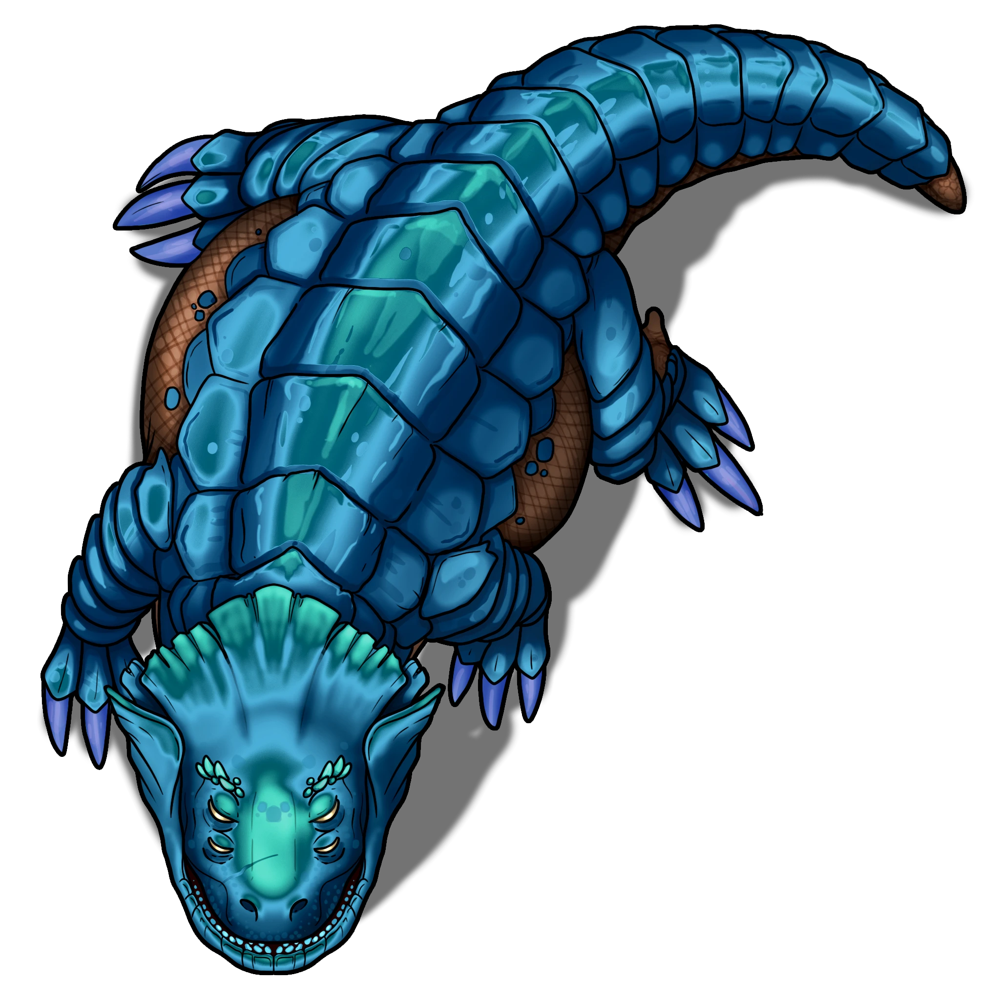

# Rocky Rescue

> [!warning] Gamemaster
> #### Gamemaster's Summary
>
> This combat event sees the party engaging in a skirmish with a band of [[Jurtak]] warriors and hunters who were responsible for kidnapping [[Kern]]'s friend named Kryz. In this event the party will do the following:
>
> - Do battle with a group of Jurtak, possibly getting the drop on them as they agitate a massive [[Baradom]] in its den.
> - Recover Kern's friend "Kryz", which turns out to be a large, once-magical crystal of unknown origin. With it, the party can decide to return it to Kern for info, or keep it for themselves.
> - Receive information from Kern about recent events in the area, and points of interest that may be relevant to the party's investigation in the Pathways.

> [!abstract] Baradom
> **[[Baradom]]**
>
> Level 15 · Baradom Chomper
>
> 
>
> With scales thick as shields, this great beast regards you and the world at large with sleepy and indifferent detachment. Its mouth, alarmingly large and wide, droops open slightly, as though it has no energy to hold it shut. Just beyond its heavy, armored may are rows of massive teeth that look more than capable of rending apart anything they sink into.

> [!abstract] Jurtak Hunter
> **[[Jurtak Hunter]]**
>
> Level 3 · Jurtak Brigand
>
> 
>
> Lurking at the boundary of shadow and light, this lithe saurian creature's six piercing eyes gleam with a dreadful intelligence. At the ready, it cradles a bow lashed together from wood and bone, strung with taut sinews. Adorned in skeletal remnants, it appears equal parts hunter and horror.

> [!abstract] Jurtak Warrior
> **[[Jurtak Warrior]]**
>
> Level 4 · Jurtak Berserker
>
> 
>
> You behold a lean, six-eyed saurian creature, its body clad in fragments of bone and its scales glinting in the dim light. The acrid scent of poison tinges the air, dripping from the bone blade held in its clawed hands. Its long, semi-prehensile tail moves with a predator's anticipation, and a forked tongue flicks across twisted lips as its eyes fix upon you with a predatory malice.

### Examining the Situation

If the party wants to examine the massive Baradom and the Jurtak messing with it, they certainly can. Events won't begin to unfold immediately, so the party has a brief window to size up both sides of the brewing conflict.

> [!tip] Exploration
> #### The Baradom
>
> This is almost certainly "Big Liz" that Kern mentioned, in fact it's probably short for "Big Lizard," which is extremely fitting. This creature is absolutely gargantuan and covered in armor thick enough to ward off siege engines.
>
> A successful **Wilderness (DC 16)** check allows a character to know a bit about the nature of the Baradom based on the result.
>
> - Success. The character knows about the Baradom's **behavior** as provided by the creature's biography section.
> - **Critical Success.** The character knows about the Baradom's **behavior** and **lore** as as provided by the creature's biography section.
>
> Using the **Talent: Wildspeaker** talent allows the caster to communicate with the Baradom. It confirms that it knows Kern, that it is called "Big Liz" by him, and is a she. She prefers to be left alone, but sometimes Kern brings food, so he gets a pass.
>
> #### The Jurtak
>
> Examining the Jurtak before combat begins may yield some insight into them and their tactics. A successful **Wilderness (DC 16)** check allows a character to get a sense for the Jurtak based on the result.
>
> - Success. The character recognizes that the Jurtak are being bold in their actions with the Baradom, but are likely to scatter the moment it moves to defend itself.
> - **Critical Success.** The character has knowledge of the Jurtak's general **behavior** as provided by the creature's biography section.
>
> The Jurtak are curious creatures, sleek, intimidating, monstrous, but still humanoid. Up to this point the party has likely never encountered the Jurtak before, and they remain something of a mystery.
>
> A successful **Society (DC 16)** check allows a character to know a bit about the history of the Jurtak based on the result.
>
> - **Success.** The character knows about the Jurtak have been a growing danger in the Pathways for as long as history has been recorded about the underground passages. They don't really have a society of any kind, no government, no known settlements, no written or spoken language of any kind. They are organized and intelligent however, just utterly hostile to anything in their path.
> - **Critical Success.** There is speculation that they might have been part of a larger society that was partially destroyed in the shattering. These remnants of the original people are completely unwilling to interact with other peoples or cultures in a peaceful way. All attempts to make contact with them as ended in disaster. Why this is remains a mystery.

### Fighting the Jurtak

If the party attacks the Jurtak, or after a few minutes of watching the Jurtak harass the Baradom, it takes offense and begins to defend itself. Narrate the following:

> [!quote] Read Aloud
> Finally having had enough of the prodding and poking, the creature utters a deep, rumbling growl, and begins to shift. Great muscles muscle tense and ripple under its heavy plates as it looms to its full, imposing height. Some of the jurtak fall back, but a few brazen warriors stand their ground, menacing it with spears and lobbing javelins to no effect.
>
> In response the armored beast lunges forward, knocking over one of the jurtak, then spins, whipping the other with a massive tail. Before either jurtak can manage to rise the gargantuan beast crushes one with a slam of its armored head, then snaps up the other in its huge jaws.
>
> The few remaining Jurtak look on warily while the creature chews on the jurtak in its jaws. The sound of the jurtak's bones snapping and crunching echo off the nearby stone. The remaining hunters and warriors hiss at the one digging through the piles of dung, seemingly urging them to work faster.
>
> A moment later there's a joyous hiss as Jurtak pries free a large, ominously glowing crystal. Wiping the muck from the gem the Jurtak holds it aloft for the others to see. As they do this you note that it has... a primitive face painted upon its gleaming surface.
>
> Ankarist lets out a frustrated groan.
>
> > Kryz. As in Kryz-tal. We're saving his pet rock.
>
> The sound of Ankarist's voice causes the remaining Jurtak to turn and fix their many predatory eyes on you. It's at this moment the gargantuan creature charges both the Jurtak and you, sick of interlopers in its den!

> [!danger] Hazard
> #### Encounter Overview
>
> The fight consists of four [[Jurtak Warrior]] and two [[Jurtak Hunter]] and one [[Baradom]]. When the encounter begins, select one of the Jurtak to carry [[Kryz]]. This should be the priority target for the party, since if they escape, so, seemingly does their hope of recovering the crystal.
>
> #### Baradom Tactics
>
> While the Jurtak are immediately hostile, the Baradom is a neutral combatant, only attacking creatures that get within 10 feet of it. It uses its [[Bite]], [[Tail]], and [[Headbutt]] attacks against any creatures that are in reach, and uses its [[Gnash]] on grappled enemies.
>
> Note that the Baradom is immune to most kinds of mundane damage, and very likely cannot be harmed during this fight. It should be treated more as an environmental hazard than a full combatant, attacking any creatures that end their turn too close to it, or which attack it.
>
> #### Jurtak Tactics
>
> The **Jurtak Warriors** fight by hurling their [[Javelin]] before equipping their [[Glaive]] while closing distance. Once in close range they rely on their pikes and the extended reach those pikes grant to full effect. If enemies bunch up they'll use their [[Acid Spit]] to hit multiple enemies.
>
> The **Jurtak Hunters** fight from a distance, using their [[Longbow]] to rain arrows down on foes, ideally from high ground. If engaged in close combat, they will [[Bite]] and [[Claws]] and until they can get free. If it's available, they will use their [[Light Weapon Training]] against foes, especially if cornered or when a nearby enemy appears especially vulnerable to attack.
>
> All Jurtak start combat with their first weapon attack coated in [[Jurtak Poison]]. They reapply it before attacking if they can spare the action to do so, and aren't being engaged by combatants in close range.
>
> If **Broken** or **Weakened** the Jurtak will break and flee. If the Jurtak carrying Kryz is still alive and successfully flees, the party cannot recover the crystal.

If the Jurtak carrying the crystal manages to flee from the battle, narrate the following:

> [!quote] Read Aloud
> With the red crystal raised triumphantly over its head, the Jurtak bolts around the edge of a rocky outcropping, disappearing from view. With it goes any hope of recovering Kern's friend. In the distance there is a faint scuffling sound, and a shriek abruptly cut short. All that remains is to finish up here and find Kern to deliver the bad news.

From this point onward the party's only remaining goal is to defeat the Jurtak.

> [!warning] Gamemaster
> #### Kern Still Wins
>
> Unbeknownst to the party, Kern arrived while they engaged the Jurtak in order to be on hand when Krys was recovered. While the Jurtak prepared to escape, he positioned himself in a place that would require it to flee past him and unceremoniously rendered the Jurtak unconscious as it ran past, reclaiming the crystal.

### Rescuing Kryz

Once the Jurtak are defeated, assuming the the party can recover [[Kryz]], and examine it, as well as examine the dead Jurtak, if they want to.

`[[/outcome rescued]]`

> [!tip] Exploration
> #### Examining Kryz
>
> Kryz is obviously a large crystal with a face painted on it. It is gently glowing with some inner light or energy, and the crystal is warm to the touch.
>
> With a successful **Arcana (DC 17)** check you know that it's not uncommon for crystals to be found that hold magic stemming from Ember itself. This could be a powerful source of magic for the old druid, and why they want it back. Alternatively, it's a vessel for magic, or, maybe more worryingly, a soul. Perhaps Kryz is trapped within?
>
> On a successful **Society (DC 17)** check you know legends and stories tell of powerful crystals from the heart of Ember. These crystals were used to turn mortals into gods. It is possible, albeit slim, that this is one such crystal. This raises perhaps a more concerning notion: is Kern a new shard god?
>
> With a successful **Wilderness (DC 17)** check you know that Ember produces powerful crystals full of life and creation magic strong enough to shape the world and make gods. While there's no way to tell if this is one such crystal, it does seem to match the pattern.
>
> #### Examination Via Magic
>
> - Characters with **Talent: Recognize Spellcraft** can thoroughly examine the crystal during a Rest to determine that while the gem is radiating magic energy of varying kinds, the energy is very weak and has likely long been depleted past the point of worth.
> - Use of **Controlling Sense** or **Soulful Sense** quickly determines that there is no presence of any consciousness within the crystal.
> - Any attempts to use **Talent: Counterspell** automatically fail.
> - A capable **Talent: Enchanting Journeyman** or `[[/talent Compendium.crucible.talent.Item.runeweavingJourn]]` knows that this type of crystal is thousands of years old and holds powerful creation magic from Ember itself. However its potential power is greatly diminished and it is worthless.

Looting the dead Jurtak doesn't yield much. Their weapons, while dangerous, are crude and meant for their hands. Only someone desperate would want to utilize them. They have no monetary value at all.

### Returning To Kern

Returning the Kern is very simple, as Kern will be nearby waiting for them! As far as the party should be able to discern, the old druid simply followed them. How he did so unseen is a question that will remain unanswered, but Kern is immensely powerful, so it would not have been difficult for him.

If the party has not [[Rocky Rescue]] because the Jurtak with the crystal escaped, narrate the following:

> [!quote] Read Aloud
> You spot Kern sitting nearby, safely removed from the skirmish, but still able to watch it. In his hands is a large crystal with a face painted onto its facets. Kern is carefully rubbing the crystal with a piece of cloth, and sitting at the old druid's feel is the body of a Jurtak, the very one that ran off with the crystal.
>
> > It was a good thing I was here, you almost lost Kryz! Luckily we make a very good team, and I used your distraction to execute my expert rescue plan and save Kryz.
> >
> > Shame you didn't save Kryz, because I'd have given you information, and boy-oh-boy do I know things now!

> [!info] Social
> #### Convincing Kern
>
> If the party wants to convince Kern that they helped with the rescue and as a result deserve information, they can do so with either a successful **Diplomacy (DC 14)** or **Deception (DC 14)** check. Doing so causes Kern to treat the party as though they successfully saved and returned Kryz, allowing them to proceed to "Getting Information From Kern."

If the party [[Rocky Rescue]] and chooses to return Kryz to Kern, set the following outcome:

`[[/outcome returned]]`

If the party is stubborn and refuses to return Kryz, Ankarist speaks up:

> [!quote] Read Aloud
> Ankarist pinches the bridge of his nose, his voice and posture betraying his growing frustration with this diversion.
>
> > Can we just hand over the crystal? I don't want to waste any more time arguing with Kern, or wasting our collective time here. I'd rather we hand over the thing and move on. We've got bigger things to deal with, and this diversion has only cost us time.
>
> Kern nods in silent agreement, and gestures for you to hand over Kryz.

> [!info] Social
> #### Keeping Kryz
>
> If the party wants to keep Kryz, they can convince Kern with either a successful **Diplomacy (DC 18)** or **Deception (DC 18)** check. If successful, read the following text:

> [!quote] Read Aloud
> Kern's scraggly, overgrown brow scrunches up in consternation, but after a moment he sighs and says:
>
> > All right, fine, sure, yes, okay, whatever, you can keep Kryz with you. Honestly, some time apart would be good for us. I don't like having freeloaders in my home anyhow, and Kryz certainly isn't doing anything to help there.
> >
> > Just make sure you take good care of Kryz, with daily polishing, and no keeping them in a sack like some common gem. Consider buying a velvet lined box, so they can travel like an uncommon gem!
>
> Kern dabs his eye with a woody knuckle, becoming wistful as he stares at the crystal.
>
> > And you come back and visit, okay?
>
> He look at you.
>
> > You can come back too, though. If you bring Kryz. Now go before I get too sad and lonely and then die from that loneliness and you have to spend all day digging a grave to bury me!

From this point on the party may keep [[Kryz]], and can continue on their way. However, because Kryz was not returned to Kern, he will refuse to share any knowledge he has.

If the party [[Rocky Rescue]] to Kern, narrate the following:

> [!quote] Read Aloud
> Kern throws his hands up, rustling noisily as he does.
>
> > Kryz, you're safe!
>
> Kern's enthusiasm to see his "friend" again dampens sharply when he sees the state of the crystal.
>
> > Oh wow, and covered in crap. Well… it's good to see you again regardless.
>
> He turns his attention to you.
>
> > You have my thanks! I knew you were the right picks to rescue my dear friend! In return I'll tell you what I know. You know, now, not what I didn't know before you saved ole Kryz. Because I didn't know anything then.
> >
> > I do know now, though.
> >
> > Ya know how it is!
>
> Ankarist makes a low, exasperated sound, but says nothing.

### Getting Info from Kern

If the party

From here the party can learn some useful information about the local Mutagists, which Kern calls the "nasties," not to be confused with the "creepies" which are the Jurtak.

> [!quote] Read Aloud
> Kern sits on a rock with a sigh, and rests his walking stick over knobby knees.
>
> > There's a big bunch of nasties living in an hold in the ground. The hole used to belong to other people long ago, but they left, and the nasties just came in and took over.
> >
> > The nasties released those sick snake dragons, too. Or… maybe they escaped? I am not sure, but I am sure that they look like the big dragon that used to live down here. Smaller, of course, but just as mean.
> >
> > Anyway, you want to head into the north-eastern corner of the pathways around here, look for the old hole in the dirt where old people took rocks, but now nasties do their business.

> [!question] Q&A
> **Q:** Who are the nasties?
>
> **A:**
>
> > Don't know. They got all them goggles and bottles and things, and I don't let them see me. They live in the hole where the snake-dragon things are coming from. They are nasty and cruel to creatures here.

> [!question] Q&A
> **Q:** What do you know about the snake dragons?
>
> **A:**
>
> > They looked real sick every time I saw them. All covered in wounds and dripping pus all the time out of bubbles and boils.
>
> Kern wretches slightly.
>
> > Terrible creatures. They always died quickly, which is sad. Seemed like they were in pain the whole time. The Nasties would come and pick up their bodies, drag them back to the hole.
> >
> > At first they died fast, but after a while they took longer to die and didn't seem so sick.

> [!question] Q&A
> **Q:** What do you know about the old dragon?
>
> **A:**
>
> > That one was big, and mean and awful. I don't know anything about it except that it lived in a hole. I always stayed well away from it, and made sure it never saw me. I might be invincible, immortal, and all-powerful, but I don't want to get swallowed alive by a dragon.
> >
> > Anyhow, it eventually left, no idea where it went or why, and I'm just fine with that!

#### Cora Attunement: Returning Kryz

If the party manages to return "Kryz" to Kern, each character advances their **Attunement: Cora (+1)** at the conclusion of the event.

> [!danger] Hazard
> #### Finders Keepers
>
> If the party is stubborn and refuses to part with Kryz, Kern will do all he can to reason and intimidate the party to avoid combat breaking out.
>
> For his part, Ankarist doesn't want to waste any more time arguing with Kern, or wasting their collective time. He'd rather just hand over the crap-caked crystal and call it a day. They've got bigger things to deal with, after all.
>
> If the party ignores this guidance, and gives Kern no other recourse, the druid will bring some very formidable magic and wild shapes to bear on the party. Though he won't kill the party, he's not above beating them unconscious and taking his "friend" if necessary.

#### Aura Attunement: Keeping Kryz

If the party chooses to keep "Kryz" for themselves, each character advances their **Attunement: Aura (+1)** at the conclusion of the event.

### Concluding the Event

> [!warning] Gamemaster
> #### Next Steps
>
> The party now has information enough to go directly to the [[Repurposed Quarry]] that holds the [[Empty Laboratory]] quest event. Though this location is anything but empty when they arrive.
