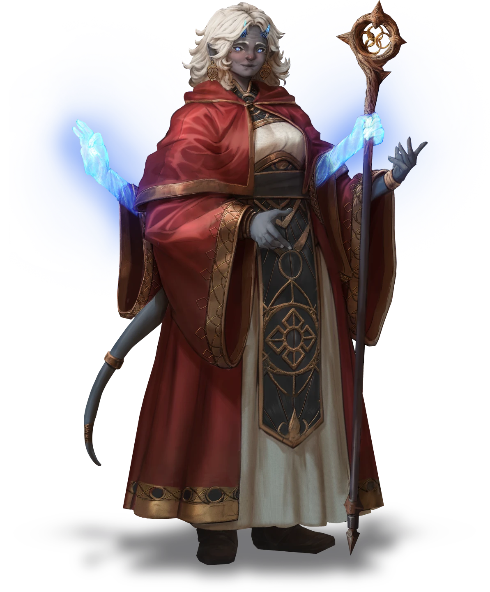
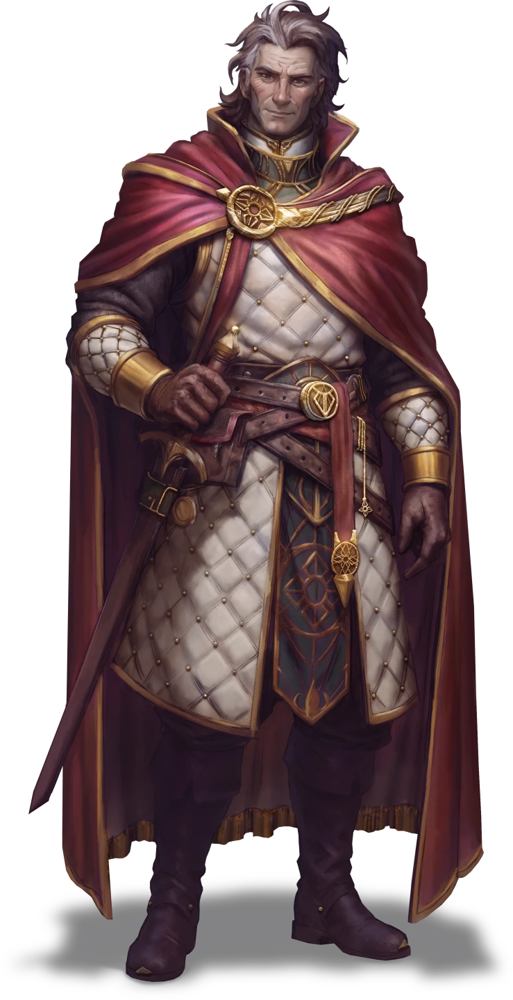

# A Sage Welcome

> [!warning] Gamemaster
> #### Gamemaster's Summary
>
> This Social Event introduces the party to the great [[Cindarin Temple]] of Ordain and its residents (whether they decided to travel alongside Sin Marmot or not). In this event, the characters can:
>
> - Visit the hallowed Cindarin Temple in the heart of [[Ordain]].
> - Meet several influential leaders of the [[Cindaric Sages]], including [[Lilla Arien]] and [[Vinarith]].
> - Witness [[Sin Marmot]] make their formal pledge to join the legendary druidic order.
> - Discuss the various troubles that have been affecting the Arctus Plateau.

### A Reunion with Sin

> [!warning] Gamemaster
> #### Music: Sin's Theme
>
> When the party reunites with Sin, play  **Music: Sin Theme**.

If the party has arrived at Cindarin Temple in Ordain independently of Sin Marmot, they'll encounter each other at this time, as the characters first make their way into the temple's inviting sanctuary. Read the following aloud immediately after you've finished "Setting the Scene."

> [!quote] Read Aloud
> Before you make it very far, the familiar voice of Sin Marmot echoes throughout the sanctuary. You turn to see your Keth friend eagerly bounding from the recesses of the large entry chamber to greet you.
>
> > Well, aren't you all a sight for sore eyes! I'm so glad you made it. This place is amazing. I can't wait for you to meet everyone. So tell me … what did I miss!?

> [!abstract] Sin Marmot
> **[[Sin Marmot]]**
>
> Level 2 · Keth Cindaric Aspirant
>
> 
>
> A Keth with a friendly demeanor and wide blue eyes and a strange half-mask that covers her mouth. She seems to view everything around her with an air of wondrous innocence but her keen glances also suggest the ability to read any given situation quickly and she may be more capable than she appears at first glance.

> [!info] Social
> #### Sin's Journey
>
> The party has a few moments before meeting the Cindaric Sages to catch up with Sin about their respective travels to Ordain. Sin will tell the characters about any events of this quest that they missed — including an encounter with sodden undead at Keeper's Crossing, the plight of the Otherhood-hassled refugees, and the Burnished Hand's investigation of Corpin Sanctuary.
>
> If the characters manage to convey a tale about their own heroism in the face of undead threats (such as during [[A Brush With Death]] et al.), Sin is awarded one point of **Heroic Inspiration** to use as the party (or the Gamemaster) sees fit.
>
> Alternately, if the party has arrived at Cindarin Temple with Sin, the characters can take a moment to discuss the grandeur of the sanctuary and their plans to meet the Sages here before they proceed.

> [!warning] Gamemaster
> #### Music: Default
>
> Once the party has finished this dialogue with Sin, return to the default music:  **Music: Reset**.

### Exploring Cindarin Temple

Once the party has had ample time to catch up with Sin (whether or not they've arrived here at the temple together), they will become acquainted with the leadership of Cindarin Temple.

> [!quote] Read Aloud
> As you linger in the sanctuary's antechamber, you become acutely aware of the enchanted grandeur on display deeper within. Long, sonorous chimes ring out from every corner of the temple, where Cindarics ritualistically meditate over bronze bowls that "sing" as the sages interact with them. Meanwhile, magical light sources — from inkaro lanterns to ever-burning torches — shed their soft amber luminance all about you.
>
> One sage in particular takes note of your group, a spectral-armed Signborn scholar, who saunters over to join you with a cordial greeting.
>
> > Welcome to Corpin Sanctuary, friends. I am Lilla Arien, who some call the Second Sage. What brings you to our most holy abode?

> [!abstract] Lilla Arien
> **[[Lilla Arien]]**
>
> Level 8 (Boss) · Signborn Cindaric Sage
>
> 
>
> A signborn woman with a round, friendly face that belies the stress she carries. Her gray skin contrasts with her bright blue eyes, rosy cheese, and messy head of white hair. Short, pale blue horns curve softly from her forehead. She is clad in the ornate robes of the Cindaric order.

> [!abstract] Vinarith
> **[[Vinarith]]**
>
> Level 12 (Boss) · Human Cindaric Sage
>
> 

> [!info] Social
> #### Meeting the Sages
>
> [[Lilla Arien]] invites the party to join her on a short tour of the Cindarin Temple facility's pubic spaces, culminating in a meeting with the Steward to the Holy Speaker, [[Vinarith]].
>
> Lilla and Vinarith are eager to hear what Sin and the characters have to say about their journey here — particularly when it comes to encounters with undead foes, Otherhood of Fortune agents, and the Sanguinaries of the Bloodwoods.
>
> Any character who succeeds on a **`[[/skill diplomacy 15]]`**check is able to detect a small amount of trepidation in Sin's demeanor, as if the druid is looking for the right time to mention their desire to join the ranks of the Cindaric Sages here.
>
> - If one of the party members speaks for Sin or compels their ally to speak their mind to the Sages, that character gains one point of Heroic Inspiration.
> - Lilla will eventually note Sin's trepidation for herself, and will ask the young Keth what's on their mind.
>
> Once Sin's ambitions have been exposed, the temperament of the Cindaric Sages here shifts from mere hospitality to one of exuberance and support. Lilla Arien shows particular interest in aiding the young druid on her journey, while Vinarith excuses himself to take care of official Cindaric matters.

> [!quote] Read Aloud
> Following the elucidation of Sin's goal to join the Cindarics, a look of pride crosses Lilla Arien's face, marked by a wry smile and tinged with an acute element of curiosity.
>
> > We are fortunate to have such passion for the Heartblood in our midsts. If this compulsion to join the Cindaric Sages has any truth to it, you are certainly most welcome here, young Sin Marmot. Our order could only benefit from the unbridled enthusiasm you display, alongside your riveting evidence of skill (however anecdotal it may be).
>
> Sin is overjoyed with satisfaction, grinning ear to ear as she looks to you for casual approval. Lilla continues, procuring a scroll and quill from her satchel with the enchanted weightlessness of a mage hand spell. The animated quill begins scrawling something on the scroll as the parchment unfurls in front of her.
>
> > If your aim is true, we can begin the proceedings, and foster your initiation three days hence — after you've had ample time to read and comprehend our scriptures. Your friends are welcome to come and go as they please, but our facilities here only provide for our sages and initiates, when it comes to food and lodging.
> >
> > If this is your first time in Ordain, the city's vast amenities should provide a most-welcome distraction from your toils and troubles. This letter of introduction should grant you hospitality when it is most needed.
>
> Lilla's scroll floats towards your party, hovering mid-air for you to grab at your leisure.
>
> > And with that, I have other duties I must attend to. It has been a most sincere pleasure, my new friends. Sin, please make yourself comfortable and one of the other sages will be with you shortly to help you get settled. Good day to you all, and may the light of the Heartblood illuminate your way.

### Sin's Initiation

The party will be invited to return to the temple at a later time, but the characters are dismissed for now. They can continue to explore Ordain while Sin settles in to begin their training.

> [!quote] Read Aloud
> Sin Marmot beams with pride as the Second Sage retreats into the facility to complete her tasks. Your group idles beneath the amber lights of the temple's sanctorum, where a statue of Adonia — the city's founder and the first Holy Speaker — stands proudly in a pose of vigilant benevolence. After a moment, Sin speaks to you with a bittersweet hesitation in their voice.
>
> > I hate to say goodbye again so soon, but it looks like I have a few things to take care of on my own. Have fun in the city! And don't do anything too exciting without me. As thrilling as the next three of days will be, I have to say I'll miss your company. See you on the other side?

### Concluding the Event

With that, the characters must say goodbye to Sin Marmot for the next three days as their druid ally settles in at Cindarin Temple. A summons for Sin's formal initiation is forthcoming, and the party is free to explore Ordain as they see fit in the meantime.

> [!warning] Gamemaster
> #### Milestone
>
> Completing this Event earns the party a [[Milestone Progression]], potentially advancing them in level.
>
> #### Subsequent Quests
>
> This event concludes the "Crumbling Sanctuary" Quest, but Sin's journey will continue during Chapter 3 with the [[Smoldering Cinders]] Quest.
