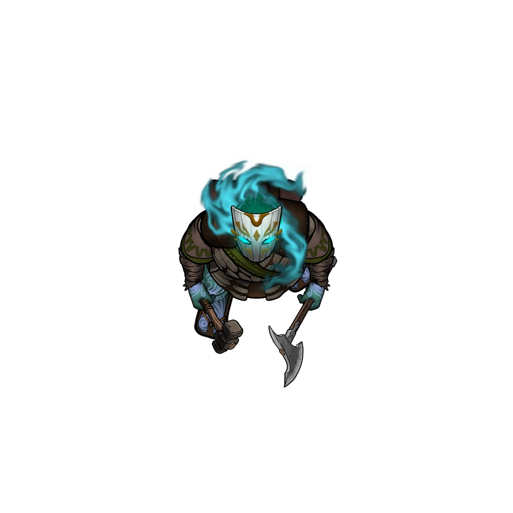
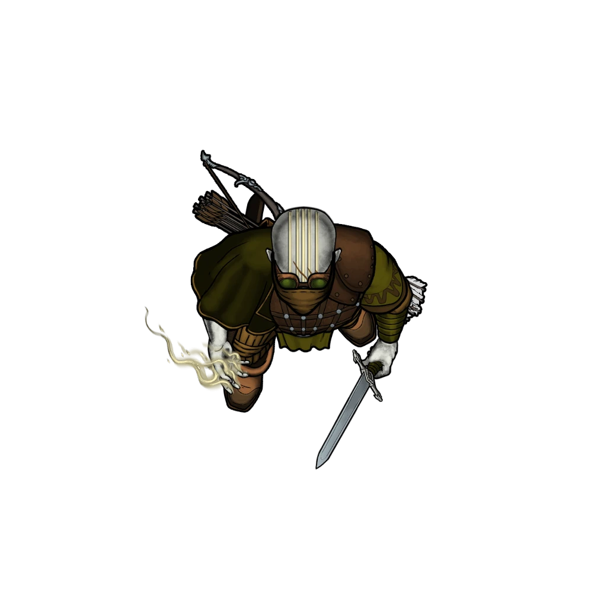

# Ambushed Refugees

> [!warning] Gamemaster
> #### Gamemaster's Summary
>
> In this Combat Event, the party and Sin encounter a beleaguered caravan of refugees who are actively under attack by predatory raiders in the [[Golden Flats]]. In this event, the characters can:
>
> - Join the fray, either defending the refugees or siding with the attackers.
> - Learn the first-hand story of the refugees and their plight.
> - Investigate clues regarding the identity of the attacking raiders.

### Caravan Under attack

The [[Vrjnhar]] warrior who fights among and for the refugees is [[Svala Bronwen]], and she readily identifies the party as allies if they choose to assist. (If they hesitate, she beseeches them for aid).

The enemy raiding party consists of [[Gafto the Howler]], [[Shimz Shimring]], and a cohort of 10 [[Otherhood Raider]]. Combat begins as soon as the encounter starts. Sin Marmot is unwilling to stand aside and let these people die.

> [!warning] Gamemaster
> #### Grouped Initiative
>
> Given the size of this encounter, we recommend you use group initiative for the raiders and refugees, rather than having each raider and refugee enter combat as an individual actor.
>
> When this event triggers, you will find two hidden combatants in the combat tracker, one for the Refugees, and one for the Raiders. When one of these groups have their turn start, resolve the actions of all creatures of that type before moving on.
>
> Svala, Gafto and Shimz all have their own initiatives, as should the characters in the party itself.

> [!abstract] Svala Bronwen
> **[[Svala Bronwen]]**
>
> Level 4 · Vrjnhar Protector
>
> 
>
> The vrjnhar woman is broad shouldered and intensely muscled, carrying herself with a fearless confidence. She sports pale white fur that pours off her chin and turns into a lengthy beard which is split into several braided coils and draped over her shoulders in several places. Each strand is adorned with bronze clasps and rings which contrast richly against her pale hair.
>
> A wickedly sharp looking battle axe is slung across her shoulder, and a heavy wooden shield adorned with ornate, intertwined knots hangs from her hip. What little armor she wears seems to be layers of chain and cloth.

> [!abstract] Gafto the Howler
> **[[Gafto the Howler]]**
>
> Level 2 (Elite) · Zeph Berserker
>
> 
>
> Clad in scraps of golden robes and leather covered in bronze plates, this Zeph raider looks like they've been countless battles and never bothered to replace a single thread of their gear. They carry an axe and hammer in either hand, and threads of pulsating energy crawl up their thick arms in wild patterns only to erupt out of their head in great swirls of mist.

> [!abstract] Shimz Shimring
> **[[Shimz Shimring]]**
>
> Level 2 (Elite) · Altyra Bard
>
> 
>
> Tall, slender, and imposing, this altyran raider holds herself with a confident swagger, and speaks with a resonant voice that vibrates with magic. At hand are her tools: a lyre made of gray wood, a bow with plentiful arrows, and a keen short sword slung from her hip.

> [!abstract] Otherhood Raider
> **[[Otherhood Raider]]**
>
> Level 1 · Human Brigand
>
> 
>
> A lightly-armored, heavily armed fighter wearing golden robes and brown leather armor. They look determined, disciplined and spoiling for a fight.

> [!danger] Hazard
> #### Otherhood Raider Tactics
>
> The Raiders are fairly coordinated, with two leaders (Gafto and Shimz) directing them. Their goal is to surround and subdue or kill the refugees before taking everything they own.
>
> The Raiders prefer attacking from distance, using [[Flaming Arrow]] to deal damage and set the terrain on fire, controlling where people can safely go.
>
> If both Gafto and Shimz are killed , or more than half the raiders are killed or **Broken**, their morale breaks completely and the remaining raiders attempt to flee. If cornered, they throw down their arms and surrender.
>
> #### Gafto's Tactics
>
> Gafto is a violent maniac with little regard for their own safety.
>
> At the beginning of combat on their very first turn Gafto activates [[Berserker]] and relies almost exclusively on making aggressive use of [[Dual Wield]] to pummel opponents with [[Hand Axe]] and [[Claw Hammer]]. Their reckless approach to combat is made somewhat safer by their [[Thick Skin]].
>
> Gafto knows their reckless aggression puts their opponents on edge, and leverages that to shatter the morale of their opponents and back them down using [[Zeph Lineage]].
>
> They have no sense of mercy, and kill anyone that puts up resistance or is too slow to escape their reach. Gafto will not retreat from combat, nor will they surrender.
>
> #### Shimz's Tactics
>
> Shimz is the calm counterbalance to Gafto's rage. A spellcaster first and foremost, Shimz leans on her magic to bolster her allies, especially Gafto, while hindering her opponents. Shimz makes steady use of [[Inspire Heroism]] and [[Extoll Deeds]] to bolster the morale of the raiders and drive Gafto's frenzy, while using [[Bard]] to mock and demoralize their opponents. As opportunities arise, she may use **Illuminated Arrow** to hurl radiant bolts at unsuspecting targets.
>
> Shimz has a greater sense of self-preservation than Gafto. If the fight is beginning to go badly, she'll slip away as quickly as possible, casting [[Invisibility]] at the first opportunity to aid her hasty retreat.
>
> #### Svala's Tactics
>
> Svala is a powerful, fearless warrior that is more than happy to carry her weight in the coming fight. She focuses on keeping the refugees safe when possible, and targets any raiders that look like they'll go after a refugee first.
>
> Svala will not hesitate to insert herself between the refugees and the raiders, making use of [[Intercept]] to close ground and shield them.
>
> In combat Svala relies on engaging with her Battleaxe and makes a dangerous foe due to [[Cadence]], following up on successful hits with a [[Unknown]] to punish her opponents, and will make liberal use of [[Disarming Strike]] to establish tactical superiority. Svala is nothing if not resilient, and will lean on [[Second Wind]] and [[Steadfast]] as needed in order to counteract physical or morale damage as necessary.
>
> If Svala is pressed heavily and finds her reserves of strength taxed, her [[Vrjnhar Lineage]] should keep her supplied with Action Points and let her stay in the fight. Svala is at her most dangerous when pressed in melee combat and surrounded by enemies, making use of the engagement bonus she receives from [[Hold Fast]]
>
> #### Refugee Reactions
>
> The refugees are all [[Arcturian]], unarmed, and unwilling to fight.
>
> At the end of each round, all refugees not engaged in combat will do their best to flee, expending all their available action points on movement. If they are engaged or would be attacked as part of their movement or if they are cornered, they will make use of the Defend action in order to gain what meagre protection they can. Once they realise that Svala and the Party are trying to protect them, they will try to take paths that use their valiant protectors to give them safe passage away from the raiders.

In the aftermath of battle there is time for investigation.

#### Heart Attunement: Refugees Saved

If the party manages to successfully save all of the refugees, advance each character's **Attunement: Heart of Ember (+1)** at the conclusion of the Event.

#### Abyss Attunement: Refugees Slain

If the party allows the refugees to die at the hands of the raiders, advance each character's **Attunement: The Abyss (+1)** at the conclusion of the Event.

### Interrogating the Raiders

If any of the raiders were captured alive they can be interrogated.

> [!info] Social
> #### Resentful Raiders
>
> If the party manages to capture any raiders alive, they can be interrogated for information. They inherently don't want to die, and are willing to cooperate if there is a chance they will survive. A successful **Intimidation (DC 14)** or **Diplomacy (DC 18)** check is sufficient to convince them to talk.
>
> A successful **Deception (DC 14)**check determines they are absolutely earnest, and have a genuine contempt for the Ordinate.
>
> **Culture: Ordani** characters or those who have **Knowledge: Trade** or **Knowledge: Politics** understand that the [[Otherhood of Fortune]] is a violent political movement full of radicals, who believe that the [[Ordinate]] and Trading Houses are utterly corrupt and need to be torn down. It's not precisely known who leads them, and their numbers have been growing over the last few months.
>
> Characters with **Knowledge: Crime** or **Knowledge: Trade** know that these Otherhood Raiders have been growing bolder by the week, raiding travelers, trade caravans, even attacking settlements (like Helkas). They are always unpredictable in terms of methods and brutality, but they are becoming more and more widespread.
>
> #### Under the Surface
>
> Characters using [[Telecognition]] while questioning the raiders can glean additional insights from the minds of the raiders.
>
> - When the **Queen of Scales** is mentioned, you get a flash of a market, and an ominously tall drakon or ashka figure.
> - When the **Captain** is mentioned, you get a flash of a larger than life, heroic, humanoid sea captain with white hair.
> - When asked about their base of operations, you get images of a large city on the coast, and it's certainly not Ordain.
>
> #### The Dead Tell No Tales
>
> If the party didn't manage to capture any raiders, but wants to use some manner of **Talent: Rune: Soul** magic to question the corpses can learn the information above. Using this magic in front of Svala and the refugees unsettles them greatly as necromancy is broadly feared and reviled.

> [!question] Q&A
> **Q:** About Raiding.
>
> **A:**
>
> > Refugees have been coming through for a while, we jump them, rob them. If they put up a fight, well, we kill a couple until the fight leaves them. Easy pickings, hardly any danger to us until today.
> >
> > Need money to survive, right? That simple. Besides, a revolution takes money. The Queen of Scales sets expectations, and the Captain gets irate if we fall short for too long. Gotta keep everyone happy so we don't lose our heads.

> [!question] Q&A
> **Q:** About the Queen of Scales.
>
> **A:**
>
> > They are the heads of the fight against the Ordinate. You won't get anything else from me. I won't help the Ordinate or their dogs.

> [!question] Q&A
> **Q:** About the Revolution.
>
> **A:**
>
> > The corrupt leadership of the Ordinate and their secret police ruin the lives of common folk, and we're exposing the truth that the people of the plateau aren't actually safe. The government doesn't care about them, and it can't stop us!

### Talking with the Refugees

If any of the refugees survived, the party can talk with them.

> [!tip] Exploration
> #### Tending the Wounded
>
> If the refugees survive the combat, they likely have wounded and ill, many already in a poor state before the attack. The party can treat them with a successful **Medicine (DC 13)** check and some time. Magic that heals or removes disease works as well, and a few casts will handle most of the ill or injured.
>
> The refugees have nothing to give in return but their gratitude.

> [!info] Social
> #### Rescued Refugees
>
> If the party speaks with any surviving Arcturian refugees, the characters can learn a few rumors about various dangers on the road that have mounted over the last few weeks:
>
> - These weren't the first bandits the small caravan has spotted on or off the road, but they managed to avoid detection before now.
> - Several villages and homesteads across the Plateau are dealing with their own calamities, whether manmade, natural, or worse.
>
> A successful **Deception (DC 14, Passive)** check against the refugees leads you to believe that they are earnest about their troubles.

> [!question] Q&A
> **Q:** About Refugee Origins
>
> **A:**
>
> > Several of us hail from Skybrush, in the Rustvar Valleys, and others joined along the way. A few homesteads and farms, where times were tougher than usual. We've been making our way east for days now, a bit aimlessly I have to admit.

> [!question] Q&A
> **Q:** About Refugee Options
>
> **A:**
>
> There is a distinct uncertainty among the survivors and where they might go. One speaks up, voicing their options:
>
> > Well, Nain would be safest but the Corpin Sanctuary might be closer, but there's no promise of help there if the rumors are true. We could also head for the Oldcraft Lodge, but the roads aren't getting any safer and there's no guarantee we'd even get halfway there given how things have been going so far.
>
> In response to this Sin becomes visibly confused and incredulous, quickly snapping back:
>
> > What? That's impossible, the Sages work to help the people of the plateau both physically and spiritually. Why would you not get help from them at their Sanctuary?
> >
> > You should absolutely make your way there, they'll help you!
>
> The refugees seem unconvinced, and the one that speaking for the group shrugs, saying:
>
> > Maybe they would, but we know what we've heard. They are apparently turning people away from the Sanctuary, and that doesn't surprise us much. Support from the Sages has been thin outside of Ordain lately. Seems like they've got their own problems and we're no longer worth they time. Maybe we ought to head for Nain…

> [!info] Social
> #### Directing the Refugees
>
> Any character that makes a successful **Diplomacy (DC 15)**check can convince the refugees to go to [[Nain]], [[Corpin Sanctuary]], or [[Oldcraft Lodge]].

### Concluding the Event

> [!warning] Gamemaster
> #### Event Outcomes
>
> If the refugees were killed, record the **Refugees Slain** outcome as having occurred. Otherwise, record the event outcome that most closely matches what the survivors plan to do next.
>
> #### Next Steps
>
> After rescuing the refugees, joining the raiders, or simply watching events unfold the party and Sin can continue on their journey towards Corpin Sanctuary and the [[Corpin Arrival]] event.
