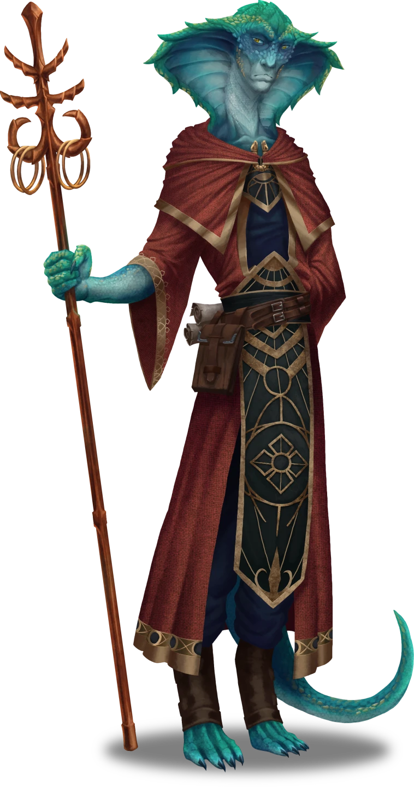

# Corpin Arrival

> [!warning] Gamemaster
> #### Gamemaster's Summary
>
> This Social Event details the party's arrival at [[Corpin Sanctuary]], a mountainside enclave of the [[Cindaric Sages]]. They're welcomed by its leader, [[Mira Wavehorn]], and have an opportunity to meet and discuss current events with various other characters at the sanctuary. In this event, the characters can:
>
> - Chat with Mira Wavehorn and debrief her on the attack at Helkas.
> - Share a meal with the Cindaric Sages and meet an enigmatic visitor to the Sanctuary named [[Avwynn Taol]].
> - Participate in an evening ceremony led by another sage named [[Evesso]].
> - Be provided with [[Dormitory]] rooms where they may stay overnight.
> - Heed the call to adventure after a mysterious note is slipped beneath their dormitory door.
>
> #### Area Walkthrough
>
> This event takes place on the Corpin Sanctuary area map, and much of its gameplay is linked to locations in the [[Corpin Sanctuary]] area walkthrough, which describes all of the individual locations which can be explored inside the area map.
>
> During this particular event, the party shouldn't be permitted to freely explore the sanctuary. Instead, they're guided to specific locations by their hosts, in the order described below. The party will have adequate opportunity to freely explore the area in the subsequent event, [[Corpin Investigation]].

## A Welcome Respite

The party arrives at Corpin Sanctuary, an enclave of the Cindaric Sages nestled in the crags of Mial Mountain, situated a day's travel west of Ordain. The party is welcomed in the [[Entry Courtyard]] by the enclave's leader, Mira Wavehorn.

> [!abstract] Mira Wavehorn
> **[[Mira Wavehorn]]**
>
> Level 6 (Elite) · Kiska Cindaric Sage
>
> 
>
> The aloof countenance of this Kiska femme is belied by her jocular smile, a disarming grin on the edge of inquisitiveness. Clad in the red robes of a Cindaric Sage and a light Cascilian breastplate, she appears ready for action despite her calm nature. Your instincts tell you that somewhere inside this gentile sage beats the fierce heart of a fellow adventurer.

> [!info] Social
> #### Meeting Mira
>
> Mira ambles with the party in the Entry Courtyard with a desire for them to explain their visit in adequate detail, and isn't afraid to use small talk to coax information out of them. Topics that Mira is quick to bring up in conversation while meeting the party include:
>
> - The party's background and any affiliations they might have.
> - A brief history of Corpin Sanctuary and the Cindaric order itself.
> - The mission of Corpin Sanctuary as a refuge for lost and displaced peoples, which has been impacted and hampered by recent events.
>
> A successful **Diplomacy (DC 13)** check indicates that Mira is scrutinizing whether or not the party are refugees themselves, and is apprehensive of those who might take unsavory advantage of the Sanctuary's graces.
>
> Any character who succeeds on a **Society (DC 14)** check is familiar with Mira's role and responsibilities as a Cindaric Sage and the leader of Corpin Sanctuary.
>
> - **Path: CindaricAdherent**: The character gains **+2 Boons**.
>
> If the characters ask Mira for shelter at the Sanctuary (or a reward for their intel from the encounters at Helkas and Keeper's Crossing), one of them must succeed on a **Diplomacy (DC 13)** check with the following possible results:
>
> - **Success**: Mira is willing to offer the party room and board for a night or two as they rest up and decide their next course of action. Mira is also happy to offer the party a modest reward for their findings, in the form of a  **1** per character, taken from the Sanctuary's tithe box.
>   - **Critical Success**: Mira takes the party's accounts of their undead encounters very seriously, and also provides them with a [[Healing Elixir]] to assist with any similar encounters in the future.
>
> If the characters fail to persuade Mira, Sin eventually steps forward and shares professes their own dream to join the Cindaric Sages. Mira's opinion of the party softens, and she invites Sin and the party to stay for the evening (if not longer). Additional dialogue options with Mira are listed below.

> [!question] Q&A
> **Q:** About Corpin Sanctuary?
>
> **A:**
>
> > Corpin Sanctuary was built long ago to establish a satellite location for Cindaric initiatives, removed from the commotion of urban life in Ordain. The people of the Golden Flats and beyond are always in deserving need of charity, and — out here on the mountain, in our quiet little enclave — we pride ourselves on a more … intimate connection with Ember through the land itself. But we do share the same goals as our cohorts in Ordain. We're just a bit more rustic.

> [!question] Q&A
> **Q:** Regarding the Undead?
>
> **A:**
>
> > Make no mistake, these undead creatures you speak of suggest a greater threat to the natural order of Ember and the sacred heartblood that flows within it. The Soul Cycle is the wheel upon which our very cosmos turns, and these threats of restless souls and abyssal incursions are most troubling. Worse yet, you aren't the first allies of the Cindaric order to share word of these kinds of calamities. And I fear you won't be the last.

## A Warm Meal

After meeting with Mira, the party is ushered into the [[Refectory]] where they can join some of the other sages and visitors in a meal. The characters are invited to sit at a table with a Maziran scholar who is also visiting the sanctuary, who introduces herself as "Av". This is Avwynn Taol, the leader of the mysterious [[Sanguinaries]], who takes great effort to keep her identity a secret at this time.

> [!quote] Read Aloud
> As Mira ushers you into the refectory, you can't help but notice another outsider seated here, a gregarious femme clad in the robes of a Maziran scholar. She smiles to greet you as one of the sages saunters over with a basket of knotted bread, its golden crust adorned with candied currants and aromatic spices. Another sage waltzes in and briskly sets enough places for all of you to join this stranger at the table, where a kettle of hot tea and a pitcher of fresh-squeezed pomegranate juice sit ready to quench your thirst.

> [!abstract] Avwynn Taol
> **[[Avwynn Taol]]**
>
> Level 12 (Boss) · Human Mystic
>
> 
>
> Tall, regal, and confident, this human woman carries herself with certainty and exudes a powerful confidence back with a steely, unwavering calm. Her icy blue eyes glimmer sharply against black sclera, betraying some hint of non-human ancestry, or perhaps magical twisting in her blood.

> [!info] Social
> #### Meeting Avwynn
>
> As the party sits down to a meal with Avwynn, she will regale them with anecdotes about her youth in Mazira and her exploits throughout the Arctus Plateau. Her methods of storytelling and overall demeanor lend an air of mystery, even slight mistrust. Subjects of this conversation with Avwynn include:
>
> - Her immigration to Ordain via the ship of an Akazean freebooter named Captain Kree.
> - Her family's history as esteemed Spirit Sages of Lunarai.
> - The tale of a Cor'ak sorcerer king who owes her a life debt.
>
> Any character who succeeds on a **Society (DC 13)** check recognizes some of the historical references that Avwynn mentions during her screed.
>
> - They're familiar with Maziran Spirit Sages and their pivotal role in conflicts with the Tayan Empire.
> - They're learned in the history of the Maziran Kingdoms and their Cor'ak origins.
>
> Any character who succeeds on a **Arcana (DC 15)** check recognizes some of the arcane references that Avwynn mentions throughout the conversation.
>
> - The aptly named Spirit Sages of Mazira are known for their ability to commune with the dead.
> - Cor'ak descendents of the early Mazirans were known to dabble in the study of eldritch magic.
>
> Meanwhile, characters who succeed on a **Deception (DC 14)** check can sense that Avwynn is not being entirely forthcoming about her travel or reasons for being at Corpin Sanctuary.
>
> Additional dialogue options with Avwynn are listed below.

> [!question] Q&A
> **Q:** Avwynn's History with Arcane Magic:
>
> **A:**
>
> > Indeed, I was born with a natural talent for sorcery. But the primal magic that flows through Ember's heartblood is the true language of my soul. I am merely the latest in a proud dynasty of spellcasters, and — like my ancestors before me — I let the spirits guide me. Yet, the spirit that guides me is the spirit of Ember itself.

> [!question] Q&A
> **Q:** Avwynn's Thoughts on Corpin Sanctuary:
>
> **A:**
>
> > Although it lacks the refinement of the Cindarin Temple in Ordain, the Sanctuary certainly has its charms. In fact, I do prefer the open mountain air and the steady earth at my feet. And after all, a building is just a building. Ember provides for those that hold its promise.

## Evening Ceremony

After the meal, the entire group of sages here escorts the party members up the [[Cliffside Path]] to the [[Sanctorum Entrance]] and into the [[Sanctorum]]. Within the Sanctorum, the group observes an evening ritual led by [[Evesso]], one of Corpin Sanctuary's senior sages. Avwynn Taol stays behind to languidly continue her meal before retiring to her chamber.

Evesso is, in fact, a malevolent necromancer in disguise, whose insidious plans involve a secret elevator beneath the Sanctorum. This plot will advance during the [[Corpin Investigation]] event, but Evesso's ruse is rather effective for now.

> [!abstract] Evesso
> **[[Evesso]]**
>
> Level 6 (Elite) · Ashka Necromancer
>
> 
>
> This tall Ashka scholar is draped in the burgundy robes of a Cindaric Sage. His viridian-scaled form is lean and austere, and his countenance betrays an erudite contrition. Surely, this scholar is an accomplished practitioner of the Cindaric arts, if the age of his blue-green squama and the patina of his weathered staff are any indication.

> [!quote] Read Aloud
> As you make your way into the large Sanctorum, you quickly take note of an eccentric Cindaric standing on the dais who appears to be leading this evening's ceremonial communion. He holds a crystal reliquary hewn from a solid piece of quartz with rough, natural edges, whose interior glows with soft amber brilliance.
>
> Each of the other sages takes their place on the blanketed floor, seated cross-legged as if for meditation. Sin Marmot takes their place alongside Mira, and offers you an inviting look to do the same. The Cindaric on the dais speaks …
>
> > Welcome, sages and siblings alike, to this most honorable occasion. Tonight, we witness the end of one cycle and the beginning of another.
>
> The other Cindaric sages around you begin chanting a low and soft phrase you can't quite distinguish, as if spoken in a primordial tongue from the dawn of time.

> [!info] Social
> #### The Cindaric Ritual
>
> Any character who wants to participate in the ceremony can do so with a successful**Society (DC 14)** or **Performance (DC 16)** check.
>
> - **Knowledge: Rituals**: The character gains **+2 Boons**.
> - **Knowledge: Souls**: The character gains **+2 Boons**.
>
> Characters who participate in the ceremony gain one point of Heart Attunement, as described below.
>
> Any character who make a successful **Deception (DC 14)** check can sense that Evesso is hiding something, and that the way he conducts the ceremony has an air of disingenuous performance to it.
>
> - **Critical Success**: The character can sense a hint of curiosity in Evesso's glances towards the party members and Sin, particularly towards any allies that happen to be arcane or divine spellcasters.

> [!quote] Read Aloud
> After a moment, Evesso continues.
>
> > These sacred pyreflies have completed their last lunar cycle. They have lived, propagated, and now gather here to make their own journey into the beyond. We take these creatures into our souls, renumeration for the absence of their own. The heartblood beats eternal.
>
> The sages continue their chant as the speaker opens the lid of the crystal reliquary. As he does, a luminous host of a dozen aged pyreflies slowly drifts from the vessel and into the open air of the Sanctorum. Each of these tiny bioluminescent insects floats towards one of the sages, as if drawn to the chant. With hands cupped to cradle a pyrefly as it lands, the sages finish their chant as the light of each pyrefly slowly fades.
>
> Seated next to you, Mira speaks as she regards the deceased pyrefly in her palm.
>
> > I witness your passing, and honor your essence.
>
> To your surprise, she ingests the dead pyrefly with a solemn and deliberate swallow. The other sages follow suit, speaking the same phrase before swallowing their own pyrefly. Mira looks to you with a smile, and Sin holds her cupped hands out in wistful anticipation.

Whether or not the characters participate in the ceremony themselves, Evesso concludes the event as he consumes his own pyrefly. The congregation is left to indulge in idle chat and meditation.

#### Heart Attunement: Ritual Participants

Each character who successfully participates in the Cindaric ritual advances their **Attunement: Heart of Ember (+1)** at the conclusion of the Event.

## A Place to Rest

Once the evening ceremony has concluded, a Cindaric Sage escorts Sin and the party to the dormitories and provides them with two [[Empty Dormitory]] chambers which they can share. The characters can choose between themselves how to divide the two rooms.

As the party settles in to rest, a shift in the narrative occurs when a note to Sin is slid beneath the door by an unseen stranger. Characters in the same room with Sin are the first to notice the note. When the moment is right, read the following aloud:

> [!quote] Read Aloud
> Just then, you see a small piece of folded parchment slide beneath the dormitory door. Even from here, you can see the handwritten text inked upon its top fold:
>
> > To: Initiate Marmot.
> > For your eyes only.

> [!tip] Exploration
> #### A Passed Note
>
> As the party is preparing to rest for the evening, a mysterious [[Note to Sin]] is slipped beneath the door of the dormitory where Sin lodges.
>
> The note's interior reads:
>
> > Heed my words, for they are astoundingly true. There is a necromancer lurking among the sages here at Corpin Sanctuary. As outsiders, it seems you and your party are the most capable to investigate this dangerous affair. Most importantly, your intentions here seem noble and just.
> >
> > Please, rid the Sanctuary of this invader, for all our sakes. And be careful to avoid suspicion — the eyes of the necromancer are everywhere.
>
> The note is written anonymously and conveys the accusation that there is a necromancer lurking among the sages at Corpin Sanctuary. As outsiders with seemingly noble intentions, the author of this note wishes for the party to closely investigate the sanctuary and its sages.
>
> Any character who wishes to scrutinize the note can do so, and notices the following with a successful **Awareness (DC 11)** check:
>
> - The handwriting is unfamiliar to everyone in the party.
> - The ink is remarkably fresh.
>
> If the characters open the door to look for whomever might have left the note, there is no sign of them, nor can any footsteps he be heard retreating from the empty corridor.
>
> If a character attempts to use magic to identify the letter's owner, their effort falls short. Unbeknownst to the party, the original owner of the letter (Avwynn Taol) is protected against magical divination.

After receiving this note, Sin wishes to confer with the party.

> [!info] Social
> #### Sin's Suspicions
>
> Sin Marmot is relatively unfamiliar with the actual practice of necromancy, and solicits the characters for conversation about the note's revelation and whether or not it has ties to their previous encounters with undead. Sin is also eager to discuss:
>
> - Who could possibly be a suspect, based on the people the party has met since arriving — including the Cindaric Sages and visitors alike.
> - The relationship of Corpin Sanctuary to the Cindaric Temple in Ordain, and what kinds of strains might currently be affecting it.
> - Her trust in the Cindaric Sages as an organization, and the honest desire to keep the charitable order safe from those who might befoul it.
>
> After some discussion about their collective thoughts and suspicions, Sin establishes a plan with the party to begin an investigation in the morning following a vigilant Rest.

### Concluding the Event

> [!warning] Gamemaster
> #### Milestone Point
>
> Completing this event earns the party a [[Milestone Progression]], potentially advancing them in level.
>
> #### Next Steps
>
> Once the party is ready to rest, mark this event as complete. Perform a long rest or Advance Time to trigger the subsequent event [[Corpin Investigation]].
