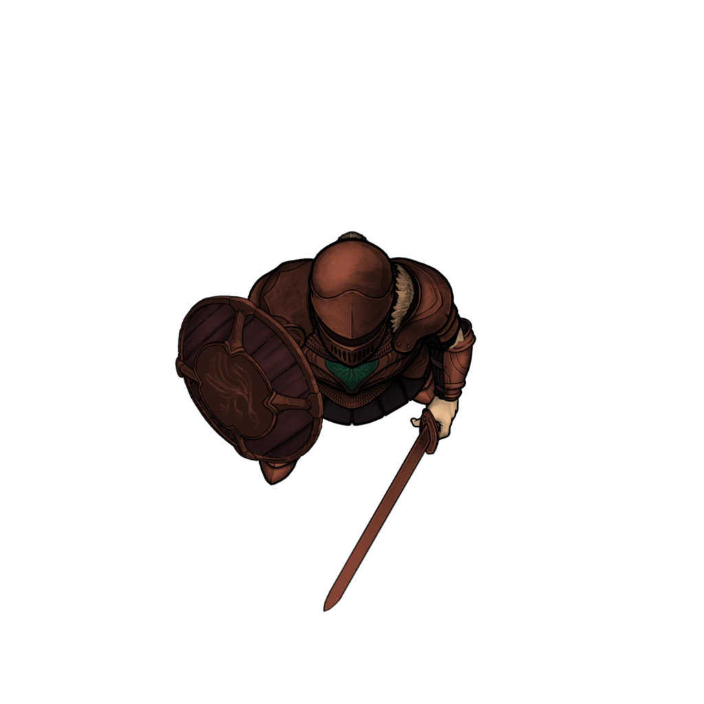
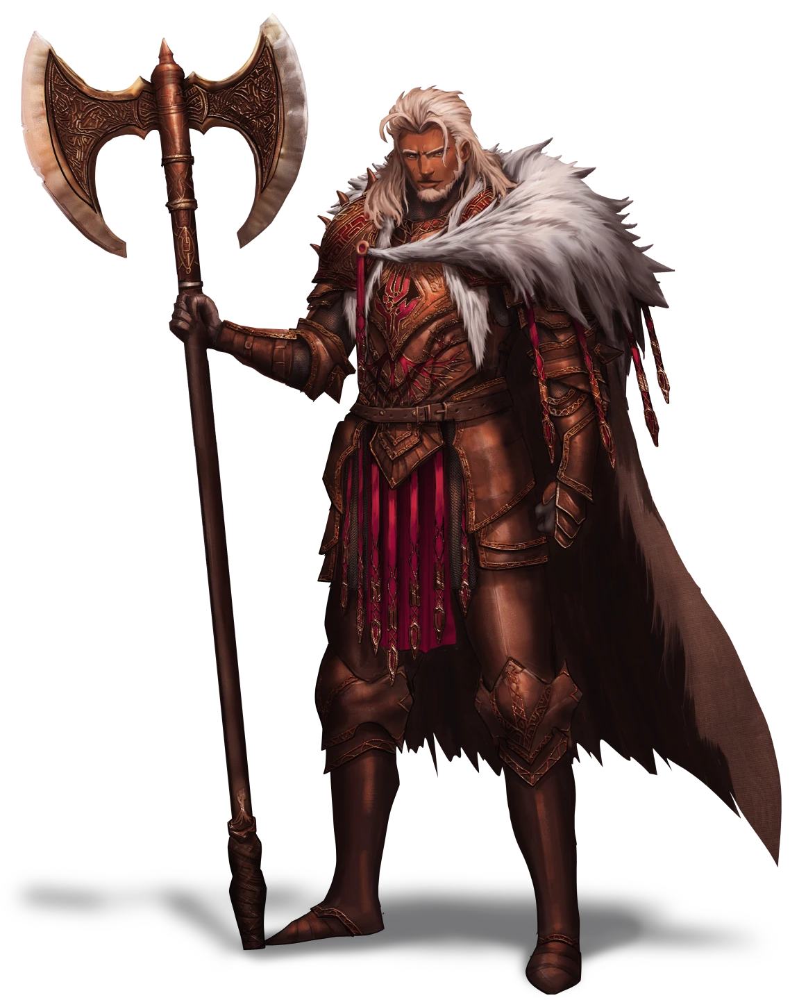

# Corpin Condemned

> [!warning] Gamemaster
> #### Gamemaster's Summary
>
> This Social Event introduces the party to [[Steros Kraver]] the commander of the Burnished Hand, who has arrived at Corpin Sanctuary to issue an edict of condemnation against the monastery's sages. In this event, the characters can:
>
> - Learn about the [[Burnished Hand]] and their accusations.
> - Discuss the matter with Steros Kraver, [[Mira Wavehorn]], and others.
> - Provide evidence to Steros that either implicates or exonerates both Mira Wavehorn and the Sanguinary [[Avwynn Taol]].
> - Choose to side with either Steros or with Mira, who will present the party with a duly-earned reward for their efforts.

### The Burnished Hand Arrives

As the party investigates the sounds of war horn and marching feet, they encounter a platoon of well-armed soldiers — two dozen Burnished Hand Protectors, led by the warrior Steros Kraver. At the behest of the Holy Speaker, these militant protectors have arrived from Ordain to take command of Corpin Sanctuary, with or without Mira Wavehorn's cooperation.

> [!quote] Read Aloud
> You arrive at the Sanctuary gates to witness the imminent arrival of a small war force of well-armed soldiers, clad in heavy bronze mail polished brighter than the sun. The crest on their shield bears the somewhat familiar image of a symmetrical crimson hand with roots like a mighty oak. A handsome white-haired warrior with a mighty greataxe leads this stalwart platoon. He surveys the Sanctuary from afar with an air of contempt and disappointment.

> [!abstract] Burnished Hand Protector
> **[[Burnished Hand Protector]]**
>
> Level 5 · Human Protector
>
> 
>
> You regard a heavily-armored Ordani warrior, whose bronze splint mail gleams with a gorgeous russet luster. A symmetrical crimson hand with the roots of an oak tree decorates this soldier's chest piece, and the well-oiled longsword at their side looks poised and ready for action.

> [!abstract] Steros Kraver
> **[[Steros Kraver]]**
>
> Level 8 (Boss) · Human Fighter
>
> 
>
> This remarkably spruce warrior is clad in an impressive suit of aged bronze armor. The etching of a symmetrical crimson hand with roots like an ancient oak is emblazoned on the breast piece, and a lavish fur cloak is draped upon the matching pauldrons. A shock of long white hair frames this bearded soldier's handsome face, which is decorated with utter discernment. He wields a mighty greataxe as tall as he is, and equally as deadly.

> [!tip] Exploration
> #### Enclosing Hand
>
> If the party members wish to determine how familiar they are with the [[Burnished Hand]] and their historical ties to the [[Cindaric Sages]], the following skill checks can provide some perspective on what they know:
>
> **Society (DC 13)** The character has knowledge of the Burnished Hand's history as protectors of the Cindaric Sages, and that they both have significant holdings in [[Ordain]], such as their residence at the Rusted Fortress on [[Bura Island]], and their adherence to ritualistic [[Oaken]] technique. Early generations of the Burnished Hand included [[Vrjnhar]] warriors and clerics amongst their ranks.
>
> - **Critical Success**: The white-haired warrior that leads this group is known as Steros Kraver, and his reputation with his greataxe is nearly as large as the massive axe itself.
>
> With a successful **Awareness (DC 13, Passive)** a character can easily intuit that these soldiers are aggressively prepared for conflict, and maintain a battle-readiness despite the current lack of an immediate threat. The leader in particular seems poised to deliver some kind of order or proclamation. It's apparent that some of the soldiers are ready for a fight, as evident by the hands on their sword hilts and the alacrity of their battle formation.
>
> - **Path: Cindaric Initiate**: The character gains **+2 Boons**, and also possess a basic understanding about the role the Burnished Hand plays in lending protective aid to the Cindarics during times of war and natural disaster.
>
> Characters with **Knowledge: Crafts** or **Knowledge: Warfare** can readily take note of the vintage quality and elaborate craftsmanship on display with the arms and armor of these soldiers. There is a distinct non-Arcturian aspect to the designs and adornments of the bronze armor, which seems to hail from a different continent during a previous age — perhaps Oaken in origin.

If the party fails to identify the Burnished Hand and is completely ignorant of their role, Sin Marmot may offer some insight of their own:

> [!quote] Read Aloud
> Sin whispers beneath their mask.
>
> > The Burnished Hand! From what I know, they protect the Sages in times of trouble … but we already handled things here. Better late than never, I guess …

Once the party has had ample time to survey the approaching battle force of Burnished Hand soldiers, these militant interlopers close the distance to arrive at the [[Entry Courtyard]], where they gather in eager anticipation. Steros Kraver steps forward to address the Sages and their guests:

> [!quote] Read Aloud
> The soldiers arrive at the rocky promontory that adjoins the Sanctuary courtyard, where they congregate in formation. Their white-haired leader steps forward with determination as he procures a scroll from a satchel at his side. He unfurls the parchment and begins to read its proclamation aloud:
>
> > By order of the Holy Speaker of Ordain, Corpin Sanctuary and its custodians have hereby been accused of the following transgressions … dereliction of duty, gross negligence of the needy and afflicted, the instigation of dissent against Cindarin Temple, and the provision of safe harbor for necromancy.
> >
> > Mira Wavehorn, as the leader of Corpin Sanctuary, how do you answer for these misdeeds?
>
> Mira shrugs off the trepidation of the other Corpin sages and strides forward to meet the white-haired warrior. They exchange heated words, which you struggle to make out against the incessant howl of morning mountain wind.

> [!info] Social
> #### Proclaimed Condemnation
>
> The party can attempt to listen in on Mira's conversation with Steros, but any attempts to join in at the moment are first met with trepidation from Mira, who politely turns the characters away with a simple gesture and a shake of her head.
>
> Any character that makes a successful **Diplomacy (DC 13)** check is able to recognize the heavy tone of the conversation, including an unmistakable air of stern officiousness that surrounds Steros. Mira stands resolute in her defense of the Sanctuary, emphatic and hopefully defiant as she explains the situation at Corpin to the militant interloper.
>
> A successful **Awareness (DC 13)** allows characters to hear some aspects of the muted conversation, including the following details:
>
> - The Holy Speaker's disappointment with the current state of affairs, and a condemnation of Mira's abilities as a leader.
> - A brief interrogation about what transpired here, and how the undead gained access to the Sanctuary.
> - Mira's explanation about what happened.
> - Mira's defense of the Sanctuary and her gratitude for the timely arrival of the party to Corpin.
>
> Any character who casts [[Telecognition]] to read Steros or Mira's mind is able to discern this information as their surface thoughts. Deeper probing reveals the following:
>
> - Mira's emotional state is a mix of worry and self-doubt, and the very fate of Corpin Sanctuary looms large in her mind.
> - Steros' emotional state is full of concern and hesitation, and the purported tombs below the Sanctuary loom large in his mind, along with the stern edicts of the Holy Speaker.

### An Interview with Steros

After the conversation with Mira, Steros requests to meet the party to interview them about what happened here at Corpin Sanctuary. The party can choose to either hide or reveal this information as they see fit, including what they know about Mira Wavehorn and the Sanguinary Avwynn Taol.

> [!quote] Read Aloud
> After a moment of conversation, Mira lowers her head in defeat, noticeably shaken by this unforeseen encounter. The white-haried warrior glances your way with equal measures of suspicion and curiosity before he strides confidently to meet you.
>
> > I understand you played a pivotal role in what happened here. My name is Steros Kraver, of the Burnished Hand. By edict of the Holy Speaker of Ordain, I have some questions for your party that need answers. Good answers.

> [!info] Social
> #### Meeting Steros
>
> Steros solicits the party for answers, which can easily result in an interrogation rather than a conversation (depending on how the characters handle it). Steros is initially somewhat hostile to the group, and will only soften his attitude at the party's behest. Success on the following social skill checks can affect the warrior's disposition towards the characters:
>
> - **Deception (DC 13)**The character is able to deceive Steros into believing that their agenda (whatever it may be) is allied with the aims of the Burnished Hand.
> - **Intimidation (DC 13)** Steros is impressed by the character's brash demonstration of authority and confidence.
> - **Diplomacy (DC 13)** The character appeals successfully to Steros' curiosity and righteous code of ethics.
>
> Additionally, use of [[Telecognition]] reveals that Steros' emotional state has shifted from concern and hesitation to curiosity. Meanwhile, the purported tombs below the Sanctuary loom large in his mind, along with the stern edicts of the Holy Speaker, and the possible motives of the party members themselves.
>
> - **Magical Insights**: Any character who successfully probes Steros' mind gains **+2 Boons** on the skill checks listed above.
>
> #### Kraver's Inquest
>
> Steros has three main questions for the party, which they can answer with either the truth or a lie. Characters who succeed on one or more of the skill checks during "Meeting Steros" above gain **+2 Boons** on skill checks made to deceive Steros.
>
> Any character who attempts to deceive Steros with a lie during this inquest must make a successful **Deception (DC 15)** check to adequately convince the warrior about the veracity of their ruse. Otherwise, he remains skeptical until they tell him the truth.
>
> **Regarding the Necromancer:**
>
> > Tell me of this necromancer. Who were they, and how did they infiltrate the Sanctuary? Furthermore, how did they gain access to the ancient tombs below?
>
> - If the party tells the truth about Evesso, Steros and the Cindaric leadership launches an additional inquest into how the necromancer managed this clandestine operation. Mira Wavehorn is held responsible for the folly. If Evesso survived the encounter, the necromancer becomes a known fugitive in the eyes of the Burnished Hand and Ordain's various protectorates. Wanted posters and bounties for Evesso's capture are quickly disseminated throughout the plateau.
> - If the party successfully lies about Evesso, Steros starts to maintain a list of suspects (including Sin and the party members themselves), and reluctantly considers Mira Wavehorn to be a potential aide to the necromancer's cause.
>
> **Regarding the Sanguinaries:**
>
> > The Holy Speaker suspects that the Sanguinaries, our enemies to the north, have a vested interest in the downfall of the Cindarics. Did you find any evidence of Sanguinary activity during your stay here?
>
> - If the party tells the truth about Avwynn, she loses her ability to blend in among the Cindarin Sages and other Ordani society without the benefit of a disguise.
> - If the party successfully lies about Avwynn, she eventually hears word of their benevolence and subsequently invites them to consider a future alliance with the Sanguinaries.
>
> **Regarding Mira Wavehorn:**
>
> > Mira Wavehorn has consistently fallen short of her expected duties in the face of disaster. Tell me, do you find Sage Wavehorn to be a competent leader here? Was this calamity a result of her inactions? The people of the Arctus Plateau rely on your testimony.
>
> - If the party vouches for Mira, Steros will reluctantly allow her to maintain some of her leadership duties at Corpin Sanctuary for the time being. As soon as she smoke clears, Mira rewards them with a [[Cindaric Writ]], which can be used to grant access through the Burnished Hand blockades located at the Ordani Skywalk or at Ordain's outer gates. (see "Corpin Farewell" below).
> - If the party condemns Mira's leadership, Steros relieves her of all immediate duties and strips her of her informal title as the Sanctuary's leader. Steros promptly rewards them with a [[Burnished Seal]], which can be used to grant access through the Burnished Hand blockades located at the Ordani Skywalk or at Ordain's outer gates.

> [!warning] Gamemaster
> #### Event Outcomes
>
> Before concluding this event, be sure to mark either the **Avwynn Secret** or **Avwynn Exposed** event outcome, depending on whether or not the party provided evidence to Steros of Avwynn's presence and affiliation as a Sanguinary.
>
> Additionally, mark either the **Mira Protected** or **Mira Condemned** event outcome,depending on whether the party supported Mira and refuted the Burnished Hand's charges or condemned Mira and attested to her shortcomings.

#### Cora Attunement: Mira Protected

If the party chooses to protect Mira Wavehorn from the Burnished Hand's inquest, advance each character's **Attunement: Cora (+1)** at the conclusion of the Event.

#### Luxarum Attunement: Mira Condemned

If the party chooses to condemn Mira Wavehorn's leadership, advance each character's **Attunement: Luxarum (+1)** at the conclusion of the Event.

#### Ragen Attunement: Avwynn Exposed

If the party chooses to expose Avwynn Taol's secret identity as a Sanguinary, advance each character's **Attunement: Ragen (+1)** at the conclusion of the Event.

#### Mayis Attunement: Avwynn's Secret

If the party chooses to help conceal Avwynn Taol's secret identity as a Sanguinary, advance each character's **Attunement: Mayis (+1)** at the conclusion of the Event.

### Corpin Farewell

After the interview with Steros, he orders the party to leave Corpin Sanctuary before the Burnished Hand seals the entire facility. The characters also have a brief moment to chat with Mira Wavehorn before departing. Depending on whether the party protected or condemned Mira during their interview with Steros, the Sage's reaction will be appreciative or disdainful.

If the party protected Mira, she now provides them with a [[Cindaric Writ]] so they can move freely past Burnished Hand blockades — like those located at the Ordani Skywalk or at Ordain's outer gates.

Meanwhile, Sin Marmot has their own thoughts on what has transpired here. As the party prepares to leave, Sin provides some perspective on their ruminations.

> [!info] Social
> #### Sin's Reckoning
>
> Needless to say, Sin's once-proud effort to meet and join the Cindaric Sages has been met with unexpected tribulations, not the least of which is the timely advent of a pernicious necromancer (who may or may not have escaped justice during the previous night's battle).
>
> Sin shares the following thoughts and considerations as the party prepares to leave Corpin Sanctuary:
>
> - It's a shame that Mira Wavehorn is facing such condemnation from the Cindaric leadership and their allies in the Burnished Hand. She was a good leader, and doesn't deserve this scorn.
> - Evesso must have been plotting and scheming about his necromancy in great secrecy to have gone unnoticed among the other Cindarics for so long. Perhaps there are other necromancers who were in league with the Ashka occultist.
> - The party should be careful about presuming too much about the Holy Speaker's attitude about Corpin Sanctuary and the other sages. He doesn't seem to be as benevolent as the stories from Sin's youth have suggested.
> - Can a difference me made by joining the Cindaric Sages after all? Despite all of the doubt and oversight that Evesso's plot has introduced, Sin maintains a steady hope for the future of the beloved druidic order.

### Concluding the Event

> [!warning] Gamemaster
> #### Next Steps
>
> After concluding their discussion with the Burnished Hand, the party and Sin may leave Corpin Sanctuary to continue their journey towards [[Ordain Gazetteer]]. The road ahead will lead them to [[Ordani Skywalk]] and the events of [[The Blockaded Bridge]].
