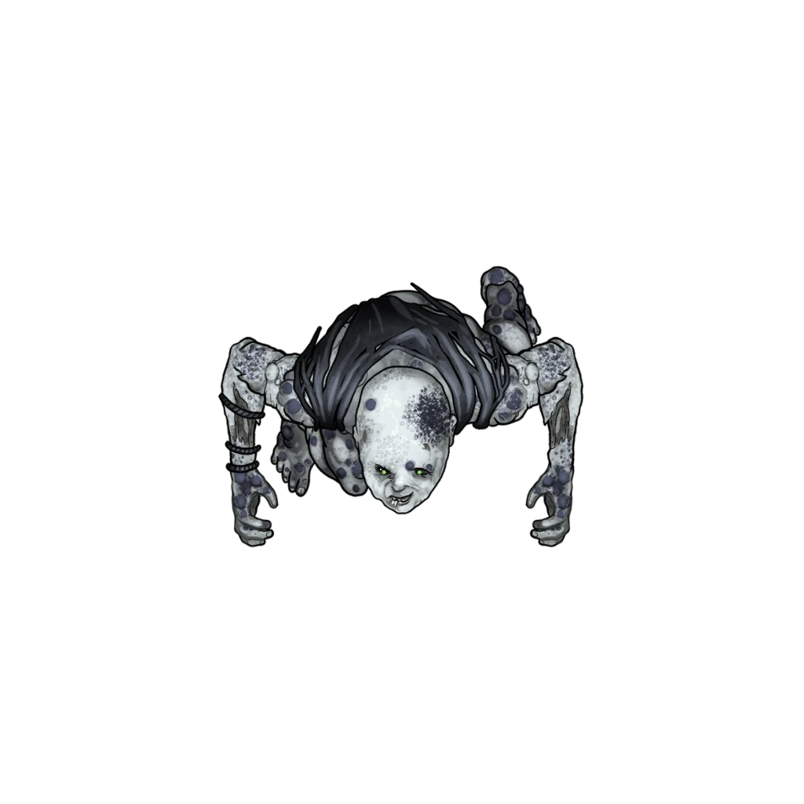

# Harrowed Crossing

> [!warning] Gamemaster
> #### Gamemaster's Summary
>
> This Combat Event tasks the party and their ally [[Sin Marmot]] with crossing the River Elenain, where the grand stone bridge of [[Keeper's Crossing]] has collapsed. In this event, the characters can:
>
> - Look for clues regarding the bridge's destruction.
> - Discover undead [[Sodden Corpse]] lodged among the debris here, who lurch to life and attack.
> - Ford the river while fighting to survive the undead ambush.

### The Collapsed Bridge

All manner of waterlogged detritus has piled up amidst stones near the ruined bridge, from fallen trees to scattered rocks, forming the humble beginnings of a few small ersatz dams. The haphazard scene here comes as an unexpected surprise for Sin and the party, who may investigate the ruins before they attempt to cross the river.

> [!tip] Exploration
> #### Unkept Crossing
>
> Any character who attempts to search the area can determine the following information using the associated skill checks:
>
> - **Society (DC 14)** The character is familiar with Keeper's Crossing and the history of both its architecture and its demise nearly twenty years ago at the hands of an earthquake.
> - **Knowledge: Crafts** The character is familiar with the Arcturian stonework here, and can validate the sturdy nature of the masonry. Something like an earthquake or demolition would have been necessary to topple this bridge, and no signs of manmade wrecking can be found.
> - **Knowledge: Trade** The character is well aware of the former importance of this bridge for trade, particularly when it came to Ordani imports and exports.
> - **Awareness (DC 14)**The character is able to confirm the relative safety of the crossing points that span the river along the southern edge of the ruined bridge, which have been supplemented with makeshift bridges made of rope and timber.
> - **Wilderness (DC 14)**The character is able to determine that falling into the rapidly-flowing river could prove hazardous. Catching onto one of the ersatz dams or bridges might be the only way to prevent being washed downstream for the better part of a mile.
>
> If the characters fail to assess the southern crossing points for themselves, Sin will eventually stumble onto her own successful Awareness check while surveying the scene, and promptly relate some findings to the group.

### Fording the River

Once one or more of the characters have moved far enough to reach the halfway mark to the eastern bank, a mob of Sodden Corpses rises from the waterlogged detritus to attack. Read the following aloud:

> [!quote] Read Aloud
> The southbound water rushes by your feet as you ford your way towards the eastern shore. Your footing remains steady as driftwood and detritus lightly strike your ankles, but you notice something else among the shadows of the ersatz dam to the northwest: a bloated human face with milky white eyes and horribly jaundiced skin.
>
> Just then, a sallow humanoid hand reaches out of the water at your feet, followed by the harrowing visage of a rotten and waterlogged carcass. Before you can blink, nearly a dozen of these humanoid corpses lurch to life around you!

> [!abstract] Sodden Corpse
> **[[Sodden Corpse]]**
>
> Level 2 · Zombie Grappler
>
> 
>
> The fetid smell of corpse rot assaults your senses as a vaguely misshapen humanoid silhouette shambles into view. What appears to be a putrid, ambulatory cadaver shuffles your way, its soft and bloated flesh reeking of the grave. The clothes it wore in life are tattered and torn, stained by the toxic putrescence of its undead form. As the creature’s milky, moldering eyes regard you with a malevolent inhuman hunger, its rotted jaws gnash in rapacious anticipation.

> [!danger] Hazard
> #### Sodden Corpse Tactics
>
> Any character who succeeds on a **Awareness (DC 13, Passive)** check is able to avoid becoming &Reference[Surprise]{Surprised} by the 10 Sodden Corpses that emerge from the water to attack.
>
> The Sodden Corpses will quickly attempt to surrounded the closest enemies, with up to 3 of them ganging up on an individual character to use [[Leg Sweep]] and try to drag them down. Attacks made against these shambling dead rupture the [[Repugnant Pustules]] that cover the creatures, spilling horrid corruption into the air.
>
> Sodden Corpses caught out away from the fight will make use of [[Acid Spit]] to deal corruption damage and try to spread the **Decaying** condition to as many targets as possible while they try to close the distance.
>
> #### River Combat Hazards
>
> The torrential southbound waters of the River Elenain continue to rush by as combat unfolds. The especially difficult terrain here requires sure footing and careful progress if the characters wish to avoid falling into the water.
>
> Any character who loses 10 hp or more from attacks by Sodden Corpses while standing on one of the rocks or bridges that comprise the southern crossing must succeed on either a **Athletics (DC 11)** check. Any character who moves more than their walking speed in a single round must also make this check. Failure results in the character falling into the rapids and being swept downstream a total of `[[/roll (1d3+1)*10]]` feet.
>
> - Movement downstream is made at double speed for all creatures (characters travel up to 10 feet downstream for every 5 feet they move while swimming).
> - Movement upstream is quartered for creatures without a swim speed (characters only travel 5 feet for every 20 feet they move while swimming).
> - Movement upstream is halved for creatures with a swim speed (characters only travel 5 feet for every 10 feet they move while swimming).
>
> Characters who wish to swim upstream against the current (which flows in a southeasterly direction) must succeed on a **Athletics (DC 15)** check to progress. If a character fails this check by 10 or more, they are washed downstream an additional `[[/roll (1d3)*10]]` feet.
>
> - Climbing out of the river at one of the rocky cliff faces on either bank requires a **Athletics (DC 13)** **Athletics (DC 13)**check.
> - Characters who attempt to climb back onto the rope and timber bridges that span the southern crossing make the same check with **+2 Boons**.
>
> #### Washed Away
>
> Characters who are swept downstream by the rover current are channeled towards the Sodden Corpses stationed at the dam near the southeastern edge of the map. Once a character reaches this dam, they are able to grab onto the dam itself with relative ease. However, the character must succeed on a **Athletics (DC 11)** check.
>
> Characters can also choose to let the current wash them further downstream, outside the bounds of the area map.
>
> - Any character that allows the river to carry them downstream must succeed on a `[[/save dex 15]]`**Athletics (DC 15)** check or they suffer being **Dashed Against the Rocks (Hazard 10, Fortitude, Health, Bludgeoning)** before they wash up nearly two miles downstream to the southeast on the shore of hex 3210.2892.
> - Characters who leave combat will remain outside of initiative order until a) all party members have washed downstream, b) the sodden corpses have been defeated in combat, or c) the remaining characters have successfully reached the eastern bank of the river.

If the party defeats the Sodden Corpses in combat, the characters may take time to inspect the remains for information about their origins and how they might have reached Keeper's Crossing.

A proper inspection of the Sodden Corpse cadavers requires a bit of diligence as the rapids persist. Skill checks associated with this task can be made using the &Reference[Help] help of other characters, despite occurring outside of combat .

> [!tip] Exploration
> #### Examining the Unholy Remains
>
> It is clear that these corpses are highly unnatural and abhorrent evidence of some unholy power. Characters who succeed on a **Arcana (DC 14)**check understand that some power has interposed itself between these deceased and the natural cycle which would convey their souls to the Bonelands.
>
> - **Knowledge: Undeath**: The character gains **+2 Boons**.
> - **Knowledge: Souls**: The character gains **+2 Boons**.
>
> A successful **Medicine (DC 14)** check reveals forensic evidence that these people died of various causes; some of the deaths were the obvious result of violence, while others seem natural or otherwise elusive.
>
> - **Knowledge: Forensics**: The character gains **+2 Boons**.
>
> Characters who succeed on a **Wilderness (DC 14)** check conclude that the bodies were swept downriver, until they became ensnared in the rocks, debris, and rapids present at this crossing.
>
> - **Knowledge: Tracking**: The character gains **+2 Boons**.
>
> Searching the bodies with a successful **Awareness (DC 14)** check locates some minor valuables among the remains. Roll once on the [[Corpse Loot]] table.

The encounter with the undead here at Keeper's Crossing is highly concerning for Sin Marmot, who is eager to share her thoughts with the rest of the party. As the characters examine the corpses or retreat from the scene, Sin speaks up:

> [!quote] Read Aloud
> Obviously taken aback by the encounter with the shambling waterlogged corpses, Sin pulls down her face mask and looks you sternly in the eye.
>
> > Two and a half decades on Ember and I've never seen anything quite like that before. Something foul has brought these poor souls back to life. Mark my words, this is not the Influence of Sockets at work. We must hasten our journey to Corpin Sanctuary. Surely they'll have answers, won't they … ?

> [!info] Social
> #### Troubling Developments
>
> The aftermath of the encounter here provides a moment for conversation with [[Sin Marmot]], who is noticeably shaken since the party's fight with the Sodden Corpses.
>
> Any character who succeeds on a **Diplomacy (DC 12)** check is able to determine that Sin feels out of their depth following the fight, and that Sin's claims of inexperience with these matters are honest and accurate.
>
> Sin is eager to compare notes and opinions with the characters about what happened here, including:
>
> - Their history as a druid and aspirations to join the Cindaric Sages (if they didn't previously discuss them during the [[Traveling with Sin]] event).
> - Thoughts regarding the origins of the various Sodden Corpse cadavers, including who these people might have been before their original demise.
> - The necessary role of clerics of all faiths in Ember's emerging battle against necromancy.
> - The nature of the Sodden Corpses compared to legends and accounts of other kinds of undead, like spectral apparitions.
>
> Characters with **Knowledge: Souls** or **Knowledge: Undeath** who participate in the conversation and attempt to bolster Sin's resolve or courage (or their very decision to join the Cindarics) gain one point of Inspiration.

### Concluding the Event

> [!warning] Gamemaster
> #### Next Steps
>
> After defeating or fleeing from the Sodden Corpses, the party can continue onwards to [[Corpin Sanctuary]] and the [[Corpin Arrival]] Event.
