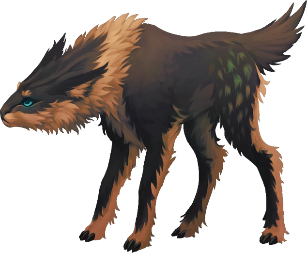

# Pillaged Farmstead

> [!warning] Gamemaster
> #### Gamemaster's Summary
>
> This Exploration Event challenges the party to collaborate with [[Sin Marmot]] when they encounter a burned and ransacked farmstead at [[Dradley Grange]]. Once the fires are quelled, a brief investigation follows — for clues regarding the arsonist's identity and what precisely became of the farmers who lived here. In this event, the party can:
>
> - Help Sin extinguish the raging fire.
> - Investigate the incinerated scene for clues.
> - Befriend a [[Rask Juvenile]] which managed to escape the conflagration.

### The Grange Ablaze

> [!quote] Read Aloud
> You follow Sin towards the main farmhouse, which is nearly subsumed by the roiling blaze. Despite the intimidating heat, Sin strides forward with a look of determination behind her mask, which she raises in protection against the surging smoke and ash. A glimmer of magic appears in the druid's open palm as she begins shaping the flames and redirecting the conflagration; but given the size of the fire, it's readily clear she'll need some help.

> [!danger] Hazard
> #### Fighting the Fire
>
> Each party member must assist Sin in combating the fire if the blaze is to be stopped.
>
> - Usage of **Talent: Rune: Frost** (like **Ray of Frost** which Sin casts in this moment) can be used to slowly curtail the blaze if used repeatedly for 10 minutes.
> - Water can be rapidly hauled from the farm's well or dirt can be thrown to choke the fire with a successful **Athletics (DC 15)**check. Success on this check has comparable effectiveness to the use of a cantrip.
> - Usage of the Frost rune by a spellcaster with `[[/talent Compendium.crucible.talent.Item.FrostProficiency]]` can instantaneously extinguish the blaze.
>
> #### Checking for Survivors
>
> A character might choose to rush into the burning buildings in search of survivors who can be saved. Any character that enters the farmhouse or guest house while the fire still rages must withstand the following hazards resulting from the blaze:
>
> - A successful **Wilderness (DC 15)** or **Science (DC 15)** will allow the character to use some ingenuity to cover themselves or their face with a wetted blanket or cloth before charging in, to better withstand the smoke and heat. On a failure, the character instead suffers **The Burning Flames (Hazard 10, Fortitude, Health, Fire)**.
> - **Athletics (DC 15)** to avoid a falling support beam that threatens to crush anyone beneath. On a failure, the character is struck by **The Falling Beam (Hazard 5, Health, Bludgeoning)** and is **Restrained**. Escaping the fallen beam requires a successful **Athletics (DC 13)** check. This escape check may be repeated if they fail, but the character suffers additional damage for each turn they are restrained in this way (see "No Time to Waste" below).
>
> Characters who enter the building must succeed on a **Awareness (DC 13, Passive)** check to verify that there are no people within (living or dead). On a success, they also notice a [[Rask Juvenile]] trapped within the wreckage, pinned down by collapsed furniture and cowering from the blaze (see "The Frightened Rask" below).

> [!abstract] Rask Juvenile
> **[[Rask Juvenile]]**
>
> Level 0.5 (Minion) · Rask Pack Member
>
> 
>
> The eyes of this majestic quadruped appear to glow with subtle phosphorescence. A lean mammal with features both canine and feline in nature, the young creature is marked by feathery tufts of fur, and appears remarkably dexterous. A striped pelt crowns the beast's regal head, and a short fluffy tail sways behind it with graceful intention.

> [!danger] Hazard
> #### The Frightened Rask
>
> The Rask Juvenile can be rescued using one of the following methods:
>
> - A successful**Wilderness (DC 15)** check allows a character to entice the Rask Juvenile to leap over or through the burning flames.
> - **Talent: Wildspeaker** can be used to reassure the Rask Juvenile and convince it to leap to safety without the need for a skill check.
> - A successful **Athletics (DC 18)** check allows a character to grapple the Rask Juvenile and haul it away to safety. Failure results in the frightened creature's escape and continued peril.
>
> #### No Time to Waste
>
> If a character lingers inside the house by becoming restrained or by tarrying unnecessarily (defined by GM discretion), they suffer**The Relentless Flames (Hazard 2, Fortitude, Health, Fire)** every 6 seconds until they perish or exit the building.

Through the party's efforts, the flames that once engulfed the farm are eventually quelled, and only smoldering ashes and singed beams of timber remain. There is no immediate danger of the fire spreading any further; but despite the group's heroic efforts, the main farmhouse has been lost to the blaze.

#### Primordis Attunement: Magical Assistance

Any character who used magic to reduce or extinguish the flames advances their **Attunement: Primordis (+1)** at the conclusion of the Event.

#### Ragen Attunement: Check for Survivors

Any character who did not hesitate to rush into the fire to check for survivors advances their **Attunement: Ragen (+1)** at the conclusion of the Event.

### The Rescued Rask

If the Rask Juvenile was rescued from the flames, the party can attempt to communicate with it.

> [!info] Social
> #### Calming the Rask
>
> Any character who succeeds on a a **Diplomacy (DC 12)**check is able to calm the Rask Juvenile. Characters with **Knowledge: Beasts** have **+2 Boons** on this check.
>
> - **Magical Methods**: Use of the **Talent: Wildspeaker** talent Sin or another character automatically succeeds.
> - **Animal Insight**: Characters with **Knowledge: Beasts** have **+2 Boons** on this check.
> - @CriticalSuccess12]: The Rask Juvenile will befriend the character as an animal companion and join the party as a non-combatant ally.
>
> #### What the Rask Knows
>
> Once the Rask Juvenile has been calmed, Sin or one of the characters can use the **Talent: Wildspeaker** talent to learn precisely what happened:
>
> - The smell of fire and the sound of stampeding cattle were the first signs that something was wrong. The bashful Rask — ironically named **Springer** by Egon Dradley's nephew Cade — was caught behind a fallen timber and left behind.
> - Strange humanoids brought the fire with them. Carrying torches and barrels of oil, these strangers were clad in golden cloaks and armed to the teeth.
> - As the fire rapidly spread, the strangers took advantage of the ensuing chaos to ensnare the people who lived (and visited) here. The people of Dradley Grange were bound and gagged, hauled away to places unknown.

If Springer was befriended, mark the following outcome as completed:

`[[/outcome companion]]`

#### Heart Attunement: Rask Befriended

Whichever character manages to calm and befriend Springer the Rask advances their **Attunement: Heart of Ember (+1)** upon the conclusion of this event.

### Searching the Rubble

Once the fires have been dealt with, the party can also search the farmstead for items or information of interest.

> [!tip] Exploration
> #### Exploring the Farmstead
>
> A general search of the farmstead grounds reveals scant items of interest, including Brewer's Supplies, Tailor's Tools, and `[[/roll 1d3+1]]` Rations per character in undamaged produce.
>
> Any character who succeeds on a **Society (DC 14)** is familiar with the general details and history of [[Dradley Grange]], and can confirm the suspicious nature of the fire and the curious lack of local residents when the party arrived.
>
> A successful **Awareness (DC 13)** check reveals some specifics about the scene: it's clear that the farm has been ransacked and looted as well as burned, the fire has spread farther than it seems like it should on its own, and nearly a dozen booted footprints can be spotted around the farmstead grounds.
>
> A successful **Wilderness (DC 14)** or **Science (DC 14)**check suggests that the fires were manmade, and that the accident here is the direct result of arson.
>
> - **Forensic Insights**: Characters with **Knowledge: Forensics** have **+2 Boons** on this check.

### Concluding the Event

After helping Sin with the fire, the party can continue on their journey towards Corpin Sanctuary.

> [!warning] Gamemaster
> #### Next Steps
>
> If they have not already encountered them, the party may yet cross paths with the brigands responsible for this fire in [[Ambushed Refugees]].
>
> Further along the road towards Mial Mountain, the party must attempt to cross the river at [[Keeper's Crossing]] where they will experience the perils of [[Harrowed Crossing]].
>
> Upon arriving at [[Corpin Sanctuary]] the party will next encounter the [[Corpin Arrival]] event.
