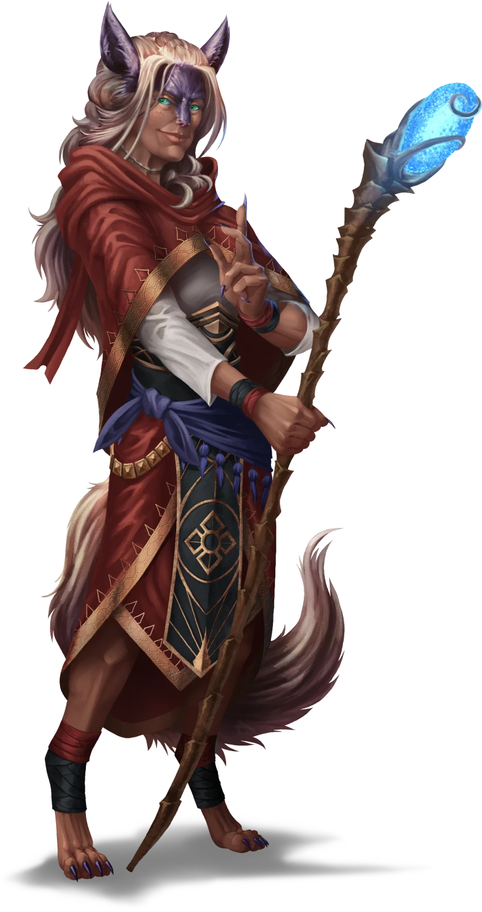
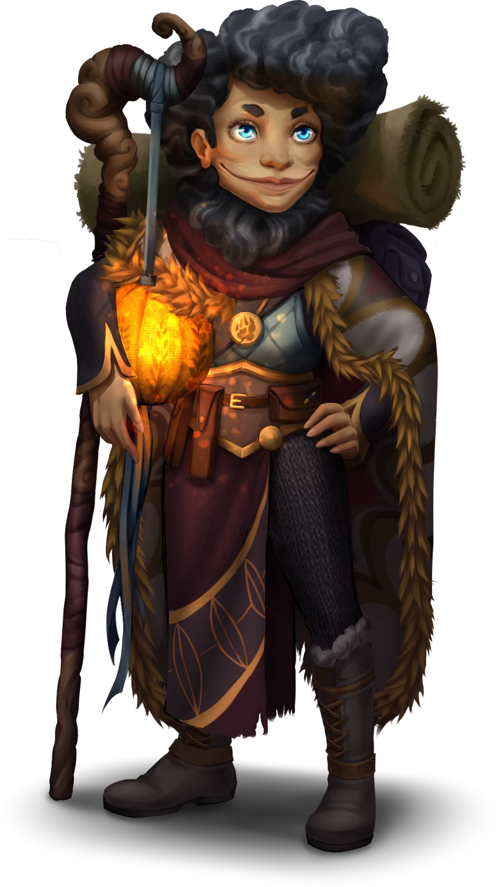

# Reuniting with Sin

> [!warning] Gamemaster
> #### Gamemaster's Summary
>
> This Social Event can allows the party to catch up with [[Sin Marmot]] at [[Corpin Sanctuary]], following an extended period of separate exploration of the [[Arctus Plateau]]. In this event, the characters can:
>
> - Meet Corpin Sanctuary's dedicated leader, the former sea captain known as [[Mira Wavehorn]].
> - Learn about Sin's journey to Corpin Sanctuary on Mial Mountain, including a trio of memorable events along the way.
> - Learn about the key denizens of Corpin Sanctuary and Sin's various opinions of them.
> - Find out about a strange note that was passed under Sin's door, and its bold claim about a furtive necromancer hiding in the midst of the Sages at Corpin Sanctuary.

## A Welcome Respite

The party arrives at Corpin Sanctuary, an enclave of the Cindaric Sages nestled in the crags of Mial Mountain, situated a day's travel west of Ordain. The party is welcomed in the [[Entry Courtyard]] by the enclave's leader, Mira Wavehorn, along with their companion Sin Marmot.

> [!abstract] Mira Wavehorn
> **[[Mira Wavehorn]]**
>
> Level 6 (Elite) · Kiska Cindaric Sage
>
> 
>
> The aloof countenance of this Kiska femme is belied by her jocular smile, a disarming grin on the edge of inquisitiveness. Clad in the red robes of a Cindaric Sage and a light Cascilian breastplate, she appears ready for action despite her calm nature. Your instincts tell you that somewhere inside this gentile sage beats the fierce heart of a fellow adventurer.

Sin regards the characters as favorable companions on the road to Ordain. No matter how long it's been since their last encounter, she greets the characters like a long-lost friend.

> [!abstract] Sin Marmot
> **[[Sin Marmot]]**
>
> Level 2 · Keth Cindaric Aspirant
>
> 
>
> A Keth with a friendly demeanor and wide blue eyes and a strange half-mask that covers her mouth. She seems to view everything around her with an air of wondrous innocence but her keen glances also suggest the ability to read any given situation quickly and she may be more capable than she appears at first glance.

> [!info] Social
> #### Meeting Mira
>
> Mira ambles with the party in the Entry Courtyard with a desire for them to explain their visit in adequate detail, and isn't afraid to use small talk to coax information out of them. Topics that Mira is quick to bring up in conversation while meeting the party include:
>
> - The party's background and any affiliations they might have.
> - A brief history of Corpin Sanctuary and the Cindaric order itself.
> - The mission of Corpin Sanctuary as a refuge for lost and displaced peoples, which has been impacted and hampered by recent events.
>
> A successful **Diplomacy (DC 13)**check indicates that Mira is scrutinizing whether or not the party are refugees themselves, and is apprehensive of those who might take unsavory advantage of the Sanctuary's graces.
>
> Any character who succeeds on a **Society (DC 14)**check is familiar with Mira's role and responsibilities as a Cindaric Sage and the leader of Corpin Sanctuary. Characters with **Knowledge: Souls** have **+2 Boons** on this skill check.
>
> If the characters beseech Mira for shelter at the Sanctuary, one of them must succeed on a **Diplomacy (DC 13)** check. If successful Mira is willing to offer the party room and board for a night or two as they rest up and decide their next course of action.
>
> If the characters fail to persuade Mira, Sin eventually steps forward and vouches for the characters. Mira's opinion of the party softens, and she invites the party to stay for the evening (if not longer). Additional dialogue options with Mira are listed below.

> [!question] Q&A
> **Q:** On Corpin Sanctuary?
>
> **A:**
>
> > Corpin Sanctuary was built long ago to establish a satellite location for Cindaric initiatives, removed from the commotion of urban life in Ordain. The people of the Golden Flats and beyond are always in deserving need of charity, and — out here on the mountain, in our quiet little enclave — we pride ourselves on a more … intimate connection with Ember through the land itself. But we do share the same goals as our cohorts in Ordain. We're just a bit more rustic.

> [!question] Q&A
> **Q:** Regarding Undead?
>
> **A:**
>
> > Make no mistake, these undead creatures Sin speaks of suggest a greater threat to the natural order of Ember and the sacred heartblood that flows within it. The Soul Cycle is the wheel upon which our very cosmos turns, and these threats of restless souls and abyssal incursions are most troubling. Worse yet, you aren't the first allies of the Cindaric order to share word of these kinds of calamities. And I fear you won't be the last.

After the party has had a chance to meet Mira and gain their proverbial footing, they are free to catch up with Sin about her journey to Corpin Sanctuary. Before departing to attend to her duties, Mira assigns the party lodging with Sin in one of the Sanctuary's [[Empty Dormitory]].

Mira takes her leave, and the party is free to wander the Sanctuary grounds with Sin as they see fit. The only areas that are considered off-limits are the Sages' private quarters in the [[Dormitories]] and [[Mira's Office]].

### The Druid's Journey

> [!warning] Gamemaster
> #### Music: Sin's Theme
>
> While the party catches up with Sin, play  **Music: Sin Theme**.

> [!info] Social
> #### Catching Up with Sin
>
> Sin details her journey to Mial Mountain for the characters, including:
>
> - Her discoveries at the Pillaged Farmstead.
> - Her encounter with the Ambushed Refugees.
> - The undead terrors of the Harrowed Crossing, where she survived a harrowing fight with sodden undying corpses that could spew a putrid and dangerous vomit.
>
> Sin also updates the party on her thoughts about the notable denizens of Corpin Sanctuary:
>
> - [[Mira Wavehorn]]
> - [[Avwynn Taol]]
> - [[Evesso]]
>
> Finally, Sin introduces the secret note that was passed under her Dormitory door the previous night: the [[Note to Sin]].
>
> Dialogue options for these various topics are presented below.

> [!question] Q&A
> **Q:** About the Farmstead
>
> **A:**
>
> > A few days after we parted company, I came across the smoldering remains of a pillaged farmstead known as Dradley Grange, a couple of miles west of the River Elenain. By all accounts, the farm houses and fields had been ransacked before they were razed to the ground. And there were no signs of survivors. I hate to think of what might have happened to those folks, but I have a few suspicions …

> [!question] Q&A
> **Q:** About the Ambushed Refugees
>
> **A:**
>
> > A day later, while heading southeast towards the river, I encountered a group of Arcturian refugees who were displaced from the village of Skybrush and a few scattered homesteads. As luck would have it, this impromptu caravan of migrants was beset by a raiding party of well-trained highwaymen just as I was happening upon it. Thanks to my timely arrival and the swift axe of a friendly warrior named Svala, we were able to drive off the bandits — bandits who, I might add, seemed a bit too organized for my tastes.

> [!question] Q&A
> **Q:** About the Harrowed Crossing
>
> **A:**
>
> > The perils of my journey came to a head at Keeper's Crossing, where the ruined bridge held a few surprises I won't soon forget … While fording the turbulent river, I was attacked by nearly a dozen undead corpses. Evil creatures bloated with rot and sodden with river water. Those foul things could spew a noxious puke that necrotized flesh and bone. Truly horrible stuff. I barely escaped with my life, and it will be too soon if I ever see one of those putrid faces again.

> [!question] Q&A
> **Q:** Mira Wavehorn (Initial Impression)
>
> **A:**
>
> > Mira Wavehorn seems to me like an inspired choice to lead the Sages at Corpin Sanctuary. Her background as a naval captain certainly affords her an interesting level of experience, and it must have been some remarkable transition for her … leaving that freewheeling life of open-sea adventure to become a Cindaric Sage, dedicating her days to a singular purpose. That's a kind of commitment I can look up to. And she seems pretty fun.

> [!question] Q&A
> **Q:** Avwynn Taol (Initial Impression)
>
> **A:**
>
> > Avwynn Taol is quite remarkable, isn't she? So tall, beautiful, and confident. I look forward to hearing more about her endless supply of ancient Maziran myths and legends. Sorcerers have always been intriguing to me. Magic channeled from the earth? That I can understand … Magic from my very blood, or the stars, or wherever it comes from? Truly wild stuff, if you ask me.

> [!question] Q&A
> **Q:** Evesso (Initial Impression)
>
> **A:**
>
> > Evesso seems to be a real master of Cindaric traditions. The kind of scholar that you'd expect a reputable place like Corpin Sanctuary to have on hand. A proper historian. It's a shame we only have a day or two to learn firsthand about some of the Cindaric legends and lore he's collected in his travels.

### The Curious Note

> [!warning] Gamemaster
> #### Music: Tension Builds
>
> As Sin reveals the note, change reset the music to default and switch the mood to tension:  **Music: Reset**,  **Music Mood: Tension**.

Sin saves the most important information for last. Once she's caught the party up to speed about her journey to Corpin Sanctuary and her first impressions of its inhabitants, she quietly shares the most actionable information at hand: the contents of the [[Note to Sin]] passed beneath her Empty Dormitory door.

If possible, Sin directs the party to a quiet spot of the Sanctuary or back to the Dormitories for relative secrecy (far away from the prying eyes and ears of potential suspects).

> [!quote] Read Aloud
> A look of trepidation crosses Sin's face before she speaks, much more timidly than usual.
>
> > Someone slid this beneath my dormitory door last night.
>
> Sin holds out a small piece of folded parchment. Even from here, you can see the handwritten text inked upon its top fold:
>
> > To: Initiate Marmot.
> > For your eyes only.

> [!tip] Exploration
> #### The Passed Note
>
> The note's interior reads:
>
> > Heed my words, for they are astoundingly true. There is a necromancer lurking among the sages here at Corpin Sanctuary. As outsiders, it seems you and your party are the most capable to investigate this dangerous affair. Most importantly, your intentions here seem noble and just.
> >
> > Please, rid the Sanctuary of this invader, for all our sakes. And be careful to avoid suspicion — the eyes of the necromancer are everywhere.
>
> The note is written anonymously and conveys the accusation that there is a necromancer lurking among the sages at Corpin Sanctuary. As outsiders with seemingly noble intentions, the author of this note wishes for the party to closely investigate the sanctuary and its sages.
>
> Any character who wishes to scrutinize the note can do so, and notices the following with a successful **Awareness (DC 12)** check, that the handwriting is unfamiliar to everyone in the party and that the ink is still quite fresh.
>
> - **Forensic Insights**: Characters with **Knowledge: Forensics** have **+2 Boons** on this check.
>
> If a character uses magic to attempt to identify the letter's author, their effort falls short. Unbeknownst to the party, the original owner of the letter ([[Avwynn Taol]]) is magically protected against attempts at divination.

Sin has her own opinions about the origins of the note, and wishes to immediately confer with the party:

> [!info] Social
> #### Sin's Suspicions
>
> Sin Marmot is relatively unfamiliar with the actual practice of necromancy, and solicits the characters for conversation about the note's revelation and whether or not it has ties to their previous encounters with undead. Sin is also eager to discuss:
>
> - Who could possibly be a suspect, based on the people the party has met since arriving — including the Cindaric Sages and visitors alike.
> - The relationship of Corpin Sanctuary to the Cindaric Temple in Ordain, and what kinds of strains might currently be affecting it.
> - Her trust in the Cindaric Sages as an organization, and the honest desire to keep the charitable order safe from those who might befoul it.
>
> After some discussion about their collective thoughts and suspicions, Sin establishes a plan with the party to begin an investigation in the morning following a vigilant Rest.

### Concluding the Event

Once the party has had adequate time to speak with Sin and catch up about their respective journeys to Corpin Sanctuary and the impending investigation, they're ready to begin their inquiries in earnest.

> [!warning] Gamemaster
> #### Next Steps
>
> Sin and the party can remain in Corpin Sanctuary to start collecting evidence and clues about the furtive necromancer during the events of [[Corpin Investigation]].
