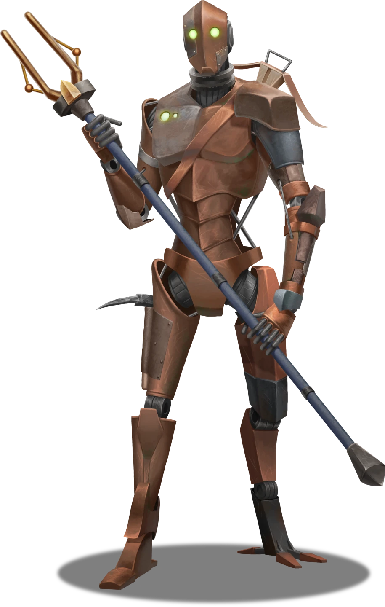

# A Peculiar Encampment

> [!warning] Gamemaster
> #### Gamemaster's Summary
>
> This social and exploration event introduces the party to the Renegade Construct itself, an awakened Chessman dubbed Hew, along with the three other missing constructs. In this event, the party can:
>
> - Discover the repurposed campsite known as [[Aberin's Folly]], which serves as the clandestine home and headquarters of the Downsiders — a group of four awakened Chessmen from Arcturel.
> - Observe the Downsiders from afar to determine whether or not they actually pose a threat to the people of Arcturel.
> - Meet the Downsiders — named [[Hew]], [[Rider]], [[Lucent]], and [[Chamberlain]] — and learn their respective stories of sentient awakening (and subsequent escape).
> - Listen to an informal deposition from each of the Downsiders about their lack of culpability in the crimes they've been accused of, and learn about the well-meaning nature of their newfound sentience.
> - Learn about various Silver Beam operations, including the covert machinations of the [[The Scrapyard]] and its attendants.
> - Plan their next steps, whether that includes exploration of the Scrapyard, investigation of the Silver Beam Inkaro Pools, or a return to Arcturel.

Whether they've followed clues from Ifton Shepp in Rock Bottom or find it of their own accord, the characters will stumble onto the remote encampment known as [[Aberin's Folly]] while exploring the easternmost reaches of the Sinkhole Depths.

### Observing the Camp

If the characters can remain hidden throughout the course of their observation, they can examine the residents of the peculiar encampment from afar.

> [!tip] Exploration
> #### What the Characters See
>
> The Chessmen known as [[Hew]], [[Rider]], [[Lucent]], and [[Chamberlain]] are gathered here, engaged in philosophical conversation. Hew, the so-called Renegade Construct, is obviously the most anxious of them all; their conversation ambles between the art of survival to matters of the soul and back again.
>
> - **Offscreen Antics**. Each of the Downsiders passed through Ifton Shepp's mushroom farm in Rock Bottom during their flight from Arcturel, and all have had their Entropic Inkaro Pearls replaced with standard ones. Additional information about their history can be found in "Befriending the Chessmen" below).
>
> Characters can covertly observe the Downsiders by succeeding on a**Stealth (DC 13)** check to avoid detection. Failure results in Lucent cautiously approaching the party to investigate (see "Alerting the Downsiders" below). Characters with **Knowledge: Subterranea** have advantage on this check.
>
> Any character who succeeds on a **Awareness (DC 13)** check while surveying the camp is able to notice the following:
>
> - The four constructs gathered here match the descriptions of the four Chessmen who are purported to have gone missing from Arcturel, including the so-called Renegade Construct.
> - The constructs don't appear to engage with the campfire for warmth, nor is there any smell of food in the air here. The camp itself appears mostly abandoned, and its amenities long forgotten.
> - Although some of the arms are different from the war picks and shock spears they're commonly known for, each of the four Downsiders possesses a modest array of weaponry.
> - If the party spoke with Hob Korell or visited his stables in the Dives, the large [[Jobri]] tethered nearby matches the precise description of one of the unconventional steeds he trained there (and corresponds with the account of his missing construct).
> - **Critical Success**: The character also notices that the construct matching the description of the Renegade has been repaired and refurbished using similar but slightly different components.
>
> Reveal the following to party members who avoid detection and succeed on the Perception skill check:
>
> > As you linger silently at the edge of camp, you manage to make out some of what the constructs say to each other. The most physically aged of the four, a silver-plated model with a rapier tied to its side, addresses another who stands at the ready with a trusty war pick.
> >
> > "My dear Hew, I dare say that your vigilance is appreciated but not entirely necessary. Our clandestine chateau is far away from the prying eyes of those Silver Beam scoundrels."
> >
> > Hew responds, "Aye, but Silver Beam has a way of turning up where they least belong."
> >
> > "Chamberlain is right," another construct adds, a shock stick slung stoically across its copper back. "We're safe here. For now. What say you, Rider?"
> >
> > The fourth construct joins the debate, a Chessman plated in blue steel. "Perhaps there's more to Hew's anxiety than mere suspicion, my friends. Perhaps the only way to save our iron hides is to take the fight to Silver Beam, while we still have the chance. Their methods are, after all, rather insidious. And, in case you missed it, our fair city is losing its love for Chessmen.
> >
> > "Indeed. That damnable Scrapyard to the west is no small testament to our plight," the silver-plated construct adds. "Perhaps we could approach the good people of Arcturel for help. But would they even listen?"
>
> A successful **Diplomacy (DC 13)** check suggests that these Chessmen exude a body language more akin to that of sentient humanoids, rather than the robotic bearing of soulless automatons. Characters with **Knowledge: Machines** have advantage on this check.
>
> - **Critical Success**: The character notices distinct emotion in the Downsiders' movement, particularly in the overt anxiety on display by the construct known as Hew. Meanwhile, Lucent seems contemplative, Chamberlain seems downtrodden, and Rider seems emboldened.
>
> A successful **Wilderness (DC 15)** check betrays the pageantry of the campfire, considering that Chessmen don't need the fire for warmth, cooking, or illumination; it's as if the fire is only lit for the atmosphere it provides. Characters with **Knowledge: Machines** have advantage on this check.

> [!abstract] Hew
> **[[Hew]]**
>
> Level 4 (Elite) · Automaton Servitor
>
> 
>
> A humanoid clad in battered and dirty steel stands before you. It moves with a slow, almost weary smoothness, each motion punctuated by a mechanical whir. This faceless construct is heavy and reinforced, meant for manual labor. It has only glowing eyes on its otherwise smooth head. It's body bears a series of shallow scrapes gouges on its chest, and a pale spot, like something was pried off it recently.

> [!abstract] Rider
> **[[Rider]]**
>
> Level 4 (Elite) · Automaton Servitor
>
> 
>
> > [!quote] Read Aloud
> > A humanoid clad in oxidized copper stands before you. It moves with a slow, smooth gait, unhurried but still precise. You notice that it has a simpler, lighter frame that other constructs of its type, as though weight were a concern. This faceless construct has only glowing eyes on its otherwise smooth head. It's chest has a word engraved into it:
> >
> > > Rider

> [!abstract] Lucent
> **[[Lucent]]**
>
> Level 4 (Elite) · Automaton Servitor
>
> 
>
> > [!quote] Read Aloud
> > A humanoid clad in brushed rose gold metal stands before you. It moves with smooth but mechanical precision, and appears especially watchful. This faceless construct has only glowing eyes on its otherwise smooth head. It's body bears a silvery badge that reads:
> >
> > > Lucent

> [!abstract] Chamberlain
> **[[Chamberlain]]**
>
> Level 4 (Elite) · Automaton Servitor
>
> 
>
> A humanoid clad in smooth silver steel stands before you. It moves with mechanical precision, and you can’t help but notice that its chassis is scuffed, worn and dirty. This faceless construct has only glowing eyes on its otherwise smooth head. It's body bears the logo of the Silver Beam Consortium, though it looks like some vain effort was made to pry it free.

> [!abstract] Jobri
> **[[Jobri]]**
>
> Level 1 · Jobri Pack Member
>
> 
>
> The eyes of this large reptilian beast are remarkably big, and the padded five-toed feet that accompany its six muscular legs only accentuate the creature's charming awkwardness. Fitted with tack and bridle, this riding lizard lurks with a measure of domesticated calm, absentmindedly hunting for insects with each flick of its prehensile tongue.

> [!info] Social
> #### Alerting the Downsiders
>
> If the characters fail their Stealth checks and are detected by the Downsiders during their attempt to observe from afar, Lucent will approach the party to investigate, triggering the events of either "Befriending the Downsiders" or "Raiding the Camp" below (depending on the party's desired course of action).

### Befriending the DOwnsiders

If adequately convinced about the humanity of the Chessmen's plight, the party can decide to embrace the four awakened constructs as allies. The following encounter occurs whether the characters approach the Downsiders or if Lucent approaches them first.

> [!info] Social
> #### Hew's Crew
>
> Any character who succeeds on a **Diplomacy (DC 13)** check is able to convince Hew and the other constructs of the veracity of their intentions. Characters with **Knowledge: Crime**, **Knowledge: Intrigue**, **Knowledge: Machines**, or **Knowledge: Souls** have advantage on this check.
>
> Once they've proven they're not a threat, the characters can learn the following information from Lucent, Hew, and the other Downsiders:
>
> - All four of the Downsiders consider themselves to be siblings in a certain spiritual sense (despite their lack of souls). Rider, Chamberlain, and Lucent convey this sense of kinship readily and without a shred of doubt.
> - Despite their apparent sense of humanity, the Downsiders remain somewhat draconian and stoic when it comes to their interpretation of morals and ethics; they are social outsiders, and their acclimation to humanoid culture is fraught with misunderstanding.
> - The nature of their respective malfunctions (including the influence of [[Inkaro Pearl, Entropic]]) are not fully understood by the constructs themselves. While they're familiar with Silver Beam and their overt practices, their perspectives on the Railen theocracy and the Altyra people are fairly limited.
> - Each of the constructs has their own unique story of escape and survival, along with sincere hopes for a future as an awakened individual.
>
> Hew reveals what really happened during the accident in Lower Arcturel, despite a fragmented recollection:
>
> > "I could feel myself slipping away, losing control. And I knew, somehow, that the pearl had something to do with it. I remember walking outside the mine and reaching out for a pearl on the catwalk. The next thing I know, I was falling a few thousand feet to the sinkhole floor. The look on Kellan Lorde's face was terrifying. And for the first time, I think I felt what you humanoids call fear.
> >
> > After hitting the ground and losing a few bits and pieces, I was picked up by our friend Ifton Shepp, who took me in and extracted the bad pearl. Thanks to Shepp, I made my way here into the company of these fine Chessmen before you.
> >
> > If I know anything in this new life of mine, it's that I didn't kill Kellan Lorde. That damned pearl is responsible … I tried to tell Kellan to mind his own business, but he was downright obstinate. At least, I thought I did … It was so confusing. Unbearably so. Before I even knew what was happening, everything was out of my control."
>
> Finally, the Downsiders implore the characters to investigate the westernmost reaches of this stretch of the Pathways below Arcturel, where they'll find a construct cemetery of rust and ruin known as The Scrapyard.

> [!warning] Gamemaster
> #### A Crossroads of Intent
>
> Once the party learns about the supposed existential plight of Hew and the other constructs, the characters are presented with a fundamental decision:
>
> - Help the Downsiders storm the Silver Beam Consortium headquarters to expose Larissa Toth's plot, or
> - Confront the Downsiders on Silver Beam's behalf, preferably after presenting evidence to Zodi Trask, Larissa Toth, and the people of Acturel.
>
> If the party decides to help the constructs, Lucent will agree to meet them in Lower Arcturel for the events of [[Presenting the Evidence]]. Since Hew is wanted for murder, Rider for thievery, and Chamberlain for desertion, Lucent is the only Downsider with enough personal freedom for a meeting with Larissa Toth and Zodi Trask.
>
> Alternately, if the party decides to condemn the constructs, they can either confront the Downsiders here and now or deliver their findings in person during "Presenting the Evidence." Hew will join them if adequately convinced to do so during "Apprehending the Renegade" (see below).

If the characters ally themselves with the Downsiders and agree to present an argument for their liberation, [[Lucent]] will join them during the inquest with Zodi Trask and Larissa Toth, which is detailed in [[Presenting the Evidence]].

#### Mayis Attunement: Downsiders Befriended

If the party chooses to befriend Hew and his fellow Chessmen, each character advances their **Attunement: Mayis (+1)** at the conclusion of the event.

### Raiding the Camp

If the characters decide to condemn the Downsiders for their crimes, the party can confront the four constructs here and now. This confrontation will inevitably lead to a combat sequence, during which the Chessmen will attempt to flee while fighting defensively.

> [!info] Social
> #### Apprehending the Renegade
>
> The party can attempt to subdue Hew and the other Downsiders through parley, whether via intimidation or otherwise.
>
> Any character who succeeds on a**Diplomacy (DC 18)**, **Deception (DC 18)**, or **Intimidation (DC 18)** check is able to convince Hew and the other Downsiders to stand down willingly. Characters with **Knowledge: Crime**, **Knowledge: Machines**, or **Knowledge: Souls** have advantage on this check.
>
> - Hew agrees to join the party as they escort him back to Arcturel to face justice, while the other Downsiders stay behind.
> - **Critical Success**: All four Downsiders lay down their weapons in an overt display of fealty to the party and their Silver Beam patrons.

> [!danger] Hazard
> #### Chessmen Tactics
>
> If the party decides to attack the Downsiders here and now, they won't hesitate to defend themselves.
>
> [[Rider]] will mount his [[Jobri]] and target any ranged attackers with his Crossbow before closing in for melee with his Shock Spear or War Pick.
>
> [[Hew]] attempts to flee the conflict immediately. If cornered or blocked from leaving, he'll arm himself with a War Pick to keep attackers at bay, otherwise using defensive actions to try to avoid any harm.
>
> [[Lucent]] will utilize a Crossbow in battle, fighting defensively while placing himself directly between Hew and the party on the battlefield.
>
> [[Chamberlain]] will summon forth a supplemental force of allied constructs to aid the Downsiders in battle (see below), and will also use his Net to entangle attackers that close distance to the other constructs. When confronted with melee combat, Chamberlain will utilize his personal [[Rapier]].
>
> #### Automated Reinforcements
>
> During the first round of combat, Chamberlain issues a command to call forth a supplemental force of 4 [[Woven Construct]], who dredge themselves out of the detritus strewn throughout the camp.
>
> > As the battle begins, the silver-plated Chessman stands erect and emits a strange inhuman sound, as if speaking in some bizarre language made of mechanical blare and electrostatic fuzz. All of a sudden, four aged constructs emerge from the timeworn detritus of the camp to stand beside the other four defenders, with verdigris-crusted chassis covered in mushroom growths and the soot of several decades.
>
> The Woven Constructs attack with no regard for their own safety, using their [[Rusty Scythe]] and [[Shovel]].
>
> #### Nothing To Lose
>
> The Downsiders and their construct allies will ultimately fight to the death, unless the characters convince one of them to surrender during the course of battle. If they become **Broken**, skill checks featured above in "Apprehending the Renegade" can be made again with **+2 Boons**.

#### Abyss Attunement: Downsiders Destroyed

If the party raids the Chessmen camp and apprehends the Renegade Construct using lethal force, each character advances their **Attunement: The Abyss (+1)** at the conclusion of the event.

### Collecting Evidence

> [!tip] Exploration
> #### Proof for Larissa Toth
>
> Once the battle is over, the party needs to collect some kind of evidence that proves their victory here at Aberin's Folly. This can include (but is not limited to) the following:
>
> - [[Renegade Construct Scraps]] that identify the construct's model number.
> - Hew, the Renegade Construct, can accompany the party alive as a willing or unwilling hostage.
>
> #### Looting the Camp
>
> If the party examines the table where the constructs were gathered, they find a crude map of the Sinkhole Depths scrawled upon it — with Rock Bottom, the Scrapyard, and the Inkaro Pools locations noted in somewhat fresh ink. They also find a [[Scrivener's Toolkit]] nearby. The kit appears to have been prepared with tools specific to cartography.
>
> Any character who succeeds on a**Diplomacy (DC 13)** check while searching the camp is also able to locate the following:
>
> - A set of [[Repair Kit (smith)]].
> - A leather purse containing  **33**].

### Concluding the Event

> [!warning] Gamemaster
> #### Next Steps
>
> The party is free to explore the rest of the [[Sinkhole Depths]] for clues, gathering information during the events of [[Poolside Predicaments]], [[Junkyard Cogs]], and `[[/eventState arcutrelSideBottom]]` if they have yet to do so.
>
> Once they've gathered enough clues, the party can return to Arcturel Lower to trigger the events of [[Presenting the Evidence]], during which time they can provide proof that either absolves or condemns the Downsiders for their so-called crimes.
