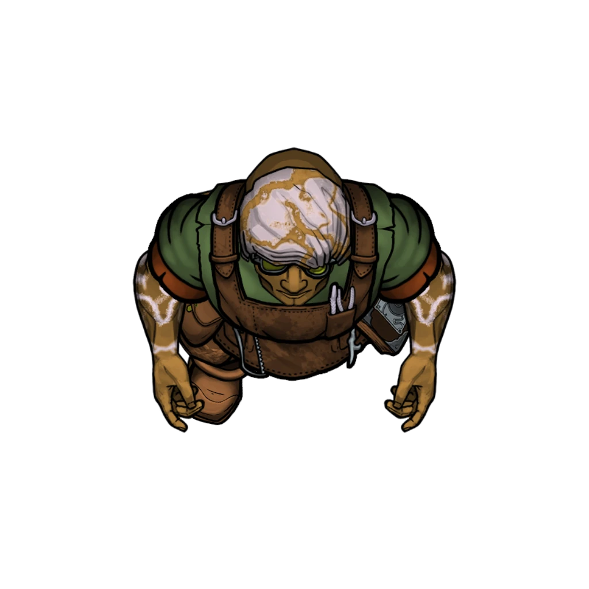
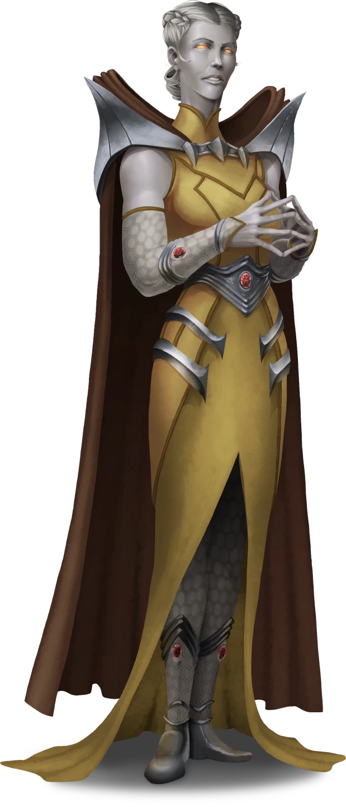

# A Troubled Tradeway

> [!warning] Gamemaster
> #### Gamemaster's Summary
>
> This social event introduces (or reintroduces) the party to [[Zodi Trask]], a gregarious Kiska miner that serves as a high-ranking foreman for [[House Cevher]] in [[Arcturel]]. Zodi has a job for the party — one that involves locating a rogue construct accused of murdering an innocent citizen of the sinkhole city. In this event, the characters can:
>
> - Visit Rallyhome in Upper Arcturel to meet Zodi Trask for the first time, if they've yet to do so.
> - Learn about the state of Arcturel and the investigation so far, including various details about the purported crime and the Renegade Construct accused of the malicious act — the [[Chessman]] named [[Hew]].
> - Negotiate with Zodi Trask about a reward for their efforts.
> - Meet with various citizens of Arcturel to further the investigation, including local raconteur **Gullivhar Paras**, famed artificer [[Vartholomew Chess]], crystal merchant **Nodrick Stolas**, and the Silver Beam Mining Consortium's [[Larissa Toth]].

### A Task from Trask

When the party reaches the threshold of Rallyhome in Upper Arcturel, read the following:

> [!quote] Read Aloud
> You can't help but notice that the mood in Rallyhome today stands in stark contrast to its reputation. The trademark mirth and merriment seem to have been replaced by a dour gloom, and the eyes of the motley patrons here regard you with no small amount of concern and trepidation. It's apparent the rumors of a killer on the loose have found purchase among the citizens of Arcturel.
>
> A gravelly baritone voice breaks the silence with song, and your gaze is pulled towards its owner: a gap-toothed Vrjnhar bard who squeezes a weathered concertina. This wild-eyed raconteur seems determined to lighten the mood, and his song is a welcome sound for the sore ears of Rallyhome's clientele.
>
> > Sing, oh kings, of the good foreman's plight
> > His mine, it be drenched in a most dismal fright
> > The workers, they speak of a murder most foul
> > And the hollows below drink the dark where he drowned.
> >
> > Trask's tasks, the old miners rasp,
> > will save our poor city from the rogue construct's wrath.
>
> Several Rallyhome patrons join in for a refrain of this rousing chorus, as all eyes fall upon a brawny Kiska sitting at a booth in the corner, who smiles in recognition at the name they sing.
>
> This affable fellow shakes his head with a laugh before returning his attention to an array of parchment maps and sheets spread out on the table. A pickaxe at the Kiska's side betrays his affiliation with the local mines, as does the House Cevher insignia emblazoned on a satchel nearby.

If the Vrjnhar bard's song wasn't a clear indication, the Kiska miner seated in the corner is none other than Zodi Trask himself — a trusted foreman for House Cevher and one of Arcturel's most esteemed citizens. Should the characters need more help with identifying Trask, any of Rallyhome's patrons are happy to oblige them as long as their inquiry is courteous (or funded with a small bribe).

> [!abstract] Zodi Trask
> **[[Zodi Trask]]**
>
> Level 2 · Kiska Grappler
>
> 
>
> You regard a burly Kiska male whose corded muscles suggest a life of strenuous labor, a detail readily confirmed by the timeworn pickaxe at his side and the simplicity of his loose-hanging garb. Covered in a coat of gray-brown fur and quarry dust, this miner wears his long mane of vibrant hair in a thick braid to keep it dutifully out of the way. A smug countenance presides upon his mustachioed face, which appears to be marked by a few scars from some violent childhood scuffle or accident.

At the behest of Arcturel's citizens, Zodi seeks to hire a party to investigate the case of the Silver Beam Consortium's murderous construct. The investigators are ultimately tasked with locating the Renegade Construct, wherever it may lurk within or without the city limits. Once they find this rogue automaton (if they decide to take up the job), the party must shut it down by any means available.

> [!info] Social
> #### A Meeting with Zodi Trask
>
> The characters are free to approach [[Zodi Trask]] as they see fit. In fact, the House Cevher mine foreman has actually been waiting for word to spread throughout the Golden Flats in the hopes that a skilled group of adventurers would eventually heed the call. Once the party asks Zodi about the Renegade Construct or the recent crimes in Arcturel, he has the following to say:
>
> > "It's good to hear Arcturel means more to the Plateau than a gullet full of inkaro pearls. As you can see, the people here have been troubled of late. A month back, a construct went missing. Then another one. Chessmen, made here in town by a fellow named Vartholomew Chess. Good man, great artificer. But, for one reason or another, a few of his contraptions started going haywire.
> >
> > We didn't think much of it until one of them, a mining construct, started malfunctioning outside a mine in the Dives …that's Lower Arcturel for you outsiders. A miner named Kellan Lorde apparently stepped in to help calm things down, and the construct went stumbling off the edge of the catwalk — but not before taking Kellan down with it. We sent a search party down to Rock Bottom looking for some signs of Kellan and the construct, but all they found were the liquified remains of a young miner and a trail of loose automaton parts.
> >
> > Some people are saying the Renegade Construct murdered that poor young man. And I aim to figure out how, why, and what became of it, if only so my city can sleep at night. I've got twenty gold pieces on the barrelhead for anyone who can bring in evidence of the construct's … retirement. What do you say?"
>
> A successful **Deception (DC 11)** check reveals the veracity of Zodi Trask's claims, and that his concerns are earnest ones.
>
> Any character who succeeds on a **Diplomacy (DC 14)** check is able to convince Zodi to throw in some extra payment on top of the 20 gp promised, which takes the form of a [[Rallying Tonic]] and a [[Bottle of Shadowcap Wine]] from his private stock — but only if the party agrees to conduct their investigation with utmost confidentiality. All payment is rendered upon successful completion of the investigation.
>
> Zodi has the following information to share about the case:
>
> - The deceased rented a room here, and scant details about his personality or history can be gleaned from his contemporaries. Kellan Lorde was a bit of a drifter, it seems, with no real roots in town to speak of.
> - Vartholomew Chess, who built the Chessmen constructs at the heart of this matter, maintains a workshop here in Upper Arcturel. Zodi is happy to provide directions to the shop, dubbed Arcturian Automatons.
> - A total of 4 Chessmen have gone missing in Arcturel: one employed at the Silver Beam headquarters in the Balconies, one from the Glimmer crystal shop next door to Arcturian Automatons, one from Hob Korell's stables in Lower Arcturel, and the so-called Renegade Construct from the nearby mine.
> - Larissa Toth and the Silver Beam Consortium, who owned half of the missing constructs, have accused Vartholomew Chess of incompetence and negligence. Local discontent is on the rise in the wake of these accusations.
>
> Any character who makes a successful **Diplomacy (DC 14)**, **Deception (DC 14)**, or **Intimidation (DC 16)** check is able to convince Zodi to reveal a few more details:
>
> - Extraction of Pathways resources like [[Inkaro Pearl, White]] and precious gemstones has slowed considerably in recent weeks, to the point where House Cevher has come under scrutiny.
> - Although the effort to track down the Renegade Construct is important to Arcturel's safety, the city's fragile trust in House Cevher also hangs in the balance. The Silver Beam Consortium's political pull has grown mighty, and they serve as fierce competitors to House Cevher's claims.
>
> Trask recommends the party start their investigation with Vartholomew Chess, whose workshop is a stone's throw away from Rallyhome here in Upper Arcturel.

> [!question] Q&A
> **Q:** Regarding the Chessmen constructs:
>
> **A:**
>
> > Until now, Chessmen have been one of the greatest boons a mining foreman could ask for. Old Varth would tell you they're the greatest inventions the Arctus Plateau has ever seen. And I'll admit, I've seen them accomplish some mighty wonderful feats in my time. But it seems an automaton can't be trusted any more than flesh and blood can, after all.

> [!question] Q&A
> **Q:** Regarding the mines:
>
> **A:**
>
> > The Lower Arcturel mine in question is owned and operated by House Cevher, which is why I keep an apartment nearby. Some of the caverns have been picked clean, but it's been a good source of precious gemstones and silver ore for quite some time now. And as you can imagine, accidents have a way of slowing things down. If you head down to investigate the catwalk where the accident happened, tell them Trask sent you.

> [!question] Q&A
> **Q:** Regarding Silver Beam:
>
> **A:**
>
> > The Silver Beam Consortium is made up of a group of Railen outsiders from the west and a handful of locals they've managed to hire out from under their competitors. Silver Beam gold spends very well in this town, so a few folks have made the hard decision to turn their back on local pride in favor of a brighter future. Larissa Toth seems to be a very savvy businesswoman, one who commands a lot of respect from her people.

> [!info] Social
> #### Other Patrons of Rallyhome
>
> Rumors abound in Rallyhome, if the characters want to seek them out. Much of the local superstition is fruitless, but a few patrons and employees have some adequate information to share. Unless otherwise noted, treat the people of Arcturel as [[Arcturian]]. Helpful individuals include:
>
> **Gullivhar Paras** (Chaotic Good, Oaken Vrjnhar, he/him), the brandy-soaked raconteur, is one of the most readily available and interested when it comes to conversation with the party.
>
> - He's heard countless tales of poor working conditions from various miners and inkaro pool workers who’ve spent time here in Rallyhome. Rumors suggest there have not only been a string of accidents in the mines and pools lately, but that new constructs of Railen design have started working in the deeper reaches.
> - Rumor has it that Kellan Lorde, the deceased, was about to leave his job with House Cevher in favor of a higher paying one for Silver Beam. Too bad he never had a chance to spend the pay. He seemed to be a drifter who was just looking to buy a better life.
> - Chessmen are known the world over. It's a shame that these curious happenings are going to taint the historical legacy of the proud Arcturian artificer and his famed constructs.
>
> **Felisa Waterborne** (Lawful Neutral, Arcturian Human, she/her), a young impertinent server who isn't very good at her job, despite her willingness to lend a hand when least expected.
>
> - Kellan Lorde had a long term rental on a room here. He'd stop by the common room in Rallyhome for a drink or a meal every so often. He was a brash kid who talked about Ordain and other big cities a lot.
> - She doesn't have much direct contact with Chessmen and their ilk, but patrons had nothing but nice things to say about Vartholomew Chess before the accidents started happening.
>
> **Xofira Aledendro** (Neutral Good, Kelmezian Nir'ae, she/her), a scholar who specializes in histories and relics of the Pathways.
>
> - Silver Beam's aggressive expansion in the Sinkhole Depths below Arcturel is a bit unprecedented, although their seemingly endless resources appear to support their heady endeavors.
> - Silver Beam's gentrification of various corners of Arcturel suggest that their presence will have a lasting impact on the citizens here, and will have an untold effect on House Cevher's relationship with other notable organizations of the Arctus Plateau.
> - While the designs of Chessmen are derived from tried and true Arcturian practice, the inkaro pearls that power them are fueled by inscrutable Pathways magic. Scholars continue to research precisely how inkaro pearls work and how they first came to be.

### The Shamed Artificer

The party can visit Arcturian Automatons, the workshop of the famed artificer Vartholomew Chess. The celebrated creator of the Chessmen constructs is eager offer the party his own insights regarding these strange occurrences in Arcturel.

> [!abstract] Vartholomew Chess
> **[[Vartholomew Chess]]**
>
> Level 4 · Hulg'run Commonfolk
>
> 
>
> You see a Hulg'run carved out of a rich brown stone, adorned with rugged, angular aesthetics. His literally chiseled jaw and hard-edged forearms are accented with pale pink marbling. He is dressed as a workman, with a heavy leather apron slung over plain, rugged clothing.

> [!info] Social
> #### A Meeting with Vartholomew Chess
>
> Vartholomew Chess is proud of his creations, and is eager to extoll their virtues to anyone who will listen. Whether or not the characters introduce themselves as investigators in the case of the Renegade Construct, Chess is forthcoming and sincere. If they mention the investigation, Chess has the following to say:
>
> > "It seems Trask's investigation has come to my very doorstep! Fear not, my friends, for I have nothing to hide. You are welcome to inspect the contents of this humble workshop, and I'd be thrilled to entreat you to a demonstration of one of my trusted automatons.
> >
> > Please, tell me more about yourselves. And do let me know if you have any specific questions."
>
> Chess is also able to offer the characters the following information:
>
> - The basics about how Chessmen are manufactured and how they function, including the use of inkaro pearls to light the spark of their supernatural creation.
> - Chess insists that his constructs would never malfunction in the way witnesses have described without having been instructed to do so, or without an adequately compelling reason — one that would contradict the instructions of its controller.
> - Local suppliers seem to think that a lot of the scrap metal moving through town lately resembles the raw materials and other components of Chessmen constructs, but ample direct proof has yet to surface.
>
> A successful **Deception (DC 12)** check reveals the veracity of Vartholomew Chess's claims, and that his concerns are earnest ones.
>
> Sales of new and refurbished Chessmen has been suspended since the accident occurred, but Chess could be compelled to sell one of his constructs for the modest price of 10,000 gp once things settle down.
>
> If pressed for additional information about Chessmen or the Silver Beam Consortium, Vartholomew Chess has some rather thorough responses for the party, detailed below.
>
> If his meeting with the party is amicable, Vartholomew Chess presents the characters with a keepsake: a [[Chessian Souvenir]] that resembles a coin-sized cog with a Chessman stamped on one side and a relief of Arcturel on the other.

> [!question] Q&A
> **Q:** Regarding Chessmen:
>
> **A:**
>
> > As you can see, each Chessman is crafted with a vague humanoid likeness, to instill the trust and confidence they deserve. My constructs are enchanted with an intelligence made to serve their owners, and enough wisdom to discern truth from fantasy. They are reliable and resilient, and stand as a testament to true Arcturian innovation.
> >
> > The magic that fuels their creation is augmented by rare inkaro pearls harvested from the Sinkhole Depths, which seethe with a primeval enchantment. And the ingenious design of my Chessmen requires only one pearl per construct life cycle. If I'm not mistaken, the oldest construct in Arcturel is only 50 years young!

> [!question] Q&A
> **Q:** Regarding Silver Beam:
>
> **A:**
>
> > Our Railen friends have certainly made an impact on Arcturel during their relatively short time here. One might say their unbridled expansions throughout town and into the Sinkhole Depths are quite reckless, and have put a lot of good people in some compromised situations. They've convinced a fair amount of down-and-out locals to take up with their enterprise, and I'm not entirely convinced the ambitions of this Larissa Toth and her Consortium are always in line with the best interests of the people here.
> >
> > Truth be told, Silver Beam bought up a lot of my inventory when they first arrived. And while I was happy to see the business, this new construct of theirs seems awfully familiar in its core design. The Aedir influences seem cosmetic at best. At least from where I'm sitting. But then again, what do I know … I'm just an old artificer with a little more spirit than my body can stand.

### The Railen Executive

Once the party leaves Arcturian Automatons, they're approached in the street by a lone Silver Beam Servitor, who addresses them directly:

> [!abstract] Silver Beam Servitor
> **[[Silver Beam Servitor]]**
>
> Level 2 · Automaton Servitor
>
> 
>
> This humanoid construct is made of brushed silver steel with blue accents and bears the distinctive logo of the Silver Beam Consortium. It moves with a smooth precision punctuated with all the whirs and swishes of machinery hidden under it's glossy metal shell.

> [!quote] Read Aloud
> As you exit the artificer's workshop, this curious steel automaton approaches you swiftly and with purpose. Once it draws near, the construct bows before speaking to you with a metallic voice that resonates with strange harmonic frequencies:
>
> > My esteemed mistress Larissa Toth summons your group for an audience at the Silver Beam Consortium offices, located conveniently at the north end of the plaza just a stone's throw away from here.
>
> The construct gestures towards a large industrial complex on the northern edge of the sinkhole a mere sixty feet away, where the brilliant white stone and bright silver chrome of the architecture stands in stark contrast to the rest of Arcturel's grimy cityscape.
>
> > Mistress Toth is available posthaste to discuss a matter of utmost importance with you, along with terms for compensation for your time and effort. Won't you join us?
>
> The construct bows again with propriety then makes its way towards the front doors of what must be the Silver Beam headquarters, which slide open in graceful anticipation of the automaton's arrival. The construct looks back to you once more with a wave forward before dutifully crossing the threshold.

If the characters choose to visit the [[Silver Beam Foyer]], they'll be greeted by a **Silver Beam Receptionist** (LE, Railen Altyra, she/her), who asks them to wait a few moments before Larissa Toth herself arrives.

A long 3 mintues later, Larissa Toth joins the party in the foyer. She has a few choice words for the characters regarding Chess and the status of the investigation to date.

> [!quote] Read Aloud
> The door at the rear end of the foyer slides open to reveal the calamitous sights and sounds of industry: the whirring of machinery, the grinding of chains, and the showering of sparks. A humanoid figure steps through the doorway as it closes …

> [!abstract] Larissa Toth
> **[[Larissa Toth]]**
>
> Level 6 (Elite) · Altyra Lightweaver
>
> 
>
> You regard a tall Altyra woman dressed in Railen fineries, her porcelain-colored skin marked with silver hexagonal lattices. Her long silver hair is worn in a braided low bun, and her attentive eyes are a striking color of bright lambent gold. This atristocrat's sharp features are overtly feminine, and noticeably bereft of scars or blemishes; she is undeniably attractive, and somewhat out of place amidst the grimy industrial subterranea of Arcturel.

> [!quote] Read Aloud
> The woman approaches you calmly and directly, her eyes full of intention and utterly devoid of hesitation. She speaks with an austere far-western accent.
>
> > I understand you've become acquainted with Mr. Chess. He's a lovable old tinkerer, even if his creations have grown unreliable. I am Larissa Toth, of the Silver Beam Consortium. I assume my reputation precedes me, and I assume you are wise enough to listen to my counsel before you resume your investigation.
> >
> > I have reason to believe these Chessmen are inherently faulty in their design, and that the wanton decrepitude of local institutions like Arcturian Automatons here and the waning influence of House Cevher have allowed their dangerous proliferation for far too long.
> >
> > The Consortium can offer you an enchanted relic as payment to eliminate the Renegade Construct and put this matter to rest for the good people of Arcturel. And while it remains clandestine, this forthcoming Railen innovation is prized at well over a thousand gold pieces. All I ask for in return is adequate communication about your progress. We can make an example of this renegade. What say you?

> [!info] Social
> #### A Meeting with Larissa Toth
>
> The party can briefly continue their conversation with Larissa Toth, during which time she provides the additional information:
>
> - Silver Beam has developed their own line of humanoid constructs based on iterations of ancient Aedir designs; these Silver Beam Servitors promise to be more reliable and safer than Chessmen. In fact, several models are currently stationed in the Silver Beam headquarters and throughout the hazardous reaches of the Sinkhole Depths.
> - Silver Beam's business in Arcturel has been a great boon for the sinkhole city, whose residents have greatly benefitted from a rise in commercial prosperity. Several citizens of Arcturel have joined the ranks of proud Silver Beam employees, and if trade continues to prosper, there will be many more jobs on the horizon.
> - The "Railen Innovation" of which Larissa speaks is to be kept a secret, but she will concede that the magic item will help bolster the abilities of those who are most skilled in the arcane arts.
>
> If the party agrees to her terms, Larissa offers the characters a [[Shard of Sending]] with which they can report their findings. In actuality, she plans on monitoring them from afar with her own divination spells.
>
> A successful **Deception (DC 16)** check suggests that Larissa Toth is hiding something from the party, and that her motive is not a selfless one.
>
> - **Result of 20+**: Larissa's promise of more jobs for the people of Arcturel is probably a lie, and she most likely means to replace humanoid labor in town with her new Silver Beam constructs.
>
> Any character who attempts to penetrate Larissa Toth's mind using [[Telecognition]] meets inconclusive results and an automatic failure. Larissa is protected against such intrusion into her thoughts by mental defenses and her own Control magic.
>
> If pressed for additional information about Chessmen or the Silver Beam Consortium, Larissa Toth has some direct responses for the party, detailed below.

> [!question] Q&A
> **Q:** Regarding Vartholomew Chess:
>
> **A:**
>
> > The old Hulg'run is a talented artificer and a most creative mind, but his pride is dangerous. It's allowed his creations to outpace their novelty, and his negligence has resulted in the death of at least one citizen of Arcturel. Chess may mean well, but it's time he retire, and leave the manufacture of constructs to more able hands.

> [!question] Q&A
> **Q:** Regarding Silver Beam:
>
> **A:**
>
> > The Consortium is an enterprise funded by an alliance of Railen and Arcturian investors, including myself. We specialize in the production of skilled machinery and in the industries of resource gathering and refinement. Our doors are always open to your party if you'd ever like to visit — upon appointment, of course — but our engineers do remain quite busy in their day-to-day tasks. We hope to fuse Railen innovation with Arcturian ingenuity, a goal I trust we can all agree upon.

#### Aura Attubement: The Executive's Offer

If the party accepts Larissa Toth's offer and takes possession of the Shard of Sending, each character advances their **Attunement: Aura (+1)** at the conclusion of the event.

### The Crystal Merchant

As they explore Upper Arcturel, the party can also visit Nodrick Stolas, the proprietor of Glimmer and the owner of one of the missing Chessmen. Treat Nodrick Stolas as a [[Arcturian]].

> [!info] Social
> #### A Meeting with Nodrick Stolas
>
> **Nodrick Stolas** (CG, Arcturian Human, he/him) is a flamboyant crystal merchant and night club owner, whose Chessman construct Lucent disappeared less than a month ago. Nodrick's a bit apprehensive of the party's investigation, as he's always wary of being taken advantage of.
>
> > "I can't say I need outsiders poking around in my shop, unless you have coin to spend. We have plenty of fine crystals and gemstones for keen-eyed adventurers like yourselves. Can I interest you in a Gem of Brightness for your subterranean exploits, or perhaps a lovely adornment for your social liaisons?"
>
> Any character who makes a successful **`[[/skillCheck diplomacy13]]`** or **Deception (DC 13)** check is able to convince Stolas of the legitimacy of the party's investigation.
>
> - Characters with **Knowledge: Crafts**, **Knowledge: Crime**, or **Knowledge: Trade** can readily appeal to Stolas's sensibilities as a business owner, and have **+2 Boons** on this check.
>
> - Alternately, characters can cast **Controlling Influence** to temporarily befriend Stolas.
>
> Once Nodrick Stolas has been befriended, he'll offer up a few details:
>
> - Stolas had a construct go missing nearly a month ago, a modified Chessman dubbed Lucent that was capable of illumination and other utility.
> - Vartholomew Chess is a trusted friend, but the Silver Beam inventions are notably innovative, based on what little Stolas has seen and heard.
> - An Altyran dressed in the uniform of a Silver Beam engineer visited the shop shortly before the construct went missing, but Stolas didn't think much of it at the time. They purchased several exotic crystal samples for research purposes.
>
> A successful **Deception (DC 13)**check suggests that Nodrick Stolas is truthful in his explanation of previous events, and that his support of Vartholomew Chess is sincere.

### Investigating the Balconies

The party can investigate other areas in Upper Arcturel for clues, although efforts to gather additional information inevitably point the characters in the same direction: towards the scene of the crime itself, where the Renegade Construct killed Kellan Lorde on a precipitous catwalk in the Dives.

> [!warning] Gamemaster
> #### Gathering Evidence: Inkaro Pool Mandate & Silver Beam Schematics
>
> Important evidence can be gathered in Upper Arcturel that can be used in support of Hew the Renegade Construct's exoneration: the [[Inkaro Pool Mandate]] and the [[Silver Beam Schematics]].
>
> In the unlikely event that the characters loot either of these items from the Silver Beam HQ during their early investigation, record the appropriate Event Outcome. These physical clues play a major role in the forthcoming [[Presenting the Evidence]] event.

### Concluding the Event

> [!warning] Gamemaster
> #### Next Steps
>
> The party is free to continue with the investigation as they see fit, starting with a visit to Lower Arcturel where they can survey the [[Scene of the Crime]] itself.
