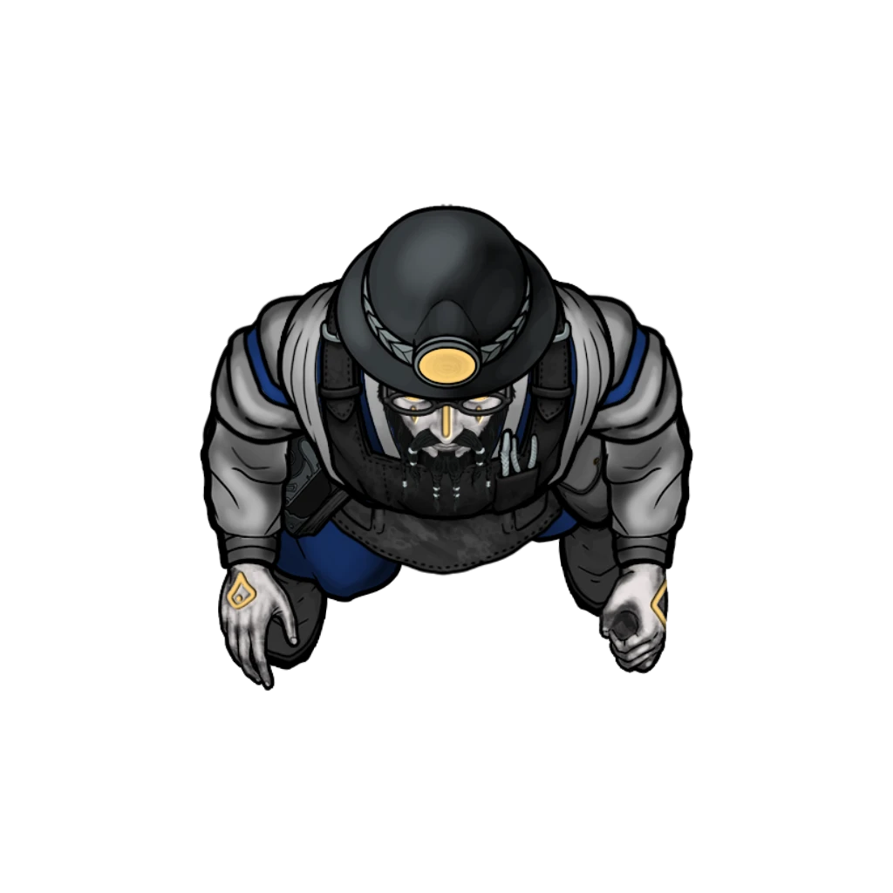
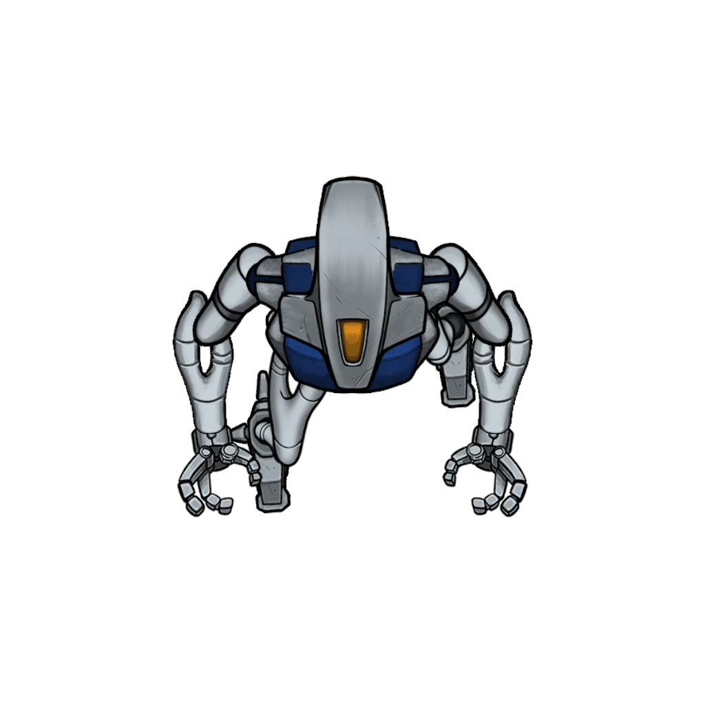

# Junkyard Cogs

> [!warning] Gamemaster
> #### Gamemaster's Summary
>
> This combat and exploration event pits the party against agents of the Silver Beam Consortium who operate a suspicious forge at the Scrapyard, a few miles west of Rock Bottom in the Sinkhole Depths. Here, they'll uncover the presence of a clandestine operation to turn Chessmen constructs into [[Silver Beam Servitor]]. In this event, the party can:
>
> - Surveil the Scrapyard and its inhabitants, which include [[Silver Beam Engineer]] and their celestial allies — a half-dozen [[Skither]] and a [[Vorg]].
> - Engage the Scrapyard's inhabitants, featuring a quartet of [[Silver Beam Servitor]], in combat.
> - Examine the local area for evidence that contributes to their investigation of the Renegade Construct.

### Entering the Scrapyard

> [!tip] Exploration
> #### Unowned Site
>
> A character with **Awareness (DC 14, Passive)** from afar reveals that — while the site is being operated by someone — there are no signs indicating precisely what the location is or who runs it. Defenses seem scarce, as there aren't any fences surrounding the location's perimeter. All the same, there's a sense that this is not a place that will be welcoming to visitors.

Entering the scrapyard is relatively easy, as there are no exterior guards; the remote, hidden nature of this forge is expected to be its best defense. However, once they breach the area's perimeter, the party will need to take care to stay unseen (or commit to fighting their way through the locals).

Two Silver Beam Engineers work here at the forge, and appear to be scrapping and sorting Chessmen parts. Characters can attempt to sneak, lie, or storm their way in.

> [!abstract] Silver Beam Engineer
> **[[Silver Beam Engineer]]**
>
> Level 4 · Automaton Servitor
>
> 
>
> Wearing a dark apron over a grey and blue uniform of the Silver Beam mining consortium, this technician is one of many hired to tackle technical issues for the company. Not outwardly armed or armored, they do have packs of tools and resources they can use to make field repairs and assist in the operation of Silver Beam machinery.

> [!info] Social
> #### Talking Their Way In
>
> The party can attempt to deceive their way into the Scrapyard's inner areas. Any appropriately-disguised character who succeeds on a **Deception (DC 16)** check is able to convince the Silver Beam Engineers of the their false identity as Silver Beam personnel.
>
> Appropriate disguises can be achieved via the following:
>
> - [[Silver Beam Uniform]], which can be acquired at the Silver Beam HQ in Upper Arcturel and at the Inkaro Pools.
> - Use of illusionary magic or items to mask a character's appearance and clothing.
> - Alternately, a Disguise Kit can be used , but the character has **-2 Banes**on the Deception check.

If the characters manage to talk their way in, they still won't be fully trusted by the Engineers and their allies, and must remain careful.

> [!danger] Hazard
> #### Under Scrutiny
>
> Since this location is hidden, and its operation largely a secret to the company, anyone coming here will be under higher scrutiny. If the party is caught taking hostile or suspicious actions, or speaking in a way that causes doubt to arise about the party's credentials the engineers will signal a floating construct to verify the party's identity.
>
> This results in the floating constructs coming to examine the party up close. If they do this, the party will only have about ten minutes before the Skithers are warned that the party is not with the company and combat breaks out.

> [!info] Social
> #### Talking to the Engineers
>
> As long as the party doesn't raise any suspicions, they can glean information about the operation from the engineers, learning the following:

If the party would prefer to observe the camp from the relative safety of cover and high ground, they may do so by climbing the rocks that surround the area.

> [!tip] Exploration
> #### Scouting From Above
>
> The stony ridges and high places around the scrapyard can be used as vantage points to scout the surrounding scrapyard and move around without being seen. The presence of cover allows for a modicum of concealment, as well.
>
> Reaching the high spaces requires the party to climb the stone faces which have plenty of handholds and perches to do so, posing no real difficulty to accomplish.

Whether the party chooses to sneak in, or stay hidden on the rocks above, the party will need to be careful not to be spotted.

> [!danger] Hazard
> #### Remaining Unseen
>
> To remain unseen characters must make successful **Stealth (DC 14)** checks to remain unseen by the denizens of the scrapyard. If a character is spotted, one of the wandering Skithers moves toward that location and investigate.
>
> Characters may have a brief window to relocate and hide. If they can get out of sight and successfully use the terrain to prevent line of sight to the Skither, they can retain their stealth.
>
> Otherwise, combat will break out, and the Skithers will alert the rest of the scrapyard instantly. If this occurs, refer to **Fighting Through** below for the tactics utilized by the denizens of the scrapyard.

### Observing the Operation

> [!abstract] Skither
> **[[Skither]]**
>
> Level 2 · Skither Servitor
>
> 
>
> Small and fast-moving, this creature seems at first like something to ignore, little more than a piece of trash with jagged wings crudely shaped to look like a insect. The creature's solitary eye and claw-like appendages seem to surge with fiery radiance as it strikes, leaving streaks of amber light in its wake.

> [!tip] Exploration
> #### Scrutinizing the Scrappers
>
> From this location they should be able to spot the following things:
>
> - There are about four constructs that was working the forge, moving materials, and shifting around inert constructs.
> - There are six strange winged mechanoids, three of them are using their sharp metal claws to shear parts of inert constructs off their frames, which the constructs take to the forge. The other three float around the scrapyard, watching things.
> - There are two humanoids wearing Silver Beam uniforms, they are making modifications to the central frames of constructs that are brought to them.
> - Once the work is done, the core and quenched metal pieces are piled into crates likely bound for Arcturel.

The party will likely want to try and make sense of what they are seeing, they can do this through various skill checks and knowledges listed below:

> [!tip] Exploration
> #### Making Sense of This
>
> Any character who succeeds on a **Arcana (DC 15)** or **`[[/skill wilderness 15]]`** check is able to recognize these strange winged creatures as outsider entities from one of the Inner Realms of the cosmos.
>
> - Characters with **Knowledge: Celestials** have advantage on this check.
> - Rangers whose favored enemy type is Celestials also have advantage on this check.
> - **Critical Success**: The character can recognize these creatures as Skithers, which often serve as couriers and spies for more powerful celestial entities of their native Inner Realm.
>
> Any character who succeeds on a **Awareness (DC 13)** **Science (DC 13)** check is able to recognize that the Silver Beam workers are effectively converting Chessmen into other constructs, but this primarily seems to entail a change to an automaton's outer structure. If internal augmentations exist, they must be examined more closely to understand.
>
> - Characters with **Knowledge: Machines** and **Knowledge: Forensics** have advantage on this check.
>
> Any character who succeeds on a **Deception (DC 13)** **Diplomacy (DC 13)** check is able to surmise that Silver Beam's blatant conversion of Chessmen designs might cause a significant controversy among the denizens and trade alliances of Arcturel, least of all Vartholomew Chess himself.
>
> - Characters with **Knowledge: Trade** and **Knowledge: Politics** have advantage on this check.

> [!warning] Gamemaster
> #### What's Happening Here?
>
> This is a Silver Beam operation where Chessmen worker constructs are cut apart. Their parts are reshaped into Silver Beam pieces, and their cores are modified to accept entropic pearls without suffering severe stability issues. Once done, the parts are transported back to the Silver Beam headquarters.

> [!warning] Gamemaster
> #### Gathering Evidence: Skither Remains
>
> Important evidence can be gathered here that can be used in support of Hew the Renegade Construct's exoneration. If the characters loot the Skither's Celestial Remains, record the appropriate Event Outcome. This physical clue plays a major role in the forthcoming [[Presenting the Evidence]] event.

### Eavesdropping on the Engineers

If the party manages to stay unseen but gets within 20 feet of the engineers, they can listen in on their conversation, this doesn't require a perception check to accomplish.

> [!quote] Read Aloud
> One of the engineers, while working on the core of a construct, faintly complains:
>
> > The mechanical eyeballs keep watching me.
>
> The second engineer, clearly the senior of the too, looks unbothered as they work.
>
> > I know, they watch me too. Just be glad they haven't tried talking to you.
>
> The junior engineer's work pauses as they look over.
>
> > They can do that?
>
> The senior engineer nods, their hands and tools never stopping.
>
> > Yeah but it doesn't sound like words, more like someone taking a hacksaw to an empty acid drum inside your head. Gave me headaches for a week. Just do the work and don't draw attention to yourself. Focus on that layer of evocation and divination channels. We need to get this next load of materials sent back to HQ.
>
> The pair lapse into silent work, the neither of them looking terribly happy about their assignment.

### Fighting Through

> [!abstract] Silver Beam Servitor
> **[[Silver Beam Servitor]]**
>
> Level 2 · Automaton Servitor
>
> 
>
> This humanoid construct is made of brushed silver steel with blue accents and bears the distinctive logo of the Silver Beam Consortium. It moves with a smooth precision punctuated with all the whirs and swishes of machinery hidden under it's glossy metal shell.

> [!abstract] Silver Beam Engineer
> **[[Silver Beam Engineer]]**
>
> Level 4 · Automaton Servitor
>
> 
>
> Wearing a dark apron over a grey and blue uniform of the Silver Beam mining consortium, this technician is one of many hired to tackle technical issues for the company. Not outwardly armed or armored, they do have packs of tools and resources they can use to make field repairs and assist in the operation of Silver Beam machinery.

> [!abstract] Skither
> **[[Skither]]**
>
> Level 2 · Skither Servitor
>
> 
>
> Small and fast-moving, this creature seems at first like something to ignore, little more than a piece of trash with jagged wings crudely shaped to look like a insect. The creature's solitary eye and claw-like appendages seem to surge with fiery radiance as it strikes, leaving streaks of amber light in its wake.

> [!abstract] Vorg
> **[[Vorg]]**
>
> Level 4 · Vorg Burrower
>
> 
>
> Seemingly endless segments of metal speed across the ground, dragged by the clicking and clacking of countless legs on each side and multiple pairs of surprisingly dexterous pincers. Within this metallic body, a orange-yellow glow is visible from the creature's pointed spine and through what passes for eyes, burning with a heat that emanates from its body into the nearby air.

> [!danger] Hazard
> #### Scrapping in the Scrapyard
>
> The fight in the scrapyard includes 4 [[Silver Beam Servitor]], 2 [[Silver Beam Engineer]], 6 [[Skither]], and a lone [[Vorg]]. The Vorg remains hidden for the first few round of combat, but emerges dramatically from one of the junk piles mid-fight.
>
> #### Construct Tactics
>
> The Silver Beam constructs prefer to get close, utilizing their [[Charged Claw]] and [[Claws]] to do most of the work subduing foes. It they need they can launch nets at targets to slow and restrain them with their [[Net]].
>
> The Silver Beam constructs explode on death thanks to their [[Radiant Death Burst]] feature, which looks nearly identical to when Skither's detonate, hinting at some similarities between them. The constructs are not aware that they explode on death, and don't make any efforts to avoid collateral damage when nearing death.
>
> #### Engineer Tactics
>
> The two [[Silver Beam Engineer]] use their [[Field Repairs]] ability to quickly repair Silver Beam constructs, keeping them in the fight.
>
> They also utilize their [[Restraining Bolt]] actions to shoot specially made bolts capable of shocking and briefly restraining enemies, leaving them vulnerable to attack.
>
> Neither engineer is willing to die for this fight, and attempt to surrender if they are **Broken** or **Weakened**. If they have no chance to give up, or it looks like they won't be spared, they'll try to flee instead.
>
> #### Skither Tactics
>
> The 6 [[Skither]] minions attempt to group up and swarm targets, focusing on one at a time until they are incapacitated. They prefer to target easier to hit enemies, leaving heavily armored targets for bigger combatants to deal with.
>
> Whenever a Skither is **Weakened** or **Broken**, or if it otherwise senses its defeat and destruction is imminent, it begins looking for ways to use its [[Sacrifice Self]] ability to deal as much damage to as many enemies as possible to turn the tide of battle. If at all possible, a Skither avoids harming allies with this action or its [[Radiant Death Burst]] feature.
>
> #### The Vorg Appears!
>
> After two combat rounds, a malicious [[Vorg]] emerges from one of the large piles of inconspicuous detritus scattered around the Scrapyard.

Once the Vorg appears in combat, read the following aloud:

> [!quote] Read Aloud
> A nearby pile of metal junk and scrap shudders, a golden light glowing within. A terrible, metallic roar pieces the air as a large creature made of dark metal erupts from the pile rusting metal and discarded material!

> [!abstract] Vorg
> **[[Vorg]]**
>
> Level 4 · Vorg Burrower
>
> 
>
> Seemingly endless segments of metal speed across the ground, dragged by the clicking and clacking of countless legs on each side and multiple pairs of surprisingly dexterous pincers. Within this metallic body, a orange-yellow glow is visible from the creature's pointed spine and through what passes for eyes, burning with a heat that emanates from its body into the nearby air.

> [!danger] Hazard
> #### Vorg Tactics
>
> Vorg are opportunistic predators that work the terrain of their hunting territory to their advantage. They will harry and herd their prey toward narrower passageways in order to make escape more difficult, and so they can better use their ability to burrow.
>
> A Vorg will typically initiate combat by either:
>
> - Emerging from a borrow very close to its prey to take advantage of its [[Burrower]] feature.
> - Dropping on its from above with a [[Clinging Grip]]
>
> A Vorg will attempt to flee if it is **Weakened** or **Broken**, but if it cannot escape, it will attempt to position itself as close to as many enemies as possible to ensure its [[Radiant Death Burst]] is effective.

Important evidence can be gathered here that can be used in support of Hew the Renegade Construct's exoneration. If the characters loot the Vorg's Celestial Remains, record the appropriate Event Outcome. This physical clue plays a major role in the forthcoming [[Presenting the Evidence]] event.

`[[/outcome evidenceRemains]]`

### Exploring the Scrapyard

There is nothing left in this scrapyard that has any inherent value.

> [!tip] Exploration
> #### Sorting the Scrap
>
> All of the scrap metal and parts have begun to rust and rot, and the empty barrels have long been emptied of whatever useful fuels they contained. Only the forge's tools are of any value, and even then, it's minimal.
>
> The modified frames of the constructs are too big and too heavy to carry, coming in at over 250 lbs, but there are a few damning pieces of evidence the party can find:
>
> - [[Chessman Scrap Metal]] consisting of Outer panels meant for the Chessmen constructs, bearing Vartholomew Chess' trademark and model numbers.
> - A copy of the [[Silver Beam Schematics]].
> - A [[Inkaro Pearl, Entropic]], which appears to have been used for testing the frames to make sure they still powered up.
>
> #### Examining the Schematics
>
> Characters who succeed on a successful **Arcana (DC 12)** **Arcana (DC 12)** check recognize that the schematics detail a change to some of the existing power regulation runes to account for a higher amount of power variance from the source (the inkaro pearl). This is atypical since inkaro pearls have a fairly predictable, linear power output when used as a battery.
>
> - Characters with **Knowledge: Machines** have advantage on this check.
>
> #### Examining the Inkaro Pearl
>
> At first glance, the inkaro pearl looks strange, its color a pale green.
>
> A successful **Awareness (DC 12)** check reveals that this inkaro pearl is inscribed with tiny markings. Characters with **Knowledge: Celestials** recognize the markings to be partially connected to the inner realm of Luxarum.
>
> Characters who succeed on a **Arcana (DC 15)** check notice that the pearl's magic has been externally altered, resulting in a more unpredictable nature. Transmutation magic has augmented the latent spirit energy in the pearls to foster stronger, more chaotic flows of power than a normal pearl.
>
> - Characters with **Knowledge: Artifacts** and **Knowledge: Subterranea** have advantage on this check, thanks to their familiarity with inkaro pearls.
> - Characters with **Knowledge: Machines** might suspect this magical augmentation could be damaging to constructs if used as a power source.

Important evidence can be gathered here that can be used in support of Hew the Renegade Construct's exoneration. If the characters loot the [[Chessman Scrap Metal]], mark the following outcome:

`[[/outcome evidenceScrap]]`

If the characters find the [[Silver Beam Schematics]], record the following outcome:

`[[/outcome evidenceSchematics]]`

These physical clues play an important role in the forthcoming [[Presenting the Evidence]] event.

### Concluding the Event

The party is free to explore the rest of the [[Sinkhole Depths]] for clues or to head back towards Arcturel.

> [!warning] Gamemaster
> #### Milestone
>
> Completing this event earns the party a [[Milestone Progression]], potentially advancing them in level.
>
> #### Next Steps
>
> If the party has not yet investigated all possible leads, they may track down more clues in [[Poolside Predicaments]].
>
> Once they've gathered enough clues, the party must return to Arcturel to trigger the [[Presenting the Evidence]] event during which they can provide proof that either absolves or condemns the Downsiders for their so-called crimes.
