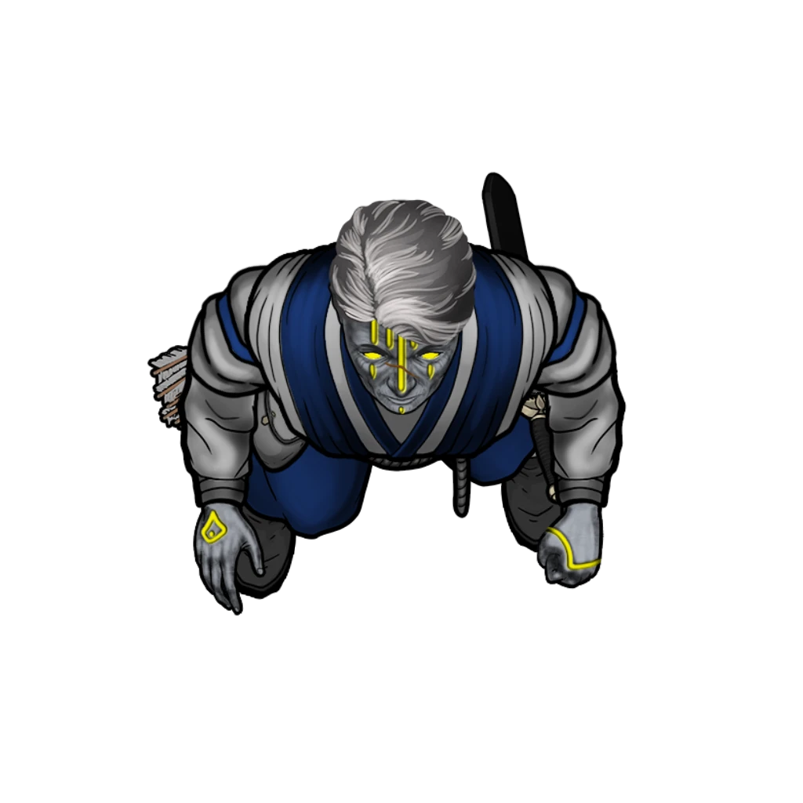
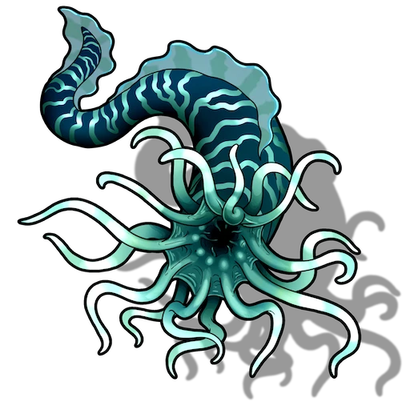
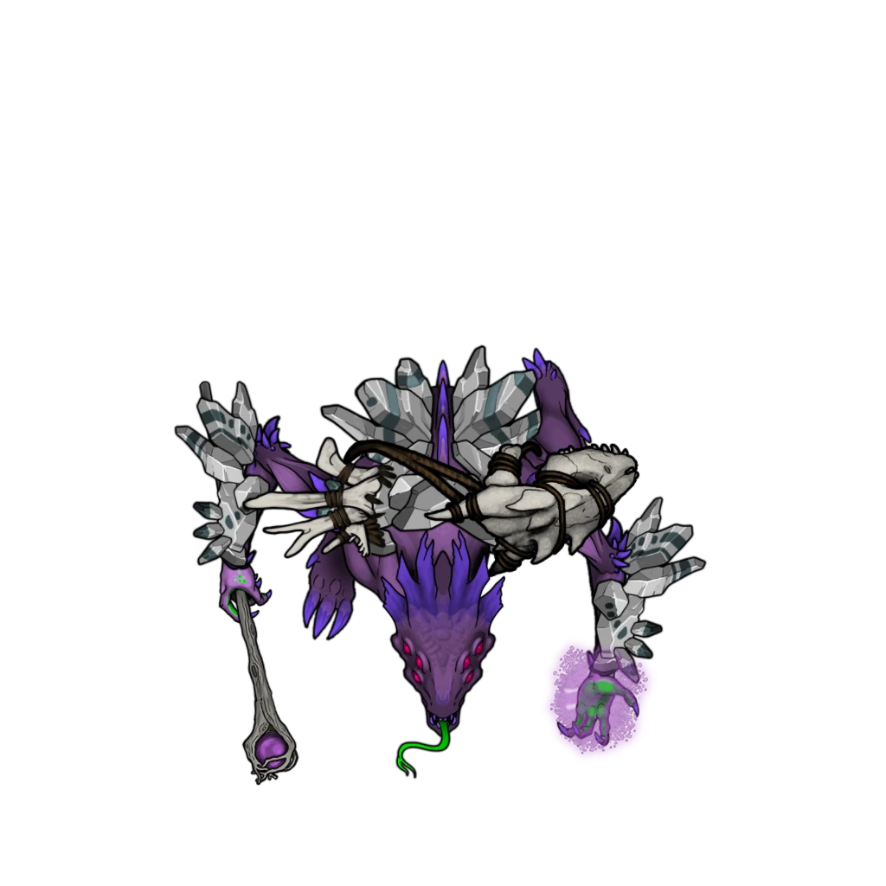
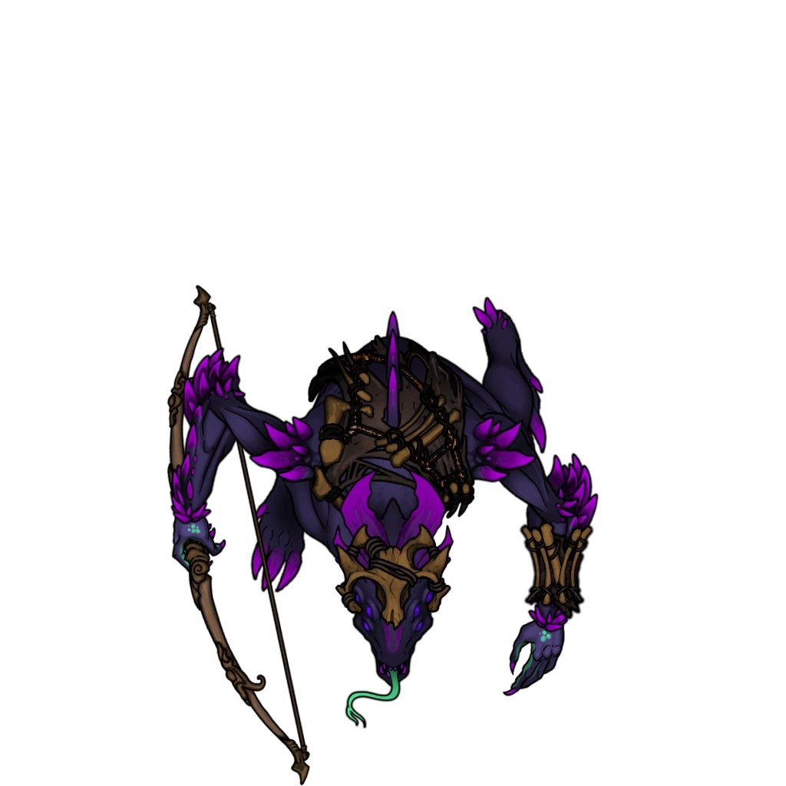
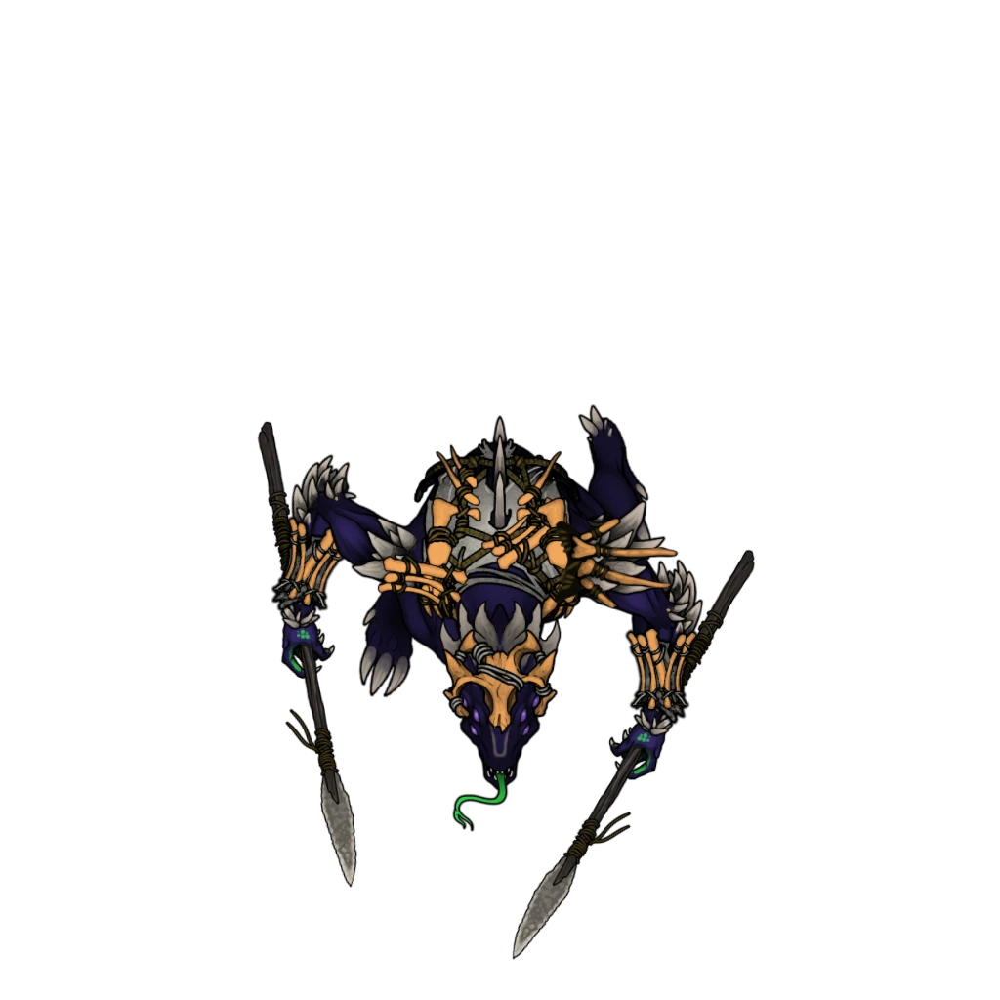

# Poolside Predicaments

> [!warning] Gamemaster
> #### Gamemaster's Summary
>
> This combat and social event takes the party to the Silver Beam Consortium's [[Inkaro Pools]] in the Sinkhole Depths, where they must investigate the scene of yet another accident involving Chessman constructs. This effort is interrupted by the untimely attack from a band of [[Jurtak]] raiders. In this event, the characters can:
>
> - Meet with the foreman Zirca Bronzebellow for a report of what happened here.
> - Learn more about the region's [[Inkaro Pearl, White]] trade with a first-hand account of their cultivation and the beasts that produce them: the subterranean [[Mootap]].
> - Investigate the scene of a fatal accident involving a [[Silver Beam Engineer]], a Mootap, and a malfunctioning [[Chessman]].
> - Drudge the damaged Chessman from the depths of the Inkaro Pool in search of clues about its malfunction and demise.
> - Survive a surprise attack by a raiding party of 3 [[Jurtak Hunter]], 3 [[Jurtak Warrior]], and a [[Jurtak Geomancer]].
> - Walk away with the [[Inkaro Pool Mandate]], an important piece of evidence that connects the situation here to Silver Beam machinations.

### Speaking to the Foreman

The first step of the party's investigation includes a conversation with the foreman Zirca, who can provide a modicum of information about what previously transpired here (along with some basic details about the Silver Beam's mining and harvesting operations).

Following the readaloud of "Setting the Scene," the 4 Silver Beam Guards and sole Silver Beam Engineer on duty here return to their appointed stations.

> [!abstract] Silver Beam Engineer
> **[[Silver Beam Engineer]]**
>
> Level 4 · Automaton Servitor
>
> 
>
> Wearing a dark apron over a grey and blue uniform of the Silver Beam mining consortium, this technician is one of many hired to tackle technical issues for the company. Not outwardly armed or armored, they do have packs of tools and resources they can use to make field repairs and assist in the operation of Silver Beam machinery.

> [!abstract] Silver Beam Guard
> **[[Silver Beam Guard]]**
>
> Level 3 · Automaton Lawkeeper
>
> 
>
> Clad in the grey and blue uniform of the Silver Beam mining consortium, this guard is one of many hired security personnel entrusted with the safety of the company's operation. They stand ready with steel maces and light crossbows, and don't wear any visually obvious armor.

Failed to embed content from 'Scene.emberSinkholeDep.Token.NgLCEJHzUxlHDUL5.Actor.6NOp0fdZPcSnGzO7'.

> [!info] Social
> #### Conversation with Zirca Bronzebellow
>
> **Zirca Bronzebellow** (Neutral Good, Arcturian Hulg'run, she/her) is the obstinate foreman of the Inkaro Pools here, and was appointed when the Silver Beam Consortium first purchased the rights to the subterranean land holdings. Zirca is a somewhat neutral figure, torn between the goals of satisfying her superiors in Upper Arctural and maintaining productivity among the workers in the pools. She's neither heartless or cruel, but tows the company line with self-serving gusto.
>
> If the party points out they are here on behalf of Zodi Trask, Zirca expresses annoyance.
>
> > Of course House Cevher's got some cronies down here poking around. Look, there's a lot I can't tell you because I like having a job, but I'm not going to turn away help. Just know that I'll be watching you, and I won't tolerate anything that looks like disruption or sabotage.
>
> If the party lies about being here on behalf of the Silver Beams they'll need to make a group**Deception (DC 14)** check. If successful, Zirca is grateful for the help, but dubious about bringing in outside mercenaries.
>
> > I know mercenaries are part of Cevher's recipe for success, but understand that I'm not a fan. No offense, I just prefer having the in-house security employees handle this kind of stuff. Still, I'm grateful for the help here. As you can see, things are a mess.
>
> If asked about the situation going on in the pools, Zirca lays things out.
>
> > One of the constructs went haywire, spooked a Mootap. It got aggressive and lashed out, killing one of the pool workers. The construct tried to defend the worker, injuring the Mootap, which made it even more aggressive. Before we knew it person was dead and the construct's destroyed. I've closed the pool and moved work to other pools for the time being.
>
> If asked about the construct and its issues, Zirca is forthcoming:
>
> > It was a Chessian model, and yeah I've been appraised of the issues they are having. In fact I pulled all of them out of the pools. I don't have enough Mark-One models to fill the gaps though. Hopefully production spools up on those.
>
> If asked about the Mark One constructs:
>
> > I don't know much about them, but they are Silver Beam made so that's something. From what I've heard they are sturdy, smart, and haven't given us any problems so far. I'm expecting the company to phase out all the Chessmen and replace them with the mark ones over time.
>
> Regarding the dead worker, Zirca is pragmatic:
>
> > The body's still in the Mootap, and no I haven't made any attempts to pull it out. I'm not asking anyone to pull a dead body out of the mouth of a hurt Mootap. Don't want more people to die, besides there's probably nothing left at this point.
> >
> > Mootaps tend to crush their food in their mouths and then slowly digest them. You're not pulling anything resembling a person out of its gullet at this point. I don't like it, but that's the reality right now. We don't have these kinds of problems usually, even with pearl diving being inherently dangerous.
>
> Regarding the destroyed construct:
>
> > Still in the pool. Once the Mootap has cooled down, I'll consider dragging it out. If you want to go try, be my guest. I'll just flag it for scrap though, because there's no way it's fixable.
>
> If the party asks about the pools being run by Silver Beam, Zirca gives the short answer:
>
> > The town controls who has the contracts to extract pearls here. Used to be House Cevher until a few months ago, then Silver Beam managed to negotiate their way into a partial stake and eventually got all of the contracts from Arcturel recently. If the party asks about Zirca herself, her answer is straightforward:
>
> If the party asks about Zirca and her background, it's not especially exciting:
>
> > I was an independent contractor working as an assistant foreman to the pools when Cevher had all the extraction rights. When it flipped to being wholly Silver Beam operated they offered me a nice raise and a chance to run the pools entirely. They've been pretty good to me so far, but they did fire all the pearl divers and replaced them with constructs, which is a shame.
>
> Asking about the pool operation, she can elaborate:
>
> > The pools are worked by a team of constructs, and each pool is overseen by a Silver Beam engineer. I'm the pool foreman who makes sure things are all running smoothly. It's a pretty neat and tidy setup. Before Silver Beam came in the pools were worked by divers, and the work was way more dangerous.
>
> #### Zirca's Orders
>
> A successful **Diplomacy (DC 12)** check verifies the integrity of Zirca's stance, but also suggests that she's withholding some additional information from the party.
>
> Any character who makes a successful **Diplomacy (DC 13)**, **Deception (DC 13)**, or **Intimidation (DC 13)** check is able to convince Zirca to reveal the source of her trepidation: the [[Inkaro Pool Mandate]], which she presents to the party with a minor amount of heistation.
>
> - Characters with **Knowledge: Intrigue** or **Knowledge: Subterranea** have **+2 Boons**.
> - Alternately, a character can offer Zirca a bribe of 1 gp or more to automatically succeed.
>
> Zirca's opinions about the mandate are fairly straightforward:
>
> > Ever since I joined up with Silver Beam, it's been nothing but hassles and headaches. If this document can help sort this whole mess out, it's yours. Just don't mention I gave it to you.

### Recovering the Evidence

Before the party can examine the destroyed construct, they'll need to remove it from the bottom of the inkaro pool where it was destroyed. Unless the party has powerful magic or other tools at their disposal, this task might require some time-consuming effort (such as diving, dredging, etc), but doesn't require any specific skill checks or challenges to accomplish.

The large, central pool where the accident occured is inhabited by 2 [[Mootap]], and is currently tended by 2 [[Silver Beam Servitor]]. Another pool nearby hosts its own Mootap, but that area is separate and distinct from the actual scene of the crime.

> [!tip] Exploration
> #### Dredging the Chessman
>
> The party can search the floor of the central inkaro pool to recover the destroyed Chessman and the dead Silver Beam worker. The destroyed Chessman is easy enough to locate and reach, and there are ample ropes and chains nearby that can be used to extract it from the pools.
>
> The construct body weighs 450 lbs by itself, and will likely need to be hoisted out of the water by the party using ropes, pulleys, and other methods. Fortunately, this area has the necessary hardware and terrain to support that effort.
>
> Once the destroyed Chessman has been extracted, the party can examine the remains — but not before an untimely attack from a Jurtak raiding party, who has set their abyssal sights on ravaging the humanoids of Arcturel and their efforts to expand throughout the Sinkhole Depths.

> [!abstract] Silver Beam Servitor
> **[[Silver Beam Servitor]]**
>
> Level 2 · Automaton Servitor
>
> 
>
> This humanoid construct is made of brushed silver steel with blue accents and bears the distinctive logo of the Silver Beam Consortium. It moves with a smooth precision punctuated with all the whirs and swishes of machinery hidden under it's glossy metal shell.

> [!abstract] Mootap
> **[[Mootap]]**
>
> Level 6 · Mootap Herd Beast
>
> 
>
> An eyeless creature appears out of nowhere, resembling a stubby eel crowned with a head of two dozen luminous tendrils like those of a giant anemone. These photophore tentacles writhe with inhuman glee as it reaches blindly into the water ahead.

> [!danger] Hazard
> #### Hazard: Live Mootaps
>
> The Mootaps in this area are inherently territorial and hostile to intruders beyond the The Silver Beam Servitors that work the pools.
>
> The mootap in the pool with the destroyed construct is not interested in the party, and will leave them alone if they avoid it. However, if the party insists on getting close, the mootap will expel the remains of the dead engineer and retreat to another side of the pool.
>
> The remains of the engineer are more goo and gore than identifiable humanoid, and quickly fill the pools with a terrible red bloom that sullies the water and turns the stomachs of anyone caught in it.

> [!warning] Gamemaster
> #### Inkaro Pearl Harvesting
>
> The harvesting of [[Inkaro Pearl, White]] is a dangerous task, which is why the industry of pool diving and pearl farming is both perilous and profitable.
>
> Any character who succeeds on a **Wilderness (DC 15)** check is able to successfully harvest Inkaro Pearls from the maw of a live Mootap, and must roll on the [[Mootap Nucleation]] table to determine precisely what they find.
>
> - Characters with **Attunement: Akon**, **Knowledge: Beasts**, or **Knowledge: Subterranea** have **+2 Boons**.
> - **Failure by 5+**: the Mootap immediately becomes hostile towards the character.
> - Characters with fresh wounds or bloodstains (i.e. characters who have less than their total number of hit points) have **-2 Banes**.
>
> A Mootap's disposition is most often determined by their immediate surroundings and current predicament. These 2 Mootaps in the central pool are predisposed for savagery based on recent events, and are more likely to attack interlopers during the investigation.

### Jurtak Attack!

No time for investigation! As soon as the party has successfully recovered the destroyed Chessman from the bottom of the central Inkaro Pool (by whatever means necessary), they're attacked by a party of raiding Jurtak — abyssal reptilians driven by an insidious, biological urge to wreak havoc. This group contains 3 [[Jurtak Hunter]], 3 [[Jurtak Warrior]], and a[[Jurtak Geomancer]].

The 4 [[Silver Beam Guard]], 2 [[Silver Beam Servitor]], and lone [[Silver Beam Engineer]] who work the area must survive the assault themselves, but Zira Bronzebellow isn't so lucky: she's killed during the initial onslaught.

Once the body of the destroyed Chessman has been dredged out of the water and placed on dry land, read the following aloud:

> [!quote] Read Aloud
> The body of the damaged construct is laid before you, covered in the lambent muck of the murky inkaro pool he'd fallen into some time ago. The frame seems to have been crushed and bent in ways you never would have imagined for such a sturdy machine. Some of the chassis has been dented and upturned, exposing the Chessman's mechanical innards to the subterranean elements.
>
> Zirca Bronzebellow strides forward to rejoin your group and take a closer look at the warped wreckage herself. The skeptical Hulg'run leans in with a scoff:
>
> > That's one hell of an underbite …
>
> Just then, the air grows remarkably quiet. Too still, even for the lightless reaches of the Sinkhole Depths. But before you can even blink, a violent whistling sound shoots through the cavernous hollow, terminating at Zirca's stony head — which shatters with a horrible snapping sound as a sharp volcanic rock the size of a fist cracks it wide open. She falls to the ground, dead as a doornail.
>
> You instantly and acutely become aware of the origin of this fatal missile … A bipedal saurian sneers in victory to the north, clad in stone armor, clutching a crystal-tipped staff of withered and petrified wood. This geomancer is flanked by warriors of a similar ilk, and you hear another sound to the south: a grievous, chittering orchestra of clattering claws.
>
> Seven of these primeval assailants have their weapons drawn, and look hungry for the kill. The heat of battle is upon you, and the need is quite apparent: be swift, or die trying.

> [!abstract] Jurtak Geomancer
> **[[Jurtak Geomancer]]**
>
> Level 5 (Elite) · Jurtak Geomancer
>
> 
>
> The tall, six-eyed saurian before you clutches a gnarled staff crowned in a jagged crystal of lambent crystal. This loathsome creature is coated in thick, jagged stone that appears to be growing out of its very hide, forming an unnatural armor.

> [!abstract] Jurtak Hunter
> **[[Jurtak Hunter]]**
>
> Level 3 · Jurtak Brigand
>
> 
>
> Lurking at the boundary of shadow and light, this lithe saurian creature's six piercing eyes gleam with a dreadful intelligence. At the ready, it cradles a bow lashed together from wood and bone, strung with taut sinews. Adorned in skeletal remnants, it appears equal parts hunter and horror.

> [!abstract] Jurtak Warrior
> **[[Jurtak Warrior]]**
>
> Level 4 · Jurtak Berserker
>
> 
>
> You behold a lean, six-eyed saurian creature, its body clad in fragments of bone and its scales glinting in the dim light. The acrid scent of poison tinges the air, dripping from the bone blade held in its clawed hands. Its long, semi-prehensile tail moves with a predator's anticipation, and a forked tongue flicks across twisted lips as its eyes fix upon you with a predatory malice.

> [!danger] Hazard
> #### Jurtak Tactics
>
> The[[Jurtak Geomancer]] acts as the leader of this group, and will issue commands to the other Jurtak throughout the course of battle. Even if the Geomancer falls during combat, the other members of the Jurtak raiding party will fight until only two of them remain — choosing to retreat if possible at that time.
>
> The Geomancer begins battle with**Kinetic Ward** cast on itself.
>
> Confident in the protection its spell offers, its armor, and its ability to use composed earth, kinesis, and flame spells to mitigate damage to itself while bombarding its foes.
>
> While it relies primarily on **Earthen Arrow**, **Earthen Strike** and **Arrow of Flame** as its main source of attacks, if enemies group up, it uses **Earthen Fan** to hit as many as possible.
>
> The [[Jurtak Warrior]] fight by hurling their [[Javelin]] before equipping their [[Glaive]] while closing distance. Once in close range they rely on their pikes and the extended reach those pikes grant to full effect. If enemies bunch up they'll use their [[Acid Spit]] to hit multiple enemies.
>
> The [[Jurtak Hunter]] fight from a distance, using their [[Longbow]] to rain arrows down on foes, ideally from high ground. If engaged in close combat, they will [[Bite]] and [[Claws]] and until they can get free. If it's available, they will use their [[Light Weapon Training]] against foes, especially if cornered or when a nearby enemy appears especially vulnerable to attack.
>
> All Jurtak start combat with their first weapon attack coated in [[Jurtak Poison]]. They reapply it before attacking if they can spare the action to do so, and aren't currently engaged by combatants in close range.
>
> If **Broken** or **Weakened** the Jurtak will break and flee.
>
> #### Mootap Tactics
>
> The pools all contain Mootaps which keep to themselves during the fight, only becoming aggressive if a creature enters their pool. Any creatures that enter their pools will be attacked if the Mootap can get within range before they leave the water.

#### Orbis Attunement: Mootap Hazards

If the party utilizes the hazardous Mootap pool during the fight to help them defeat the Jurtak, each character who exploited this strategy advances their **Attunement: Orbis (+1)** at the conclusion of the event.

### After the Assault

Once the smoke of battle has cleared, the party is free to to examine the destroyed Chessman and other details of the crime scene. During this aftermath, the characters can discover that the construct's chest was damaged *before* the Mootap was involved. One thing is clear: someone wanted to obscure or vandalize the Chessman's internal components.

> [!tip] Exploration
> #### Examining the Chessman
>
> When the party can finally take a closer look at the crumpled body of the destroyed Chessman, they'll readily notice the following:
>
> - The chest armor of the construct has been so thoroughly damaged, some effort will be required to open it for further inspection.
> - The remnants of three Restraining Bolts remain attached to the chassis of the construct.
>
> Any character who succeeds on a **Awareness (DC 12)** check while examining the damaged construct is able to notice that the Restraining Bolts attached to the chassis are from the Silver Beam Engineer's [[Restraining Bolt]] attack. Additionally:
>
> - **Critical Success**: Much of the damage to the construct was caused by a Mootap's bite, but some of the damage to the chest armor appears to be caused by some kind of tool or weapon.
> - Characters with **Knowledge: Crime**, **Knowledge: Forensics**, **Knowledge: Machines**, or **Knowledge: Tracking** have **+2 Boons**.
>
> #### Opening the Chassis
>
> In order to open the damaged Chessman's chassis, a character must either succeed on a **Science (DC 14)** check or tear it open with a successful **Athletics (DC 18)** check using a [[Compendium.crucible.equipment.Item.crowbar000000000]]
>
> - Characters with **Knowledge: Crafts** or **Knowledge: Forensics** have **+2 Boons**.
> - Characters with **Knowledge: Machines** automatically succeed.
>
> #### Inside the Chessman
>
> Any character who succeeds on an **Awareness (DC 13)** check while examining the damaged construct is able to notice the following details:
>
> - The extra Restraining Bolts on the chassis suggest that the Chessman was malfunctioning or disobeying orders, and extra bolts were used in an aggressive attempt to pacify the construct.
> - They can deduce that Chessmen use [[Inkaro Pearl, White]] as a primary power source (if they didn't already have this information). A strange [[Inkaro Pearl, Entropic]] has been installed in this construct, but the character is unaware of this curious pearl's origin or qualities.
> - Characters with **Knowledge: Forensics** or **Knowledge: Machines** have **+2 Boons**.
>
> #### The Entropic Pearl
>
> Characters who have previously discovered an [[Inkaro Pearl, White]] will instantly recognize that the [[Inkaro Pearl, Entropic]] in this damaged construct's chest cavity looks rather strange compared to the others they've seen. But further research is necessary to determine other details.
>
> Any character who makes a successful **Arcana (DC 16)** check is able to determine that this sickly green pearl is a modified version of a regular Inkaro Pearl of some kind, augmented by some unknown force like strange transmutation magic, bizarre alchemy, or preternatural influence.
>
> - Characters with **Attunement: Luxarum** or **Knowledge: Rituals** have **+2 Boons**.
> - Characters with the [[Recognize Spellcraft]] talent automatically succeed.
>
> #### Zirca's Orders
>
> The first character who takes the time to inspect Zirca Bronzebellow's corpse will find the [[Inkaro Pool Mandate]], folded inside a pouch on her belt.

`[[/outcome evidencePools]]`

### Concluding the Event

Once the party has finished their investigations around the now deserted pools, they can get going.

> [!warning] Gamemaster
> #### Gathering Evidence: Inkaro Pool Mandate
>
> Important evidence can be gathered here that can be used in support of Hew the Renegade Construct's exoneration. If the characters loot the [[Inkaro Pool Mandate]], record the appropriate Event Outcome. This physical clue plays a major role in the forthcoming [[Presenting the Evidence]] event.
>
> #### Next Steps
>
> The party is free to explore the rest of the [[Sinkhole Depths]] for clues, gathering information during the events of [[A Peculiar Encampment]] and [[Junkyard Cogs]] if they have yet to do so.
>
> Once they've gathered enough clues, the party must return to Arcturel Lower to trigger the events of [[Presenting the Evidence]], during which time they can provide proof that either absolves or condemns the Downsiders for their so-called crimes.
