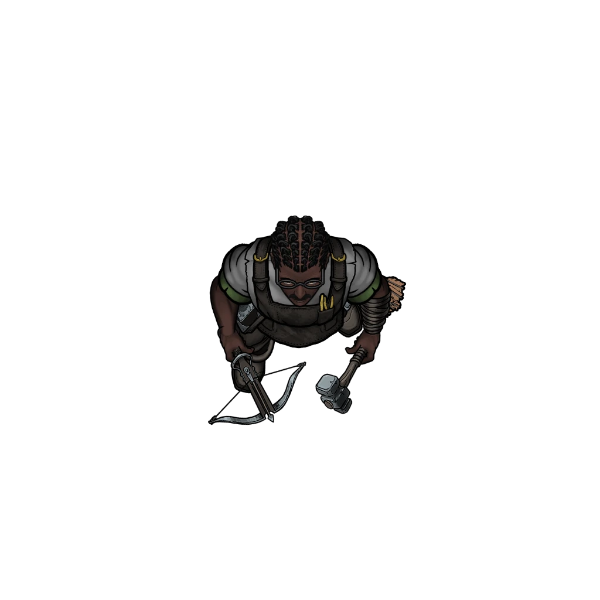

# Rumors in Rock Bottom

> [!warning] Gamemaster
> #### Gamemaster's Summary
>
> This social and exploration event allows the party to continue their investigation into the Renegade Construct's so-called murder of Kellan Lorde by visiting the scene of the impact in Rock Bottom — a tent town that resides below Arcturel on the sinkhole floor. In this event, the characters can:
>
> - Gather rumors from locals about the scene of the impact, where Kellan Lorde and the Renegade Construct are said to have hit the ground after their perilous fall.
> - Investigate the scene of the impact itself for forensic evidence and signs of the Renegade Construct's survival.
> - Encounter a mushroom farmer named [[Ifton Shepp]], a retired artificer who aided the constructs before sending them on their way.

### The Itinerant Spelunkers

If the party approaches the itinerant spelunkers — a human [[Scout]] named **Thura** and a Kiska [[Fighter]] named **Beet** — the characters will be able to quickly learn about the "final" location of the crime scene, where Kellan and the Renegade Construct fell to the sinkhole floor, along with a few generalized pieces of information about Rock Bottom itself.

> [!quote] Read Aloud
> You take a closer look at the rambunctious wine-swilling duo on the boardwalk. An aged Kiska soldier lovingly cradles the wine bottle like a newborn babe, while a younger human next to him tries to playfully snatch it away. This tawny-haired young man is clad in loose Arcturian leathers, and his Kiska companion wears mismatched pieces of Lowland splint mail. These two bleary-eyed revelers strike you as accomplished subterannean scouts, despite their current state of reckless abandon.

> [!info] Social
> #### What the Spelunkers Have Seen
>
> If the party mentions their investigation to **Thura** (Chaotic Neutral, Arcturian Human, he/him) and **Beet** (Chaotic Neutral, Arcturian Kiska, he/him), the itinerant spelunkers are willing to share some information, culminating in general directions to the scene of the impact:
>
> > The young scout shoots you a swift glance at your mention of the Renegade Construct, a look marked by equal parts curiosity and recognition … "Well, there's a giant crater in the boardwalk a stone's throw away from here, if that's what you're talking about," he says.
> >
> > The Kiska takes a swig from the wine bottle and offers a few words of his own without looking up:
> >
> > "Cevher and Silver Beam sent a search team down to check it out, but their findings were … what did they call it, Thura?"
> >
> > "Inconclusive."
> >
> > "That's right. 'Inconclusive'. Like every mystery in Rock Bottom."
> >
> > Thura the scout snatches the bottle and takes a big draught of his own. "All the same, we're happy to point you kind folks towards the crater. And it goes without saying …"
> >
> > The Kiska interrupts: "But he'll say it anyway."
> >
> > "A donation would certainly help your cause." The young scout flashes a black-toothed grin in salutation.
>
> A successful **Diplomacy (DC 13)** check suggests that Thura and Beet are being sincere with the party.
>
> Characters who succeed on a [**Diplomacy (DC 13)**, **Deception (DC 13)**, or **Intimidation (DC 13)** check are able to compel Thura and Beet to reveal more, as indicated below. Any character who offers a "donation" of at least 5 gp (or another bottle of wine) automatically succeeds on these Charisma checks. Additional information includes:
>
> - Mutual suspicion about Silver Beam and House Cevher operations in the Sinkhole Depths.
> - A general distrust for the authority of House Cevher in Arcturel. Zodi Trask is an amiable enough fellow, but he's a puppet of Trading House industrialism.
> - An explanation of Rock Bottom's ramshackle culture of wayward travelers and lost causes.

If the characters don't speak with the spelunkers but choose to look around Rock Bottom for themselves, they can still locate the scene of the impact; it just takes a short while longer.

> [!tip] Exploration
> #### Exploring the Scene of the Impact
>
> Any character who spends 30 minutes to search Rock Bottom and makes a successful **Awareness (DC 15)** check is able to locate the scene of the impact without assistance.
>
> > The scene of the impact is recognizable as a section of wooden boardwalk marked by splintered wooden planks surrounding a large hole. The fragmented wooden planks are stained with blood, and the impact appears to have left a nearly 10-foot-wide shallow basin.
>
> Characters can examine the impact site for clues and other details:
>
> **Awareness (DC 13)** The character can spot heavy gouges in the wooden boardwalk near the impact that match the hard angles of a Chessman's chassis, along with an indentation in the ground beneath the boardwalk that roughly matches the outline of an adult humanoid. Gallons of blood appear to have seeped into the earth below.
>
> - **Critical Success**: A loose scattering of components that could be from a Chessman construct (small bolts, nuts, and wires) can be found trailing away from the impact site to the northeast, towards Ifton Shepp's Mushroom Farm.
>
> **Science (DC 13)**The character is able to confirm the site as the location of an impact from a humanoid and a construct, via the splinter patterns in the boardwalk, the splash patterns and directional splatter of blood, and a rough estimate of the parabolic approach vector of the falling victims.
>
> - **Critical Success**: The loose scattering of components that trail off to the northeast towards Ifton Shepp's mushroom farm appear to match the materials used in the manufacture of Chessmen.
> - Characters with **Knowledge: Forensics** have advantage on this check.
>
> **Society (DC 15)** The character is familiar enough with Arcturel and Rock Bottom to know that this impact site is recent enough to match the timeline of events surrounding the accident in Lower Arcturel.

Once the party has had enough time to search the scene of the impact, they can continue their investigation by following leads to the mushroom farmer Ifton Shepp, who cultivates a farm nearby.

### The Mushroom Farmer

If the party decides to approach the mushroom farm, they'll meet some of Rock Bottom's most interesting characters — the disgraced artificer [[Ifton Shepp]] and his [[Woven Construct]] companion named **Totter**. Not only does Ifton Shepp have a past that's intertwined with Vartholomew Chess and the Silver Beam Consortium, his recent run-in with the Renegade Construct makes him a person of significant interest.

> [!quote] Read Aloud
> You survey the earthen sprawl of a modest mushroom farm that occupies a lonely corner of this derelict tent town. A field of edible greencaps and sprite-stools grow here in lush abundance, tended by a squat construct made of rustic timber, who brandishes a spade with stoic proficiency.
>
> A few small tents conceal what are likely the dwelling and storage areas of whoever lives here, and you regard a few crates of newly harvested mushrooms nearby. A tiny wisp of smoke trails up from what must be a cook's fire pit inside, as the hearty smell of mushroom stew also suggests. The wooden automaton continues in its work, undeterred and nonplussed by your arrival.

The characters have a moment to visually inspect the area before meeting the mushroom farm's residents.

> [!tip] Exploration
> #### Surveying the Mushroom Field
>
> Any character who succeeds on a **Awareness (DC 13)** check is able to notice a few details of interest:
>
> - The character catches a brief glimpse of someone inside the tent, looking out at the party through a darkened flap, but briefly illuminated by the fire pit inside.
> - One crate among the mushroom crates is stocked full with what appears to be lumber.
> - **Critical Success**: The person inside the tent was a cloaked human with a masculine silhouette. The lumber in the crate resembles loose or replacement parts for the wooden construct that works the field.
>
> Any character who makes a successful **Society (DC 17)** check knows the tale of an ex-assistant of Vartholomew Chess named Ifton Shepp, who took residence in Rock Bottom after the two artificers had a falling out. Rumor has it that Shepp runs a mushroom farm nearby. Perhaps this is that very farm.
>
> - Characters who succeed on this check gain advantage on skill checks made to observe and influence Ifton Shepp (see "A Conversation with Ifton Shepp" below).
>
> A successful **Wilderness (DC 15)** check allows a character to locate some curious tracks at the perimeter of the farmyard. Since it doesn't rain here in Rock Bottom, the soil is rarely upturned.
>
> - There are heavy booted footprints here that don't match the footprint of the wooden construct that works in the field. It's possible they match the humanoid inside the tent, but it's hard to say. The depth of the tracks suggests that whoever left them is quite heavy.
> - The tracks appear to head eastward into the Sinkhole Depths, and there are more outgoing tracks than incoming ones.
> - **Critical Success**: There are four distinct sets of tracks that look remarkably similar, recognizable from each other by their age and the most minor of physical inconsistencies. The oldest tracks are several months old, while the newest seem to have been left here a week ago or less.

If the party approaches the wooden construct or the tents, or after they've surveyed the area for a few minutes, they'll be promptly greeted by the mushroom farm's owner — the semi-retired artificer known as Ifton Shepp.

> [!quote] Read Aloud
> The wooden construct looks up toward the sound of booted footsteps on the boardwalk. You follow its gaze to see someone emerging from the darkened tent, a cloaked humanoid whose cautious yet comfortable body language suggests an utmost familiarity with this place. He approaches you, and speaks:
>
> > Hello, travelers. I see you've met Totter.
>
> He glances toward the construct, who looks up with a shrug of benevolent indifference, before sizing you up once more.
>
> > You seem to be a bit lost. Or do you simply seek the finest mushrooms the Depths have to offer? I'm afraid there's little else for you here. And while I usually sell my wares in bulk, it seems like a fine day for exceptions.

> [!abstract] Ifton Shepp
> **[[Ifton Shepp]]**
>
> Level 2 · Human Commonfolk
>
> 
>
> Wearing a dark apron over grease stained tunic and pants, this technician looks ready to tackle any technical issues put in front of him. Not outwardly armed or armored, he has a pack of tools on-hand to make field repairs if necessary.

> [!info] Social
> #### A Conversation with Ifton Shepp
>
> The hermetic mushroom farmer known as Ifton Shepp is one of Rock Bottom's most well-known and self-reliant citizens, known to keep the company of his construct companion Totter and few others. Once the characters reveal their intentions about the investigation, Ifton Shepp has the following to say:
>
> > "Well, they say everything hits Rock Bottom sooner or later … The name's Shepp. Ifton Shepp. And yes, I've heard about this 'renegade' Chessman and the accident upstairs. They say the miner didn't survive the fall, and as far as we locals can tell, there wasn't much left to find.
> >
> > So, while it's been nice meeting you all, I have some mushrooms to feed. If you don't mind, I'll respectfully bid you a farewell."
> >
> > The lonesome mushroom farmer turns back to his field.
>
> A successful **Diplomacy (DC 13)** check suggests that Ifton Shepp is hiding something from the party.
>
> - **Critical Success**: Ifton Shepp keeps glancing towards the crate of body parts and the wooden construct, as if they've occupied his thoughts since you mentioned the Renegade Construct.
>
> Any character who succeeds on a **Diplomacy (DC 15)**, **Deception (DC 15)**, or **Intimidation (DC 15)** check is able to compel Ifton Shepp to reveal more information, some of which is detailed below.
>
> - A character who presents a [[Chessian Souvenir]] to Ifton Shepp automatically succeeds on these checks.
> - Characters with **Knowledge: Machines** and **Knowledge: Subterranea** have advantage on these checks.
> - **Ancestry: Altyra** characters have disadvantage on this check.
>
> The information Ifton Shepp provides includes the following:
>
> - Not only did the Renegade Construct come through here, Ifton Shepp provided direct assistance to the damaged automaton before sending them on their way.
> - The "Renegade Construct" has a name, and their name is Hew.
> - Hew has gained sentience, most likely through the strange Inkaro Pearl that was found inside the construct's chassis, dubbed an [[Inkaro Pearl, Entropic]]. Shepp still has one of these Entropic Pearls to offer the party for inspection, but the rest were cast down into a bottomless refuse crevasse on the southern edge of town.
> - Hew is one of four Chessmen that Ifton Shepp has assisted over the course of the past several months. They've relocated to a camp several miles to the east.
> - Ifton Shepp shares his philosophical thoughts about Hew and the other Chessmen (known as the "Downsiders"), which include support for their autonomy as sentient creatures. Whatever caused their awakening, the Downsiders deserve the same rights as other people of the Arctus Plateau.
> - From time to time, Shepp has spotted Silver Beam crewmen (including constructs and humanoid alike) hauling scrap into Arcturel from the Sinkhole Depths. He couldn't be sure, but it seemed as though they were hauling these materials from the east.

> [!question] Q&A
> **Q:** The curious Inkaro Pearl:
>
> **A:**
>
> > When Hew crawled out of that crater in the boardwalk, he was busted up and his brains were scrambled. So I brought him back to the farm and went to work. The first thing I did was replace the pearl in his chest … the one I pulled out was a sickly green color, tainted by gods knows what. The most curious thing about this is that I pulled similar inkaro pearls out of the other three constructs. So something's adding up, I'm just not sure what.

> [!question] Q&A
> **Q:** The other constructs:
>
> **A:**
>
> > "Chamberlain" was the first one to come through a few months back. Snuck down the shaft of his own accord, worried about what would happen if Silver Beam ever found him, or found out about his … awareness. A confusion plagued the poor fellow, until I replaced his inkaro pearl. Then "Lucent" snuck into Rock Bottom a few weeks later, followed by "Rider" — on the back of a lizard no less. "Hew" was the most recent Chessman to visit the farmstead. And I dare say, the four of them didn't strike me as hostile or threatening. They just seem to want a fair shake, and a chance at something special.

> [!question] Q&A
> **Q:** About the Construct Camp:
>
> **A:**
>
> > I don't know much about it, nor would I tell you if I did. Those Chessmen deserve their peace. But Chamberlain came back once or twice to let me know he'd found a place to settle in for a moment, somewhere a few miles to the east, tucked away from the prying eyes of Silver Beam goons.

> [!question] Q&A
> **Q:** Ifton Shepp's past:
>
> **A:**
>
> > In a former life, not too long ago, I worked closely with Vartholomew Chess, crafting Chessmen with my very hands for the good people of Arcturel. But times change, and times grew tough. So I took an offer to work for Silver Beam on the construction of their facility. Little did I know, I was being used to sabotage my mentor. Not only did they headhunt his most skilled assistant, they extorted me for designs and information. I sold my soul for a chance at financial freedom, and I ended up losing almost everything along the way. So now, it's me and Totter against the world. Helping out the Downsiders seemed like the only way to make up for my checkered past. But then again, things wind up in Rock Bottom for a reason.

> [!tip] Exploration
> #### The Entropic Pearl
>
> This is likely the party's first direct encounter with an [[Inkaro Pearl, Entropic]], a corrupted variant of a standard [[Inkaro Pearl, White]] that has been crafted by the quest's antagonist Larissa Toth. No matter their original purpose, Entropic Pearls serve to sabotage the Chessmen very constructs they empower — and the Downsiders were each spiritually awakened by the chaotic magic of the Entropic Pearl.
>
> Any character who is familiar with a regular Inkaro Pearl immediately notices the strange and novel aspects of an Entropic Pearl when they first see it. [Recap of description of Entropic Pearl from item here].
>
> Finer details can be gained through examination, as follows:
>
> **Awareness (DC 12)** The character identifies carbon burns on the pearl that confirms its previous use in the chassis of a Chessman construct. Characters with **Knowledge: Machines** have **+2 Boons** on this check.
>
> **Science (DC 13)** The character is able to notice several layers of esoteric symbols traced into the surface of the pearl, rather than just the overt layer on top, suggesting a process of multiple augmentations. Characters with **Knowledge: Artifacts** have **+2 Boons** on this check.
>
> **Arcana (DC 13)**The character is able to confirm the novel aspect of the Entropic Pearls, which haven't been seen elsewhere on Ember. Characters with **Knowledge: Alchemy** and **Knowledge: Artifacts** have **+2 Boons** on this check.
>
> **Diplomacy (DC 13)** The character recognizes that the Entropic Pearl deviates from the subtle supernatural qualities of standard Inkaro Pearls and is a manmade or man-altered material. Characters with **Knowledge: Subterranea** have advantage on this check.
>
> **Society (DC 15)** The character recognizes the esoteric symbols traced on the surface of the pearl as Luxaran in origin. Characters with **Knowledge: Legends** have advantage on this check.
>
> Additionally, those who have **Talent: Rune: Oblivion** or **Talent: Recognize Spellcraft** can readily identify the presence of Oblivion magic on all Entropic Pearls.

#### Signara Attunement: Entropic Pearl Details

If the party manages deduce at least 3 of the 5 "finer details" listed above, each character who participated in the deduction advances their **Attunement: Signara (+1)** at the conclusion of the event.

### Concluding the Event

> [!warning] Gamemaster
> #### Gathering Evidence: Entropic Pearl & Used Chessman Parts
>
> Important evidence can be gathered here that can be used in support of Hew the Renegade Construct's exoneration. If the characters loot an [[Inkaro Pearl, Entropic]] or the [[Used Chessman Parts]], record the appropriate Event Outcome. This physical clue plays a major role in the forthcoming [[Presenting the Evidence]] event.
>
> #### Next Steps
>
> The party is free to explore the rest of the Sinkhole Depths for clues, gathering information during the events of [[Poolside Predicaments]], [[A Peculiar Encampment]], and [[Junkyard Cogs]] if they have yet to do so.
