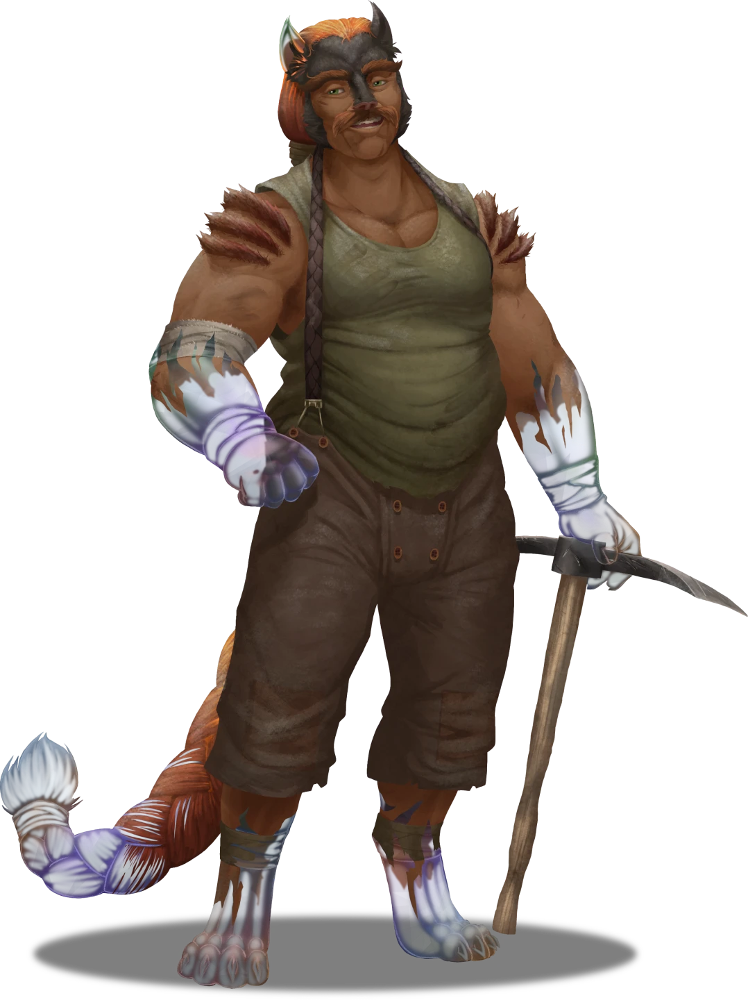

# The Crystal Quarryman

> [!warning] Gamemaster
> #### Gamemaster's Summary
>
> This Social and Combat Event involves a surreptitious meeting in [[Arcturel]] with [[Zodi Trask]], a [[Kiska]] miner whose fateful encounter with a [[Luxarum]] relic has curiously started transmogrifying his physical form into a crystalline one. In this Event, the characters can:
>
> - Locate [[Zodi Trask's Apartment]] in [[Arcturel Lower]] aka "The Dives," where they can meet the so-called crystal quarryman himself and discuss the nature of his strange affliction.
> - Scrutinize the strange [[Uncanny Relic]] responsible for Zodi's transformation — a celestial device that Zodi himself strangely cannot perceive — in an effort to determine how to reverse the crystallization effect.
> - Defend themselves from a surprise attack by a quintet of [[Skither]] spies, who've been sent to observe Zodi before retrieving the device for its creator — the celestial [[Aburyx]] known as Kilner.
> - Help restore Zodi to his original organic form using the Uncanny Relic itself, at which time they can transcribe the quarryman's tale in the [[Stonecraft Manuscript]].
>
> This Event is depicted using the [[Arcturel Lower]] Area Map.

### An Incident in Arcturel

Unless the characters have already met Zodi Trask during a previous visit like [[Unhappy Accidents]], they will need to gather information throughout the sinkhole town about the Kiska quarryman and his whereabouts: an apartment in the substrata of Lower Arcturel, a shadow-swept area of town also known as "The Dives."

No matter their familiarity with the surrounding environment, the characters should remain well aware of [[Amalthea Stonecraft]]'s directive from [[The Storyteller of Nain]]: "Zodi Trask is rumored to be undergoing a most strange transformation — one that is turning him to solid crystal. Find out how his perilous situation came to be."

The characters need to find Zodi Trask, analyze the strange alien source of his transformation, and extract a cure from it. If they can solve the relic’s conundrum, the characters gain the insight to reverse the crystallization process.

> [!info] Social
> #### In Search of Zodi Trask
>
> The following Skill Challenge allows the characters to gather assorted information as they search Arcturel for details about Zodi and his plight. The party must succeed on 2 of the 6 checks listed below in order to locate Zodi's home apartment in lower [[Arcturel]]. The duration of each check is equal to 30 minutes of time in-game.
>
> Rather than simply resolving these checks, you may prefer to extrapolate them into dialogue-driven scenes with the assorted NPCs of Arcturel. Feel free to award **+2 Boons** to any characters who engage in particularly inspired roleplaying or conversation choices.
>
> - **Society (DC 15)** Characters who are more familiar with Arcturel and its local history may already be aware of Zodi Trask based on his reputation as a gregarious foreman for [[House Cevher]] mining operations here. Someone near the [[Level 3 Mine Office]] or in town should be able to provide more information.
> - **Stealth (DC 13)** Characters who attemptto blend with the crowd while searching for information about Zodi Trask find that people are legitimately concerned about the foreman, who is considered to be one of the more ethical and good-natured citizens of Arcturel. Despite his overtly commercial Trading House affiliation, Trask is known to be a "man of the people" with an open heart and a lot of grit.
> - **Awareness (DC 13)** Characters who attempt to gather general information while snooping about town are able to discern that Zodi Trask is a well-liked member of the community who dwells in the lower district of Arcturel, also known as "the Dives."
> - **Deception (DC 13)** Characters who manage to successfully deceive the locals into divulging information are able to learn the precise location of [[Zodi Trask's Apartment]] in Lower Arcturel.
> - **Diplomacy (DC 13)** Characters who manage to successfully persuade the locals into divulging information are able to learn the precise location of Zodi Trask's Apartment in Lower Arcturel.
> - **Intimidation (DC 13)** Characters who manage to successfully intimidate the locals into divulging information are able to learn the precise location of Zodi Trask's Apartment in Lower Arcturel.
>
> When making the above checks:
>
> - **Culture: Arcturian**: The character gains **+2 Boons** when making a History or Persuasion check.
> - **Knowledge: Crime**: The character gains **+2 Boons** when making a Deception, Intimidation, or Investigation check.
> - **Knowledge: Trade**: The character gains **+2 Boons** when making an Insight, Investigation, or Persuasion check.
> - **Critical Success**: The character also learns a random rumor that provides a helpful clue. Roll `[[/roll 1d5]]` on the following table to determine the subject of this information:
>
> 1. An informant is able to confirm Zodi's presence at his home apartment and relate vague rumors about the quarryman's condition, along with the speculation of its cause.
> 2. It stands to reason that a hands-on craftsman like Zodi Trask would be afforded an apartment somewhat close to the mine itself, where proximity to daily operations might be advantageous for House Cevher and Zodi himself.
> 3. While they haven't seen Trask himself, his most observant neighbors have noticed a strange pallid glow emanating from the dark interior of his apartment from time to time.
> 4. The characters are warned about arousing the suspicion of Trask's neighbors while investigating his apartment. Dives dwellers are said to be on edge about the disappearance of such a prominent member of the blue collar community.
> 5. The characters are warned about a rumor suggesting Zodi was exposed to a rare supernatural disease in the mines. Some say the foreman already lies dead in that Dives apartment of his, while others maintain he's disintegrated altogether.
>
> Once the party members have succeeded on 2 of the aforementioned checks, they are able to pinpoint the exact location of [[Zodi Trask's Apartment]] in Lower Arcturel — which is his last known position.
>
> For more specific dialogue options that citizens of Arcturel might offer during a conversation, consult the Q&A blocks below.

> [!question] Q&A
> **Q:** Regarding Zodi Trask:
>
> **A:**
>
> > Zodi Trask has a reputation for showing up on time and delivering the goods — traits that have earned him a rather notable position as a local foreman for House Cevher. He's an invaluable part of Ordain's mining operations in Arcturel.
> >
> > When Zodi stopped showing up to work a couple of weeks ago, Cevher's enterprises began to suffer, and word spread quickly about his disappearance. Attempts to check on him at home have been unsuccessful, and he didn't leave a single word with anyone about a potential departure.

> [!question] Q&A
> **Q:** About Trask's situation:
>
> **A:**
>
> > Some say Zodi was been stricken with a strange affliction, and that's why he's either disappeared, gone into hiding, or both. Rotten lungs from the mines or some madness from the depths … Who knows? Could be anything, as close as we are to the Pathways. After all, a lot of curious things lurk beneath the surface of Ember.

> [!warning] Gamemaster
> #### What Really Happened
>
> Unbeknownst to the people of Arcturel, the [[Uncanny Relic]] was planted in the mine by the [[Aburyx]] known as Kilner — a subordinate of the [[Tyraphem]] [[Pyix]] — who placed it there for the very purpose of its discovery.
>
> The Uncanny Relic is an arcane catalyst, created to enact unpredictable change on whoever it comes into contact with; and Zodi Trask is the unfortunate soul who made contact. Kilner seeks to not only study the effects of the Relic on humanoids of the [[Arctus Plateau]], but wreak havoc among House Cevher's mining operations in Arcturel as well. Fundamentally, the Uncanny Relic is capable of afflicting living humanoids with a potent curse known as the Relic's Touch, which transmutes the cursed humanoid's flesh into a glassy esoteric substance.
>
> Zodi experienced a his own fateful encounter with the Uncanny Relic rather recently when working the House Cevher mines. Uncovering the relic from a lode of alloyed silver, Trask was exposed to its curse and immediately fell victim to its alarming transmogrification — which started turning his physical form to one of pure crystal. The essence of his original [[Kiska]] features remain, but his hands and feet have become as stony and translucent as the edges of a nacreous diamond.
>
> And it seems this abstruse crystallization is on the verge of spreading; as a result, Zodi has quickly and resolutely retreated to the solitude of his home apartment in fearful anticipation of what's to come. Furthermore, **Zodi can no longer perceive the Uncanny Relic itself**, which presents a strange conundrum for the quarryman and anyone who dares to help him. The Uncanny Relic is currently located in the rear workshop section of [[Zodi Trask's Apartment]].

### Meeting Zodi Trask

Once the party locates [[Zodi Trask's Apartment]] in [[Arcturel Lower]], they can survey the local area for signs of the quarryman himself. Soon enough, they'll discover evidence that the crystalline transformation has started spreading to Zodi's surroundings, and that a strange otherworldly relic is responsible — a relic Zodi can no longer perceive.

When the characters finally investigate the home apartment of [[Zodi Trask]] in Arcturel's Balconies, read the following aloud.

> [!quote] Read Aloud
> The isolated apartment before you would be relatively unassuming if it weren't for the occluded window on its front door, which appears to have parchment handbills plastered upon it from within. Following closer inspection, these wax-covered papers appear to be a mix of old news sheets and mining requisition forms.
>
> If what the locals say is true, this should be the dwelling of Zodi Trask, the quarryman in Amalthea Stonecraft's tale — but someone has taken efforts to hastily conceal the apartment's interior. Your attention drifts towards an iron knocker affixed to the front door, shaped like an inverted pickaxe.

> [!info] Social
> #### Salutations and Introductions
>
> Zodi Trask actually lurks inside the apartment bedroom in silence, well out of sight and succeeding on nearly every attempt to hide.
>
> The characters can knock on the door to get Zodi's attention, but they must mention either their quest for [[Amalthea Stonecraft]] or an affiliation with [[House Cevher]] in order to convince the quarryman to talk — let alone open the door and let them enter.

Once the party has convinced Zodi to parley with them through the closed door, read the following aloud:

> [!quote] Read Aloud
> A baritone voice with an Arcturian accent speaks to you from the other side of the thick wooden door, streaked with anxiety that almost sounds of cracked glass.
>
> > If I told you what truly awaits on the opposite side of this door, you might not be so eager to open it. So tell me, friend … who are you and what …
>
> The voice cracks a bit, as if under pressure.
>
> > What are you doing here?

> [!info] Social
> #### Entering the Apartment
>
> Any character who makes either a successful **Diplomacy (DC 14)**, **Deception (DC 14)** or **Intimidation (DC 14)** check is able to convince Zodi Trask to open the door and let the party in.
>
> - **Knowledge: Crime**: The character gains **+2 Boons** on this check.
> - **Knowledge: Trade**: The character gains **+2 Boons** on this check.
>
> Alternately, a character can automatically succeed on these skill checks if they recount a tale the party has previously written in the [[Stonecraft Manuscript]].
>
> If [[Lyla Cevher]] happens to be with the party because of [[Unhappy Accidents]] or otherwise, she'll let the party attempt to convince Zodi before demanding his compliance herself, at which point Zodi will quickly open the door and hurry the characters inside.
>
> The characters can force their way into Zodi's apartment with either a successful **Stealth (DC 18)** with [[Lockpicks]] check to pick the lock (which can be clandestine), or a successful **Athletics (DC 20)** check to bash the door in (which is likely heard by the local neighbors).

Once Zodi opens the door, the characters can finally take full stock of his physicality.

> [!abstract] Zodi Trask
> **[[Zodi Trask]]**
>
> Level 2 · Kiska Grappler
>
> 
>
> You regard a burly Kiska male whose corded muscles suggest a life of strenuous labor, a detail readily confirmed by the timeworn pickaxe at his side and the simplicity of his loose-hanging garb. Covered in a coat of gray-brown fur and quarry dust, this miner wears his long mane of vibrant hair in a thick braid to keep it dutifully out of the way. A smug countenance presides upon his mustachioed face, which appears to be marked by a few scars from some violent childhood scuffle or accident.

As the party enters Zodi's apartment, the quarryman is sure to shut the door behind them, which promptly draws attention to the crystalline transformation afflicting his hands.

> [!quote] Read Aloud
> Something peculiar draws your attention as your host closes the door behind you. Both of his hefty stoneworker hands appear to have turned to solid crystal, shimmering and nacreous like some arcane silicate. His digits sound like crackling glass as he moves them with slow precision, and you hear a similar hyaloid quality to his footsteps as he ushers you into the front room.

> [!question] Q&A
> **Q:** About his condition?
>
> **A:**
>
> > It's hard to explain. My hands, my feet, they're … changing. Becoming crystal, like some horrible gemstone. It hurts, and I can feel it spreading. I can feel it in my throat … creeping like a cold chill …
>
> You notice the crystalline sheen of Zodi's hands, and consider how delicate they look compared to his furred skin. Just then, a look of pain crosses the quarryman's face as the crystal spreads, streaking up his arm like a flash frost on a cold winter night.

> [!question] Q&A
> **Q:** What happened?
>
> **A:**
>
> > I don't rightly know. It was a few days ago, at least. I remember heading into work, but came home feeling sick.
>
> Zodi takes stock of his translucent hands and feet, and expresses a look of acute disquietude.
>
> > Something's happening to me. I'm all messed up. I've been hiding here ever since. I don't want anything to happen to anyone, and I can't risk spreading it any farther than it's grown …

> [!tip] Exploration
> #### Examining Zodi's Condition
>
> After Zodi allows the party to enter his apartment, they can study the effects of his condition and attempt to locate the otherworldly Magic Item that's responsible for it — the [[Uncanny Relic]], which is located in the northeastern workshop of [[Zodi Trask's Apartment]].
>
> The longer the characters spend with Zodi, the more difficult it becomes for him to talk; the Relic's Touch is taking hold before their very eyes. By the time they move onto their examination of the relic, Zodi grows weary of struggling to speak, and will only utter short phrases.
>
> Any character who makes a successful **Arcana (DC 13)** check can tell that Zodi's transformation is progressing but incomplete, and is certainly of an arcane nature. The cause for this magical transmutation must be very powerful, and no known arcane or divine Spells come to mind that could be directly responsible.
>
> Any character who makes a successful **Medicine (DC 13)** check can determine that the glasslike transformation is most concentrated at Zodi's extremities, including his hands and feet, along with his mane of hair. Certain internal organs also seem to be affected, including Zodi's tongue and throat, his stomach, and other unseen innards. The crystalline transformation is obviously progressing, and Zodi Trask is in mortal peril if something isn't done to stop or reverse the condition.
>
> Using magical senses such as **Earthen Sense**, **Vital Sense**, or **Deathly Sense** reveals that there is a strong and persistent aura of magic surrounding Zodi's entire body, with his glasslike extremities appearing most brightly. The aura resonates clearly as related to the runes of Illumination and Earth.
>
> Attempts to reverse Zodi's condition using Counterspell, or similar magic proves to be ineffective — Zodi Trask can only be saved from the encroaching doom of the Relic's Touch via the power of the Uncanny Relic itself.
>
> #### Locating the Uncanny Relic
>
> No matter what the characters say to Zodi or what questions they ask him, the quarryman is wholly unable to perceive the Uncanny Relic. He also cannot remember finding it, and struggles to recall that it even exists. The party must discover the strange Magic Item for themselves.
>
> Any character who makes a successful **Awareness (DC 13)** check is able to spot a soft pearlescent glow beneath the cracks of the closed door to Zodi's office in the northeast corner of the apartment, or they can hear a soft metallic drone coming from within.
>
> - **Attunement: Luxarum**: The character gains **+2 Boons** on this check, but is distinctly unaware of where this advantageous edge comes from.
>
> Any character who makes a successful **Wilderness (DC 13)** check is able to follow a trail of tiny crystal growths around the apartment, starting from the front door and terminating at a larger concentration near the closed door to Zodi's office.
>
> - **Knowledge: Forensics**: The character gains **+2 Boons** on this check.
>
> Inside the office, the desk that holds the Uncanny Relic is bathed in the dim nacreous light that it sheds, and is surrounded by scattered moss-like growths of crystal and silicate.
>
> #### Analyzing the Relic
>
> The characters can attempt to analyze the Uncanny Relic for its properties and try to determine how they might use it to reverse the transmutation that has taken hold of Zodi Trask. Additionally, the relic can be neutralized so that no further harm can be done.
>
> Once they choose to inspect the Item, any character who makes either a successful **Awareness (DC 13)** check is able to pinpoint an inherent connection between Zodi and the Uncanny Relic: the relic emits a low hum that grows in frequency the closer Zodi gets to it in physical proximity. Furthermore, the transmogrification seems to be spreading to Zodi's apartment; the door knob, the door jamb, and several footprints throughout the place are covered in tiny crystalline growths that seethe with soft arcane lambency. The characters can repeat this check once every 15 minutes.
>
> - **Ancestry: Altyra**: The character gains **+2 Boons** on this check.
> - **Knowledge: Artifacts**: The character gains **+2 Boons** on this check.
> - **Knowledge: Celestials**: The character gains **+2 Boons** on this check.
>
> Any character who makes a successful **Arcana (DC 13)** check is able to spot the magical essence of the Uncanny Relic, although its properties and true nature remain mysterious.
>
> - **Attunement: Luxarum**: The character gains **+2 Boons** on this check
> - **Knowledge: Artifacts**: The character gains **+2 Boons** on this check.
> - **Critical Success**: Those more versed in the ways of the arcane can discern that the Uncanny Relic most likely holds the key to reversing the strange transmutation that affects Zodi Trask, despite (or perhaps because of) being the source of it.
>
> Any character who makes a successful **Wilderness (DC 15)** check has a well-rounded understanding of the natural world, and can accurately deduce that the Uncanny Relic is not native to terrestrial Ember, and must hail from some otherworldly place.
>
> - **Knowledge: Artifacts**: The character gains **+2 Boons** on this check.
> - **Knowledge: Celestials**: The character gains **+2 Boons** on this check.
> - **Knowledge: Cosmology**: The character gains **+2 Boons** on this check.
> - **Knowledge: Subterranea**: The character gains **+2 Boons** on this check.
> - **Critical Success**: The character is more learned naturalist, and can accurately ascribe a [[Luxarum]] origin to the relic.

#### Signara Attunement: Luxaran Influence

If the party manages to successfully connect the Uncanny Relic (or Zodi Trask's condition) to the Inner Realm of Luxarum, each character advances their **Attunement: Signara (+1)** at the conclusion of the Event.

### Celestial Interlopers

As the party begins to examine the Uncanny Relic, they are attacked by a group of celestial minions, who have been observing Zodi in secrecy nearby.

As the characters begin to unravel the mystery of the relic and its effect on [[Zodi Trask]], these celestials will intervene at the most dramatically appropriate moment in an attempt to abscond with the relic.

> [!quote] Read Aloud
> You spy something out of the corner of your eye: a small metallic creature lurks in the dark recesses of the apartment's clutter, seeming to appear out of nowhere. Before you know it, four more of these odd interlopers appear. Combat is afoot as these intruders pivot their attention towards the relic!

> [!abstract] Skither
> **[[Skither]]**
>
> Level 2 · Skither Servitor
>
> 
>
> Small and fast-moving, this creature seems at first like something to ignore, little more than a piece of trash with jagged wings crudely shaped to look like a insect. The creature's solitary eye and claw-like appendages seem to surge with fiery radiance as it strikes, leaving streaks of amber light in its wake.

> [!danger] Hazard
> #### Celestials Attack!
>
> A scrappy group of 5 [[Skither]] have been keeping watch over Zodi and the Uncanny Relic throughout the course of the Event: one in the workshop, one in the bedroom, and three in the front room. Thanks to their [[False Appearance]] trait, the skithers automatically catch the party **Unaware** at the start of combat.
>
> #### Skither Tactics
>
> At the start of combat, one or more of the skithers will attempt to attack the character nearest to the Uncanny Relic in an effort to snatch the relic from them and escape the area. In order to successfully escape, the skither carrying the relic must reach the westernmost extremity of the Area Map, which marks the spot they begin ascending into [[Arcturel Upper]] and beyond, well out of capture range.
>
> Over the course of combat, the skithers will prioritize the following actions and abilities:
>
> - All skithers will make use of [[Pack Hunter]] and talons to swarm the character member who either holds the Uncanny Relic or poses the greatest threat to their mission.
> - It's unlikely these skithers will make use of their [[Sacrifice Self]] ability to trigger [[Radiant Death Burst]] — as their mission is to extract the Uncanny Relic — but they can resort to these measures if the moment is desperate enough.
>
> Combat concludes when all 5 skithers have been destroyed or captured, since their abject goal is to escape with the Uncanny Relic.
>
> #### Preventing Escape
>
> If a skither manages to grab the Uncanny Relic and break away from the party to such an extent that escape seems imminent, [[Zodi Trask]] himself will burn all action points can to put himself in the Skither's path and block its movement, and will make an attempt to grapple the skither and prevent its escape. Out of desparation, he makes this grapple check with **+2 Boons**. If the skither is slain, it drops the Uncanny Relic in the same square it dies in.
>
> Should this effort fail, a local [[Arcturian]] can step in to help distract the escaping skither long enough for the party to intervene.

### The Quarryman's Tale

Zodi Trask encountered the Uncanny Relic while digging one day and claimed it for himself, totally ignorant of the dire consequences of the uncanny artifact’s powerful Luxarum paradigms. With the skithers dispatched, the party can find a way to destroy the item and revert Zodi back to his normal form.

> [!tip] Exploration
> #### Restoring Zodi's Physical Form
>
> Once they find the [[Uncanny Relic]] and deal with the skither intruders, the party can attempt to destroy the strange Magic Item.
>
> Any character who succeeds on a **Arcana (DC 13)** check understands the following: the Uncanny Relic is a wondrous item of a most fragile nature, created to resemble a precious otherworldly gemstone, and can be destroyed with a concentrated effort.
>
> - **Knowledge: Artifacts**: The character gains **+2 Boons** on this check.
> - **Knowledge: Subterranea**: The character gains **+2 Boons** on this check.
>
> Any character who makes a successful **Athletics (DC 15)** check is able destroy the Uncanny Relic with a heavy blow.
>
> As soon as the Uncanny Relic is destroyed, Zodi Trask's bizarre transformation to crystal is halted, and his normal fleshy form slowly returns to its original state.

Zodi Trask's voice returns when the characters manage to restore his physical form via the Uncanny Relic, at which time he can relate the narrative of his tale.

> [!quote] Read Aloud
> At once, the Uncanny Relic starts floating in the air just before emitting a brilliant luminance that streaks outward in blinding striated beams. The relic slowly begins to spin, and quickly gathers speed, eventually moving so quickly that it starts folding in on itself in a strange display of metaphysical improbability.
>
> With a flash of light, the Uncanny Relic vanishes before your very eyes, and the only signs of it that remains are the crystalline extremities of Zodi Trask, who holds his hands aloft in amazement as the glasslike transformation recedes. You watch as the color and texture of fur return to the quarryman's flesh, and he breathes a belated sigh of relief before addressing you with gratitude.
>
> > Who knew a hard day's work could be so hard?
>
> Trask unslings his trusty pickaxe, and traces his thumb down the wide steel blade with a self-knowing nod.
>
> > I suppose you want to know how all of this happened … I assure you, it's nearly a mystery to me. The day began like any other. Our latest assignment involved the excavation of a newly-discovered lode of silver and gemstones in House Cevher's deepest holdings. I found the relic that very first morning on the new site, hidden in a vein of silver alloy. It was almost as if the thing was calling to me, begging me to hew it from the rock, with my bare hands if necessary ...
> >
> > As soon as I touched that accursed, otherworldly stone, I felt something come over me. Some dangerous, unseen force was at work, and I knew in my heart it spelt doom for the people around me. So I hustled the weird relic back to my apartment just in time to keep it secret and safe. The next morning, the transformation had taken hold. My fingers were solid crystal, just as you saw them earlier. In the days that followed, the crystalline curse spread further and further. It's a miracle you intervened when you did. I dare say I was well on my way to becoming a permanent fixture.
> >
> > And what led me here? A lifetime of taking initiative; and of doing what's right. Stone-shaping is in my blood, part of my lineage. And something about this weird little sinkhole town always felt like home to me. The nights are long here, and sometimes these people need a strong hand to guide them through the darkness. It feels good to have a sense of purpose. A place to make a difference. But I guess, as far as this whole … curse, is concerned … I'd say I was in the wrong place at the right time.
> >
> > I hope my story satisfies your assignment, friends. It's the only one I've got.

`[[/outcome collected]]`

#### Cora Attunement: Zodi Trask's Tale

If the party manages to successfully record Zodi Trask's Tale in Amalthea's Manuscript, each character advances their **Attunement: Cora (+1)** at the conclusion of the Event.

### Concluding the Event

Once Zodi Trask's tale has been written into the Stonecraft Manuscript, the characters can hear the soft music of Amalthea's driftwood wind chimes stirring on the breeze.

> [!warning] Gamemaster
> #### Next Steps
>
> If the party has yet to do so, they must collect the three other stories proposed by Amalthea Stonecraft for her manuscript:
>
> - Scout the river north of [[Nain]] for [[The Boy Who Collected Boats]].
> - Go south to find [[Vortest Tower]] and [[The Signborn's Secret]].
> - Journey to [[Steed's Point]] for [[The Rickety Man]].
>
> Once all four of these stories have been transcribed into [[Amalthea's Manuscript]], [[The Manuscript Awakens]] will occur.
