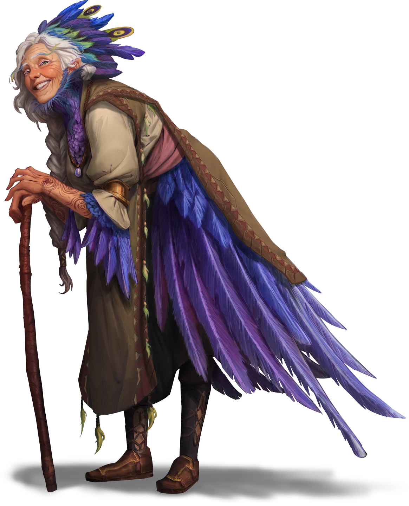

# The Moon Child of Lake Jinro

> [!warning] Gamemaster
> #### Gamemaster's Summary
>
> This Combat and Exploration Event takes place at the [[Lake Jinro Lunar Shrine]], where a powerful [[Pathways]] predator known as a [[Juvenile Garganthus]] emerges from the local subterranea to interrupt Amalthea Stonecraft's climactic ritual of rebirth. In this Event, the characters must:
>
> - Help the storyteller [[Amalthea Stonecraft]] complete her 80-year cycle of [[Aster]] reincarnation at the height of the Lake Jinro Lunar Shrine's winding precipice.
> - Explore the ancient ruins of the [[Ancient Lunar Shrine]]for evidence of its historical and modern significance.
> - Protect a younger, reincarnated Amalthea from a deadly assault by a Juvenile Garganthus.
>
> This Event is depicted using the [[Lake Jinro]] Area Map.

### The Storyteller's Ritual

Now that the party has reached the island near the center of Lake Jinro, they must ascend to the [[Ancient Lunar Shrine]] situated at the top of the location's hilly terrain. There, Amalthea can channel her magic through the Shrine's standing stones and complete her process of reincarnation.

The characters have ample time to converse with Amalthea as they move toward the island's precipice (see "More Info From Amalthea" below). However, when Lady Stonecraft finally begins her ritual, a Juvenille Garganthus arrives just in time to spoil the ceremony (see "Attack of the Juvenile Garganthus" below).

Full details about this location and its associated encounters are available in the [[Lake Jinro Lunar Shrine]] area walkthrough.

> [!abstract] Amalthea Stonecraft
> **[[Amalthea Stonecraft]]**
>
> Level 10 (Elite) · Human Bard
>
> 
>
> A wizened woman dressed in loose-fitting Arcturian garb stands before you, her elderly hands perched upon a knotted walking stick. You spy a pair of feathered wings on her stooped back, as brilliant and violet as any amythest, draped beneath the folds of a stitched brown apron. Similar quills line her forearms, and a ruffle of smaller feathers around her neck serves as an ersatz collar.
>
>  > [!quote] Read Aloud
> > A plume of purple feathers sits upon her aged head like a posh hat, capturing a fashionable kind of folk sensibility, which she wears with grace and aplomb. Her smile is as bright as the dawn, and her wrinkled eyes regard the world with a warm and perpetual interest.

> [!info] Social
> #### More Info From Amalthea
>
> Amalthea invites the party to a moment of preparation before the group ascends the hill to the Lunar Shrine.
>
> The famed storyteller is reluctant to over-explain the moments that are about to take place, and is quick to suggest that the mystery itself is somehow a necessary component to the reincarnation ritual. If the characters wish to press Amalthea for more information about what precisely is happening in this moment, they can certainly try.
>
> Any character who makes a successful **Diplomacy (DC 15)** check is able to pry the following information from Amalthea as she approaches the Shrine proper:
>
> - She has a vague recollection of returning to this place on several occasions throughout her lifetime.
> - She suspects the Lunar Shrine is somehow able to focus the power of Ember's moons into a magical force that affects her Aster physiology.
> - The [[Stonecraft Manuscript]] is a mysterious key to it all, and only by transcribing a certain number of stories — including stories told and collected by others — can she complete the fated process of her reincarnation.

### The Ritual Begins

Read the following aloud as Amalthea and the characters reach the island's overgrown precipice.

> [!quote] Read Aloud
> Amalthea takes her place upon the dais at the center of the standing tones. Closing her eyes, the aged storyteller starts performing a series of somatic gestures while orating the rest of her tale. Fragments of arcane phrases weave in and out of the narrative, and you hear the bard mention things like "the Moon Child" and "a grand return" among her esoteric chants.
>
> The stone menhirs begin to swell with arcane brilliance and the wind stirs with uncanny excitement as the storyteller continues her tale.

> [!tip] Exploration
> #### Discerning the Storyteller's Ritual
>
> Any character who makes a successful **Arcana (DC 11)** while observing Amalthea's ritual of rejuvenation is able to tell that she has called upon the magical power of the stone menhirs to focus her bardic and innate spellcasting abilities.
>
> - **Knowledge: Rituals**: The character gains **+2 Boons** on this check.
> - **Critical Success**: Amalthea's attunement to [[Orbis]], the Spirit Moon, seems to be a factor in the ritual's potency — as evident by the Orbis-related birthmarks that glow upon her skin during the ritual's zenith. There's no doubting this metaphysical occurrence has something to do with Amalthea's rare nature as an [[Aster]].
>
> Any character who makes a successful **Wilderness (DC 15)** check is able to deduce that the magic of the Lunar Shrine is both natural and supernatural in nature — a synthesis of worldly and otherworldly enchantments channeled through the primeval materials used in the shrine's construction.
>
> Characters with **Attunement: Orbis** are able to understand the interplay of the Lunar Shrine with Amalthea's ritual and her physical being, and consider this to be a preternatural phenomenon of the living planet itself. The direct connection between Amalthea's Aster physiology and Ember's abstruse cosmological balance is undeniable.

Once the characters have had a brief moment to observe Amalthea's ritual in action, the moment is cut short by the appearance of a rampaging [[Pathways]] predator.

> [!danger] Hazard
> #### Attack of the Juvenile Garganthus
>
> Lake Jinro has recently become the domain of a [[Juvenile Garganthus]], which leaps into combat when the characters least expect it. The full details of this combat encounter are featured in the [[Ancient Lunar Shrine]] section of the [[Lake Jinro Lunar Shrine]] Area Walkthrough.
>
> This encounter with the garganthus is inevitable, and the party must protect Amalthea Stonecraft from this malicious predator as she completes her ritual.

When the timing feels appropriate, read the following text aloud:

> [!quote] Read Aloud
> As the arcane pageantry of Amalthea's ritual begins to reach a fever pitch, the earth below your feet rumbles, stone cracks, and the nearby trees shudder in response. Before you can blink, a huge creature leaps from below to take its own place on the island's grassy precipice …

Consult the [[Ancient Lunar Shrine]] section of the [[Ancient Lunar Shrine]] location journal for full details about the encounter with the Juvenile Garganthus.

### Completing the Ritual

Once the Juvenile Garganthus has been defeated, Amalthea resumes her arcane rites.

> [!quote] Read Aloud
> Unwavering in the face of the monster's brutal attack, Amalthea appears more focused than ever, and before you know it the entire precipice of the island is enveloped in a blinding flash of bright white light. Your eyes adjust to reveal a most incredible sight: a young child — no more than five — now stands where the aged storyteller once stood, draped in oversized garments.
>
> And much to your amazement, this child unmistakably bears the countenance and plumage of Amalthea Stonecraft, albeit in a much younger body. She regards you with a distinct look of familiarity that confirms your suspicions before producing her manuscript and scribing upon its page once more …
>
> > What's old was new once more. Thus, both lost and assured of what's to come, the storyteller stood on the novel edge of a recognizable shore, adrift in the liminal understanding of "now."
> >
> > She thought of Nain, somehow; that place where the rivers run wild as imagination.
>
> The young author appears lost in thought, as if struggling to maintain a grip on the here and now. You wonder if a night in her own bed back in Nain might be the best course of action, and can't help but detect a singular innocence on young Amalthea's face.

The characters will discover that "Moon Child of Lake Jinro" hinted at in Amalthea Stonecraft's manuscript is none other than Amalthea herself, reborn in a younger body through some strange metaphysical process of Ember.

From here on out, Amalthea is effectively a 5-year old instead of an 85-year old, but her stat block and bio otherwise remains the same. She has been rejuvenated by the magical effects of her uncanny ritual and its effect on her unique Aster physiology.

> [!question] Q&A
> **Q:** About the Ritual:
>
> **A:**
>
> > I apologize for the mystery and the pageantry, my friends. But it seems the spectacle itself is part of the magic's power, along with your observation of it. The moons move in mysterious ways. I cannot thank you enough for your guidance and protection.

> [!question] Q&A
> **Q:** Regarding the Garganthus:
>
> **A:**
>
> > I'm not exactly sure what that monster is … or was. But tales of subterranean creatures escaping the Pathways are not altogether unheard of. Especially since the great quake. Perhaps it was attracted to the magic of the standing stones. Let's just hope it was bad timing and not an ill omen of things to come.

> [!question] Q&A
> **Q:** What next?
>
> **A:**
>
> > Next, I journey back to … where is it I'm from, again? I seem to recall a river, and the most wonderful speaking statues …

### The Lunar Menhirs

If any characters take the time to commune with one of the six lunar menhirs here at the shrine, they can strengthen their Attunement to the moon associated with that particular standing stone.

#### Akon Attunement: The Akon Stone

Any character who successfully communes with the shrine via the Akon Stone advances their **Attunement: Akon (+1)** at the conclusion of the Event.

#### Aura Attunement: The Aura Stone

Any character who successfully communes with the shrine via the Aura Stone advances their **Attunement: Aura (+1)** at the conclusion of the Event.

#### Cora Attunement: The Cora Stone

Any character who successfully communes with the shrine via the Cora Stone advances their **Attunement: Cora (+1)** at the conclusion of the Event.

#### Mayis Attunement: The Mayis Stone

Any character who successfully communes with the shrine via the Mayis Stone advances their **Attunement: Mayis (+1)** at the conclusion of the Event.

#### Orbis Attunement: The Orbis Stone

Any character who successfully communes with the shrine via the Orbis Stone advances their **Attunement: Orbis (+1)** at the conclusion of the Event.

#### Ragen Attunement: The Ragen Stone

Any character who successfully communes with the shrine via the Ragen Stone advances their **Attunement: Ragen (+1)** at the conclusion of the Event.

### Concluding the Event

The party is set to guide Amalthea back home to Nain, where they'll help the reincarnated storyteller reacquaint herself with her hazily-recollected past.

> [!warning] Gamemaster
> #### Next Steps
>
> Once the Juvenile Garganthus has been defeated and the ritual complete, the party must escort the reborn Amalthea Stonecraft (now the five-year old "Moon Child" of Lake Jinro) back to the safety of her home in [[Nain]]. There, the characters can help her rediscover a lifetime of memories during [[The Turn of a Friendly Page]].
