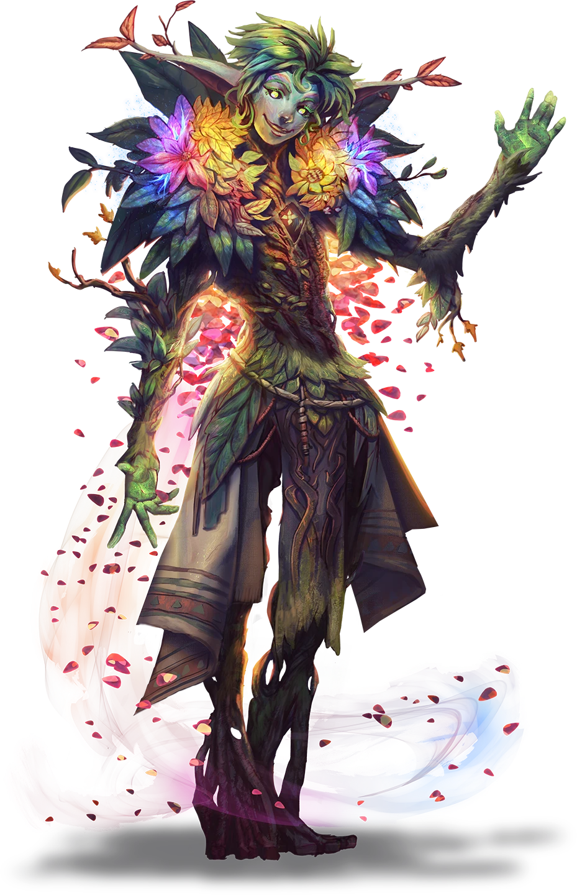

# Aythorn's Blessings

> [!warning] Gamemaster
> #### Gamemaster's Summary
>
> In this Social Event, the party meets the shard god [[Aythorn]], who is visiting [[Brevin]] to celebrate the new bridge. Whether or not the party saved the bridge, the characters can still do the following:
>
> - Meet Aythorn who is excited to see the seed-grown town and gives it a blessing of prosperity.
> - Catch up with the town steward [[Triss Carpel]] and aspiring wizard [[Edivel Sprout]], and find out how the town is faring after the crisis in [[Bridging the Gap]].
>
> The vista composition remains on "[[Vista: Brevin]]" by default but can be swapped to "Brevin Festival, Bridge Complete" if the party saved the bridge.

### The Arrival of Aythorn

> [!abstract] Aythorn
> **[[Aythorn]]**
>
> Level 1 · Unknown Unknown
>
> 

> [!quote] Read Aloud
> Aythorn moves to the center of the platform at the heart of Brevin, seeming to float as much as they walk, trailing flower petals as they go.

> [!info] Social
> #### Social Topic Title
>
> Any character who succeeds on a `[[/check religion 15]]` check know that Aythorn is the god of eternal mischief in times of piece and a source of happiness and peace during times of trouble. It is widely believed that the flower blossoms they leave behind are a sign of either luck or trouble — often both.
>
> - **Knowledge: Gods**: The character automatically succeeds.
> - **Culture: Arcturian**: The character automatically succeeds.

Any character that picks up one of the blossoms left in Aythorn's wake will see it immediately dissolve in their hand, but leaves them with a sense of calm and grace, and the benefits that would come from completing a &reference[Short Rest].

> [!quote] Read Aloud
> As Aythorn reaches the large platform at the heart of Brevin, ignoring any chaos and clutter they pass along the way, they turn to address the still-growing crowd.
>
> > Do not worry about the chaos, my friends — to be honest, I like a gathering that isn’t too set in its ways, and a place whose people come together to strive against the dangers of the unexpected.
> >
> > In truth, I have been looking forward to my visit here for some time — a city that grows from the ground was too much of a temptation for me to resist, and it is somehow even lovelier than I'd imaged.

From this point, Aythorn's conversation shifts slightly based on the outcome of the bridge.

If [[Bridging the Gap]]:

> [!quote] Read Aloud
> > In the end, new vines will grow, and long after the bridge has become commonplace, you will remember all that you have done here today.
> >
> > But long speeches are for other gods.
> >
> > What if, instead, I give you one more thing to remember?

If [[Bridging the Gap]]:

> [!quote] Read Aloud
> > I am sure that you are tired from your many efforts here today, but you are to be commended for all you have accomplished. In many ways, this is exactly how I hoped to find you all — giving your all for each other.
> >
> > Nectar cider all around!
> >
> > And, if you're up for it, I'll give you one more thing to celebrate!

In either case, Aythorn provides a blessing for the town.

### A Blessing for Brevin

> [!quote] Read Aloud
> Aythorn spreads their arms wide, and a rain of blossoms falls on the city, some in the colors of flowers you've seen before and some in impossible shades of silver and gold.
>
> > I bless this town with a bit of luck, at least for a time. The things you've misplaced may suddenly be found. The love you seek may unexpectedly find you. The flowers you plant will be that much brighter and the bonds you make that much stronger.
>
> The murmuring in the crowd grows louder until it threatens to become a full-throated cheer. But before the noise can overpower them, Aythorn clears their throat, and the town grows quiet again.
>
> > But I will be watching - anyone who uses their luck to harm another while within Brevin will find small misfortunes following them as soon as they step outside of its gates - holes in their shoes, being caught in the rain, accidentally sitting down right in a patch of crawleaf or on top of a pricklebush. So use your luck well. Lest it run out.
>
> And with a final flourish of their hand, Aythorn bows and walks into the excitedly milling crowd.

Any player character who observes Aythorn bestow this blessing is overcome with feelings of positivity and possibility, gaining **+2 Boons** on any skill checks made within Brevin for the next 24 hours.

### Leaving Brevin

> [!quote] Read Aloud
> As you begin to make your way out of town, Edivel appears, moving swiftly to reach your side.
>
> > Thank you all for your help! I am so glad our paths crossed back on the Plateau. Couldn't have done this all without you. There's no real way to repay you, but we'll try. Triss — Steward Carpel, that is — gave me these gems to pass on to you for helping to keep me out of trouble.
>
> Edivel holds up a pair of flower petals encased in glittering crystal.

> [!info] Social
> #### Farewell from Edivel
>
> The party receives two [[Petalzon]].
>
> Edivel can speak on any of the following:
>
> - Whether or not the bridge was saved, Edivel's work alongside the druids of Brevin made them feel more a part of the community than ever before.
> - If the bridge was destroyed, they reassure the party that a new one will be built and eventually there will be a bridge across the Splinter Canyons between the Arctus Plateau and the outskirts of Ordain.
> - While they plan to continue their study of agrimagic, they now feel that they have a mentor in [[Kali Andrella]] and can learn from her while staying safe in Brevin. They are going to focus on figuring out a way to keep the ground and those on it steady during earthquakes.

> [!question] Q&A
> **Q:** About Edivel's plans?
>
> **A:**
>
> > I've been wandering around the Plateau for a long time trying to figure out agrimagic, and I'm still going to figure it all out, don't you worry, but working along with the druids on the bridge? Reminds me that there's a lot I can do closer to home. Probably less dangerous too. And this way you know where to find me - come back anytime!

> [!question] Q&A
> **Q:** About learning Agrimagic?
>
> **A:**
>
> > Kali and I magicked up a little something so we can talk once in a while, and she can give me ideas on what I can learn next. With her as my teacher, I'm going to be a great agrimage, but more than that, I want to figure out some way to keep folks steady on the ground in the middle of all these earthquakes - maybe something with magic and roots and even a bit of that sticky stuff on those gumtoads in the canyons.

If [[Bridging the Gap]]:

> [!question] Q&A
> **Q:** About the Brevin bridge?
>
> **A:**
>
> > With everything we all went through to get the bridge up, I just hope people use it. Aythorn's blessing should help - who doesn't want to visit a lucky town!

If [[Bridging the Gap]]:

> [!question] Q&A
> **Q:** About the Brevin bridge?
>
> **A:**
>
> > Don't worry about the bridge. I was sad to see it fall into the canyons too, but the druids are already at work on a new one, and with our new luck. I'm sure it'll be done in no time!

### Aythorn's Boon

> [!quote] Read Aloud
> As you part ways with Edivel, you smell the faintest hint of grass and forests, flowers and dew on the air. A moment later Aythorn stands before you, an aura of life and wildness about them. They smile brightly, and give a small dip of their chin in greeting.
>
> > Hello, travelers. I have been following a bit of your adventures through the Arctus Plateau, and the trials of young Edivel. I am glad you were present to help him when went end over end into a canyon, though between us, I may have helped to smooth their path to the canyon floor just a little. But you?
>
> Aythorn gestures to you.
>
> > You are what truly intrigues me. In recent days, strife and trouble seem to be multiplying. Yet you helped a stranger, kept them safe long enough for them to follow their dream. I believe there is more to come for you, and will offer you a small boon, if you choose to accept it.
> >
> > I will strengthen your connection to Ember itself, a minor thing in and of itself, but with great potential in your future.

#### Heart Attunement: Aythorn's Blessing

If the party accepts Aythorn's blessing, their, each character advances their **Attunement: Heart of Ember (+1)** at the conclusion of the Event.

### Concluding the Event

> [!warning] Gamemaster
> #### Milestone
>
> Completing this event earns the party a [[Milestone Progression]], potentially advancing them in level.
>
> #### Next Steps
>
> This ends the Thorny Predicaments quest, and the party is free to continue their adventures elsewhere. However, there are still some events which may occur after some time has passed. These Events are tied to the decision that Kali made in [[A Dying Art]]:
>
> - If [[A Dying Art]] then she can be encountered again in the riverside town of [[Nain]] in the Event:[[Next Year In Nain]]
> - If [[A Dying Art]] the ruined town of [[Steed's Point]] then she can be encountered there again in the Event: [[The New Steed's Point]]
> - If [[A Dying Art]] then she remains in Steed's Point and can be visited there to start the Event: [[Kali On The Fence]]
