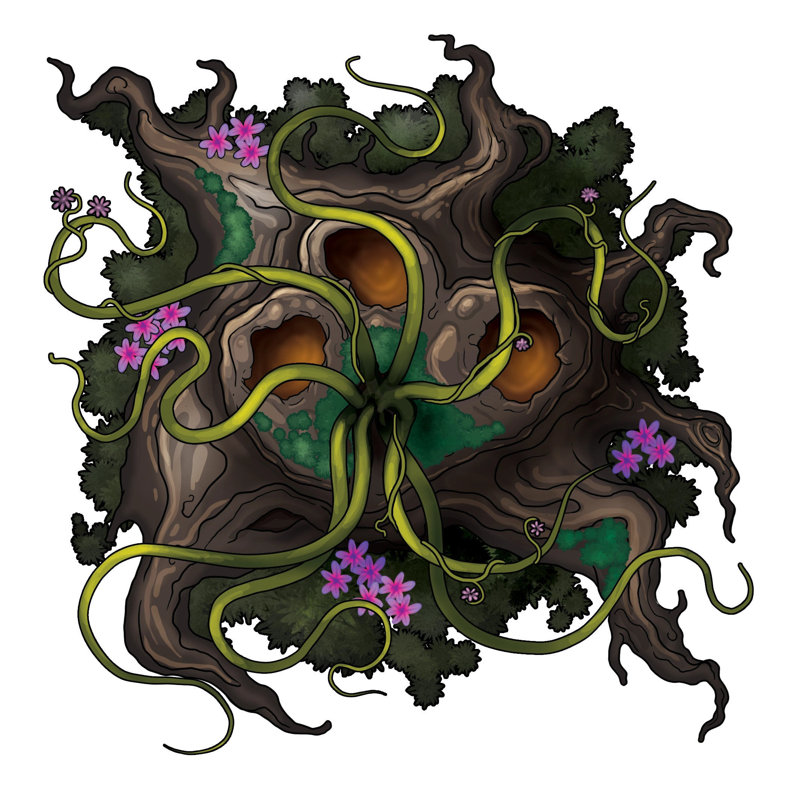
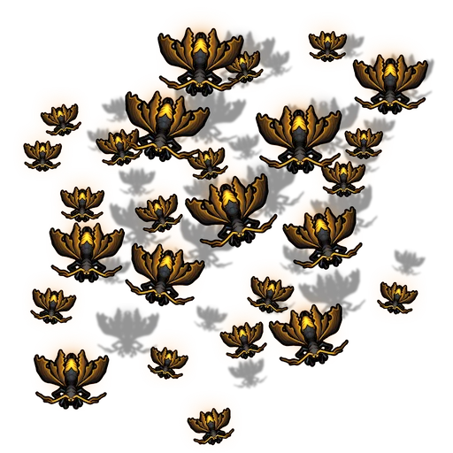

# Growing Pains

> [!warning] Gamemaster
> #### Gamemaster's Summary
>
> In this Combat Event, the party must make their way into the [[Splinter Canyons]] to find the [[Everbloom]], a colorful flower [[Edivel Sprout]] needs to complete his spell. While traveling through the canyons in search of the flower they will encounter dangers including:
>
> - [[Gumtoad]] and [[Sarracenias]], which lurk within the center of Bramble Gully.
> - [[Ketral]] and [[Swarm of Cave Wasps]], found upon the rocky slopes or within cavernous areas.
>
> Note: The Everbloom can sometimes be difficult to spot on the map - it is an all-white flower in the Southeast section of the map, immediately below the ledge with the broken wheel.

### The Path Through the Canyons

The bush containing Everbloom that Edivel needs to reach is on the far side of the [[Bramble Gully]] from where the party begins, and cannot be reached by returning to the [[Golden Flats]] above.

> [!quote] Read Aloud
> Edivel immediately offers a path forward.
>
> > I know this looks impossible to get through, but there's a path. We stay in the middle of the Gully, winding through all these plants, and we should find a way up to that ledge.
> >
> > If we're lucky, it's a quick walk.
> >
> > If we're unlucky … well, that's why I asked you all to come along.

> [!info] Social
> #### The Way Forward
>
> Edivel can speak on the following topics related to the route ahead:
>
> - There are dangers on the path ahead, mostly in the form of creatures that may attack in Bramble Gully. If characters ask about these dangers, they have advantage on perception checks while in the Gully.
> - The flower is called an Everbloom, and can be used as a spell component when others won't work. Edivel is sure this will make their spell a success.
> - Edivel can't guarantee that their spell will save Brevin, but believe it could be of help if the earthquakes continue to rock the region.
>
> Characters who succeed on a `[[/check insight 16]]` check can confirm that Edivel is being truthful, telling the party everything they know about the flower and the region. They are nervous, but only about something going wrong with the plan.

> [!question] Q&A
> **Q:** Dangers of the Gully?
>
> **A:**
>
> > Oh, there's plenty here that might want to kill you. Gumtoads jumping down from the canyon walls, ketral trying to take a finger off while you're climbing, plants with an appetite. Just the kinds of things adventurers are ready to tackle, right?

> [!question] Q&A
> **Q:** The Flower?
>
> **A:**
>
> > The flower is called an Everbloom. From the Everblooming bush, naturally. Despite the name, they're not the easiest to find on the Plateau, which is too bad - their petals can work in spells that normally require very hard-to-get ingredients. It's exactly what the vine weaving spell needs.

> [!question] Q&A
> **Q:** Why doe the Flower Matter?
>
> **A:**
>
> > The Everbloom flower on that hedge over there is the flower that I need to make the vine-weaving spell work. I don't know that it will save Brevin exactly, but with these earthquakes, any spell that can pull things together is a good thing.

### Crossing the Garden Path

The Garden Path is a relatively flat area made up of leafy bushes and grasses punctuated by sprays of colorful flowers and vines that snake partway up the canyon walls.

> [!quote] Read Aloud
> The area ahead of you is broad and flat, though it is hard to tell exactly how level the ground is beneath the intertwining greenery of the bushes and flowers. Above, the canyon rock is still a muted brown, but there are traces of color where vines and flowers have grown partway up the rocks, rustling slightly where they sit against the canyon wall.

The movement of the vines on the canyon walls is due to the presence of 2 Gumtoads, each perched on a different low outcropping. Further in the gully, a third Gumtoad waits. In addition, there are 2 Sarracenias hidden among the plants on the ground.

> [!abstract] Gumtoad
> **[[Gumtoad]]**
>
> Level 1 · Unknown Unknown
>
> 

> [!danger] Hazard
> #### Ambush!
>
> Three [[Gumtoad]] attack the party from concealed positions. Characters with **Awareness (DC 16, Passive)** are able to spot the gumtoads before they attack. If no character spots the gumtoads, the party is **Unaware** at the start of combat.
>
> #### Gumtoad Tactics
>
> The Gumtoads in Bramble Gully attack any creature that moves within range of their tongue attack (30 feet). If they see a creature moving 30-60 feet ahead of them, they will attempt to close the distance by jumping toward the target with their [[Standing Leap]]. If choosing between targets, Gumtoads favor creatures of Small or Medium size, which they believe are easier for them to grapple.
>
> Once Gumtoads have selected a target, they use their very long [[Barbed Tongue]] to grab at members of the party — once the gumtoad has successfully used it to grapple a target, they can either pull the creature toward them with [[Tongue Pull]] or propel themselves onto the target from a distance with [[Tongue Boomerang]].

> [!abstract] Sarracenias
> **[[Sarracenias]]**
>
> Level 1 · Unknown Unknown
>
> 

> [!danger] Hazard
> #### Ambush!
>
> Two [[Sarracenias]] attack the party from concealed positions. Characters with **Awareness (DC 20, Passive)** are able to spot the plants before they attack. If no character spots the plants, the party is **Unaware** at the start of combat.
>
> #### Sarracenias Tactics
>
> Sarracenias will attack any creature that is not currently grappled by or attached to another creature, and is within the 15-foot range of its Grasping Vines. Sarracenias prefer not to move if at all possible; if creatures move out of their range successfully, they will stay where they are instead of pursuing their prey.
>
> The Sarracenias primarily uses its [[Grasping Vines]] to drag creatures into its digestive sacs. The Sarracenias has several sacs, and can [[Engulf]] a new creature every other round.

### Climbing to the Ledge

Once on the far side of the canyon, Edivel points out the location of the bush they need on a low outcropping and suggests carefully climbing up:

> [!quote] Read Aloud
> > Almost there! There's the Everbloom flower, on the ledge above. I think there are enough handholds that we can make our way up.
>
> Up close, you can see that the canyon wall is less a single rock than a collection of outcroppings and crags, rough spots and smooth, small crevices and deep crevasses. In this section of the wall, in particular, enough pieces of rock jut out to form handholds that seem to lead up to the ledge you need to reach.

> [!abstract] Ketral
> **[[Ketral]]**
>
> Level 1 · Unknown Unknown
>
> 

> [!danger] Hazard
> #### Ambush!
>
> Two [[Ketral]] attack the party from concealed positions. Characters with **Awareness (DC 20, Passive)** are able to spot the them before they attack. If no character spots the ketral, the party is **Unaware** at the start of combat.
>
> #### Ketral Tactics
>
> Ketral will only attack creatures who come within 5 feet of whatever position they currently hold, but attempt to anticipate where creatures will move next; once a creature is within 40 feet of them, they will burrow through rock and ground to move into the creatures' most likely path without being seen.
>
> Ketral work in packs, with one or two members of the pack situating themselves in a crack or crevice in a stony wall and striking out with their [[Bite]] or [[Claws]] in a [[Surprise Attack]]. If the moon Cora is at its height, these attacks are more dangerous, as noted in [[Lunar Attack]].
>
> Additional Ketral wait in a nearby cavern; if their prey chases them into the cavern, they can take advantage of their [[Pack Tactics]], working together with others of their pack.

> [!abstract] Swarm of Cave Wasps
> **[[Swarm of Cave Wasps]]**
>
> Level 1 · Unknown Unknown
>
> 

> [!danger] Hazard
> #### Cave Wasp Attack
>
> If characters explore the northern cavern of Bramble Gully, a swarm of cave wasps attacks from the darkness. While not particularly powerful, a Swarm of Cave Wasps, immediately surrounds and extinguishes all sources of light with [[Light Eater]], then attack anyone in the party who is in its immediate path.

### Upon the Ledge

Once the party has made it to the top of the outcropping, they reach the bush needed for Edivel's spell and can retrieve the [[Everbloom]] without a check.

If characters wish, they can examine the Everbloom for themselves as well. With a successful `[[/check 15 nature]]` or `[[/check 15 arcana]]` check, they can confirm that this is the flower known as Everbloom, and know that it can be used as a substitute for other components in lower level spells that require a material component. It has no known harmful or toxic properties.

> [!quote] Read Aloud
> > We made it!
>
> Edivel begins the careful work of picking up discarded flowers from around the bush's base and placing them in one of their cloak's pockets.
>
> > I knew we would… or I hoped we would.
> >
> > And don't worry, I've got plenty — we won't need to go through all of this again.
> >
> > All I need to do now is figure out how to use it.

### Concluding the Event

> [!warning] Gamemaster
> #### Next Steps
>
> Depending on the route the party has taken in the Quest, they may be headed to do any of the following:
>
> - Seek out Edivel's spellbook in [[Supplies and Demands]]
> - Travel to Steed's Point in search of information about Kali Andrella's spell in [[A Dying Art]]
> - Return to Brevin with both Kali's advice and Edivel's spellbook in tow in [[Bridging the Gap]]
>
> To leave the Canyons, characters should ideally exit up into Steed's Point from the canyons below.
