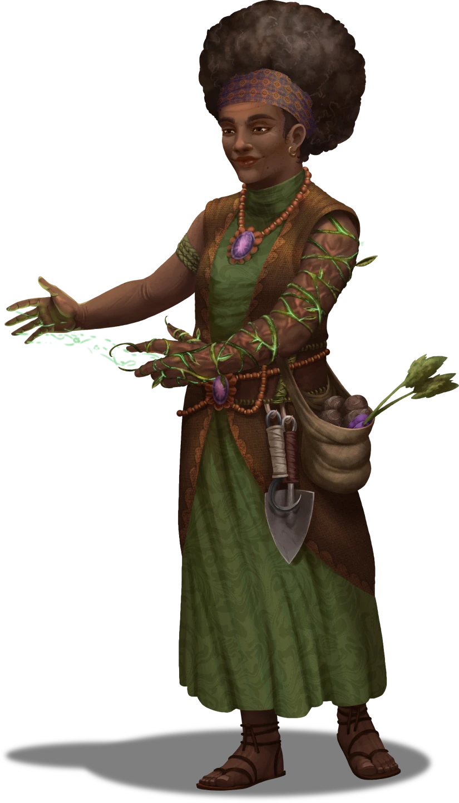

# Kali On The Fence

> [!warning] Gamemaster
> #### Gamemaster's Summary
>
> This is a Social Event that happens after some time has passed since the other events of Thorny Predicaments and is an opportunity to catch up with [[Kali Andrella]] in [[Steed's Point]]. While visiting Kali, characters can:
>
> - Find out what Kali has been up to, and see how [[Rattletrap, the Rickety Man]] is doing.
> - Get a helpful item from her in trade for information about the world.
> - Attempt to convince her to either rebuild Steed's Point or resettle somewhere else.

### Catching Up with Kali

> [!abstract] Kali Andrella
> **[[Kali Andrella]]**
>
> Level 1 · Unknown Unknown
>
> 

> [!quote] Read Aloud
> Kali sits in much the same place as she was when you left her. While she appears calm, there is something in the way she twists her hands together and occasionally furrows her brow that suggests a bit of unease.
>
> > Now I'm not sure what brings you here, but I'm not letting you leave without telling me a bit of what's going on out there in the world. What have you been up to since you left here?

> [!question] Q&A
> **Q:** About Kali?
>
> **A:**
>
> > You know, all right, I think.
> >
> > I’ve had a couple of visitors since I last saw you, which is nice. Not too many are willing to brave the jurtak and the gore birds for little ol' me, but the occasional traveling adventurer has managed to fight their way in, ask me to explain a spell or two.
> >
> > Though lately I've been wondering if I should stay here any longer. Thinking maybe I should rebuild this place for real, or settle in Nain, or move on. Do something other than sitting here, you know?
> >
> > Just haven't quite made up my mind.

If the party has news of [[Moriah Foxhaven]], she is thrilled, and offers them a handful of something new she's been cooking up, Throwing Stones, which have the properties of [[Beads of Force]], as a thank you for the news.

> [!quote] Read Aloud
> > Moriah? Really? How's she looking? Is she eating? Did she say she was going to visit?
> >
> > Sorry, don't mean to overwhelm you with questions. I'm sure I'll reconnect with her at some point. But knowing that she knows about me and that we might see each other again some day soon?
> >
> > That's worth a lot, even if I'm not quite sure how we'll get along this time. I'm not sure I can pay you back, but here's a little something I've been whipping up, in case it helps you on your travels.

If the party knows that Rattletrap is Bertron, she's intrigued, and offers them an [[Herbalism Kit]] as a thank you for the news.

> [!quote] Read Aloud
> > That sounds like a wild story. Something from an Amalthea tale. Might be worth going out there and hearing it from Rattletrap … or should I say Bertron … for myself. Though I don't know how Bertron would feel about me, what he'd think about what this place has become. Maybe one day I'll find out. In the meantime, here. Take one of these herbalism kits for the road, you never know when it'll come in handy.

If [[Bridging the Gap]], she's happy to hear it, and offers each party member a [[Potion of Healing]].

> [!quote] Read Aloud
> > I knew you all could do it. I'm glad that what I taught Edivel did its part. That young agrimage is promising - might be a legend of their own one day. And I'm sure you had a part to play in keeping them safe, so here's something extra for your packs, as a thank you.

### Convincing Kali

If desired, the party can attempt to convince Kali to leave Steed's Point, though she is reluctant to talk about her current decision-making process.

> [!quote] Read Aloud
> > I'm happy to have you here, and you're always welcome to visit, but I'm in the middle of some things and don't have time to talk through every thing I'm weighing while I figure out what's next.
> >
> > And since you don't have any desperate agrimages with you needing training, I'm inclined to take my time figuring things out. If do appreciate you, though, so if you have an argument to make, I'll listen.

> [!info] Social
> #### Making Their Case
>
> To convince Kali, a character must succeed on a `[[/check persuasion 26]]` check.
>
> - **News of Moriah**: If the party brought Kali new news of Moriah, they have **+2 Boons** on the check if persuading her to leave.
> - **Info on Rattletrap**: If the party brought Kali news of Rattletrap having the spirit of Bertron Steed, they have **+2 Boons** on the check if persuading her to stay.
> - **Saved Brevin's Bridge**: If the party successfully saved Brevin, they have **+2 Boons** on the check.

If the party successfully convinces Kali to leave, she says:

> [!quote] Read Aloud
> > You're right. It's time to leave this place. I think I'll head to Nain, look up my old pal Zenodora, see if she's still running her General Store. It'd be good to be around friends again…

If they convince her to rebuild, she begins preparing for that.

> [!quote] Read Aloud
> > You're right. With all the little bibs and bobs I'm making for travelers, I'm already starting to put Steed's Point back on the map. Why not go all the way? I'm going to start fixing this place up, and see who I can scrounge up to help. If you come across people who are willing to help with the work, send them my way.

If they fail to convince her, she bids them farewell.

> [!quote] Read Aloud
> > I hear what you're saying, but I'm just still not sure, and there's no rush to decide these days.
> >
> > Until I do, you're always welcome here.
> >
> > Good luck on your travels.

### Concluding the Event

> [!warning] Gamemaster
> #### Next Steps
>
> There are no major next steps following this Event, the party is free to continue their adventures as they see fit.
