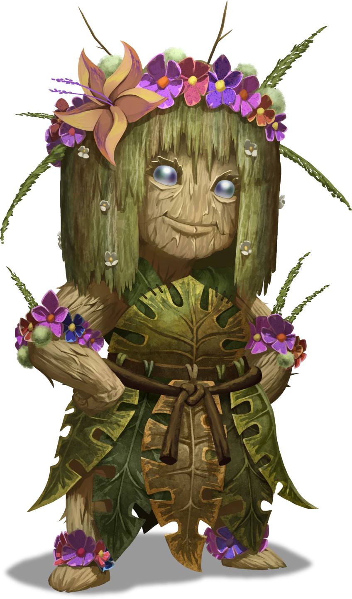

# Natural Wonders

> [!warning] Gamemaster
> #### Gamemaster's Summary
>
> In this Social Event the party visits [[Brevin]] and meets its Steward, [[Triss Carpel]]. While in town, characters can do the following:
>
> - Learn about the town of Brevin, it's history, and the upcoming festival it's planning.
> - Learn that [[Edivel Sprout]], a local wizard, is missing, which the party might know something about.
> - After an Earthquake, agree to locate Edivel, and bring them back to town so they don't end up lost and hurt.

### Concern for Edivel

> [!abstract] Triss Carpel
> **[[Triss Carpel]]**
>
> Level 1 · Unknown Unknown
>
> 

> [!quote] Read Aloud
> As you take in the scene, a willowy Thornling runs towards you, a garland of flowers in their outstretched hands.
>
> > Welcome to Brevin! Please, have a garland! I'm Triss Carpel, the Steward of Brevin. Have you come for our bridge blessing celebration?

Brevin Steward, Triss Carpel, is worried about the missing local, Edivel, and hoping the party ran into the young Thornling during their journeys. The Steward can share the following:

> [!info] Social
> #### The Worried Steward
>
> An `[[/check insight 16]]` check confirms that they're worried about Edivel’s safety and sees them as a surrogate younger sibling to watch out for.
>
> - Brevin is currently preparing for a Bridge Blessing ceremony, which will include a visit from the shard god [[Aythorn]].
> - Edivel Sprout, who promised to unveil a new marvel at the event, is nowhere to be found. The Steward is worried that Edivel may have gotten into some trouble — they can be foolhardy as they search out what they know.
> - If the party has met Edivel during [[Planting a Seed]], the Steward is somewhat reassured but still concerned about their continued absence, and if the party saw Edivel fall into the ravine in [[The Fall's Gonna Kill You]], the Steward is worried that they might be hurt and in need of rescue.
> - The Steward is willing to offer a reward of two [[Petalzon]] for Edivel's safe return.

> [!question] Q&A
> **Q:** About Brevin?
>
> **A:**
>
> > We’re not your average Arcturian town! Everything you see around you is grown from seeds, not built by hand. It took a lot of work and time cultivating this town into what you see before you, but we think it's been worth the effort.

> [!question] Q&A
> **Q:** Bridge ceremony?
>
> **A:**
>
> > That's right! A celebration to mark the opening of a new bridge, made of vines, grown across the Splinter Canyons.
> >
> > Things aren’t usually quite this hectic, but Aythorn has sent word that they’re making an appearance at the event, so we have to make sure Brevin is looking its best for the Shard God.

> [!question] Q&A
> **Q:** About Aythorn?
>
> **A:**
>
> > Yes! One of the few roaming Shard Gods that people may run into! Aythorn is a very tall and colorful Thornling that likes to hand out blessings and pranks to travelers. From what I understand, you can always tell when they are about if you start seeing colorful flower petals appear out of nowhere.
> >
> > Few of us have actually met Aythorn here in Brevin, so it's kind of a big deal they are coming!

### Edivel is Missing

> [!quote] Read Aloud
> > Say, this might be a long shot, but have you seen a young Thornling on your way here? His name is Edivel, he's an aspiring wizard, very enthusiastic, but still green. I haven't seen him in a bit, and he has a knack for getting himself into trouble, so I'm just a little worried right now.
> >
> > You haven't run across him have you?

If the party hasn't completed [[Planting a Seed]], and notes that they haven't run into Edivel yet, then Triss' response is:

> [!quote] Read Aloud
> Triss' shoulder slump a touch upon hearing you haven't met him yet.
>
> > Well, that’s just a little worrying. I do hope he's okay. Thornlings are pretty hardy as a rule, but Edivel’s the type to try a spell for flame resistant plants by charging into a bonfire.
> >
> > Could I ask you to search the area and see if you run into him? If you do, tell him to come check in. I'd really appreciate it. I just hope he hasn't wandered off to the Splinter Canyons again…

If the party has completed [[Planting a Seed]], and tells Triss they've seen Edivel, she says the following:

> [!quote] Read Aloud
> Triss looks immediately relieved.
>
> > Oh wonderful, at least he was okay last time you saw him. It sounds like they might have gone off on some fool headed quest though… do me a favor, would you? Go see if you can find him, and send him back here. I could use the extra help, and I'd feel a little less anxious if he was accounted for.

If the party completed [[The Fall's Gonna Kill You]], and saw Edivel fall into the canyon, they can inform her of this, and get the following response:

> [!quote] Read Aloud
> Triss throws her hands up in exasperation.
>
> > Of course! I've told him to steer clear of the canyons, but that Sprout never listens.
> >
> > Would you go get them? Normally, I'd send someone to go help them, but we're all hands on deck here trying to make the place look nice for Aythorn.
> >
> > Besides, there are a lot of dangerous creatures in the canyons and none of us are quite as suited to the task as you. We thornlings are tough, but that only gets you so far.

> [!question] Q&A
> **Q:** Where to start looking?
>
> **A:**
>
> > Splinter Canyons, naturally. Edivel says it's a good place to practice magic without danger of harming anything important. Problem is that it's plenty dangerous on its own, what with the dangerous creatures, shifting rock and floods.

> [!question] Q&A
> **Q:** About reward?
>
> **A:**
>
> > Sure, if you bring Edivel back home I can reward you for your trouble with a couple of Petalzon which would be worth some gold in Ordain, or could be made into some very fine jewelry, if that's more your style.

### A Sudden Shake

As the party begins wrapping up their conversation with Triss or begins to head off to other tasks, another tremor hits the area.

> [!quote] Read Aloud
> The ground rumbles beneath your feet, but it feels distant, as if something is stopping the disturbance from touching you. Around you, the buildings shake ever so slightly, their woody forms swaying like trees in a strong wind, but none seem damaged.
>
> Triss exhales with reliefe.
>
> > Every time one of those tremors hit I'm glad we grew this place sturdy.

> [!question] Q&A
> **Q:** Tremors common here?
>
> **A:**
>
> Steward Carpel shrugs slightly.
>
> > Common enough. They're worse in the canyons though, so watch your footing if you end up in there.

> [!question] Q&A
> **Q:** Best way into the canyons?
>
> **A:**
>
> Triss gestures for your map.
>
> > I don't know all the ins and outs, but I can mark the easiest way in that I know of…
>
> The Steward notes the best ways into the Canyons on your map before handing it back.
>
> > Now, this doesn't mean the way won't be dangerous, just less so.

### Concluding the Event

> [!warning] Gamemaster
> #### Next Steps
>
> If the party already completed [[The Fall's Gonna Kill You]] and agree to go looking for Edivel, they will next encounter Edivel in [[A Rising Tide]]
>
> Otherwise, if the party has not yet run into Edivel, the next encounter will be [[The Fall's Gonna Kill You]] in the splinter canyons.
