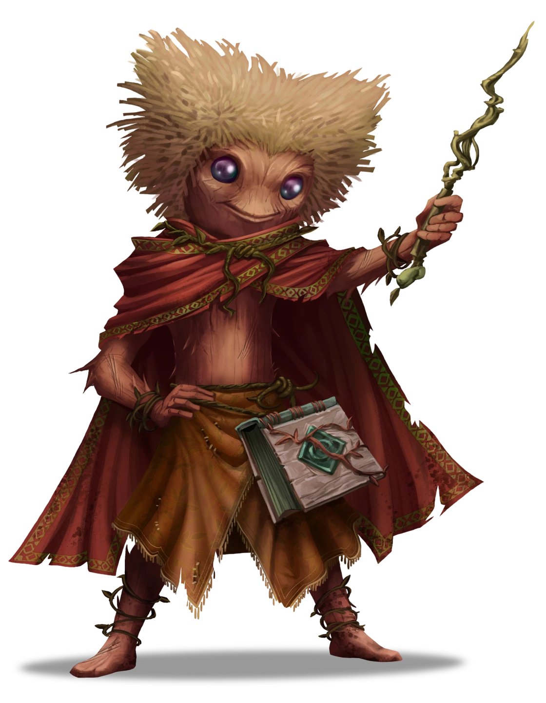

# Planting a Seed

> [!warning] Gamemaster
> #### Gamemaster's Summary
>
> This Social Event occurs while the party is traveling through the [[Golden Flats]] and involves [[Edivel Sprout]], a young wizard dealing with a spell gone awry. By interacting with Edivel and the wall of animated hedges they created the characters can:
>
> - Get to know Edivel Sprout, his aspirations to become an [[Agrimage Circle]], and why he's attempting to wrangle hedges.
> - Figure out how to move the hedges off the road, ideally without destroying them, and possibly help Edivel understand his malfunctioning spell better.
> - Learn about the Shard God [[Aythorn]], local hedge wizard [[Kali Andrella]], and the nearby town of [[Brevin]].

### Meeting Edivel

> [!abstract] Edivel Sprout
> **[[Edivel Sprout]]**
>
> Level 1 · Unknown Unknown
>
> 

Edivel explains the situation at hand:

> [!quote] Read Aloud
> The young Thornling takes a few steps away from the writhing hedge wall and says:
>
> > My name is Edivel, Edivel Sprout!
> >
> > I was trying to figure out a vine weaving spell I have, but I think I did something wrong because instead of the vines following my hands, it uh … started creeping up the road.
> >
> > I don't think the shrubs are a danger to anyone, but it is blocking the path, and I did create this, so it's my responsibility to undo it.
> >
> > There must be some trick to undoing it right?

### Moving the Shrubs

> [!tip] Exploration
> #### Tis A Shrubbery
>
> Any character that succeeds on a `[[/check arcana 15]]` check while examining the animated bramble recognizes that it has been magically awakened, and has gained a modicum of intelligence and the ability to move slowly. Because of this, they can be dealt with a number of ways:
>
> - A source of fire (real, magical, or illusory) should cause them to move out of fear.
> - Use of the [[Speak with Plants]] spell might allow the caster to reason with them.
> - Use of the [[Dispel Magic]] would undo the spell, returning the plants back to normal shrubs.
>
> A character that succeeds on a **Wilderness (DC 13)** check knows that destroying the brambles would be trivially easy with the use of fire or weapons that deal slashing damage.
>
> - **Knowledge: Plants**: The character automatically succeeds on this check thanks to knowledge of local flora.

The party can move or destroy the brambles by whatever means they deem suitable.

> [!tip] Exploration
> #### Dealing with the Brambles
>
> There are multiple methods available for the party to deal with the animated brambles. The party can utilize any of the following actions:
>
> A character that can communicate with the plants, such as with the [[Speak with Plants]] spell finds the plants are not especially brave or cunning, and are easily swayed with any of the following actions:
>
> - **Diplomacy (DC 13)** to convince them to go elsewhere.
> - **Deception (DC 13)** to trick the plants into relocating.
> - **Intimidation (DC 13)** to threaten the plants with the consequences of not moving.
> - Any fire, whether mundane, or magical (via [[Thaumaturgy]], [[Produce Flame]], [[Prestidigitation]], or similar) will cause the brambles to move away from the source.
> - The Brambles do not have any form of defense or attack, and any attempts to attack them automatically succeed and deal damage. The brambles have a total of 30 hit points and are vulnerable to fire and slashing damage. The brambles reflexively move away from their attacker, which can be used to herd them off the road.
> - The above list of solutions is not ironclad or exhaustive, and players may use whatever methods you deem effective to move or deal with the hedges in the road.

Once the party has dealt with the brambles, mark the appropriate outcome below.

`[[/outcome moved]]`

> [!quote] Read Aloud
> Edivel jumps into the air and lets out a cheerful whoop as the brambles are moved off the road.
>
> > That's perfect! They should be safe over here. I'll come check on them, make sure they don't wander back onto the road. Thanks for your help!

#### Heart Attunement: Hedge Redirected

Any character who participates in redirecting the bramble hedge to bypass it advances their **Attunement: Heart of Ember (+1)** at the conclusion of the Event.

`[[/outcome destroyed]]`

> [!quote] Read Aloud
> Edivel deflates at the sight of the destroyed brambles and says:
>
> > I guess that works, but you didn't have to hurt them! I mean, if I hadn't made the plants come to life to begin with, it would be fine now. I feel terrible.
> >
> > Thanks I guess …

#### Ragen Attunement: Hedge Destroyed

Any character who participates in destroying the brambled hedge advances their **Attunement: Ragen (+1)** at the conclusion of the Event.

### Edivel's Spell

The issue at hand is that Edivel is working with a third-hand copy of a copy of a spell acquired by a friend of theirs. The page is badly faded in places, and they keep casting it incorrectly as a result, getting unpredictable results.

Ideally, Edivel needs to return to the spell's creator and get a new copy, or find a complete copy elsewhere. However, Edivel is also stubborn, and convinced they can figure it out themselves, even if evidence so far indicates the opposite.

Characters that want to help Edivel with their spell may want to look at the pages in the spellbook to get a sense for what it does.

> [!tip] Exploration
> #### Convincing Edivel to Share
>
> Edivel can be convinced to share the spell page in question with a successful `[[/check persuasion 14]]` or **Intimidation (DC 12)** check.
>
> - **Path: Academy Dropout**: The character automatically succeeds on this check.
> - **Character is a Wizard**: The character gains **+2 Boons** on this check.
>
> #### Studying the Design
>
> The spell is called "Vine Weaving" and to any character with a `[[/skill arcana 13 passive format=long]]` it is immediately obvious upon basic examination of the page that a good half of the spell is missing. Many of these blank spots have been drawn over with newer ink in clumsy attempt to complete the designs.
>
> A character that examines the spell design closely and makes a successful **Arcana (DC 15)** check recognizes that the spell utilizes a series of complex verbal and somatic components to establish temporary control over a body of vines, roots, or similar mundane plants. However, the damage to the spell is so extensive that it would be sheer luck if the spell did anything close to what it was meant to.
>
> - **Critical Success**: Scrutinizing the designs further, it is clear that original design of the spell grants the targeted mass of plants temporary and limited intelligence for the purposes of following the caster's commands and gestures more effectively. This, coupled with the damage to the spell, is likely what caused the brambles to become animated when Edivel cast it.
>
> #### Fixing the Spell
>
> Any character that successfully studied the design of the spell (as above) recognizes that the damage is too great to be fixed, and Edivel would be better off looking for a copy of the completed spell, rather than trying to patch the damaged one.

### Talking to Edivel

> [!info] Social
> #### Edivel's Ambitions
>
> Edivel wants to be a great Agrimage, like the ones they grew up idolizing. This walking hedge is a result of their latest attempt at Agrimagic.
>
> A successful `[[/check insight 12]]` check reveals that Edivel is a young, bright, and resourceful spellcaster that has done well for themselves so far, but desperately needs a proper mentor. However, Edivel is prideful and likely deeply embarrassed by his failure to cast the spell, and too self-conscious about the gaps in his magical knowledge to admit he needs help.

> [!question] Q&A
> **Q:** About Edivel?
>
> **A:**
>
> > I'm an Agrimage in training, soon to be the pride of Brevin! Well, once I figure out this spell and impress Aythorn!

> [!question] Q&A
> **Q:** About the spell?
>
> **A:**
>
> > I got it from my friend Carmin! They say it's from Kali Andrella! I really want to figure out how to cast it effectively, so I can impress Aythorn when they visit Brevin soon! I think I need to get a special spell component to do it though.

> [!question] Q&A
> **Q:** About the spell component?
>
> **A:**
>
> > Well, I had to make substitutions on the component list, and that's had … mixed results. However, I think that I can get a special flower from the Bramble Gully in Splinter Canyons, which I should have done in the first place, I will be able to cast the spell properly!

> [!question] Q&A
> **Q:** About your training?
>
> **A:**
>
> > Uh … nobody taught me, really. I am surrounded by Druids in Brevin and they taught me what they could, but, they aren't wizards and I learn better from books. Sometimes I get to talk to wandering Agrimages, but they can be rare. So, I've been putting together my own spell book on my own!

> [!question] Q&A
> **Q:** About the spell edits?
>
> **A:**
>
> > I edited the spell myself, I figured it wouldn't be that hard to fix the missing parts and get it working again. To be fair, it did work! It wove all the shrubs together and made them move!
> >
> > I just didn't have any control over them.

> [!question] Q&A
> **Q:** About Agrimagic?
>
> **A:**
>
> > They are wizards that work with the land! They can enrich and enchant soil to make the crops grow faster, make plants grow into ladders, create a fence made of flowers that keeps pests away. Agrimages tend to be a bit more focused on using spells to enhance everyday life.
> >
> > They're not druids though, they harness nature's power, we're a traditional school of magic.
> >
> > I know that may not sound like much compared to turning into a bird and everything, but agrimagic can mean a lot to people. There's stories of whole towns that wouldn't have gotten off of their feet without the help of someone like Kali Andrella.

> [!question] Q&A
> **Q:** About Kali?
>
> **A:**
>
> > Kali Andrella is only one of the greatest living Agrimages on the Arctus Plateau.
> >
> > At least I think she's still living.
> >
> > No one's heard from her in a few years, but the spell I'm working from is a Kali Andrella original. Got it from my friend Carmin, who copied it from a paper they saw, so it's kind of third hand, but I'm sure it's pretty close to the real thing.

> [!question] Q&A
> **Q:** About Brevin?
>
> **A:**
>
> > Have you heard of Brevin? We're one of the new seed cities that's grown from the ground up instead of built. The druid who put it together, Moss Rivethun? Another Agrimage legend.
> >
> > Anyway, one of the big things we've been growing recently is a bridge, right across the Splinter Canyons, to make travel to Ordain easier if you're coming from the North. It's a big deal. So big that the shard god Aythorn's sent word that they are going to come and give a blessing.
> >
> > A shard god. In my home town!
> >
> > Which is why I'm practicing. Naturally I had to come up with something to impress, right?

> [!question] Q&A
> **Q:** About Aythorn?
>
> **A:**
>
> > I'm sure you've heard of Aythorn. Of all the shard gods, they're the one who tends to show up the most in the world.
> >
> > Some say it's because they're full of mischief, or 'cause they just became a god not too far back, but I like to think they just enjoy keeping an eye on us and making sure we do well. And I'm going to do well by them.
> >
> > Once I figure this all out.

> [!question] Q&A
> **Q:** About the special plant?
>
> **A:**
>
> > There's only so well a spell can go if you're not using the right components, right? Looking at the way these vines twirled around, I realized exactly the flower I need to match the sketch here in my book. And I know where to find it - Bramble Gully.
> >
> > Getting there will mean a little climbing at the top of Splinter Canyon, but nothing I can't handle.

> [!question] Q&A
> **Q:** About helping?
>
> **A:**
>
> Edivel waves a hand dismissively.
>
> > Oh, don't worry about me! Between this cloak, my tough skin, and the kindness of strangers, I always find a way to make it through.
> >
> > Hey, maybe I'll see you at Brevin? The bridge celebration ceremony is going to be amazing. Especially when I show off the final version of this spell!

### Concluding the Event

Edivel is willing to mark the location of [[Brevin]] on their map for the party before he leaves to continue his adventuring. Mark the outcome "Location of Brevin" as completed to do this, revealing location of Brevin to the players on the Region Map.

`[[/outcome brevin]]`

> [!warning] Gamemaster
> #### Next Steps
>
> Once the party has finished helping Edivel with the brambles and his spell they can continue their adventures across the region, and may run into any of the following Events:
>
> - As the party moves through the area they may encounter some lost travelers trying to find Brevin in [[Revelers on the Road]].
> - If the party decides to visit Brevin to check out the upcoming celebrations they'll start [[Natural Wonders]].
> - A party that heads to the [[Splinter Canyons]] may encounter Edivel again in [[The Fall's Gonna Kill You]].
