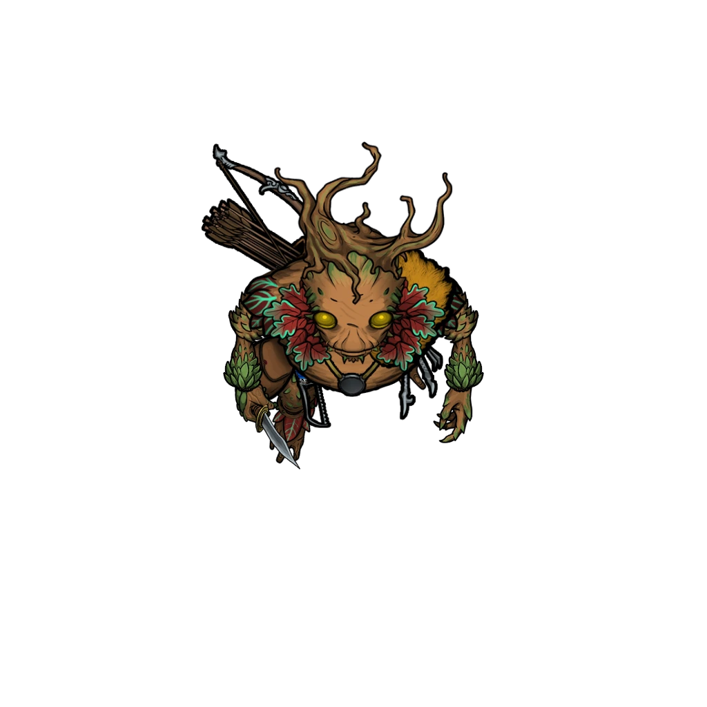

# Supplies and Demands

> [!warning] Gamemaster
> #### Gamemaster's Summary
>
> In this Exploration Event party encounters the Canyon Crawler while traveling through the flooded [[Splinter Canyons]]. During a series of dangerous encounters that will test them, characters can:
>
> - Brave the attack and traps of the Canyon Crawler to recover the spellbook belonging to [[Edivel Sprout]].
> - Determine how to locate the Canyon Crawler, and defeat or evade them.

#### Geysers

The circular openings on the ground throughout this scene indicate the location of the geysers. Currently there is no geyser animation, so this will need to be theater of the mind.

> [!quote] Read Aloud
> The unseen voice continues to make demands:
>
> > You are now in the domain of the Canyon Crawler. If you wish to survive your time here, you will pay me a fee: either fifty gold, each, or an item of true value.
> >
> > Place your choice on the ground in front of you and I will let you walk away from here unharmed. Refuse, and you shall feel my power. Oh, and leave the spellbook. That is mine.
> >
> > You have two minutes to decide — either make the right choice or feel my wrath!

> [!tip] Exploration
> #### Assessing the Situation
>
> The party cannot see the Canyon Crawler, but they can determine a few things about this adversary from their voice alone.
>
> A character that makes a successful `[[/check 17 perception]]` check can tell that the echo of the Canyon Crawler's voice is not natural and is being enhanced, likely via magic cantrip.
>
> A further successful `[[/check 17 arcana]]` check surmises that this would either be with a Thaumaturgy or Minor Illusion spell, putting the Crawler within 30 feet of the party.

Edivel is determined to get their spellbook back and immediately refuses to hand anything over to the Canyon Crawler.

> [!quote] Read Aloud
> Edivel takes out their wand, ready to fight.
>
> > You are not going to take my spellbook, and you will see that we did not come unprepared!
>
> Laughter echoes all around you in a bitter, coughing bark.
>
> > You think to taunt me with your power? I have power of my own. Let me show you all that I can do!

### Canyon Crawler Attacks

The Canyon Crawler reveals several "powers," one at a time, announcing their power before striking, like a parody of a villain. This also gives the party options for tracking down their hidden location.

> [!warning] Gamemaster
> #### Striking from the Shadows
>
> Place the party and Edivel into a tracked Combat encounter. At the beginning of each round of combat, the Canyon Crawler remains hidden and performs one of the following actions which you may choose:
>
> - [[Supplies and Demands]]
> - [[Supplies and Demands]]
> - [[A Rising Tide]]
>
> On the players' turn, they can spend their action trying to locate the Canyon Crawler.

Each time that the Canyon Crawler strikes, the party has an opportunity to find and confront them. They can use any of the following methods:

> [!tip] Exploration
> #### Locating The Crawler
>
> The party can locate the Canyon Crawler by actively searching for them. A single successful check provides the party enough info to locate them.
>
> - A character making a successful `[[/check survival 22]]` check while searching the area for tracks finds evidence of another person having moving through the area recently, and where they may have gone. Each attempt reduces the DC by 2 until successful.
> - A character making a successful `[[/check perception 24]]` check picks up on the Canyon Crawler's real voice underneath the magical facade and can use it to pinpoint their location. Each time the Crawler speaks, the DC of this check goes down by 2.
> - Each effect the Canyon Crawler creates has a specific range which can be pinpointed with a successful `[[/check arcana 24]]` check when it manifests. This gives the character a sense of how far the Crawler can be from the party's current position. With each new effect witnessed, the DC of this check goes down by 2.

Alternately, the party may try to fool the Canyon Crawler into thinking that their demands are being met to draw them out.

> [!info] Social
> #### Fooling The Crawler
>
> If characters want to fool the crawler into emerging from their hideout, they will need to leave some items of value (or that appear to be items of value) as instructed. If a character leaves an item or collection of items that are collectively worth at least 100 gold pieces, the Crawler will be satisfied with the offering.
>
> - If the items left are not truly valuable, the character leaving them must succeed on a `[[/check deception 18]]` or `[[/check sleightofhand 18]]` to trick the Crawler.
>
> Once their items are placed, the party must "surrender" either verbally or via their body language. The Crawler commands the party to depart the area, leaving the offerings behind. The party may attempt to deceive the Crawler into thinking they have withdrawn using either a `[[/check 18 deception]]` or `[[/check 18 stealth]]` check.
>
> - On a success, the Crawler comes out as soon as the party is out of sight to collect the goods left behind. If the party successfully lures out the Canyon Crawler, proceed to the final section of this event, [[The Canyon Crawler, Revealed]].

### Water Geyser

> [!quote] Read Aloud
> > Watch as the water rises from the depths to sweep you away! Can you make the power of Mayis itself bend to your commands as I can!
>
> Water erupts from the edge of the river left in the center of the canyons in a spout that streams up from the surface and curves toward you with full power.

> [!danger] Hazard
> #### Geyser
>
> A geyser of water erupts from the center of the water-filled crevasse towards a member of the party within 30 feet. Whomever is targeted must succeed on a `[[/save 15 strength]]` saving throw or take `[[/damage 1d4 bludgeoning]]` and be pushed 15 feet away by the force of the blast. If their movement ends against solid rock, they take an additional `[[/damage 1d4 bludgeoning]]` damage and fall prone.
>
> #### Ketral Attack
>
> The first time this attack is used, the geyser disturbs the nearby rocks, causing a single [[Ketral]] to emerge and join the combat encounter.
>
> #### Locating the Source
>
> The gushing water is caused by an [[Endless Fountain Stone]], which the Canyon Crawler has placed beneath the edge of the water in the Canyons. An acute party member can see a magical glint in the light as the stone is activated with a successful `[[/check perception 22]]` check.
>
> - If the Fountain Stone is noticed, its function is understood to any party member who succeeds on a `[[/check arcana 22]]` check or uses the [[Identify]] spell.

### Grasping Vines

> [!quote] Read Aloud
> > Nowhere you stand is safe. Behold as even the plants in the ground respond to my power!
>
> On the still-damp ground, weeds begin to sprout around you, grasping at whatever is around them as if they were the fingers of the dead, looking to hold on to whatever part of you they can grasp.

> [!danger] Hazard
> #### Entangling Vines
>
> Weeds and roots form a 20-foot square at a location of the Crawler's choosing requiring each creature in the area to make a `[[/save strength 15]]` saving throw or become &Reference[restrained].
>
> Any character that succeeds on a `[[/check arcana 16]]` check recognizes the effect as originating from the [[Entangle]] spell.
>
> #### Sarracenias Attack
>
> If any character is successfully restrained by the effect, a single [[Sarracenias]] emerges from a small cave in the nearby rock and slowly moves towards the restrained character to devour them.

### Falling Stones

> [!quote] Read Aloud
> > See how the canyon itself tears itself apart to crush you? You will never know peace unless you give me what I want!
>
> The vines on the canyon's wall seem to double in size, growing new shoots and leaves and getting thicker than before. As they grow, they dislodge rocks from the canyon walls, which tumble down from above.

> [!danger] Hazard
> #### Rocks Fall
>
> A cascade of large rocks crash down towards the party. Two of these rocks are close enough to pose a significant threat, each creating a 10-foot radius impact somewhere of the Crawler's choosing. Any creature within the area of effect must succeed on a `[[/save dexterity 16]]` saving throw or suffer `[[/damage 1d12 bludgeoning]]` damage.
>
> #### Gumtoad Attack
>
> Affixed to each of the falling rocks is a single [[Gumtoad]] which joins the combat encounter. Each toad is initially &Reference[stunned] for 1 round by the fall, but after recovering its senses will attack any character nearby.

### The Crawler Revealed

If characters reach the Canyon Crawler in their lair, they find a young Thornling in the back of a cave, surrounded by items, including a [[Speaking Horn]], which they hold to their lips:

> [!abstract] Carmin Anther
> **[[Carmin Anther]]**
>
> Level 1 · Unknown Unknown
>
> 

> [!quote] Read Aloud
> > Do not enter this cavern!
>
> Though the voice booms, you can see its origin in the dim light — a young Thornling, not much older than Edivel, speaking into a carved horn. This close, you can hear the Thornling's normal voice a second before whatever they say comes booming into your ears as if by magic — thin and shaky.
>
> Before you can speak or confront the Crawler, Edivel gasps and points in the other Thornling's direction.
>
> > Carmin? Is that you? What are you doing? Someone could have been seriously hurt!

If the party has lured the Canyon Crawler outside of their lair, Edivel recognizes them immediately.

> [!quote] Read Aloud
> In the distance, a Thornling emerges from around a corner, carrying a bag of items and waving what looks to be a fallen branch in your direction. Before they can speak, Edivel gasps and points in the newcomer's direction.
>
> > Wait, I know who this is! It's Carmin! Carmin, I know you've been getting all those 'be a bandit like the Otherhood of Fortune' ideas in your head, but this is ridiculous! Someone could have been killed!

Regardless of how they meet her, Carmin is unapologetic, and trades words with Edivel briefly.

> [!quote] Read Aloud
> Carmin seems a mixture of disappointed and annoyed at the sight of an old friend.
>
> > My old friend, don't worry, nobody's been harmed, not really. I'm just having a little fun, like that shard god you're always going on about, god of tricks and traps, or whatever. And you're way too attached to that spellbook anyway.
> >
> > Or you were.
> >
> > Now it's mine! And while you were off filling up your spellbook with lost spells, I was figuring out how to use the things they make for something a little more interesting. Want to see what else I can do?
>
> Edivel shakes their head and turns to you:
>
> > Carmin used to be so great, they aren't like this normally! Please, don't kill them if you have to fight?

The party can attempt to talk Carmin down, avoiding a fight if they want to.

> [!info] Social
> #### Convincing Carmin
>
> As Carmin prepares to attack again, the party can attempt to intervene and prevent a fight by convincing the Thornling that they won't win in a direct battle and should stand down with a successful `[[/check persuasion 20]]`. The DC of this check can be lowered by 1 with success on either of the following checks:
>
> - Carmin can be flattered with a successful `[[/check deception 16]]` check
> - Carmin can be threatened with a succesful `[[/check intimidation 16]]` check
> - Carmin can also be persuaded using spells to induce them to stand down, such as [[Suggestion]] or [[Charm Person]].

If successfully persuaded, Carmin agrees to stand down, although they are sulky about the outcome:

> [!quote] Read Aloud
> Carmin sighs, their shoulders slumping.
>
> > Gods, no fun to be had anymore.
> >
> > Keep your silly spellbook, Edival. Plenty of other travelers on these roads I can "make friends" with.
> >
> > How else am I going to get nice gear and coin?

### Fighting Carmin

> [!danger] Hazard
> #### Fighting Carmin
>
> If Carmin is attacked by the party at any point before they exit, Edivel will refuse to participate in the attack. Edivel spends each turn in combat taking defensive or protective actions and attempting to persuade both the party and Carmin to stand down.
>
> #### Carmin's Tactics
>
> Carmin attacks haphazardly, using their [[Shielding Pin]] to protect themselves. Carmin lacks any significant combat capabilities, and instead will rely upon his [[Handcarved Vine Wand]] and pre-placed [[Endless Fountain Stone]] to threaten the party as described above.

### Dealing with Carmin

> [!info] Social
> #### Reconsidering Life Choices
>
> Once Carmin is either persuaded to stand down or forcibly subdued, Edivel — and possibly the party — will demand that they divert from their criminal path. Carmin intends to continue as the Canyon Crawler, but may be convinced to give up banditry altogether with a successful `[[/check 22 persuasion]]` check. The DC of the check lowers by 1 for each of the following successes:
>
> - A `[[/check intimidation 17]]` check to threaten to find Carmin and destroy them if they continue their robbing spree.
> - A `[[/check insight 17]]` check to realize that Carmin simply wants to be famous and important and convince them accordingly
> - A `[[/check performance 17]]` check to tell a stirring tale of why Brevin needs them more than they need to continue being the Canyon Crawler.

If effectively persuaded, Carmin agrees to return to Brevin and to stop robbing travelers.

> [!quote] Read Aloud
> > Okay, okay. Maybe those Otherhood folks aren't the best to listen to anyway. And if Brevin's in trouble, they'll need the Canyon … Crusader.
>
> Carmin strokes their chin in a moment of consideration.
>
> > "Canyon Crusader to the rescue…"
> >
> > You know what? I like the sound of that.

If the party does not succeed in talking Carmin down, they suddenly smash an [[Eversmoking Bottle]] upon the ground and vanish into the resulting haze, their voice lingering behind as they go.

> [!quote] Read Aloud
> Carmin slips a thin bottle out of their pocket and drops it. The glass shatters on contact with the ground and creates a sudden burst of blinding smoke. You hear Carmin moving away, but can't catch sight of her. The last contact you get is her voice echoing off the stone around you:
>
> > See you around, old friend.

#### Heart Attunement: Carmin in Brevin

If the party manages to convince Carmin to give up their life of banditry and settle in Brevin, each character advances their **Attunement: Heart of Ember (+1)** at the conclusion of the event.

#### Orbis Attunement: Carmin the Bandit

If Carmin chooses to continue their life of banditry, each character advances their **Attunement: Orbis (+1)** at the conclusion of the event.

#### Luxarum Attunement: Carmin Killed

If the party kills Carmin during this fateful encounter, each character advances their **Attunement: Luxarum (+1)** at the conclusion of the event.

### A Final Clue

With Carmin either gone or no longer a threat, the party can recover [[Edivel's Everlasting Spellbook]] and the [[Handcarved Vine Wand]] that was in Carmin's posession. Most of the remaining items in Carmin's pile of goods are useless, including their [[Shielding Pin]], which has burned out and become mundane.

Edivel is thrilled to get their spellbook back but is most intrigued by the wand, which features an intricate woodcarving technique and might be related to the type of vine magic that they are trying to master.

> [!tip] Exploration
> #### Examining the Wand
>
> Edivel asks the party what they make of the wand. Characters can notice the following:
>
> - With a successful `[[/check history 16]]` check, characters can tell that this is a somewhat older version of the agrimage symbol, indicating that it might be from an older or more traditional agrimage.
> - With a successful `[[/check perception 16]]` check, characters notice initials carved into the side of the wand — "KA".
> - If Carmin has been convinced to give up their ways, the party can ask where they got it. Carmin tells the party that the person they took the wand from was said to have been given it by a great agrimage in Steed's Point.
>
> Either through success on these checks, or through Edivel's independent realization, Edivel is convinced that the wand previously belonged to Kali Andrella — a renowned agrimage who used to live in the now-ruined town of Steed's Point.

### Concluding the Event

Edivel is convinced that the wand is an important clue and wants to travel to Steed's Point to learn more.

> [!warning] Gamemaster
> #### Milestone
>
> Completing this Event earns the party a [[Milestone Progression]], potentially advancing them in level.
>
> #### Next Steps
>
> This event should lead the party towards [[Steed's Point]], where they encounter the quest event [[A Dying Art]].
>
> To leave the Canyons, characters should ideally exit up into Steed's Point from the canyons below.
