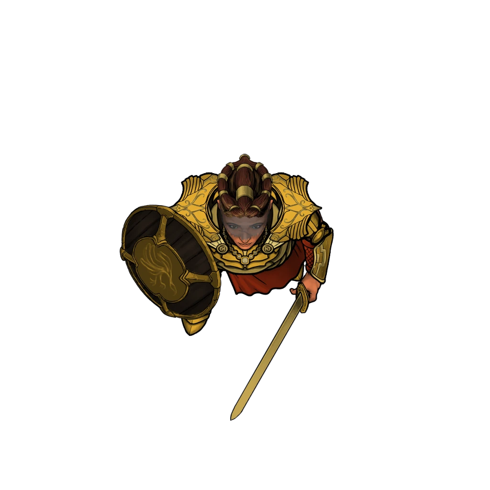

# Absolute Destruction

> [!warning] Gamemaster
> #### Gamemaster's Summary
>
> This Social and Combat event can occur anywhere in the [[Rustvar Valleys]] Biome. In it, the party encounters a Paladin of the Elder God [[Lantyr]] studying ancient ruins, before both she and the party are attacked by [[Abyssal Echo]]. By speaking with and fighting alongside this Paladin, the characters can:
>
> - Learn about an the subterranean [[Pathways]] that run below the surface of Ember.
> - Receive a dire warning about a growing Abyssal threat to the [[Arctus Plateau]], which originates in the Pathways below it.
>
> This Event is depicted using the "Giant Ruins" Level of the [[Rustvar Valleys]] Area Map.

### A Greeting from Issa Sunsword

As the characters approach the pillar, they are further hailed by Issa Sunsword, the Paladin of Lanytr.

> [!abstract] Issa Sunsword
> **[[Issa Sunsword]]**
>
> Level 1 · Unknown Unknown
>
> 

> [!quote] Read Aloud
> The woman studying the pillar turns toward you.
>
> > My apologies for speaking without showing you my face. Lantyr knows that all things are best done in the light, but this pillar troubles me enough to draw my gaze into its shadows. This is a troubling stain upon the Arctus Plateau, and one more place in need of Lantyr's light. Tell me, do you also walk her path?

> [!info] Social
> #### The Questing Paladin
>
> Faced with Issa's question, any character who makes a successful `[[/check 13 religion]]` or `[[/check 13 history]]` check knows that Lantyr is both an Elder Goddess *and* the cosmic body known commonly as The Sun. They also know that worship of her generally involves reverence for the light, energy, radiance, and life, and hatred of all things twisted by evil and monsters.
>
> - **Knowledge: Gods**: The character automatically succeeds on this check.
>
> Unless the party attacks Issa or claims to be working with forces that opposed Lantyr, she wishes them well on their quest and is happy to share the details of her own:
>
> - Issa has been traveling alone across the surface of Ember for several years, rooting out evil and fighting corruption.
> - Issa is from the southern continent of [[Kessia]], miles away from the [[Arctus Plateau]], where the worship of Lantyr is common and the threat of monsters is ever-present.
> - Long ago, Kessia was a place where the [[Aedir]] built massive cities and entire kingdoms, but [[The Shattering]] ravaged the land, transforming most of the continent into the vast Obsidian Desert. According to many Kessians, only Lantyr's divine help saved what remains of the continent.
> - Issa hopes that recovering and translating the inscriptions on the Shent pillar will explain why it was so brutally attacked.
>
> Any character who makes a successful `[[/check insight 14]]` check knows that Issa is being forthright about what brings her to this place.
>
> - **Critical Success**: The character senses that Issa hopes to convince them to join her in worship of Lantyr, and that she is prepared to attack if it turns out they have any association with the corruption that Lantyr opposes.

> [!question] Q&A
> **Q:** Issa's quest?
>
> **A:**
>
> > Like many others from my homeland of Kessia, I have committed myself to the service of Lantyr, whose light graces us daily and whose divine wisdom has shaped my long journey here. While other Kessians perform their service at home, I have traveled far from my birthplace, across the ocean, to fight evil and slay monsters in my goddess's name.
> >
> > While you may not concern yourselves with the darkness as we do, this place is no less threatened by the creatures it corrupts.

> [!question] Q&A
> **Q:** About Kessia?
>
> **A:**
>
> > Our ancient texts say that my homeland of Kessia was once a paradise, with lush vibrant jungles filled with thriving cities, powerful armies, and wondrous magics. But when the Shattering ripped apart the sky, our land was destroyed, broken, and twisted beneath our feet. Only Lantyr saved Kessia's people, and even she could do so much against the evils that sprang forth. Rich land became endless black and purple deserts, with only stones like this one left as markers of what once was.
> >
> > I fear that this could happen to your land too. If Kessia was harmed by ambition, Aterica and the Arctus Plateau may someday fall to ignorance. Remember, just because you do not see the monsters shifting below the surface does not mean they aren't coming.

> [!question] Q&A
> **Q:** What brought Issa here?
>
> **A:**
>
> > I believe this stone was left here by the Shent giants. They fell against the darkness during the Shattering but they were strong enough and wise enough to leave knowledge behind. I suspect many evil monsters make it a point to destroy Shent relics where they can, leaving nothing for future mortals to learn from. Perhaps there is something from this marker they've left behind — though it suffered greatly under some ancient assault.

> [!tip] Exploration
> #### The Ancient Stones
>
> Any character who makes a successful `[[/check history 15]]` check knows that the ancient pillar was placed here by the Shent, an ancient [[Ancestry]] of giants wiped out during the time of the Shattering.
>
> - **Critical Success**: The character also knows that the Shent were targeted for destruction by creatures of corruption who descended on Ember after the Shattering.
>
> Any character who succeeds on a `[[/check investigation 15]]` check determines that the damage to the stones is ancient, and the result of a targeted effort. Something or someone purposefully attacked the stones in a coordinated assault.
>
> - **Knowledge: Warfare**: The character automatically succeeds on this check.
>
> Meanwhile, characters who succeed on a `[[/check religion 15]]` check have a strong feeling that the pillars were a part of a Shent ceremony of some kind, but the purpose of the ceremony has been lost to time.
>
> - **Knowledge: Rituals**: The character automatically succeeds on this check.

Many of the runes on the ancient pillar are difficult to make out through the damage, but by inspecting the only two inscriptions not destroyed or worn unrecognizable by time, Issa thinks she can make out the Pathward words for "sun" and "people," and shares her suspicion with the party:

> [!quote] Read Aloud
> > Here, this is the the Pathward symbol for sun. It is similar to a mark we use at some of our holy sites in Kessia, passed down from before the Shattering. And I believe this other one here is the sign for people. Maybe people of the sun? I wish there was more I could see, but it is good to mark where it is — some believe that these pillars marked nearby entrances to the Pathways beneath Ember's surface.

> [!tip] Exploration
> #### Translating the Runes
>
> Characters with **Language: Pathward** or **Knowledge: Shent** concur with Issa on the translation of the two runes, and know that Pathward is written as combinations of symbols that together sum to a greater meaning.

### A Sudden Attack

Before the party can investigate further, they are interrupted by an unexpected attack.

> [!quote] Read Aloud
> For a moment, the wind slows to stillness. When a faint breeze returns, it carries the smell of smoke, bile, and rot. Behind the pillar, a shadow appears, seeming to form out of thin air as it advances on Issa Sunsword. The Paladin draws her sword in an instant.
>
> > Monstrous echoes of darkness! They will cower soon enough before the power of Lantyr!
>
> As she turns to face the threat, another one of the creatures forms behind her, joined soon by another, then another.
>
> > Stand against these horrors!

A group of 5 Abyssal Echoes appear from nowhere amidst the shadows cast by the great pillars.

> [!abstract] Abyssal Echo
> **[[Abyssal Echo]]**
>
> Level 1 · Abyssal Harbinger Echo
>
> 
>
> Emerging from the darkness is a terrifying eldritch apparition composed of dark smoke and malice, with prominent rows of gleaming sharp teeth. Its softly glowing eyes radiate spiteful hatred and cunning as it glides through the air with measured movements. Grasping hands, as if yearning to escape its form, materialize and vanish instantly, while its two enormous clawed hands seem to appear and disappear at will.

> [!danger] Hazard
> #### Abyssal Echo Tactics
>
> To start combat, the Abyssal Echoes launch a focused attack on Issa Sunsword, moving immediately to surround her.
>
> During combat, Abyssal Echoes will:
>
> - Prioritize attacking Issa Sunsword. If Issa falls, they prioritize targeting spellcasters, those who have Attunement to Lantyr, and those who carry any holy symbol.
> - Use their Fly Speed to swarm their targets in order to take advantage of [[Unknown]] while attacking with [[Unknown]].
> - Target known spellcasters with [[Unknown]] to prevent them from casting Spells with verbal components.
>
> When Abyssal Echoes die, they melt into dangerous[[Unknown]]. When Abyssal Echoes drop low on Hit Points, they may attempt to position themselves such that their remains would keep a nearby target pinned in a corner.
>
> #### Issa's Combat Dialogue
>
> During combat, there is a high probability that Issa will be hurt or killed. As such, during the battle, she attempts to share what she knows, and may say any of the following.

> [!question] Q&A
> **Q:** Initial attack:
>
> **A:**
>
> > How are there so many of them?

> [!question] Q&A
> **Q:** During the attack:
>
> **A:**
>
> > They come from below! The Pathways of legend are filled with horrors!

> [!question] Q&A
> **Q:** If and when Issa would die:
>
> **A:**
>
> > Find these creatures where they lurk and stop them, before they corrupt your lands as they did Kessia!

### After the Attack

If Issa died in combat, the party can search her body for information:

> [!tip] Exploration
> #### Issa's Items
>
> Issa's shield has broken in two, but her sword [[Lantyr's Blade]] can be taken by anyone in the party. If the character who takes the sword has **Attunement: The Abyss** or is carrying an item of The Abyss (such as the[[Finger of Nethehepticas]]) the sword burns them as they grab the handle, dealing `[[/damage radiant 1d6]]` damage.

#### Abyss Attunement: Issa Sunsword Died

If Issa Sunsword dies during the fight with the Abyssal Echoes, each character advances their **Attunement: The Abyss (+1)** at the conclusion of the Event.

If Issa survives, she moves on to her next adventure, but wishes the party well:

> [!quote] Read Aloud
> > Thank you so much for your help. Much as I walk my path with Lantyr alone, I am so grateful for the times that she places companions along my journey. I wonder if we have met for a reason; if you are to be the ones who find where these creatures came from, and stop them. If you have the chance, please take it. I believe they have come up from the Pathways below the surface. I do not know a way down there, but if you find one, perhaps you can track them down and end this threat.
>
> Issa lifts her gaze up to the sky, tracing the path of a ray of sunlight as it runs far into the distance.
>
> > I see a glow of light that I must follow, but that is my journey. May Lantyr bless you on yours.

#### Luxarum Attunement: Issa Sunsword Survived

If Issa Sunsword survives the fight with the Abyssal Echoes, each character advances their **Attunement: Luxarum (+1)** at the conclusion of the Event.

### Concluding the Event

> [!warning] Gamemaster
> #### Next Steps
>
> Once the party has finished their encounter with Issa Sunsword, they can continue the story by:
>
> - Independently exploring and investigating the Pathways.
> - Visiting the hamlet of [[Storsa's Strand]], triggering [[Strand of Fate]] and continuing along this Quest.
